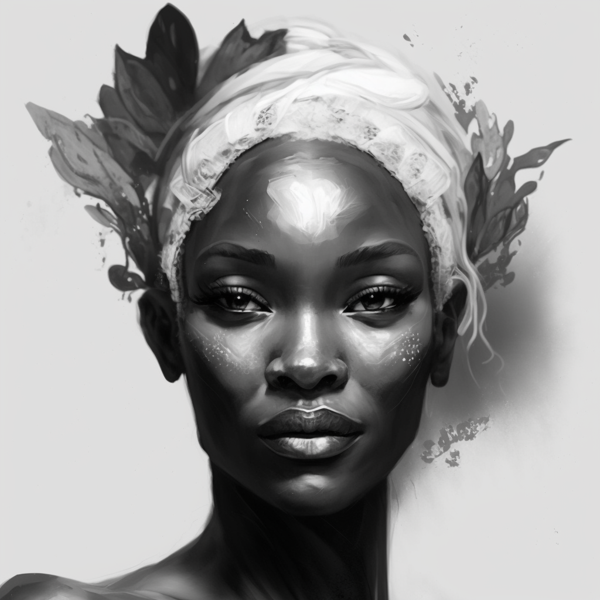

*Stories of Tyrwingha (For Profit)* is written as a set of notes and hints from a master storyteller to her apprentices about how to best tell popular stories from Tyrwingha. It is clearly written for someone who knows the folktales and stories, or is comfortable making them up. For tales that would be expected to be quite well known, it barely even hints at the plot. For other tales, it outlines the plot a bit and is full of marginalia explaining when to take a dramatic pause, when to pass a hat, when to embellish, when to burst into song, and so on. 

There are four stories about the fey directly, although fey are mentioned in various other stories as well:
### Arryn's Tale
This is the tale of [Arryn I](<../../../people/historical-figures/sembaran-royalty/arryn-i.md>), the king of Sembara and Tyrwingha in the late 1500s. He was badly injured during his youth, when venturing south to the borders with the Plaguelands to help heal the land after a curse, caused by [Anne's](<../../../people/historical-figures/sembaran-royalty/anne.md>) betrayal of her twin sister [Elaine I](<../../../people/historical-figures/sembaran-royalty/elaine-i.md>) (the marginalia talks about how to play up the sadness of this, pull on the audience heartstrings about the heroic Prince Arryn and the dastardly evil Anne). But the core of the story is about his life in the Feywild, after his supposed death in 1600. The story tells about his life of ease in Ethlenn's court, as a guest of honor, and the feasts he enjoys under the sparkling stars and lamps of Twilight's Grace, and the excellent hunting. It is extremely full of adjectives and florid language (and the marginalia suggests numerous synonyms and variants). 

The tale appears to be told as basically wish fulfillment and fantasy, but the author's marginalia make it sound like the author, at least, believes it. It does hint at a cost - never seeing the sun again, as Arryn is told to head west, toward Sunset Gate (which is never explained) would be too dangerous in his weakened state.

### Derik's Tale
This is the tale of [Derik I](<../../../people/historical-figures/sembaran-royalty/derik-i.md>) and his coming to Tyrwingha. It is a common story told all over Sembara, about how a little known son-in-law of the Duchess of Telham, only distantly related to the Sembaran throne, became king. It focuses on how he was proclaimed the king of Tyrwingha - how across Tyrwingha entire villages were disappearing, either escaping to the Feywild or destroyed by dark magic, no one knew, and how hobgoblins were ravaging the southern borders, spilling across the land from their strongholds in the Mostreve Hills. Into this chaos a lizardfolk elder foretold that Derik I, then the husband of the second daughter of the Duchess of Telham, and a distant cousin of the king of Sembara, would carry Sembara through an age of war. But only if the Queen of the Evening Mist heralded his coming. In Tyrwingha, the the old queen was been wracked by dreams of the horrible fate that would befal if she entered the war, and so had kept her forces away, despite her misgivings for not aiding an ally. 

The marginalia here talk a lot about how to set the dramatic moment - play up how bad things are and so on. The storyteller clearing suggests making Derik into a hero here, but says in part it is to work up to the big reveal.

When Derik arrived in [Tyrwingha](<../../../gazetteer/greater-sembara/tyrwingha/tyrwingha.md>), he immediately disembarked and spoke with the queen. It is said that as he set foot on Tyrwinghan shores, the morning fog parted, and turned golden where he stepped, leaving a trail of sparklingly mist behind him. Crowds began to follow, and when he reached the castle in [Tafolwern](<../../../gazetteer/greater-sembara/tyrwingha/tafolwern.md>), the people of [Tyrwingha](<../../../gazetteer/greater-sembara/tyrwingha/tyrwingha.md>) were watching as he bowed his head humbly to ask to speak with the queen, and [Archfey Ethlenn](<../../../people/extraplanar-powers/archfey-ethlenn.md>) herself appeared before him, and proclaimed that he would be the savior of [Tyrwingha](<../../../gazetteer/greater-sembara/tyrwingha/tyrwingha.md>), and kissed him on the forehead, passing him her blessing.  

Her the marginalia talk about a portrait of Ethlenn, that is the real magic. A sketch is included, but the book says that doesn't do it justice.

As news spread like wildfire of a knight from the north who had been blessed by Ethlenn herself, Derik was quickly proclaimed [Derik I](<../../../people/historical-figures/sembaran-royalty/derik-i.md>), King of [Tyrwingha](<../../../gazetteer/greater-sembara/tyrwingha/tyrwingha.md>) by the [Oracle of the Riven](<../../../groups/oracle-of-the-riven.md>). Derik gathered an army of lizardfolk, the knights of Telham and [Tyrwingha](<../../../gazetteer/greater-sembara/tyrwingha/tyrwingha.md>), the fey-touched warlocks of the Ethlenn, and [Tollen](<../../../gazetteer/western-green-sea/tollen/tollen.md>) and [Vostok](<../../../gazetteer/western-green-sea/vostok/vostok.md>) mercenaries, and he marched to victory.

{width="400"}

### Umbraeth's Tale
This the tale of Lord Umbraeth, a disgraced fey who was banished from Ethlenn's domain a thousand years ago. The tale is structured as a classic tragedy, and describes how Ethlenn had a favorite, Hallabard, who it is said she loved beyond reason. Hallabard, however, loved Eloise, who loved him in return, and so Ethlenn invited both Hallabard and Eloise to her domain (called The Land of the Evening Mist in this story) to live forever, as a gift to her love she could never have. Years pass, and one of Ethlenn's sons, Lord Umbraeth, falls in love with Eloise, and through a series of tricks, charms her into loving him as well. Hallabard kills himself in despair, Ethlenn finds out, and banishes her son. Eloise is forbidden from following Umbraeth into exile, and returns to Tyrwingha and lives out her mortal life in despair. 

The marginalia focus on playing up the plight of Hallabard and Eloise, especially Eloise, a tragic figure in the tale. The notes indicate that in some places, it can be fun to tell the story with Umbraeth as the tragic hero, winning his lady love and being unfairly punished because he won a human love his mother could not but it suggests that this take on the tale won't go over well in Tyrwingha, and to save it the border baronies or [Arnsbury](<../../../gazetteer/greater-sembara/sembara/heartlands/arnsbury.md>) or elsewhere in the highlands. 

### Gloomshaper's Tale
This is the tale of the Gloomshaper, banished from Twilight's Grace for his wicked deeds. It spends a lot of time discussing in detail his various tricks and traps he played on unsuspecting mortals, being particularly fond of promising them refuge from danger in the Feywild, failing to specify *where* in the Feywild, and leaving them somewhere even more dangerous then whatever situation they are in. The tale talks about four or five of these specific incidents, and the marginalia dwells on focusing on the sadness and frustration and wrongness of this kind of trickery. There is a lot of building up of these folks who were tricked, making clear it wasn't their fault - or at least, that is how the marginalia says to play it.

The tale continues with Ethlenn's revenge. When she discovered what the Gloomshaper was doing, she was furious, icy cold, wrathful and vengeful. But when the Gloomshaper offered to find the lost humans across the Feywild, Ethlenn stayed her hand and, instead of death, offered him exile. The tale then plays almost in reverse, as the Gloomshaper is forced to find and make amends to those he tricked. 

The marginalia discusses this as a morality play, how this story shows that even the fey get what the deserve in the end and talks about how to play Ethlenn - cool, calm, protector of humanity - and how to play the Gloomshaper - chaotic, frivolous, nasty.

