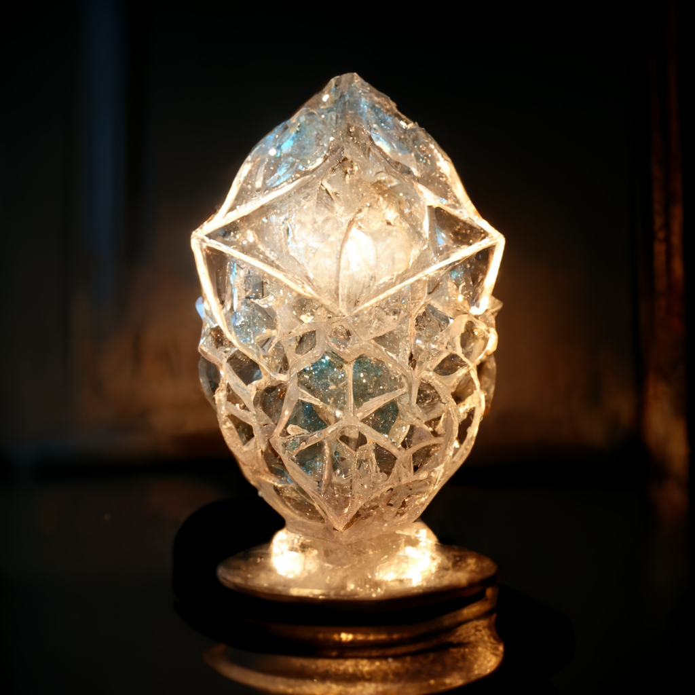

# The Lantern of the Bright Hearth

- :octicons-info-24:{ .lg .middle } __Unique Lantern__  
   Owned by [Robin of Abenfyrd](<../../../people/pcs/cleenseau/robin-of-abenfyrd.md>)  
    :simple-dungeonsanddragons:{ .middle} [Mechanics](https://www.dndbeyond.com/magic-items/5477138-lantern-of-the-bright-hearth) 

A small lantern carried by [Robin](<../../../people/pcs/cleenseau/robin-of-abenfyrd.md>). It gives off a perpetual warm glow that reminds one of home and pleasant things. 

> [!INFO]- Finding the Lantern (For Dan's Eyes Only)
> Robin is out on a patrol with the Rangers, and he awakes in the middle of the night in camp. Standing up, under the full moon, he smells the scent of spring growth and fresh cool rain wafting from the top of the hill. He follows the scent. At the top of the hill, amongst the trees with new green leaves he sees, blowing on the wind, dozens of golden leaves. The leaves land in a perfect circle and in the middle of the circle he sees a pool of white light sparkling and flowing along the ground like a mist. Out of the mist two hands form, and rise from the mist in the center of the circle of golden leaves. The hands hold out a softly glowing pebble, smooth and round. 
> 
> Robin approaches, sits outside the circle, and asks, "Who are you?"
> 
> Nothing happens at first. Time seems to pass very slowly, or the scent of the air distracts you from the time passing, or something. Either way, Robin is surprised to notice the moon is setting and apparently hours have passed when a male large elk with out-of-season antlers comes out of the forest and walks up to him and gently and almostly lovingly pushes Robin towards the hands
> 
> Robin gives the elk a scritch, and then walks into the circle following its nudge.
> 
> As Robin crosses the circle of leaves he feels a sense of deja vu, like he has seen these leaves before. It reminds him of the Festival of the Mists, somehow. For a moment, the setting moon is replaced by the setting sun, and the entire sky is covered with crimson and pink clouds. Then the moon returns, and as he picks up the pebble from the hands.
> 
>  As he touches the pebble it becomes insubstantial for a moment. Time seems to freeze and he feels in his mind a question -- Will you Help? 
>  
>  He doesn't really know what is asking for his help, beyond the vibes of the moon and the sun, the elk, the pebbles. It feels fey to him, but it also feels infinite and vast, and like a Great Power. But he also senses sincerity from the question, and can feel a palpable sense of the hands -- he sees a series of visions:
>  
> * A man in shining armor, the sigil of the Wyrdling on this armor, riding a white horse into battle
> * the same man, bloodied, standing in a battlefield of dead hobgoblins and humans, weeping 
> * the same man again, laying his hands on an elderly woman, and her wounds closing
>
>He gets the sense that this man, whoever he was, wants him to say yes.
>
>Robin answers: "Yes" and as he takes the pebble it transforms into a lantern, the hands vanish, and the circle drifts away in the rising sun. As Robin walks back to the patrol camp, he feels for a moment this is all a dream. But the lantern is real in his hand

{width="400"}