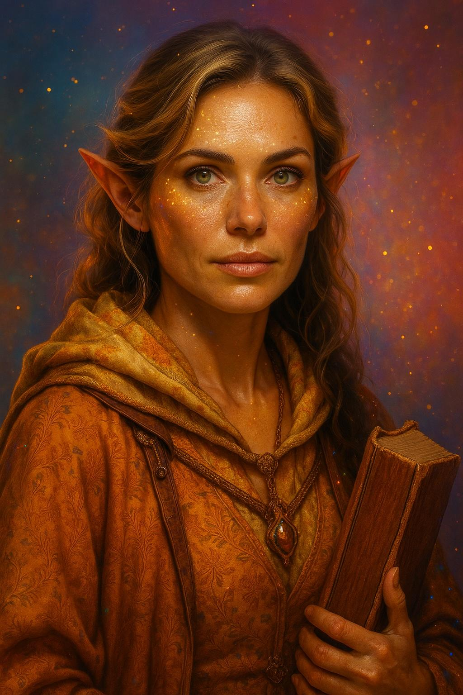
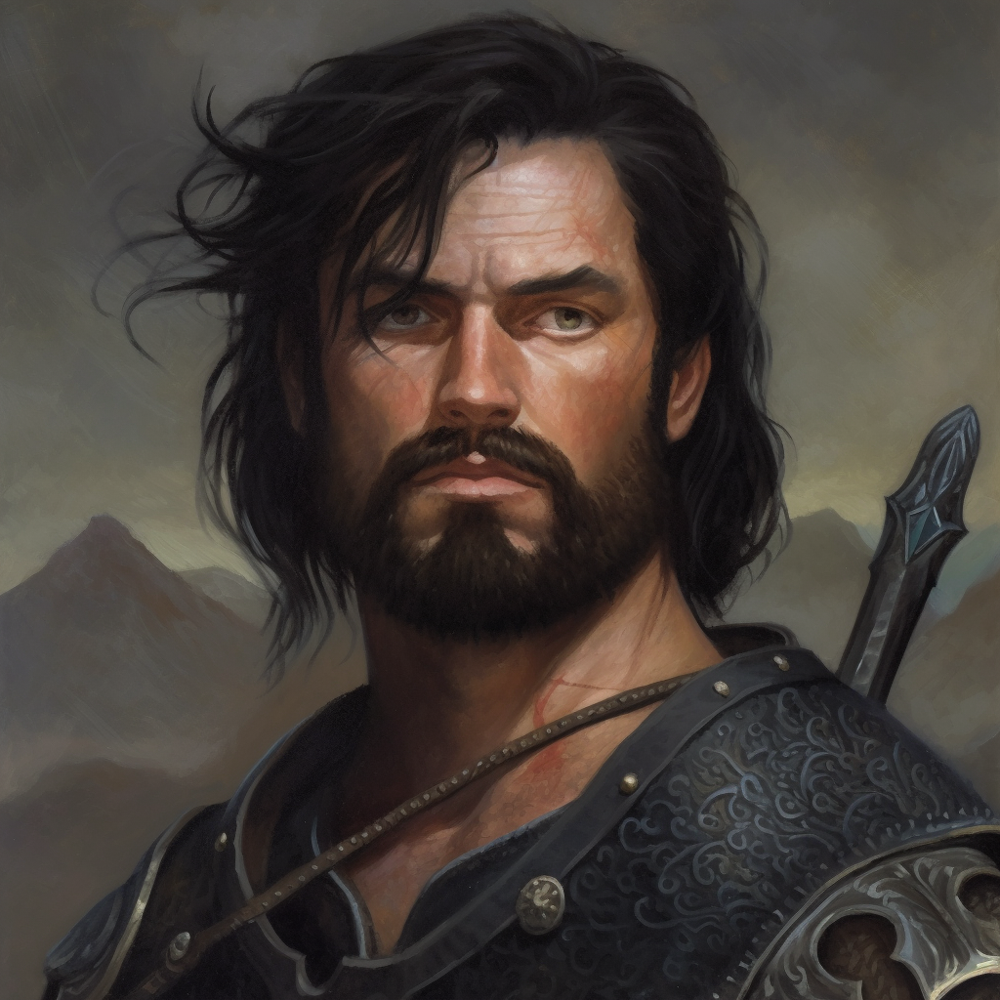

# Associates of the Dunmar Fellowship

The [Dunmar Fellowship](<../../people/pcs/dunmar-fellowship/dunmar-fellowship.md>) has many followers, associates, companions, and friends. 

## Vindristjarna Crew

The rotating cast of character that serve as the crew of Vindristjarna. 

-   [Faldrak Bronzehammer](<../../people/dwarves/faldrak-bronzehammer.md>)
 
    ---
    
     Dwarven artificer, adventurer, creator of magic items, and skyship captain.

-   [Amil](<../../people/dunmari/amil.md>)
 
    ---
    
     Joyful and upbeat Dunmari monk of the [Order of the Awakened Soul](<../../groups/dunmari-mystery-cults/order-of-the-awakened-soul.md>), who left his former masters [Pava](<../../people/dunmari/pava.md>) and [Avaras](<../../people/dunmari/avaras.md>) to travel with [Kenzo](<../../people/pcs/dunmar-fellowship/kenzo.md>)

-   [Égnir](<../../people/elves/egnir.md>) (*AY-nyeer*)
    
    ---
    
     A meditative young elven gardener and a musician from [Orenlas](<../../gazetteer/upper-istaros/orenlas/orenlas.md>), seeking to experience the world in his own quiet way. 
     
-   [Jotha](<../../people/deno-qai/jotha.md>) (*yo-TAH*)

    ---
    
      A Deno'qai warrior, lost to the shadow realms, and found among the Vargaldi by the [Dunmar Fellowship](<../../people/pcs/dunmar-fellowship/dunmar-fellowship.md>), now traveling with and learning from [Delwath](<../../people/pcs/dunmar-fellowship/delwath.md>)

-   [Mica Copperharp](<../../people/halflings/mica-copperharp.md>)

	---
    
    A halfling who left Tilly Brineheart and [Milo Thistlefoot](<../../people/halflings/milo-thistlefoot.md>)'s crew to join the [Dunmar Fellowship](<../../people/pcs/dunmar-fellowship/dunmar-fellowship.md>), with his wife [Willow Copperharp](<../../people/halflings/willow-copperharp.md>). A comic, a joker, good with his hands and the drums, a brewer, and a bit of a drinker. 

-   [Willow Copperharp](<../../people/halflings/willow-copperharp.md>)

    ---
    
    A halfling who left Tilly Brineheart and [Milo Thistlefoot](<../../people/halflings/milo-thistlefoot.md>)'s crew to join the [Dunmar Fellowship](<../../people/pcs/dunmar-fellowship/dunmar-fellowship.md>), with her husband [Mica Copperharp](<../../people/halflings/mica-copperharp.md>). A storyteller, a poet, and fairly religious as halflings go.
    

## Followers Based Elsewhere

Although most of the hirelings, crew, and followers associated with the [Dunmar Fellowship](<../../people/pcs/dunmar-fellowship/dunmar-fellowship.md>) are based on [Vindristjarna](<../../things/ships/vindristjarna.md>), some are elsewhere. 

-  [Kethra Silverspark](<../../people/dwarves/kethra.md>)
 
    ---
    
     A dwarven smith and adventurer from [Tharn Todor](<../../gazetteer/greater-dunmar/realms/nardith/tharn-todor.md>), drawn to [Riswynn](<../../people/pcs/dunmar-fellowship/riswynn.md>)'s service by the tales of her heroic actions in [Morkalan](<../../gazetteer/extraplanar/shadowfolds/morkalan/morkalan.md>). Currently traveling with [Riswynn](<../../people/pcs/dunmar-fellowship/riswynn.md>) on her quest to free more orcs from [Thark](<../../gods-and-religions/gods/embodied-gods/thark.md>). 

-   [Nuzkar](<../../people/orcs/nuzkar.md>) (*NUZ-car*)

    ---
    
     An orc from [Uzgukhar](<../../gazetteer/upper-istaros/xurkhaz/uzgukhar.md>), twin sister of [Aygul](<../../people/orcs/aygul.md>), an archivist and loremaster interested in stories of free orcs. Currently traveling with [Riswynn](<../../people/pcs/dunmar-fellowship/riswynn.md>) on her quest to free more orcs from [Thark](<../../gods-and-religions/gods/embodied-gods/thark.md>). 

-   [Aygul](<../../people/orcs/aygul.md>) (*EYE-gool*)

    ---
    
     An orc from [Uzgukhar](<../../gazetteer/upper-istaros/xurkhaz/uzgukhar.md>), twin sister of [Nuzkar](<../../people/orcs/nuzkar.md>), a brawler and fighter and a bit of loner, with no family but her sister. Currently traveling with [Riswynn](<../../people/pcs/dunmar-fellowship/riswynn.md>) on her quest to free more orcs from [Thark](<../../gods-and-religions/gods/embodied-gods/thark.md>). 
     
-   [Adam Gower](<../../people/tollenders/adam-gower.md>)

    ---
    
    A Tollen factor and agent, with a history of working for the [Goodbarrels](<../../groups/halfling-families/goodbarrels.md>). Now serves as the [Dunmar Fellowship](<../../people/pcs/dunmar-fellowship/dunmar-fellowship.md>)'s representative in Tollen, managing trade goods and contracts. Based in [Tollen](<../../gazetteer/greater-sembara/tollen/tollen.md>). 

## Former Crew and Hirelings

Members of the crew who have moved on to other things since traveling on [Vindristjarna](<../../things/ships/vindristjarna.md>). 

-   [Kecha](<../../people/kenku/kecha.md>)

    ---
    
     A kenku scout who helped guide the party through the [Svinjo Mountains](<../../gazetteer/northern-green-sea/svinjo-mountains.md>) and the [~Northern Boreal Forest~](<../../gazetteer/northern-green-sea/northern-boreal-forest.md>), before leaving to search for kenku living on the ~Eastern Islands~. 

-   [Algerd](<../../people/giants/algerd.md>)

    ---
    
     A frost giant historian, who was not happy in [Isenborg](<../../gazetteer/northern-green-sea/isenborg.md>) and journeyed with the party across the [~Northern Boreal Forest~](<../../gazetteer/northern-green-sea/northern-boreal-forest.md>), before leaving after meeting other frost giant refugees from [Kaldhalla](<../../gazetteer/northern-green-sea/kaldhalla.md>). 
     

## Traveling Companions

People who have traveled with the [Dunmar Fellowship](<../../people/pcs/dunmar-fellowship/dunmar-fellowship.md>) in various contexts. 

-   [Vola](<../../people/chardonians/vola.md>)
    ---
    
     A Chardonian adventurer, the party rescued Vola from [Raven's Hold](<../../gazetteer/greater-dunmar/dunmari-basin/raven-s-hold.md>), and she traveled with them for a time before parting company. Later, she was mind controlled by [The Cleansed](<../../groups/the-cleansed.md>) using the [Crown of Purity](<../../things/artifacts-of-power/crown-of-purity.md>) and forced to fight the party; after being captured, she was eventually freed when [Riswynn](<../../people/pcs/dunmar-fellowship/riswynn.md>) claimed the [Crown of Purity](<../../things/artifacts-of-power/crown-of-purity.md>). 

-   [Havdar](<../../people/dunmari/havdar.md>)
    ---
    !120
     The [Dunmar Fellowship](<../../people/pcs/dunmar-fellowship/dunmar-fellowship.md>) traveled into the [Garamjala Desert](<../../gazetteer/drankorian-hinterland/garamjala-plateau/garamjala-desert.md>) east of [Karawa](<../../gazetteer/greater-dunmar/realms/dunmar/eastern-dunmar/karawa.md>) with [Havdar](<../../people/dunmari/havdar.md>) and his [warband](<../../groups/havdar-s-warband.md>) while investigating rumors of orcs and other strange happenings. 

-  [Cintra](<../../people/dunmari/cintra.md>)
    ---
    
     The Supreme Oracle of [Shakun](<../../gods-and-religions/gods/incorporeal-gods/dunmari-pantheon/shakun.md>), who the party rescued from [Agata Dustmother](<../../people/fey/agata.md>)'s trap at [Shakun’s Wellspring](<../../gazetteer/greater-dunmar/realms/dunmar/eastern-dunmar/shakuns-wellspring.md>). Traveled with the party back to [Karawa](<../../gazetteer/greater-dunmar/realms/dunmar/eastern-dunmar/karawa.md>), after her daughter [Jumi](<../../people/dunmari/jumi.md>) was freed from [Agata](<../../people/fey/agata.md>)'s curse. 

-  [Jumi](<../../people/dunmari/jumi.md>)
    ---
    
     The young daughter of [Cintra](<../../people/dunmari/cintra.md>). Captured by [Agata](<../../people/fey/agata.md>) and cursed; freed by [Seeker](<../../people/pcs/dunmar-fellowship/seeker.md>). Traveled with the party back to [Karawa](<../../gazetteer/greater-dunmar/realms/dunmar/eastern-dunmar/karawa.md>). 

-   [Garret Tealeaf](<../../people/halflings/garret-tealeaf.md>)
    ---
    
     A halfling rescued by the party from [Agata Dustmother](<../../people/fey/agata.md>), who had imprisoned him as a puppet. He joined the party traveling from [Karawa](<../../gazetteer/greater-dunmar/realms/dunmar/eastern-dunmar/karawa.md>) to [Tokra](<../../gazetteer/greater-dunmar/realms/dunmar/central-dunmar/tokra/tokra.md>). 

-   [Johar](<../../people/dunmari/johar.md>)
    ---
    
     A Dunmari, a member of the [Lakan Mystai](<../../groups/dunmari-mystery-cults/lakan-mystai.md>) and a friend of [Kenzo](<../../people/pcs/dunmar-fellowship/kenzo.md>)'s from his days at the [Lakan Monastery](<../../gazetteer/greater-dunmar/realms/dunmar/central-dunmar/tokra/lakan-monastery.md>). Johar traveled with the party from [Tokra](<../../gazetteer/greater-dunmar/realms/dunmar/central-dunmar/tokra/tokra.md>) to [Darba](<../../gazetteer/greater-dunmar/realms/dunmar/coastal-dunmar/darba/darba.md>) on orders from [Lara](<../../people/dunmari/lara.md>) to negotiate with [Karnas](<../../people/dunmari/nayan-karnas.md>). 

- [Justan](<../../people/dunmari/justan.md>)
    ---
    
     A Dunmari bandit hiding in the [Copper HIlls](<../../gazetteer/greater-dunmar/darba-highlands/copper-hills.md>), convinced by [Delwath](<../../people/pcs/dunmar-fellowship/delwath.md>) to join the party and fight a dragon (which turned out to be a wyvern). Killed by [Casian](<../../people/chardonians/casian.md>). 

-   [Theba](<../../people/deno-qai/theba.md>)
    ---
    
     A Deno'qai paladin who the party helped escape from her village, which had fallen under the sway of [Mezzar](<../../people/other-nonhumans/mezzar.md>). Later, she joined with the party to help them defeat [Grimbaskal](<../../people/other-nonhumans/mezzar.md>).
     
-   Tilly Brineheart
    ---
    
     A halfling sailor and adventurer, wife of [Milo Thistlefoot](<../../people/halflings/milo-thistlefoot.md>), rescued from being imprisoned on the [Elemental Plane of Water](<../../cosmology/energy-realms/elemental-plane-of-water.md>) by the [Dunmar Fellowship](<../../people/pcs/dunmar-fellowship/dunmar-fellowship.md>), who then traveled to the ~Circular Island~ and helped defeat [Ra'ghemdros](<../../people/other-nonhumans/ra-ghemdros.md>) before setting of to explore. 
 
-   [Milo Thistlefoot](<../../people/halflings/milo-thistlefoot.md>)
    ---
    !
     A halfling sailor and adventurer, husband of Tilly Brineheart, rescued from being imprisoned on the [Elemental Plane of Water](<../../cosmology/energy-realms/elemental-plane-of-water.md>) by the [Dunmar Fellowship](<../../people/pcs/dunmar-fellowship/dunmar-fellowship.md>), who then traveled to the ~Circular Island~ and helped defeat [Ra'ghemdros](<../../people/other-nonhumans/ra-ghemdros.md>) before setting of to explore. 

 -   [Ismara](<../../people/fey/ismara.md>)
    ---
    !
     A fey traveler and scholar from [Gleamwater](<../../gazetteer/extraplanar/feywild/gleamwater.md>), who joined the party for a short time in [Emberwine](<../../gazetteer/extraplanar/feywild/emberwine/emberwine.md>), guiding them east to the Sunset Gate before parting ways.

 -   [Valeris](<../../people/fey/valeris.md>)
    ---
    !
     A satyr musician and gambler, part of the court of [Lord Soven](<../../people/extraplanar-powers/archfey/lord-soven.md>), who was cursed to always speak the blunt, honest truth. He joined the party in their quest to free [Cloudspinner](<../../people/extraplanar-powers/archfey/cloudspinner.md>) in the hopes that a selfless act could release him from his curse.
     

## Captives and Former Captives

These people are still trapped in the [Mirror of Soul Trapping](<treasure/mirror-of-soul-trapping.md>), with no immediate plans to be released:

-   [Revaka](<../../people/other-nonhumans/revaka.md>)
    ---
    
     A hobgoblin wizard, trapped in the [Mirror of Soul Trapping](<treasure/mirror-of-soul-trapping.md>) since before the [Great War](<../../events/1500s/great-war.md>).  

-   [Antonia](<../../people/chardonians/antonia.md>)
    ---
    
     An artificer, follower of [Kadmos](<../../people/chardonians/kadmos.md>), and member of the [Society of the Open Scroll](<../../groups/chardonian-organizations/society-of-the-open-scroll.md>). Imprisoned, instead of executed, after reacting in horror to the news that [Fausto](<../../people/chardonians/fausto.md>)'s true master was the lich [Apollyon](<../../people/historical-figures/drankorian-emperors/apollyon.md>). The [Dunmar Fellowship](<../../people/pcs/dunmar-fellowship/dunmar-fellowship.md>) agreed to release her on the edge of the [Chardonian Empire](<../../gazetteer/greater-chardon/chardonian-empire/chardonian-empire.md>) in a few years. 

 -   Slavomir
    ---
    !
     A wizard of the [Rodnya Kinzal](<../../groups/urskan-magical-organizations/rodnya-kinzal.md>), captured in [Shadowkeep](<../../gazetteer/northern-green-sea/shadowkeep.md>) while secretly negotiating  with [Rhodar von Glauer](<../../people/other-nonhumans/rhodar-von-glauer.md>). 
     

These people have been released and are recovering on [Vindristjarna](<../../things/ships/vindristjarna.md>), or sent on their way. 

-   [Hektor](<../../people/chardonians/hektor.md>)
    ---
    
    A Chardonian warrior, who served for several years as [Kadmos](<../../people/chardonians/kadmos.md>)' enforcer under the control of the [Crown of Purity](<../../things/artifacts-of-power/crown-of-purity.md>), until the control was broken by [Riswynn](<../../people/pcs/dunmar-fellowship/riswynn.md>). Once was a sailor with a sweet singing voice. Currently being tended by [Wellby](<../../people/pcs/dunmar-fellowship/wellby.md>) to help him remember his old life.

-   [Valius](<../../people/chardonians/valius.md>)
    ---
    
    A warrior ensnared by the machinations of [Fausto](<../../people/chardonians/fausto.md>) and the twin brother of [Vargus](<../../people/chardonians/vargus.md>). Released by the [Dunmar Fellowship](<../../people/pcs/dunmar-fellowship/dunmar-fellowship.md>) outside [Tokra](<../../gazetteer/greater-dunmar/realms/dunmar/central-dunmar/tokra/tokra.md>) to make a new life with his brother. 

 -   [Vargus](<../../people/chardonians/vargus.md>)
    ---
    !
     A warrior ensnared by the machinations of [Fausto](<../../people/chardonians/fausto.md>) and the twin brother of [Valius](<../../people/chardonians/valius.md>). Released by the [Dunmar Fellowship](<../../people/pcs/dunmar-fellowship/dunmar-fellowship.md>) outside [Tokra](<../../gazetteer/greater-dunmar/realms/dunmar/central-dunmar/tokra/tokra.md>) to make a new life with his brother. 
     

