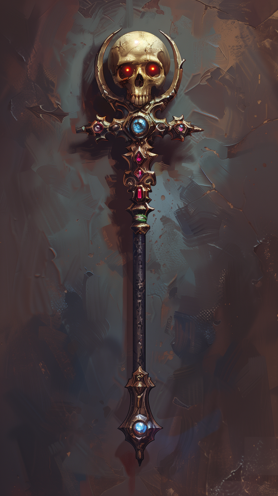

# Former Party Treasure

*Anything that was lost, sold, given away, or used goes here.*
## Destroyed or Used
- Three blood red rubies, from [Shadowkeep](<hoards/ursk-treasure.md>) *used for simulacrum*
- A small crystal vial containing three doses of universal solvent. Found in a hidden lead box, and used to destroy the silver threads binding the trapped elemental in the elemental forge, and then Grash's ring of undying
- [Medusa Blade](<treasure/medusa-blade.md>)
- A shard of [Inkaye](<../../things/materials/inkaye.md>) ready to be infused with explanar magic, created by [Umli](<../../people/other-nonhumans/umli.md>) from Delwath's [Delwath's Elven Breastplate](<treasure/delwath-s-elven-breastplate.md>). Used to create the rainbow prism for [Vindristjarna](<../../things/ships/vindristjarna.md>), created by Faldrak at the Elemental Forge. 
- Used to construct magic items at the Elemental Forge:
	- Phoenix feather, used to allow [Faldrak](<../../people/dwarves/faldrak-bronzehammer.md>)'s stone bird to fly, among other things. 
	- Elemental rods (one each of fire, earth, air, water), used to improve [Seeker](<../../people/pcs/dunmar-fellowship/seeker.md>)'s [Glove of Crystalized Magic](<treasure/glove-of-crystalized-magic.md>)
	- Spectral prism (used for rainbow bridge)
	- Two vials of mercury (used for rainbow bridge)
	- Eternal ice, from the [Elemental Forge Hoard](<hoards/elemental-forge-hoard.md>), used for icicle generator
	- Starlight dew, from the [Elemental Forge Hoard](<hoards/elemental-forge-hoard.md>), used for icicle generator
- Speak with Dead. ([Monastery of Bhishma](<../../gazetteer/greater-dunmar/dunmari-basin/monastery-of-bhishma.md>)), used in [Session 86 (DuFr)](<session-notes/session-86-dufr.md>) 
- [Scepter of Command](<../../things/artifacts-of-power/scepter-of-command.md>), destroyed in [Session 81 (DuFr)](<session-notes/session-81-dufr.md>)
- A small silver statue of a demon with ruby eyes (from The Flaming Tempest, tossed in the sacred waters on [Vetta](<../../gazetteer/western-green-sea/skaerhem/vetta.md>))
- [Delwath's Elven Breastplate](<treasure/delwath-s-elven-breastplate.md>), given to Umli in [Session 80 (DuFr)](<session-notes/session-80-dufr.md>), who removed and blanked the [Inkaye](<../../things/materials/inkaye.md>) that had powered it, leaving a mundane breastplate
- [Dunmari Heirloom Shield](<treasure/dunmari-heirloom-shield.md>) (uncommon major item), used to make the adamantine required for the phasing stone harness on [Vindristjarna](<../../things/ships/vindristjarna.md>)
- A perfect emerald hung on a silver chain (from Grimbaskal's Hoard), used as a focus to power the phasing stone on [Vindristjarna](<../../things/ships/vindristjarna.md>) 
- [Horn of Silent Alarm (Dunmari)](<../../things/magic-items/horn-of-silent-alarm-dunmari.md>) (common minor item), sacrificed as part of the ritual to uncurse Kenzo from the soul chain bound to him during [Motua](<../../people/extraplanar-powers/motua.md>)'s rescue.
- Amber Web. [Mechanics](https://www.dndbeyond.com/magic-items/3643193-amber-web). A small piece of amber with a spider trapped inside, which radiates conjuration magic. Seems likely to be a creation of [Agata](<../../people/fey/agata.md>)’s. Taken from [Agata](<../../people/fey/agata.md>)’s person. Used by [Seeker](<../../people/pcs/dunmar-fellowship/seeker.md>) in battle with [Agata](<../../people/fey/agata.md>) reborn in the [Feywild](<../../cosmology/feywild.md>), in [Session 67 (DuFr)](<session-notes/session-67-dufr.md>). 
- Swarm Bottle. [Mechanics](https://www.dndbeyond.com/magic-items/3643187-swarm-bottle). A smoky glass bottle from which a buzzing sound can constantly be heard, which radiates conjuration magic. Seems likely to be a creation of [Agata](<../../people/fey/agata.md>)’s. Taken from [Agata](<../../people/fey/agata.md>)’s person. Used by [Seeker](<../../people/pcs/dunmar-fellowship/seeker.md>) in the fight with [Kadmos](<../../people/chardonians/kadmos.md>) and [Casian](<../../people/chardonians/casian.md>) in [Session 44 (DuFr)](<session-notes/session-44-dufr.md>). 
- Leech Bottle. [Mechanics](https://www.dndbeyond.com/magic-items/3819597-leech-bottle). A bottle filled with preserved leeches, radiating necromancy magic. Probably a creation of [Agata](<../../people/fey/agata.md>)’s. Taken from [Agata](<../../people/fey/agata.md>)’s hut. (used in battle)
-  Helm of Iron Will. [Mechanics](https://www.dndbeyond.com/magic-items/2341102-helm-of-iron-will). A helmet from the Drankorian era, enchanted to protect warriors in battle. Found in [Raven's Hold](<../../gazetteer/greater-dunmar/dunmari-basin/raven-s-hold.md>). Used to protect Delwath in battle against [Agata](<../../people/fey/agata.md>). 
-  Block of adamantine. Found in the [dwarven outpost](<../../gazetteer/greater-dunmar/dunmari-basin/dwarven-outpost-raven-s-hold.md>) near [Raven's Hold](<../../gazetteer/greater-dunmar/dunmari-basin/raven-s-hold.md>), used to reinforce Delwath's [Dunmari Heirloom Shield](<treasure/dunmari-heirloom-shield.md>). 
- Thorn Seed Bag. Destroyed in [Session 31 (DuFr)](<session-notes/session-31-dufr.md>).
- [Soul Lantern](<treasure/soul-lantern.md>). Destroyed in [Session 32 (DuFr)](<session-notes/session-32-dufr.md>).
- Seven iron spears carved with the incantation: “[Mad One](<../../gods-and-religions/gods/embodied-gods/mad-one.md>), come to us, let [Jinnik](<../../gods-and-religions/gods/high-gods/jinnik.md>)’s howl be heard.” From the [Fraternity of the Empty Moon](<../../groups/fraternity-of-the-empty-moon.md>); destroyed. 
- Necklace of Tongues ([Seeker](<../../people/pcs/dunmar-fellowship/seeker.md>)). A necklace made of a large number of dried, shriveled tongues struck on a twisted copper chain, radiating divination magic. Probably a creation of [Agata](<../../people/fey/agata.md>)’s, based on both [Seeker](<../../people/pcs/dunmar-fellowship/seeker.md>)’s and [Tharandros](<../../people/other-nonhumans/tharandros.md>)’ examination. Taken from [Agata](<../../people/fey/agata.md>)’s person. (destroyed, sadly(?))
- Four dried scorpions in a leather pouch. [Tharandros](<../../people/other-nonhumans/tharandros.md>) thinks they could be magical, but their nature is hidden. Destroyed, will turn back into real giant scorpions when touched. Showed to the mirror, seeing an image of a struggling giant scorpion. 
- [Agata's Wooden Figurines](<treasure/agata-s-wooden-figurines.md>). These are the wooden carvings/figures of cursed people. All of these radiate complex transmutation magic. All were changed back into people.
	- A young girl, maybe 3 years old, with light brown skin and dark shoulder-length hair, big, curious brown eyes, and a chubby face, now broken in half and no longer radiating magic. This is [Jumi](<../../people/dunmari/jumi.md>). Freed. Casting Dispel Magic on [Jumi](<../../people/dunmari/jumi.md>) herself, mostly turned to wood, ended the magic on [Jumi](<../../people/dunmari/jumi.md>) and the figure of [Jumi](<../../people/dunmari/jumi.md>). 
	- An older halfling man, easily into his 80s or 90s, with a wrinkled face, stained traveling clothes, blue eyes and curly graying hair. Tentatively identified as one of the Tealeaf family, a large merchant clan that once traded between [Chardon](<../../gazetteer/greater-chardon/chardonian-empire/chardon/chardon.md>) and eastern [Dunmar](<../../gazetteer/greater-dunmar/realms/dunmar/dunmar.md>). Freed; name is [Garret Tealeaf](<../../people/halflings/garret-tealeaf.md>), captured by [Agata](<../../people/fey/agata.md>) 11 years ago.
	- [A young woman](<../../people/dunmari/kaya.md>), maybe around 16, with dark brown skin, long braided black hair, and green eyes, wearing ill-fitting chain mail and carrying a spear. Probably Dunmari, but the clothes are very archaic. Freed; but at the moment fairly catatonic and has not spoken.
	- [A middle aged man](<../../people/dunmari/shandar.md>), maybe 50, wearing stained and repeatedly mended riding clothes, with short cropped white hair, lightly tanned, with a bony, lined face and a bow and quiver on his back. Probably Dunmari, but the clothes are very archaic. Freed; but at the moment fairly catatonic and has not spoken.
- Prophecy Bones. A tan pouch containing seven human knucklebones, radiating divination magic. When a bone is drawn from the bag and cast, it has the effect of the augury spell, and then turns to dust. Probably created by [Agata](<../../people/fey/agata.md>). Taken from [Agata](<../../people/fey/agata.md>)’s hut. (destroyed)
- Finger of Direction. A realistic carved wooden hand with an index finger that is rotting flesh, radiates divination magic. When asked, it will unerringly point north. Probably created by [Agata](<../../people/fey/agata.md>). Taken from [Agata](<../../people/fey/agata.md>)’s hut. (destroyed)
- Eye of Undead Sensing. A jar filled with liquid in which floats a single human eye, radiating divination magic. When an undead creature comes within 100 feet of the jar, the eye darts about as if it is looking around in panic. Probably a creation of [Agata](<../../people/fey/agata.md>)’s. Taken from [Agata](<../../people/fey/agata.md>)’s hut.  (destroyed)
- [Liquid Wood](<treasure/liquid-wood.md>). This jar of putty-like brown goo radiates transmutation magic, and is clearly a creation of [Agata](<../../people/fey/agata.md>)’s. It is used for turning creatures into wooden servants. Taken from [Agata](<../../people/fey/agata.md>)’s hut. 
- Battle Standard of the [Blackened Claw](<../../groups/hobgoblin-clans/blackened-claw.md>) hobgoblins. Found in [Raven's Hold](<../../gazetteer/greater-dunmar/dunmari-basin/raven-s-hold.md>). Destroyed. 
- A blood-red book of necromancy bound in human skin, containing [Apollyon's](<../../people/historical-figures/drankorian-emperors/apollyon.md>) secret knowledge for how to become a lich. Destroyed by [Dimitaur](<../../people/pcs/great-war/companions/dimitaur.md>) with a fireball.
## Sold

### In [Zvervinka](<../../gazetteer/northern-green-sea/ursk/zvervinka.md>)
- Monster parts, traded for entry to the city, lodging and aid from [Roman](<../../people/other-humans/roman.md>), and a number of magic items at the market:
	- Material harvested from an ice worm: teeth, sensory patches, skin, and stomach acid
	- Material harvested from a white dragon: cold breath venom sack, scales, resistance organ, teeth, and claws
### In [Tollen](<../../gazetteer/greater-sembara/tollen/tollen.md>)
- A collection of Tollender goods, that survived water damage: 20 bolts of brilliantly dyed red cloth; 4 crates of fine linen shits; 2 crates of red Tollender cloaks (one of which [Seeker](<../../people/pcs/dunmar-fellowship/seeker.md>) takes); 6 small crates of beaver fur hats in a variety of styles. Left with [Adam Gower](<../../people/tollenders/adam-gower.md>) to sell / trade.
- 8 swords and 4 spears of [Skaer Steel](<../../things/materials/skaer-steel.md>) (used by Skaer warriors killed on [Vetta](<../../gazetteer/western-green-sea/skaerhem/vetta.md>); gifted to party in their honor by Vaalinen). Given to [Umli](<../../people/other-nonhumans/umli.md>) to reuse. 
- 5 pounds [Skaer Steel](<../../things/materials/skaer-steel.md>), gifted by the Skaer. Given to [Umli](<../../people/other-nonhumans/umli.md>) to reuse.
- The [Flaming Tempest](<../../things/ships/flaming-tempest.md>), once [Urgall](<../../people/skaer/urgall-the-black.md>)'s pirate ship. Badly damaged. Potentially worth 20,000 gold if repaired and fixed up, considerably less in it's current state. Being dismantled and converted to usable timber in [Tokra](<../../gazetteer/greater-dunmar/realms/dunmar/central-dunmar/tokra/tokra.md>). 
### In Chardon

- Black Light Candle. Sold as part of the deal to get the [Chalice of the Runepriest](<../../things/artifacts-of-power/chalice-of-the-runepriest.md>) back, in [Session 49 (DuFr)](<session-notes/session-49-dufr.md>) 
- A painting of [Eudomes](<../../people/historical-figures/eudomes.md>). A portrait of a man, wearing silver robes, holding a staff against a black, plain background. He has sharp, angular features, short dark hair, clear brown eyes, and is wearing a medallion on a silver chain with an insignia you can't quite make out; about 2' x 3'. Found in [Stormcaller Tower](<../../gazetteer/greater-dunmar/dunmari-basin/stormcaller-tower.md>). Not a particularly famous or skilled artist, but old and rare. Sold to a collector of portraits for 1000gp. Sold in [Session 49 (DuFr)](<session-notes/session-49-dufr.md>).
- A landscape of mountains rising up from a lush, rolling grassland full of flowers; about 2' x 3'. Found in [Stormcaller Tower](<../../gazetteer/greater-dunmar/dunmari-basin/stormcaller-tower.md>). Not a particularly famous or skilled artist. Sold in [Chardon](<../../gazetteer/greater-chardon/chardonian-empire/chardon/chardon.md>) for 600gp. Sold in [Session 49 (DuFr)](<session-notes/session-49-dufr.md>).
- [Pandemonium Scroll](<treasure/pandemonium-scroll.md>). Traded to [Fausto](<../../people/chardonians/fausto.md>) as part of the deal for [Hralgar's Eyes](<treasure/hralgar-s-eyes.md>); kept by [Fausto](<../../people/chardonians/fausto.md>) when he betrayed the party in [Session 49 (DuFr)](<session-notes/session-49-dufr.md>).

### In Darba

(All sold in [Session 46 (DuFr)](<session-notes/session-46-dufr.md>))

- [Lyrics of a New Age](<../../things/books/lyrics-of-a-new-age.md>). A book of elvish poetry by [Nelawe](<../../people/elves/nelawe.md>). Found in [Stormcaller Tower](<../../gazetteer/greater-dunmar/dunmari-basin/stormcaller-tower.md>). Could sell to an interested party for 50-200 gp. Sold for 220 gp. 
- Tarot Cards. Finely painted on thin ivory; Moon Tarot Card found separately on the trap keeper’s person. From the werewolf lair in [Tokra](<../../gazetteer/greater-dunmar/realms/dunmar/central-dunmar/tokra/tokra.md>). Probably worth 20-360gp. Sold for 250 gp. 
- Iron dial used to track moon phases from werewolves in [Tokra](<../../gazetteer/greater-dunmar/realms/dunmar/central-dunmar/tokra/tokra.md>). Probably worth 5-30gp. Sold for 6 gp. 
- A single small turquoise stone, found in wvyern lair. Sold for 70 gp.
- Well-worked decorative saddle, found in wyvern lair. Sold for 40 gp.
- Golden bracelet set with pearls, found in wyvern lair. Sold for 8 gp. 
- Elaborate pendant of platinum and gems from the werewolf leader. Probably worth 750-1800 gp. Sold for 800 gp.
- Riding boots and cloak, set, from the chest in the werewolf lair’s secret room. Probably worth 10-60 gp as a set. Sold for 20 gp.
- Dice set of six, made of ivory. From werewolf lair in [Tokra](<../../gazetteer/greater-dunmar/realms/dunmar/central-dunmar/tokra/tokra.md>). Worth 1-6 gp. Sold for 3 gp.
- Dagger, with a well-carved wooden handle with horse design. From werewolf lair. Probably worth 10-60 gp. Sold for 30 gp.
- Scroll case and cap, empty, matching the [Ivory Scroll Case](<treasure/ivory-scroll-case.md>) found long ago which summoned the demon in [Raven's Hold](<../../gazetteer/greater-dunmar/dunmari-basin/raven-s-hold.md>). From the werewolf lair in [Tokra](<../../gazetteer/greater-dunmar/realms/dunmar/central-dunmar/tokra/tokra.md>). Worth 20-120 gp if reunited with missing cap; 5-30 gp otherwise. Sold for 80 gp.
- Iron pendant from the werewolf lieutenant. Probably worth 10-180gp. Exchanged with [Harol Silversong](<../../people/halflings/harol-silversong.md>) for passage to [Chardon](<../../gazetteer/greater-chardon/chardonian-empire/chardon/chardon.md>) on the [Emerald Song](<../../things/ships/emerald-song.md>). 
- Holy symbol from giant werewolf captain. Pale moonstone depiction of a full moon, set in a larger outer ring of iron with jagged wire. Probably worth 150-900gp. Exchanged with [Harol Silversong](<../../people/halflings/harol-silversong.md>) for passage to [Chardon](<../../gazetteer/greater-chardon/chardonian-empire/chardon/chardon.md>) on the [Emerald Song](<../../things/ships/emerald-song.md>).

### In Tokra

- A small round moonstone from [Agata](<../../people/fey/agata.md>)’s hut.
- Four small (pea-sized) amethysts with obvious flaws, from [Agata](<../../people/fey/agata.md>)’s hut.
- A pea-sized cube of shiny cobalt from [Agata](<../../people/fey/agata.md>)’s hut.
- Six white moonstone gems from the werewolf lair.
- A malachite carving of a stalking cat, designed as a pendant. from [Agata](<../../people/fey/agata.md>)’s hut.
- A black pearl and silver twisted flame amulet, reminiscent of one of [Cha'mutte](<../../people/extraplanar-powers/cha-mutte.md>)'s symbols. Taken from the undead creature in the fort east of [Gomat](<../../gazetteer/greater-dunmar/dunmari-basin/gomat.md>). 
- Two small and uncut pieces of amber from [Raven's Hold](<../../gazetteer/greater-dunmar/dunmari-basin/raven-s-hold.md>)
- Silver goblet with small red gems. Found in [Raven's Hold](<../../gazetteer/greater-dunmar/dunmari-basin/raven-s-hold.md>), in the hobgoblin chief’s bedroom.

## Given Away

### Given to Milo and Tilly

The following was given to [Milo Thistlefoot](<../../people/halflings/milo-thistlefoot.md>) and Tilly Brineheart when they departed from [Vindristjarna](<../../things/ships/vindristjarna.md>) in the [Sea of Storms](<../../gazetteer/drankorian-hinterland/sea-of-storms.md>). 
- 100,000 silver coins and 2,500 gold coins from [Ra'ghemdros' Hoard](<hoards/ra-ghemdros-hoard.md>).
- 700 silver torcs and bracelets, from [Ra'ghemdros' Hoard](<hoards/ra-ghemdros-hoard.md>)
- The Folding Boat originally taken from [Kadmos](<hoards/kadmos-and-company-loot.md>).
- A plain silver ring, unadorned and unmarked, but with a bright, reflective shine, a Ring of Ocean Command, from [Ra'ghemdros' Hoard](<hoards/ra-ghemdros-hoard.md>)
- 1 [Orb of Direction](https://www.dndbeyond.com/magic-items/27077-orb-of-direction) from [Ra'ghemdros' Hoard](<hoards/ra-ghemdros-hoard.md>)
- 1 [Clockwork Amulet](https://www.dndbeyond.com/magic-items/27042-clockwork-amulet) from [Ra'ghemdros' Hoard](<hoards/ra-ghemdros-hoard.md>)
- 1 silver ewer that, when you speak a command word, can turn the water in the ewer into wine. You can use this command word three times per day, from [Ra'ghemdros' Hoard](<hoards/ra-ghemdros-hoard.md>)
- 1 serving platter that allows you to season any food placed on the platter, from [Ra'ghemdros' Hoard](<hoards/ra-ghemdros-hoard.md>)
- 1 goblet that allow you to cast *purify food and drink*, targeted liquid in the goblet only, once per day, from [Ra'ghemdros' Hoard](<hoards/ra-ghemdros-hoard.md>)
- 1 serving platter that can cast create food and water (food only) once per day, from [Ra'ghemdros' Hoard](<hoards/ra-ghemdros-hoard.md>)
- 1 [Necklace of Adaptation](https://www.dndbeyond.com/magic-items/4682-necklace-of-adaptation), from [Ra'ghemdros' Hoard](<hoards/ra-ghemdros-hoard.md>)
- 1 ring of survival, which lets you add 1d4 to any ability check you make using the Survival skill (**+** requires attunement) from [Ra'ghemdros' Hoard](<hoards/ra-ghemdros-hoard.md>)
- 2 candlesticks that let you cast light at will, targeting the candlestick only, from [Ra'ghemdros' Hoard](<hoards/ra-ghemdros-hoard.md>)

Other treasure returned to Milo and Tilly
- An elegant wooden pipe, made of some strange dark wood you have not seen before, carved with the initials M. T., from [Buruli's kingdom](<hoards/merfolk-quest-treasure.md>), returned to [Milo Thistlefoot](<../../people/halflings/milo-thistlefoot.md>).
- A silver ring set with a small blue sapphire, engraved, "To my beloved Tilly" on the inside,  from [Buruli's kingdom](<hoards/merfolk-quest-treasure.md>), returned to [Milo Thistlefoot](<../../people/halflings/milo-thistlefoot.md>) and Tilly Brineheart.
- A beautifully crafted brass compass, casing engraved with "Stormdancer". It does not work anymore, from [Buruli's kingdom](<hoards/merfolk-quest-treasure.md>), returned to [Milo Thistlefoot](<../../people/halflings/milo-thistlefoot.md>) and Tilly Brineheart.
- A magic silver rapier, owned by Milo and returned to him, from [Buruli's kingdom](<hoards/merfolk-quest-treasure.md>), returned to [Milo Thistlefoot](<../../people/halflings/milo-thistlefoot.md>) and Tilly Brineheart.
- A strange swirling silvery crystal on a necklace, returned to Tilly, from [Buruli's kingdom](<hoards/merfolk-quest-treasure.md>), returned to [Milo Thistlefoot](<../../people/halflings/milo-thistlefoot.md>) and Tilly Brineheart.
### Given to Followers and Allies
- Celestial Gem of Protection, originally a [gift](<hoards/gifts-and-purchases.md#gifts>) to [Riswynn](<../../people/pcs/dunmar-fellowship/riswynn.md>), given to [Kethra](<../../people/dwarves/kethra.md>)
- Ring of Displacement, originally part of [Agata's Treasure](<hoards/agata-s-treasure.md>), given to [Jotha](<../../people/deno-qai/jotha.md>)
- Helm of Telepathy. This is a tiara made of silver, looking like tentacles wrapped in a circle, and decorated with smoky black gems, from Buruli as part of the [Merfolk Quest Treasure](<hoards/merfolk-quest-treasure.md>). Given to [Amil](<../../people/dunmari/amil.md>).
- Ring of Shadows. A strange shadowy thing that looks like the currents of the ocean depths in solid form, from Buruli as part of the [Merfolk Quest Treasure](<hoards/merfolk-quest-treasure.md>). Given to [Faldrak Bronzehammer](<../../people/dwarves/faldrak-bronzehammer.md>). 
- Brooch of Warmth. Constructed by [Faldrak](<../../people/dwarves/faldrak-bronzehammer.md>) and [Seeker](<../../people/pcs/dunmar-fellowship/seeker.md>) from the detailed brooch enameled with brilliant reds, missing a central crystal, and an enchanted ruby found in the chest of gems, clearly meant to fit into the brooch (from the Elemental Forge). While attuned to this item, the wearer gains resistance to cold damage, and is unaffected by temperatures as low as -50 degrees. Given to Faldrak as partial payment for magic item construction. 
- 1 silver bar, weighing 5 pounds, from the Elemental Forge. Given to Faldrak as partial payment for magic item construction. 
- 1/2 a gold bar, weighing 5 lb, from the Elemental Forge. Given to Faldrak as partial payment for magic item construction. 
- A well-constructed set of jeweler’s tools, and material to stock a jeweler’s workshop recovered from the workshop shelves at the elemental forge. Given to Faldrak as partial payment for magic item construction. 
- [Drankorian Message Stone](<../../things/magic-items/drankorian-message-stone.md>), given to [Sura](<../../people/dunmari/sura.md>), paired with Wellby's message stone.
- [Deno’qai Eagle Shield](https://www.dndbeyond.com/magic-items/5346731-denoqai-eagle-shield) (give to [Theba](<../../people/deno-qai/theba.md>)): A enchanted wooden shield, brightly painted and carved with an eagle motif. While attuned, can cast animal messenger (at 3rd level) at will, but only targeted the eagle motif (so need to wait for it to return to cast again). The eagle messenger can travel up to 5 miles an hour, and can pass through obstacles. 
- [Deno’qai Lightning Spear](https://www.dndbeyond.com/magic-items/5346735-denoqai-lightning-spear) (give to [Theba](<../../people/deno-qai/theba.md>)): A spear decorated with lightning motifs. Functions as a +1 spear, with 60 foot short range and no long range. Has 3 charges, which it regains each day at dawn. Can use 3 charges to cause the spear to turn into a lightning bolt as you hurl it, which has the effect of casting the lightning bolt spell but with a range of 60' instead of the normal range of the spell. If you hurl it at a target, make an attack roll against the target as normal: on a hit, they take the normal spear damage and have disadvantage on the lightning bolt saving throw. You can also expend 1 charge to do an extra 2d6 lightning damage on a hit. (Spell Save DC is equal to your 8 + ability score used for the attack roll + proficiency) 

### Traded to the Philosopher's Guild

|  | Rod of the Pact Keeper | Major item, Uncommon | Taken from [Kadmos](<../../people/chardonians/kadmos.md>) as part of the [Kadmos and Company Loot](<hoards/kadmos-and-company-loot.md>), and given to the [Philosopher's Guild](<../../groups/tollen-guilds/ancient-and-honorable-guild-of-philosophers.md>) in [Session 115 (DuFr)](<session-notes/session-115-dufr.md>) | [Mechanics](https://www.dndbeyond.com/magic-items/11217-rod-of-the-pact-keeper-1) |
| --------------------------------------- | ---------------------- | -------------------- | --------------------------------------------------------------------------------------------------------------------------------------------------------------------------------- | --------------------------------------------------------------------------------- |
|                                         | [Watcher's Dagger](<treasure/watcher-s-dagger.md>)   | Major item, Rare     | From [Shadowkeep](<hoards/ursk-treasure.md#acquired-from-shadowkeep>), given to the [Philosopher's Guild](<../../groups/tollen-guilds/ancient-and-honorable-guild-of-philosophers.md>) in [Session 115 (DuFr)](<session-notes/session-115-dufr.md>)          | [Mechanics](https://www.dndbeyond.com/magic-items/336928-dagger-of-blindsight)    |
- Spell gem from [Kadmos](<../../people/chardonians/kadmos.md>) containing the Summon Greater Demon spell, given to the [Ancient and Honorable Guild of Philosophers](<../../groups/tollen-guilds/ancient-and-honorable-guild-of-philosophers.md>) in exchange for [Philosopher's Information Concerning Ursk](<letters-and-notes/philosopher-s-information-concerning-ursk.md>)
- A silver wand found in the hidden lead box in the jeweler's workshop in the Elemental Forge. Given to the [Ancient and Honorable Guild of Philosophers](<../../groups/tollen-guilds/ancient-and-honorable-guild-of-philosophers.md>) in exchange for [Philosopher's Information Concerning Rodnya Voknaz](<letters-and-notes/philosopher-s-information-concerning-rodnya-voknaz.md>). From the [Elemental Forge Hoard](<hoards/elemental-forge-hoard.md>)
- [Mace of Terror](<treasure/mace-of-terror.md>) (rare major item, party), given to the [Ancient and Honorable Guild of Philosophers](<../../groups/tollen-guilds/ancient-and-honorable-guild-of-philosophers.md>) in exchange for information about the [Binding Stones](<treasure/binding-stones.md>), in [Session 84 (DuFr)](<session-notes/session-84-dufr.md>)
- Arcane Grimoire (rare major item, party), from [Grimbaskal's Hoard](<hoards/grimbaskal-s-hoard.md>), given to the [Ancient and Honorable Guild of Philosophers](<../../groups/tollen-guilds/ancient-and-honorable-guild-of-philosophers.md>) in exchange for information about [Rai](<../../people/pcs/great-war/rai.md>) and [Apollyon](<../../people/historical-figures/drankorian-emperors/apollyon.md>), in [Session 84 (DuFr)](<session-notes/session-84-dufr.md>)
- Cassian's chalyte spell book (rare major item, party), given to the [Ancient and Honorable Guild of Philosophers](<../../groups/tollen-guilds/ancient-and-honorable-guild-of-philosophers.md>) in exchange for information about Rai and Apollyon, in [Session 84 (DuFr)](<session-notes/session-84-dufr.md>)
- [Floating Disc Coin](<treasure/floating-disc-coin.md>) (common minor item), given to [Ancient and Honorable Guild of Philosophers](<../../groups/tollen-guilds/ancient-and-honorable-guild-of-philosophers.md>) in exchange for information about [Frankar](<../../people/dwarves/frankar.md>) in [Session 84 (DuFr)](<session-notes/session-84-dufr.md>)
### Other Gifts
- [Apollyon's](<../../people/historical-figures/drankorian-emperors/apollyon.md>) throne, taken from his tower. A large grey mottled marble and granite throne encrusted with gemstones. Left on the ~Circular Island~ in [Dimitaur](<../../people/pcs/great-war/companions/dimitaur.md>)'s possession. 
- A golden circlet set with four small green alexandrite gems (at least 500 gp, possibly more, [Grimbaskal's Hoard](<hoards/grimbaskal-s-hoard.md>)). Given to Ghesh in exchange for keeping the party secret from [Ra'ghemdros](<../../people/other-nonhumans/ra-ghemdros.md>)
- The Watcher Pendant - a very elaborate design, set with diamonds, taken from Rhodar von Glauer in [Shadowkeep](<hoards/ursk-treasure.md>). Given to [Olen Vrask](<../../people/other-humans/olen-vrask.md>) as proof of the death of [Rhodar von Glauer](<../../people/other-nonhumans/rhodar-von-glauer.md>).
- A giant-sized hunting horn carved from a mammoth tusk and scrimshawed with elaborate patterns (400 - 650 gp, from [Grimbaskal's Hoard](<hoards/grimbaskal-s-hoard.md>)), given to [Brimskarda](<../../people/giants/brimskarda.md>) as a gift 
- [Hralgar's Eyes](<treasure/hralgar-s-eyes.md>) (legendary major item*, party), returned to [Hralgar](<../../people/giants/hralgar.md>) as part of freeing him.
- Black Iron Staff,  given to the [Archives](<../../gazetteer/greater-dunmar/realms/dunmar/central-dunmar/tokra/archives.md>) in [Tokra](<../../gazetteer/greater-dunmar/realms/dunmar/central-dunmar/tokra/tokra.md>). 
- 175 gp wereguild for bandits, given to [Johar](<../../people/dunmari/johar.md>) to get to families 
- Locket from [halfling](<../../species/halflings.md>) killed by chimera. A silver locket with a faded painted portrait of a [halfling](<../../species/halflings.md>) inside. Found in [Raven's Hold](<../../gazetteer/greater-dunmar/dunmari-basin/raven-s-hold.md>). Given to [Bree Charmheart](<../../people/halflings/bree-charmheart.md>) and family in [Tokra](<../../gazetteer/greater-dunmar/realms/dunmar/central-dunmar/tokra/tokra.md>).
- Gold ring from [halfling](<../../species/halflings.md>) killed by chimera. A golden ring set with bloodstones. Found in [Raven's Hold](<../../gazetteer/greater-dunmar/dunmari-basin/raven-s-hold.md>). Given to [Bree Charmheart](<../../people/halflings/bree-charmheart.md>) and family in [Tokra](<../../gazetteer/greater-dunmar/realms/dunmar/central-dunmar/tokra/tokra.md>). 
-  [Govir](<../../people/dunmari/govir.md>)’s two holy symbols of [Laka](<../../gods-and-religions/gods/incorporeal-gods/dunmari-pantheon/laka.md>), returned to [Govir](<../../people/dunmari/govir.md>)
- Two small garnets from [Raven's Hold](<../../gazetteer/greater-dunmar/dunmari-basin/raven-s-hold.md>), 10 gp each. Given to [Charmhearts](<../../groups/halfling-families/charmhearts.md>) in [Tokra](<../../gazetteer/greater-dunmar/realms/dunmar/central-dunmar/tokra/tokra.md>).
- [Looseleaf Hobgoblin Journal and log book](<letters-and-notes/hobgoblin-notes-from-raven-s-hold.md>). A leather satchel holding unbound pages that include notes and sketches that might portray troop movements, as well as a log book. Old. Given to [Archives](<../../gazetteer/greater-dunmar/realms/dunmar/central-dunmar/tokra/archives.md>) in [Tokra](<../../gazetteer/greater-dunmar/realms/dunmar/central-dunmar/tokra/tokra.md>)
- [Two letters from Stormcaller Tower](<letters-and-notes/two-letters-from-stormcaller-tower.md>), from [Stormcaller Tower](<../../gazetteer/greater-dunmar/dunmari-basin/stormcaller-tower.md>). Given to [Marcella](<../../people/chardonians/marcella.md>), Chardonian adventurer, in exchange for information.
- [Boots of False Tracks (Agata)](<treasure/boots-of-false-tracks-agata.md>). Given to [Marcella](<../../people/chardonians/marcella.md>). 
- A large carved wooden statue of a dragon, painted in vivid greens and with two emeralds for eyes. Weighs at least 2000 pounds, if not more. Would be worth at least 5000 gp to the right buyer, but transport is a major issue. About 15 feet long, 10 feet wide, and 10 feet tall. [Grimbaskal](<../../people/other-nonhumans/mezzar.md>)’s Hoard, left behind with Te’kula village.
- A stuffed owlbear. Weighs at least 1000 pounds, and is big and awkward. Might be worth something to a collector, but impossible ot value. Roughly 10 feet by 10 feet by 10 feet in size. [Grimbaskal](<../../people/other-nonhumans/mezzar.md>)’s Hoard, left behind with Te’kula village. 
- Eight bolts of silk. Four are plain white silk (20 - 50 gp each), two are fine silk dyed a rich purple (100 - 250 gp each), and two are beautifully dyed with a complex pattern (100 - 600 gp each). [Grimbaskal](<../../people/other-nonhumans/mezzar.md>)’s Hoard, left behind with Te’kula village.
- A large number of logs, in a range of lengths from just larger than an arm in length and breadth up to the breadth of a [human](<../../species/humans.md>)’s body and ten paces in length. Each log has been carefully cut and polished so as to display the beauty of its grain and remove any danger of splinters. Many of the logs are hardy and rare hard woods of considerable value. Even the less valuable logs would still be useful to any master carpenter or lesser workman (32 logs total, most would sell for 15 - 150 gp, but two exquisite and rare hardwood logs would sell for 300-400 gp). [Grimbaskal](<../../people/other-nonhumans/mezzar.md>)’s Hoard, left behind with Te’kula village. 
## Stolen or Lost

- [Ever Spinning Top](<treasure/ever-spinning-top.md>). Stolen by M-F Chardonians. Retrieved in [Session 79 (DuFr)](<session-notes/session-79-dufr.md>)
- A small silver snuff box inlaid with tiny flakes of agate. Contains: a pair of pendants made from obsidian that resemble tiny panther heads and three rings of obsidian. Stolen by [orc](<../../species/orcs.md>) raiders who got away, from attack on camp after raiding [Agata's Lair](<../../gazetteer/greater-dunmar/dunmari-basin/agata-s-lair.md>).
- Twelve ingots of pure silver, each about a pound. Stolen by [orc](<../../species/orcs.md>) raiders who got away, from attack on camp after raiding [Agata's Lair](<../../gazetteer/greater-dunmar/dunmari-basin/agata-s-lair.md>).