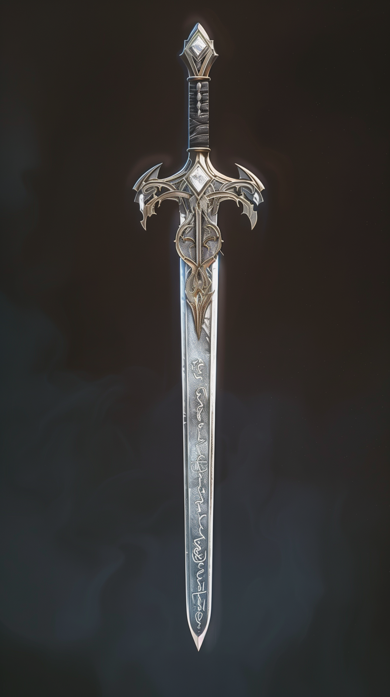
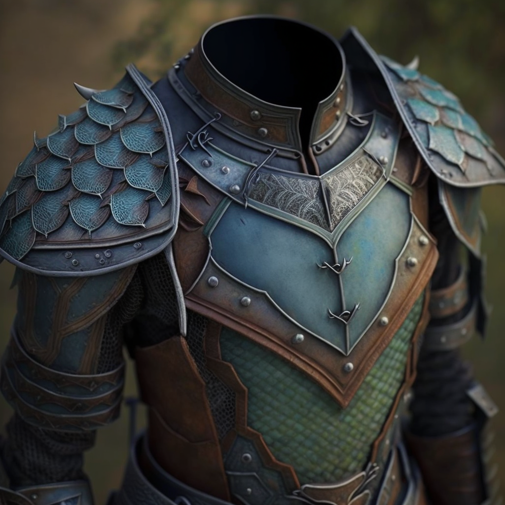
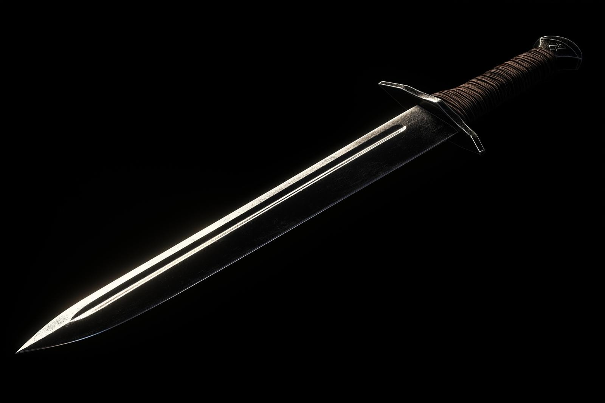
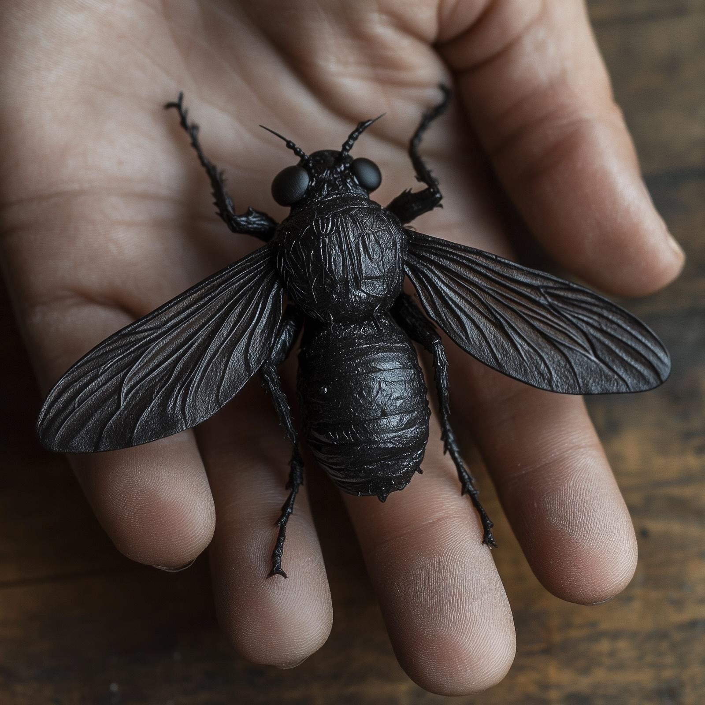
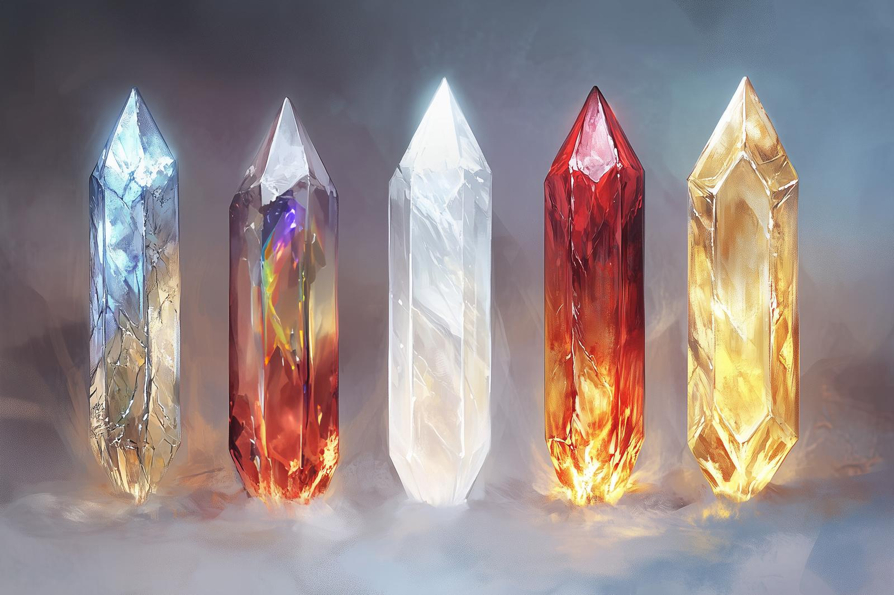

# Dunmar Fellowship Treasure

This records the magic items and mundane treasure acquired by the [Dunmar Fellowship](<../../people/pcs/dunmar-fellowship/dunmar-fellowship.md>) in the course of their adventures. Treasure that has been lost, used, destroyed, sold, or given away is [listed elsewhere](<./party-treasure-former.md>).
## Magic Items

*Note: potions and scrolls are not tracked here. Make sure to add these to character sheets when you get them, and remove them when you use them.*
### Delwath

| Image                                     | Name                               | Rarity                | Origin                                                                                                                                           | Mechanics                                                                       |
| ----------------------------------------- | ---------------------------------- | --------------------- | ------------------------------------------------------------------------------------------------------------------------------------------------ | ------------------------------------------------------------------------------- |
|                                           | Dust of Glibness                   | Minor item, Legendary | Found in [Ra'ghemdros' Hoard](<hoards/ra-ghemdros-hoard.md>)                                                                                                                  | [Mechanics](https://www.dndbeyond.com/magic-items/9218738-dust-of-glibness)     |
|                  | [Deno'qai Lynx Shield](<treasure/deno-qai-lynx-shield.md>)           | Major item, Legendary | [Gift](<hoards/gifts-and-purchases.md>) from [Enon](<../../people/deno-qai/enon.md>), and blessed by the [Meswati](<../../gods-and-religions/gods/tanshi/meswati/meswati.md>) as they were freed. Later enhanced with [Skaer Steel](<../../things/materials/skaer-steel.md>) by [Umli](<../../people/other-nonhumans/umli.md>). | [Mechanics](https://www.dndbeyond.com/magic-items/5360068-lynx-denoqai-shield)  |
|                    | [Narengril](<treasure/narengril.md>)                      | Major item, Rare      | Found in [Grimbaskal's Hoard](<hoards/grimbaskal-s-hoard.md>)                                                                                                                  | [Mechanics](https://www.dndbeyond.com/magic-items/5346819-narengril)            |
|  | [Deno'qai Scale Mail](<treasure/deno-qai-scale-mail.md>)            | Major item, Uncommon  | [Gift](<hoards/gifts-and-purchases.md>) from [Enon](<../../people/deno-qai/enon.md>)                                                                                                      | [Mechanics](https://www.dndbeyond.com/magic-items/5372382-denoqai-scale-mail)   |
|                                           | [Rod of Elmerca's Bond](<treasure/rod-of-elmerca-s-bond.md>)          | Major item, Rare      | Take from [Apollyon's Tower](<hoards/apollyon-s-tower-treasure.md>) on the ~Circular Island~.                                                          | [Mechanics](https://www.dndbeyond.com/magic-items/9217523-rod-of-elmercas-bond) |
|            | [Horn of Silent Alarm (Dunmari)](<../../things/magic-items/horn-of-silent-alarm-dunmari.md>) | Minor item, Common    | Taken from [Justan](<../../people/dunmari/justan.md>) in the [Copper Hills](<hoards/copper-hills-treasure.md>) after he was killed by [Casian](<../../people/chardonians/casian.md>)                                           | [Mechanics](https://www.dndbeyond.com/magic-items/horn-of-silent-alarm)         |
|   | Ring of Sharp Mind                 | Minor item, Rare      | Constructed by [Faldrak](<../../people/dwarves/faldrak-bronzehammer.md>) and [Seeker](<../../people/pcs/dunmar-fellowship/seeker.md>) at the [Elemental Forge](<hoards/elemental-forge-hoard.md>)                                | [Mechanics](https://www.dndbeyond.com/magic-items/7632123-ring-of-sharp-mind)   |
|          | Magic Cooking Pouch                | Minor item, Uncommon  | [Purchased](<hoards/gifts-and-purchases.md#purchases>) from the Te'kula in exchange for a portion of [Grimbaskal's Hoard](<hoards/grimbaskal-s-hoard.md>)                            | [Mechanics](https://www.dndbeyond.com/magic-items/6210885-magic-cooking-pouch)  |

### Wellby 

| Image                                        | Name                                            | Rarity                | Origin and Notes                                                                                                      | Mechanics                                                                                    |
| -------------------------------------------- | ----------------------------------------------- | --------------------- | --------------------------------------------------------------------------------------------------------------------- | -------------------------------------------------------------------------------------------- |
|           | Boots of Speed                                  | Major item, Rare      | Taken from [Hektor](<../../people/chardonians/hektor.md>) as part of the [Kadmos and Company Loot](<hoards/kadmos-and-company-loot.md>)                                                      | [Mechanics](https://www.dndbeyond.com/magic-items/4589-boots-of-speed)                       |
|                                              | [Wayfarer's Bow](<treasure/wayfarer-s-bow.md>)                              | Major item, Very Rare | Found as part of [Ra'ghemdros' Hoard](<hoards/ra-ghemdros-hoard.md>)                                                                               | [Mechanics](https://www.dndbeyond.com/magic-items/9218851-wayfarers-bow-shortbow)            |
|       | Vicious Shortsword                              | Major item, Rare      | Part of the [Werewolf Lair Treasure](<hoards/werewolf-lair-treasure.md>)                                                                                | [Mechanics](https://www.dndbeyond.com/magic-items/5208-vicious-shortsword)                   |
|              | [Obsidian Fly](<treasure/obsidian-fly.md>)                                | Major item, Rare      | Part of [Agata's Treasure](<hoards/agata-s-treasure.md>)                                                                                          | [Mechanics](https://www.dndbeyond.com/magic-items/4831-figurine-of-wondrous-power-ebony-fly) |
|   | Cloak of Protection                             | Major item, Uncommon  | Taken from Buruli as part of the [Merfolk Quest Treasure](<hoards/merfolk-quest-treasure.md>)                                                       | [Mechanics](https://www.dndbeyond.com/magic-items/4607-cloak-of-protection)                  |
|        | [Flaming Bowstring](<treasure/flaming-bowstring.md>)                           | Major item, Uncommon  | [Gift](<hoards/gifts-and-purchases.md>) from [Havdar](<../../people/dunmari/havdar.md>) in thanks for aid in battle against orcs of [Grash's Horde](<../../groups/orc-hordes/grash-s-horde.md>)           | [Mechanics](https://www.dndbeyond.com/magic-items/8705290-flaming-bowstring)                 |
|           | [Frostshard Shortbow](<../../things/magic-items/frostshard-weapons.md>)     | Major item, Uncommon  | [Purchased](<hoards/gifts-and-purchases.md#purchases>) in [Zvervinka](<../../gazetteer/northern-green-sea/ursk/zvervinka.md>)                                                         | [Mechanics](https://www.dndbeyond.com/magic-items/5254-shortbow-1)                           |
|    | [Kenku Glamoured Armor](<treasure/kenku-glamoured-armor.md>)                       | Major item, Very rare | Found in [Grimbaskal's Hoard](<hoards/grimbaskal-s-hoard.md>). Enhanced and repaired by [Nahto](<../../people/kenku/nahto.md>).                                                  | [Mechanics](https://www.dndbeyond.com/magic-items/5793008-kenku-studded-leather-enhanced)    |
|                                              | Moon Necklace                                   | Minor item, Common    | [Gift](<hoards/gifts-and-purchases.md>) from [Arryn](<../../people/other-humans/arryn.md>)                                                                          | [Mechanics](https://www.dndbeyond.com/magic-items/5920576-moon-necklace)                     |
|                                              | Hat of Vermin                                   | Minor item, Common    | [Purchased](<hoards/gifts-and-purchases.md#purchases>) from the Te'kula in exchange for a portion of [Grimbaskal's Hoard](<hoards/grimbaskal-s-hoard.md>) | [Mechanics](https://www.dndbeyond.com/magic-items/27049-hat-of-vermin)                       |
|                                              | Clockwork Amulet                                | Minor item, Common    | [Purchased](<hoards/gifts-and-purchases.md#purchases>) from the Te'kula in exchange for a portion of [Grimbaskal's Hoard](<hoards/grimbaskal-s-hoard.md>) | [Mechanics](https://www.dndbeyond.com/magic-items/27042-clockwork-amulet)                    |
|                                              | Saddle of the Bonded Companion                  | Minor item, Rare      | Found in [Grimbaskal's Hoard](<hoards/grimbaskal-s-hoard.md>)                                                                                       | [Mechanics](https://www.dndbeyond.com/magic-items/5346718-saddle-of-the-bonded-companion)    |
|                                              | [Skaer Steel](<../../things/materials/skaer-steel.md>) arrows                          | Minor item, Rare      | [Purchased](<hoards/gifts-and-purchases.md#purchases>) from [Umli](<../../people/other-nonhumans/umli.md>)                                                            | N/A                                                                                          |
|                                              | Chime of Opening                                | Minor item, Rare      | Taken from [Antonia](<hoards/kadmos-and-company-loot.md>) as part of the [Kadmos and Company Loot](<hoards/kadmos-and-company-loot.md>).                           | [Mechanics](https://www.dndbeyond.com/magic-items/4602-chime-of-opening)                     |
|            | [Dwarven Driftglobe](<../../things/magic-items/dwarven-driftglobe.md>)                          | Minor item, Uncommon  | Part of the [Raven's Hold Treasure](<hoards/raven-s-hold-treasure.md>)                                                                                 | [Mechanics](https://www.dndbeyond.com/magic-items/5349-driftglobe)                           |
|                                              | [Drankorian Message Stone](<../../things/magic-items/drankorian-message-stone.md>)                    | Minor item, Uncommon  | Long range version. Part of [Agata's Treasure](<hoards/agata-s-treasure.md>). Paired stone currently held by [Sura](<../../people/dunmari/sura.md>).                            | [Mechanics](https://www.dndbeyond.com/magic-items/3657531-drankorian-message-stone)          |
|                                              | [Tattoo of Darkvision](<../../things/magic-items/tollen-magical-tattoo.md>) | Minor item, Uncommon  | [Purchased](<hoards/gifts-and-purchases.md#purchases>) from [Cecilia Lister](<../../people/tollenders/cecilia-lister.md>)                                                  | [Mechanics](https://www.dndbeyond.com/magic-items/4648-goggles-of-night)                     |

### Kenzo

| Image                                       | Name                                   | Rarity                | Origin and Notes                                                                                                                                                   | Mechanics                                                                           |
| ------------------------------------------- | -------------------------------------- | --------------------- | ------------------------------------------------------------------------------------------------------------------------------------------------------------------ | ----------------------------------------------------------------------------------- |
|                                             | [Staff of the Forest Soul](<treasure/staff-of-the-forest-soul.md>)           | Major item, Very rare | Constructed by Kenzo from a branch of the Tokra tree, a [gift](<hoards/gifts-and-purchases.md>)  from [Rishi](<../../people/dunmari/rishi.md>)                                                              | [Mechanics](https://www.dndbeyond.com/magic-items/5330897-staff-of-the-forest-soul) |
|           | [Raven Whistle](<treasure/raven-whistle.md>)                      | Major item, Rare      | Part of [Agata's Treasure](<hoards/agata-s-treasure.md>)                                                                                                                                       | [Mechanics](https://www.dndbeyond.com/magic-items/3819621-raven-whistle)            |
|        | Dragonscale Cloak                      | Major item, Rare      | [Purchased](<hoards/gifts-and-purchases.md#purchases>) in [Zvervinka](<../../gazetteer/northern-green-sea/ursk/zvervinka.md>)                                                                                                      | [Mechanics](https://www.dndbeyond.com/magic-items/4047227-scaled-ornament-stirring) |
|  | Ring of Fire Protection                | Major item, Rare      | Part of [Agata's Treasure](<hoards/agata-s-treasure.md>)                                                                                                                                       | [Mechanics](https://www.dndbeyond.com/magic-items/5149-ring-of-fire-resistance)     |
|          | Ring of Jumping                        | Major item, Uncommon  | [Acquired from Havdar](<hoards/gifts-and-purchases.md>) in exchange for the Spear of the War Leader from the [Raven's Hold Treasure](<hoards/raven-s-hold-treasure.md>)                                       | [Mechanics](https://www.dndbeyond.com/magic-items/4724-ring-of-jumping)             |
|   | Wand of Caustic Arrows                 | Major item, Uncommon  | Part of [Agata's Treasure](<hoards/agata-s-treasure.md>)                                                                                                                                       |                                                                                     |
|                                             | [Soul Tattoo](<../../things/magic-items/tollen-magical-tattoo.md>) | Major item, Rare      | [Purchased](<hoards/gifts-and-purchases.md#purchases>) from [Cecilia Lister](<../../people/tollenders/cecilia-lister.md>) in exchange for gold and the Shadowfell Brand tattoo from [Kadmos](<hoards/kadmos-and-company-loot.md>) | [Mechanics](https://www.dndbeyond.com/magic-items/7087402-soul-tattoo)              |
|           | [Dwarven Driftglobe](<../../things/magic-items/dwarven-driftglobe.md>)                 | Minor item, Uncommon  | Part of the [Raven's Hold Treasure](<hoards/raven-s-hold-treasure.md>)                                                                                                                              | [Mechanics](https://www.dndbeyond.com/magic-items/5349-driftglobe)                  |
|                                             | Dream Mirror                           | Minor item, Common    | Part of [Agata's Treasure](<hoards/agata-s-treasure.md>)                                                                                                                                       |                                                                                     |
|                                             | Cloak of the Mantra Ray                | Minor item, Uncommon  | [Purchased](<hoards/gifts-and-purchases.md#purchases>) from the Te'kula in exchange for a portion of [Grimbaskal's Hoard](<hoards/grimbaskal-s-hoard.md>)                                              | [Mechanics](https://www.dndbeyond.com/magic-items/4609-cloak-of-the-manta-ray)      |
|                                             | [Aagir's Everlight](<../../things/magic-items/aagir-s-everlight.md>)                  | Minor item, Common    | Found in the [Dunmari Fort (Gomat)](<hoards/nashtkar-treasures.md>) as part of the [Nashtkar Treasures](<hoards/nashtkar-treasures.md>)                                                                    |                                                                                     |
|                                             | [Scroll of Storykeeping](<../../things/magic-items/scroll-of-storykeeping.md>)             | Minor item, Uncommon  | [Gift](<hoards/gifts-and-purchases.md>) from [Saka](<../../people/dunmari/saka.md>)                                                                                                                        |                                                                                     |
|                                             | Necklace of Fireballs                  | Major item, Rare      | Found as a part of [Ra'ghemdros' Hoard](<hoards/ra-ghemdros-hoard.md>). Eight charges when found.                                                                                               | [Mechanics](https://www.dndbeyond.com/magic-items/4683-necklace-of-fireballs)       |

### Seeker

| Image                                               | Name                                             | Rarity                | Origin and Notes                                                                          | Mechanics                                                                                |
| --------------------------------------------------- | ------------------------------------------------ | --------------------- | ----------------------------------------------------------------------------------------- | ---------------------------------------------------------------------------------------- |
|                                                     | [Rings of Elemental Protection](<treasure/rings-of-elemental-protection.md>)                | Major item, Very rare | Taken from Apollyon's Tower Treasure. Have ruby, sapphire, emerald. | [Mechanics](https://www.dndbeyond.com/magic-items/9217495-rings-of-elemental-protection) |
|                                                     | Wand of the Planes                           | Major item, Very rare | Found as part of [Ra'ghemdros' Hoard](<hoards/ra-ghemdros-hoard.md>)                                                   | [Mechanics](https://www.dndbeyond.com/magic-items/9218666-wand-of-the-planes)            |
|                         | [Cha'mutte’s Shadow Armband](<treasure/cha-muttes-shadow-armband.md>)                   | Major item, Legendary | Recovered from the [Forest of Nightmares](<../../gazetteer/northern-sentinels/forest-of-nightmares.md>) by [Delwath](<../../people/pcs/dunmar-fellowship/delwath.md>)                                | N/A                                                                                      |
|                         | [Binding Stones](<treasure/binding-stones.md>)                               | Major item, Legendary | Found in [Stormcaller Tower](<hoards/stormcaller-tower-treasure.md>)                                | [Mechanics](https://www.dndbeyond.com/magic-items/7676659-binding-stones-of-amloch)      |
|   | [Dragonhide Studded Leather](<../../things/magic-items/dragonhide-armor.md>) | Major item, Uncommmon | [Purchased](<hoards/gifts-and-purchases.md#purchases>) in [Zvervinka](<../../gazetteer/northern-green-sea/ursk/zvervinka.md>)                             | [Mechanics](https://www.dndbeyond.com/magic-items/5096-studded-leather-1)                |
|             | [Ring of the Warded Mind](<treasure/ring-of-the-warded-mind.md>)                      | Major item, Uncommon  | Part of [Agata's Treasure](<hoards/agata-s-treasure.md>)                                                              | [Mechanics](https://www.dndbeyond.com/magic-items/4725-ring-of-mind-shielding)           |
|                  | Pearl of Power                                   | Major item, Uncommon  | Recovered from [Raven's Hold](<hoards/raven-s-hold-treasure.md>)                                    | [Mechanics](https://www.dndbeyond.com/magic-items/4691-pearl-of-power)                   |
|            | [Glove of Crystalized Magic](<treasure/glove-of-crystalized-magic.md>)                   | Major item, Very rare | Constructed by Seeker from gift of crystallized magic from [Illaran](<../../people/fey/illaran.md>)                    | [Mechanics](https://www.dndbeyond.com/magic-items/5865922-glove-of-crystallized-magic)   |
|                                                     | Sunset Thread                                    | Minor item, Common    | Gift from [Lady Eventide](<../../people/fey/lady-eventide.md>), in exchange for the color from a strand of Seeker's hair     |                                                                                          |
|                                                     | Charlatan's Dice                                 | Minor item, Common    | Part of [Agata's Treasure](<hoards/agata-s-treasure.md>)                                                              |                                                                                          |
|                                                     | Chanceweaver's Dice                              | Minor item, Rare      | Gift from the [Chanceweaver](<../../people/extraplanar-powers/archfey/prince-of-luck.md>)                                            | [Mechanics](https://www.dndbeyond.com/magic-items/5920637-chanceweavers-dice)            |
|                                                     | Alchemical Teakettle                             | Minor item, Uncommon  | Part of [Agata's Treasure](<hoards/agata-s-treasure.md>)                                                              | [Mechanics](https://www.dndbeyond.com/magic-items/3819614-alchemical-teakettle)          |
|                                                     | Wand of Detect Magic                             | Minor item, Uncommon  | Part of [Grimbaskal's Hoard](<hoards/grimbaskal-s-hoard.md>)                                                            | [Mechanics]( https://www.dndbeyond.com/magic-items/5346836-wand-of-detect-magic)         |
|                                                     | [Goggles of Object Reading](<treasure/goggles-of-object-reading.md>)                    | Minor item, Uncommon  | Found in [Stormcaller Tower](<hoards/stormcaller-tower-treasure.md>)                                | [Mechanics](https://www.dndbeyond.com/magic-items/2984533-goggles-of-object-reading)     |
|                                                     | Immovable Rod                                    | Minor item, Uncommon  | Acquired from the Te'kula in exchange for a portion of [Grimbaskal's Hoard](<hoards/grimbaskal-s-hoard.md>)         |                                                                                          |
### Riswynn

| Image                      | Name                                   | Rarity                | Origin and Notes                                                                          | Mechanics                                                                         |
| -------------------------- | -------------------------------------- | --------------------- | ----------------------------------------------------------------------------------------- | --------------------------------------------------------------------------------- |
|  | [Shatterstorm](<treasure/shatterstorm.md>)                       | Major item, Rare      | Recovered from [Raven's Hold](<hoards/raven-s-hold-treasure.md>)                                    | [Mechanics](https://www.dndbeyond.com/magic-items/2172493-shatterstorm)           |
|                            | Girdle of the Mountain             | Major item, Legendary | Found in [Ra'ghemdros' Hoard](<hoards/ra-ghemdros-hoard.md>)                                                           | [Mechanics](https://www.dndbeyond.com/magic-items/9218870-girdle-of-the-mountain) |
|                            | [Silverspark Gauntlets](<treasure/silverspark-gauntlets.md>)              | Major item, Uncommon  | Gift from [Nora Silverspark](<../../people/dwarves/nora-silverspark.md>)'s ghost                                                    | [Mechanics](https://www.dndbeyond.com/magic-items/4641-gauntlets-of-ogre-power)   |
|                            | [Dragonhide Cloak](<../../things/magic-items/dragonhide-armor.md>) | Major item, Uncommon  | Purchased in [Zvervinka](<../../gazetteer/northern-green-sea/ursk/zvervinka.md>)                                                                | [Mechanics](https://www.dndbeyond.com/magic-items/4607-cloak-of-protection)       |
|                            | Masterwork [Skaer Steel](<../../things/materials/skaer-steel.md>) shield      | Major item, rare      | Purchased from [Umli](<../../people/other-nonhumans/umli.md>)                                                                   | [Mechanics](https://www.dndbeyond.com/magic-items/7633182-skaer-shield)           |
|                            | Coin of Delving                        | Minor item, Common    | Gift from Brawnanvils                                                                     | [Mechanics](https://www.dndbeyond.com/magic-items/1434262-coin-of-delving)        |
|                            | [Crown of Purity](<../../things/artifacts-of-power/crown-of-purity.md>)                    | Artifact              | Part of the [Drankorian Treasure](<hoards/drankorian-treasure.md>), taken from [Fausto](<../../people/chardonians/fausto.md>). Currently worn by [Riswynn](<../../people/pcs/dunmar-fellowship/riswynn.md>) |                                                                                   |

### Party

*Party items are stored in the [Portable Hole](<treasure/portable-hole.md>), unless otherwise indicated. The [Portable Hole](<treasure/portable-hole.md>) is folded up and stashed in a lead-lined locket worn by [Wellby](<../../people/pcs/dunmar-fellowship/wellby.md>).*

| Image                                          | Name                           | Rarity                | Origin and Notes                                                                                                                                                                                                                          | Mechanics                                                                                                    |
| ---------------------------------------------- | ------------------------------ | --------------------- | ----------------------------------------------------------------------------------------------------------------------------------------------------------------------------------------------------------------------------------------- | ------------------------------------------------------------------------------------------------------------ |
|                                                | Apollyon's Crystal Ball    | Major item, Legendary | Part of the [Drankorian Treasure](<hoards/drankorian-treasure.md>), taken from Apollyon's Temple                                                                                                                                                                     |                                                                                                              |
|          | [Taurion's Manual of Golems](<treasure/taurion-s-manual-of-golems.md>) | Major item, Very Rare | Part of the [Tower of the Colossus Treasure](<hoards/tower-of-the-colossus-treasure.md>)                                                                                                                                                                                            | [Mechanics](https://www.dndbeyond.com/magic-items/4950-manual-of-stone-golems)                               |
|                                                | Carnelian Triceratops Figurine | Major item, Very Rare | Found as part of [Ra'ghemdros' Hoard](<hoards/ra-ghemdros-hoard.md>)                                                                                                                                                                                                   | [Mechanics](https://www.dndbeyond.com/magic-items/7102431-prehistoric-figurine-of-wondrous-power-carnelian ) |
|                                                | [Pearls of Far Sight](<treasure/pearls-of-far-sight.md>)        | Major item, Very Rare | Found as part of [Ra'ghemdros' Hoard](<hoards/ra-ghemdros-hoard.md>)                                                                                                                                                                                                   | [Mechanics](https://www.dndbeyond.com/magic-items/9218524-pearls-of-far-sight)                               |
|        | [Mirror of Soul Trapping](<treasure/mirror-of-soul-trapping.md>)    | Major item, Very Rare | Part of [Agata's Treasure](<hoards/agata-s-treasure.md>)                                                                                                                                                                                                              | N/A                                                                                                          |
|                | [Mirror of the Past](<treasure/mirror-of-the-past.md>)         | Major item, Very Rare | Found in [Stormcaller Tower](<hoards/stormcaller-tower-treasure.md>)                                                                                                                                                                                | [Mechanics](https://www.dndbeyond.com/magic-items/2739459-eudomes-mirror)                                    |
|  | Efreeti Bottle                 | Major item, Very rare | Found in [Grimbaskal's Hoard](<hoards/grimbaskal-s-hoard.md>)                                                                                                                                                                                                           | [Mechanics](https://www.dndbeyond.com/magic-items/4629-efreeti-bottle)                                       |
|                                                | [Longsword of Heroism](<treasure/longsword-of-heroism.md>)       | Major item, Rare      | Found in [Kharsan](<hoards/nashtkar-treasures.md#found-in-kharsan>)                                                                                                                                                                                 | [Mechanics](https://www.dndbeyond.com/magic-items/8884215-longsword-of-heroism)                              |
|                                                | Cloak of Elvenkind             | Major item, Uncommon  | Found in the [Elemental Forge Hoard](<hoards/elemental-forge-hoard.md>)                                                                                                                                                                                                    | [Mechanics](https://www.dndbeyond.com/magic-items/4606-cloak-of-elvenkind)                                   |
|   | [Portable Hole](<treasure/portable-hole.md>)              | Minor item, Rare      | Acquired from [Basu](<../../people/dunmari/basu.md>) in exchange for help clearing the [Elven Arborea Workshop](<../../gazetteer/greater-dunmar/dunmari-basin/elven-arborea-workshop.md>)                                                                                                                                                       | [Mechanics](https://www.dndbeyond.com/magic-items/4699-portable-hole)                                        |
|                     | [Augury Mirrors](<treasure/augury-mirrors.md>)             | Minor item, Rare      | Found in [Grimbaskal's Hoard](<hoards/grimbaskal-s-hoard.md>)                                                                                                                                                                                                           | [Mechanics](https://www.dndbeyond.com/magic-items/5346832-augury-mirrors)                                    |
|                                                | [Ever Spinning Top](<treasure/ever-spinning-top.md>)          | Minor item, Common    | Originally part of [Agata's Treasure](<hoards/agata-s-treasure.md>); stolen by [Kadmos](<../../people/chardonians/kadmos.md>), and [reclaimed](<hoards/kadmos-and-company-loot.md>).                                                                                                                                | [Mechanics](https://www.dndbeyond.com/magic-items/3819604-always-spinning-top)                               |
|                                                | Enchanted oyster shell         | Minor item, Rare      | [Gifted](<hoards/gifts-and-purchases.md>) by [Skaer](<../../gazetteer/western-green-sea/skaerhem/skaerhem.md>) as thanks for defeating the demon of [Vetta](<../../gazetteer/western-green-sea/skaerhem/vetta.md>). Can be used once to cast [Divination](https://www.dndbeyond.com/spells/2073-divination) with no components, targeting [Kaikkea](<../../gods-and-religions/gods/incorporeal-gods/kaikkea.md>). | N/A                                                                                                          |
|                                                | [Drankorian Message Stone](<../../things/magic-items/drankorian-message-stone.md>)   | Minor item, Uncommon  | Long range version. Found in the [Elemental Forge Hoard](<hoards/elemental-forge-hoard.md>). [Lucius](<../../people/chardonians/lucius.md>), a boy in a small village in [Chardon](<../../gazetteer/greater-chardon/chardonian-empire/chardon/chardon.md>) has its pair, and thinks it is his imaginary friend Benji talking.                                                        | [Mechanics](https://www.dndbeyond.com/magic-items/3657531-drankorian-message-stone)                          |
|                                                | Locked spellbook               | Unknown               | From the [Elemental Forge Hoard](<hoards/elemental-forge-hoard.md>)                                                                                                                                                                                                        | N/A                                                                                                          |
|                                                | Frostbrand Greatsword          | Major item, Rare      | From [Ra'ghemdros' Hoard](<hoards/ra-ghemdros-hoard.md>)                                                                                                                                                                                                               | [Mechanics](https://www.dndbeyond.com/magic-items/9218564-frostbrand-greatsword)                             |

### Common Drankorian Magic

These are the common and uncommon items recovered from [Ra'ghemdros' Hoard](<hoards/ra-ghemdros-hoard.md>). Items marked with a **+** require attumement

- 17 magic weapons and shields, converted to a [meta-resource](<./party-treasure.md#other-rewards>).
- 3 [Orb of Time](https://www.dndbeyond.com/magic-items/27078-orb-of-time)
- 2 [Amulet of the Devout](https://www.dndbeyond.com/magic-items/2411840-amulet-of-the-devout-1), bearing the symbol of [The Sibyl](<../../gods-and-religions/gods/incorporeal-gods/mos-numena-pantheon/the-sibyl.md>) (**+**)
- 1 Masquerade Amulet, bearing the symbol of [The Wildling](<../../gods-and-religions/gods/incorporeal-gods/mos-numena-pantheon/the-wildling.md>), which gives the attuned wearer the ability to cast *disguise self* once per day. (**+**)
- 1 [Brooch of Shielding](https://www.dndbeyond.com/magic-items/4596-brooch-of-shielding) (**+**)
- 1 silver ewer that, when you speak a command word, can turn the water in the ewer into wine. You can use this command word three times per day. 
- 1 silver pitcher that, when you speak a command word, fills itself with clear, pure water. You can use this command word three times per day. 
- 1 serving platter that allows you to season any food placed on the platter. 
- 2 goblets that allow you to cast *purify food and drink*, targeted liquid in the goblet only, once per day. 
- 5 rings that allow you to cast *prestidigitation* once per day. 
- 1 [Ring of Spell Recharge](https://www.dndbeyond.com/magic-items/4691-pearl-of-power) (**+**)
- 1 [Ring of Health](https://www.dndbeyond.com/magic-items/4692-periapt-of-health)
- A pair of matched rings that function as [Drankorian Message Stone](<../../things/magic-items/drankorian-message-stone.md>) (short range)
- 2 rings that let you cast mending once per day
- 1 ring of acrobatics, which lets you add 1d4 to any ability check you make using the Acrobatics skill (**+**)
- 2 candlesticks that let you cast light at will, targeting the candlestick only
- 1 [candle of fey detection](https://www.dndbeyond.com/magic-items/2188385-lantern-of-tracking-fey)
- 1 [candle of fiend detection](https://www.dndbeyond.com/magic-items/2188386-lantern-of-tracking-fiends)
- 1 [candle of elemental detection](https://www.dndbeyond.com/magic-items/2188384-lantern-of-tracking-elementals)

## Non-Magical Items

*All non-magical items are stored in the Portable Hole, unless noted.*
### Coin

- 1,000 mixed silver and 80 mixed gold coins from The Laughing Wave in [Drankor](<../../history/drankorian-era/drankor.md>), part of the [Drankorian Treasure](<hoards/drankorian-treasure.md>)
- 20,000 Drankorian gold coins from [Ra'ghemdros' Hoard](<hoards/ra-ghemdros-hoard.md>)
- 300,000 Drankorian silver coins from [Ra'ghemdros' Hoard](<hoards/ra-ghemdros-hoard.md>)
- 250 gold Drankorian coins (250 gp), taken from [Apollyon's Tower](<hoards/apollyon-s-tower-treasure.md>) on the ~Circular Island~
- 3000 tarnished Drankorian silver coins (300 gp), taken from [Apollyon's Tower](<hoards/apollyon-s-tower-treasure.md>) on the ~Circular Island~ 
- 109 Dunmari silver coins, from [Merfolk Quest Treasure](<hoards/merfolk-quest-treasure.md>)
- 93 strange silver coins of a design you have never seen, with a small hole in the center and strange writing around the edge, from [Merfolk Quest Treasure](<hoards/merfolk-quest-treasure.md>).
- 50 pounds of gold in trade bars (2,500 gp), from [Shadowkeep](<hoards/ursk-treasure.md>)
- 7 1/2 heavy gold bars, each weighing 10 pounds and worth 500 gp (total value 3750 gp), recovered from the [Elemental Forge Hoard](<hoards/elemental-forge-hoard.md>)
- 15 heavy silver bars, each weighing 5 pounds and worth 25 gp (total value 375 gp), recovered from the [Elemental Forge Hoard](<hoards/elemental-forge-hoard.md>)
- 2000 Tollender silver coins (200 gp, from the [Flaming Tempest Hoard](<hoards/flaming-tempest-hoard.md>)).
- 200 Sembaran gold coins (200 gp, from the [Flaming Tempest Hoard](<hoards/flaming-tempest-hoard.md>)).
- 105,112 Chardonian silver coins (10,500 gp, from  [Grimbaskal's Hoard](<hoards/grimbaskal-s-hoard.md>) and [Merfolk Quest Treasure](<hoards/merfolk-quest-treasure.md>)).
- 60,000 Chardonian copper coins (600 gp, from  [Grimbaskal's Hoard](<hoards/grimbaskal-s-hoard.md>)).
- 11,500 ancient Elven silver coins (2,300 gp; 5 elven silver = 1 gp, from [Grimbaskal's Hoard](<hoards/grimbaskal-s-hoard.md>)).
- 30,000 mixed Drankorian coins (5,000 gp, could be more to the right collector, from  [Grimbaskal's Hoard](<hoards/grimbaskal-s-hoard.md>)).
- 200,000 mixed coins from the Kin-Asa city state (6,000 gp, could be more to the right collector, from [Grimbaskal's Hoard](<hoards/grimbaskal-s-hoard.md>)).
- 7,014 Dwarven gold coins (7,014 gp, from [Grimbaskal's Hoard](<hoards/grimbaskal-s-hoard.md>) and [Merfolk Quest Treasure](<hoards/merfolk-quest-treasure.md>)).
- 4,113 Chardonian gold coins (4,113 gp, from [Grimbaskal's Hoard](<hoards/grimbaskal-s-hoard.md>)).
- 36 small silver disks stamped with the [Blackened Claw](<../../groups/hobgoblin-clans/blackened-claw.md>) mark, from the [Raven's Hold Treasure](<hoards/raven-s-hold-treasure.md>).
- 66 copper disks stamped with the [Blackened Claw](<../../groups/hobgoblin-clans/blackened-claw.md>) mark, from the [Raven's Hold Treasure](<hoards/raven-s-hold-treasure.md>).

### Gemstones
- Four large pearls, a [gift from the Skaer](<hoards/gifts-and-purchases.md>)
- 16 uncut and unpolished gemstones (value would increase if properly cut), from the [Elemental Forge Hoard](<hoards/elemental-forge-hoard.md>):
	- Two rubies (deep red, radiant glow)
	- Three garnets (dark red, glassy appearance) 
	- Two peridot (bright green, light-catching sparkle) 
	- One opal (multicolored, mystical fire) 
	- Two citrine (yellow to orange, sunny and bright) 
	- Three topaz (golden yellow, shimmers in light)  
	- Two onyx (black, deep and opaque) 
	- One lapis lazuli (blue with gold flecks, royal appearance) 
- Three large pearls, damaged (25-50 gp each, from [Grimbaskal's Hoard](<hoards/grimbaskal-s-hoard.md>)).
- A set of six small pieces of polished jasper (10 - 60 gp each, from [Grimbaskal's Hoard](<hoards/grimbaskal-s-hoard.md>)).
- Two beautiful amethyst (100 - 200 gp each, from [Grimbaskal's Hoard](<hoards/grimbaskal-s-hoard.md>)).
- Two small garnets, uncut (25 - 50 gp as is, 50 - 100 gp if cut, from [Grimbaskal's Hoard](<hoards/grimbaskal-s-hoard.md>)).
- A flawed black pearl (50 - 300 gp, [Grimbaskal's Hoard](<hoards/grimbaskal-s-hoard.md>)).
- A large amber (100 - 200 gp, [Grimbaskal's Hoard](<hoards/grimbaskal-s-hoard.md>)).
- A extraordinarily fine black opal set on gold chain (400 - 2400 gp, [Grimbaskal's Hoard](<hoards/grimbaskal-s-hoard.md>)).
- A diamond of beautiful quality and cut. Could sell for 1000-2400gp. Seen in [Mirror of the Past](<treasure/mirror-of-the-past.md>): [Extravagant Diamond Vision](<mirror-visions/extravagant-diamond-vision.md>). From [Agata's Treasure](<hoards/agata-s-treasure.md>).
- Five uncut gemstones: an amethyst (10-60gp), a rose quartz (50-300gp), and a topaz (100-600gp). ​​If cut and polished by a skilled gemcutter, the topaz could sell for perhaps quadruple; the amethyst and rose quartz could sell for double. From [Agata's Treasure](<hoards/agata-s-treasure.md>).
- A single turquoise, shaped into a perfect blue sphere the size of a robin’s egg. Could sell for 200-1200gp. From [Agata's Treasure](<hoards/agata-s-treasure.md>).
### Jewelry

#### Drankorian Items
- A set of three plain golden rings, found as part of [Apollyon's Tower Treasure](<hoards/apollyon-s-tower-treasure.md>). Of Drankorian make.
- 2,200 elaborate rings with a variety of engravings and gemstone settings, from [Ra'ghemdros' Hoard](<hoards/ra-ghemdros-hoard.md>)
- 12,000 plain rings, generally silver or brass, from [Ra'ghemdros' Hoard](<hoards/ra-ghemdros-hoard.md>)
- 1,000 elaborate earrings often set with gems, from [Ra'ghemdros' Hoard](<hoards/ra-ghemdros-hoard.md>)
- 3,500 plain earrings, typically silver, from [Ra'ghemdros' Hoard](<hoards/ra-ghemdros-hoard.md>)
- 740 elaborate necklaces, often with gemstones or detailed gold work, from [Ra'ghemdros' Hoard](<hoards/ra-ghemdros-hoard.md>)
- 2000 common necklaces, typically of silver, from [Ra'ghemdros' Hoard](<hoards/ra-ghemdros-hoard.md>)
- 450 hairpins and combs, gold or set with gems, from [Ra'ghemdros' Hoard](<hoards/ra-ghemdros-hoard.md>)
- 300 belt buckles, brooches, and fasteners, gold or set with gems, from [Ra'ghemdros' Hoard](<hoards/ra-ghemdros-hoard.md>)
- 300 gold torcs and bracelets, from [Ra'ghemdros' Hoard](<hoards/ra-ghemdros-hoard.md>)
- **Sapphire and Diamond Necklace**: A stunning necklace featuring a cascade of sapphires surrounded by diamonds. 
- **Fine Gold Necklace**: A striking necklace made of interlinked gold pieces, each set with three teardrops with diamonds. 
- **Gold Medallion with Intricate Relief**: A large gold medallion featuring a detailed relief of a strange animalistic human figures. 
- **Imperial Signet Ring**: A heavy gold ring featuring the Drankorian imperial crest, used for sealing important documents and symbols of authority. 
- {align="right"; width="300"}**Chased Gold Ring**: A ring made of solid gold with intricate chase work depicting the mythology of dragnets, a rare work of art, eyes of rubies. 
- **Exquisite Gemstone Brooch**: A brooch made from an array of precious stones set in a unique floral design, a treasured family heirloom.
{align="right"; width="300"}  
- **Silver and Diamond Ring**. Etched in Elvish with a fragment of a poem about the stars. 
- **Emerald Platinum Ring**. A platinum ring set with a massive emerald.  
#### Other Jewelry
- An elaborate amulet of Gazankoa, made of ivory and gold, decorated with sapphires, taken from Buruli as part of the [Merfolk Quest Treasure](<hoards/merfolk-quest-treasure.md>)
- Three silver armbands, each finely worked and decorated with pearls, taken from Buruli as part of the [Merfolk Quest Treasure](<hoards/merfolk-quest-treasure.md>)
- 17 amulets of Gazankoa. Each amulet has a pearl in the center, with eight tentacles curling off in a spiral pattern. They are made of a variety of materials: 6 of shell, 7 of some kind of resin, 3 of ivory, and 1 of silver. Taken from various merfolk guards, as part of the [Merfolk Quest Treasure](<hoards/merfolk-quest-treasure.md>)
- Four projects in various states of completion recovered from the jeweler's workshop at the [Elemental Forge](<hoards/elemental-forge-hoard.md>). All would require further finishing work before being enchanted or sold. 
	- A delicate gold necklace with a pendant setting designed to hold a gemstone, but empty 
	- A pair of silver bracelets, one of which has an intricate set of etched symbols, the other looks half-finished 
	- A finely engraved platinum ring set with a tiny but perfect sapphire 
	- A silver tiara set with moonstones 
- A silver ring, set with an obsidian gem. Could sell for 300-1800gp. Part of [Agata's Treasure](<hoards/agata-s-treasure.md>).

### Objects of Art

#### Drankorian Objects
- A silver ewer of Drankorian make found as part of [Apollyon's Tower Treasure](<hoards/apollyon-s-tower-treasure.md>)
- A golden serving platter of Drankorian make found as part of [Apollyon's Tower Treasure](<hoards/apollyon-s-tower-treasure.md>)
- 450 gold and crystal serving platters, goblets, ewers, and cutlery, from [Ra'ghemdros' Hoard](<hoards/ra-ghemdros-hoard.md>)
- **Gold-encrusted Ceremonial Cup**: An ornate cup with intricate gold filigree and inlays of lapis lazuli, marked with archaic and out-of-date symbols of the eight divines.  
- {align="right"; width="300"}**Intricately Carved Marble Statuette**: A small, exquisite marble statue of a dragonet, displaying incredible detail and craftsmanship, inlaid with silver and emerald eyes. 
- **Gemstone-Set Dagger**: An elegantly designed dagger with a hilt encrusted with rubies and a finely etched blade.  
- **Imperial Scepter**: An elaborately designed scepter made from gold and adorned with multiple sapphires.  
- **Historic Silver Paten**: An intricately designed paten (plate) made of silver, clearly very old but unweathered and undamaged, with scenes of pastoral human life.  {align="right"; width="300"}
- **Ceremonial Stoneborn Shield**: An ornate shield crafted from metal, featuring vivid colors and designs that tell the story of the Stoneborn fighting in the Demonfire Wars against fiends.  
- **Bejeweled Imperial Coronation Crown**: A stunning crown adorned with emeralds, rubies, and pearls, symbolizing the authority and lineage of a ruling family.
- **Enamelled Silver Serving Platter**: A large serving platter with elaborate enamel work depicting a historical scene, used during feasts. Ships sailing away from a coast. 
- **Masterfully Wrought Sword**: A beautifully crafted sword with an inlaid hilt of gold and precious stones, displaying masterful smithing techniques. 
- **Royal Flagon**: An intricately designed flagon made of silver, adorned with engravings and gemstones, used for serving drinks at state banquets. Like a punchbowl. 
#### Other Objects of Art
- Dragon statuette glittering with small diamonds, from [Shadowkeep](<hoards/ursk-treasure.md>)
- A golden necklace with a holy symbol of Jeevali, dating to before the [Great War](<../../events/1500s/great-war.md>), with two blue lapus lazuli gemstones representing Jeevali's tears, found in [the palace in Kharsan](<hoards/nashtkar-treasures.md#found-in-kharsan>)
- A pair of nice wooden spoons, found in [the palace in Kharsan](<hoards/nashtkar-treasures.md#found-in-kharsan>)
- {align="right"; width="200"}A tapestry depicted a lush, wild rose garden, tangled and vibrant, probably of Elven make (450 - 650 gp, [Grimbaskal's Hoard](<hoards/grimbaskal-s-hoard.md>)).
- A tapestry of trees in bloom, in front of a mountain, in an unusual and hard to recognize style, probably from far away (unknown value, [Grimbaskal's Hoard](<hoards/grimbaskal-s-hoard.md>)).
- Carved bone statuette of an eagle (80 - 130 gp, [Grimbaskal's Hoard](<hoards/grimbaskal-s-hoard.md>)).
- The polished skull of a unicorn, latticed with luminescent blooms, and seemingly a minor enchantment to keep the flowers alive (150 - 900 gp, [Grimbaskal's Hoard](<hoards/grimbaskal-s-hoard.md>)).
- A life-sized wooden statute of an owl, carved from a single piece of wood, deep red in color, with gems for eyes and silver highlights on the feathers and talons (30 - 180 gp, [Grimbaskal's Hoard](<hoards/grimbaskal-s-hoard.md>)).
- A harp, its pillar carved to represent a beautiful elf (30 - 180 gp, [Grimbaskal's Hoard](<hoards/grimbaskal-s-hoard.md>)).
- A richly detailed, beautifully made painting of an ancient elven forest, of Elven make (at least 500 gp, possibly much more, [Grimbaskal's Hoard](<hoards/grimbaskal-s-hoard.md>)).
- [Chardon Fan](<treasure/chardon-fan.md>), part of [Agata's Treasure](<hoards/agata-s-treasure.md>) (carried by Kenzo).
- A small wooden box holding six small statuettes, each in the shape of a farm animal. All are clockwork contraptions which, when properly wound, walk and make the appropriate animal noise. There is a cow, a horse, a chicken, a pig, a goat (which was [given to Dunmari goat herders](<session-notes/session-40-dufr.md>)), and a sheep. Part of [Agata's Treasure](<hoards/agata-s-treasure.md>). Probably worth 10 - 180 gp as a set, perhaps 2-35 gp per item (carried by [Seeker](<../../people/pcs/dunmar-fellowship/seeker.md>)). 
### Books and Notes
- Approximately 100 scrolls from the Drankorian Customs House, consisting mostly of shipping records, part of the [Drankorian Treasure](<hoards/drankorian-treasure.md>)
- The Book of Martyrs of the Radiant Path, part of the [Drankorian Treasure](<hoards/drankorian-treasure.md>), found in the administrative complex of the Temple of the Eight Divines
- [Appollyon's](<../../people/historical-figures/drankorian-emperors/apollyon.md>) backup spellbook containing notes on how to use the forge in his tower, notes on how to become a lich, and perhaps other hidden secrets.
- Ten fireproof [books of records and lore](<../../things/books/compendium-of-fire.md>) about the [Elemental Plane of Fire](<../../cosmology/energy-realms/elemental-plane-of-fire.md>), and a chronicle of the history of the ~Circular Island~, taken from the Concordia Pyrae villa where Cloudspinner was imprisoned. 
- Six scrolls (five copies, one original) of Drankorian and Elvish literary works (poems and plays), found as part of the [Tower of the Colossus Treasure](<hoards/tower-of-the-colossus-treasure.md>)
- [The Lore of the Feywild](<../../things/books/the-lore-of-the-feywild.md>), by [Ulfgar Frostbeard](<../../people/dwarves/ulfgar-frostbeard.md>), received as a [gift](<hoards/gifts-and-purchases.md>)
- [On the Lost People of the Forests](<../../things/books/on-the-lost-people-of-the-forests.md>), by [Gnaeus](<../../people/chardonians/gnaeus.md>) received as a [gift](<hoards/gifts-and-purchases.md>)
- [The Runes of Creation](<../../things/books/the-runes-of-creation.md>), author unknown received as a [gift](<hoards/gifts-and-purchases.md>)
- A treatise about alchemy carved on metal cylinders, author unknown, from [Grimbaskal's Hoard](<hoards/grimbaskal-s-hoard.md>)
- The [Enchiridion of the Occulta Ludum](<../../things/books/enchiridion-of-the-occulta-ludum.md>), a small pamphlet titled in Drankorian, faintly magical and empty inside, part of the [Stormcaller Tower Treasure](<hoards/stormcaller-tower-treasure.md>). 
- A second copy of “The [Enchiridion of the Occulta Ludum](<../../things/books/enchiridion-of-the-occulta-ludum.md>)”, also blank and slightly magical. Found in the bedroom of the Elemental Forge workshop as part of the [Elemental Forge Hoard](<hoards/elemental-forge-hoard.md>)
- [Tales Before the Fall](<../../things/books/tales-before-the-fall.md>), a huge book written in Giant, with tales of giants, part of the [Stormcaller Tower Treasure](<hoards/stormcaller-tower-treasure.md>)
- On the Ordering of Giants, ancient, written in a strange language presumed to be the first tongue of humans, on giants, part of the [Stormcaller Tower Treasure](<hoards/stormcaller-tower-treasure.md>)
- [Journeys of Souls](<../../things/books/journeys-of-souls.md>), ancient, written in a strange language presumed to be the first tongue of humans, on the afterlife, part of the [Stormcaller Tower Treasure](<hoards/stormcaller-tower-treasure.md>)
- Four books from [Hralgar](<../../people/giants/hralgar.md>)'s library, all part of [Hralgar's Palace Treasure](<hoards/hralgar-s-palace-treasure.md>):
	- Notes on the construction of skyship controls, copied from a pillar 
	- A book on the history of [Vindristjarna](<../../things/ships/vindristjarna.md>), in [Hralgar](<../../people/giants/hralgar.md>)'s hand
	- A book on etiquette for entertaining the smaller races, written in Giant
	- A book of recipes, written in Giant
- Notes and papers from various sources:
	- A [scroll written in a cipher](<treasure/urgall-s-scroll.md>), from the [Flaming Tempest](<../../things/ships/flaming-tempest.md>), locked in chest in Urgall's cabin. 
	- The [Flaming Tempest log books](<treasure/flaming-tempest-log-books.md>), recovered from the [Flaming Tempest](<../../things/ships/flaming-tempest.md>)
	- [Papers from the Fraternity of the Empty Moon](<letters-and-notes/papers-from-the-fraternity-of-the-empty-moon.md>). Translations left at the [Tokra](<../../gazetteer/greater-dunmar/realms/dunmar/central-dunmar/tokra/tokra.md>) [Archives](<../../gazetteer/greater-dunmar/realms/dunmar/central-dunmar/tokra/archives.md>) with [Govir](<../../people/dunmari/govir.md>). No obvious value. Part of the [Werewolf Lair Treasure](<hoards/werewolf-lair-treasure.md>).
	- [Map of old Drankorian fort](<treasure/dunmari-map-of-pandemonium-ruins.md>) protecting area of [Pandemonium](<../../cosmology/spiritual-realms/pandemonium.md>) influence. Dunmari make. Taken from werewolf lair. Faintly magical. Part of the [Werewolf Lair Treasure](<hoards/werewolf-lair-treasure.md>).
	- Monk's journal from the [Great War](<../../events/1500s/great-war.md>) era ([Monastery of Bhishma](<../../gazetteer/greater-dunmar/dunmari-basin/monastery-of-bhishma.md>), [Kenzo](<../../people/pcs/dunmar-fellowship/kenzo.md>)). A small diary, written in Dunmari, of an unnamed monk, who seemed to have lived here just before the [Great War](<../../events/1500s/great-war.md>). The entries describe life in the monastery, the joy of the craft of parchment making and especially skill required to turn it into something that could take enchantments. Then,  increasing danger and the growing militarization of [Kharsan](<../../gazetteer/greater-dunmar/dunmari-basin/kharsan.md>), several attacks, news of distant heroes and great councils, then no news, which was worse. Then, people running scared of the red death, everyone fleeing east. Last entry: choosing to stay with the elders, contribute how I can to protecting our great work. [Bhishma](<../../gods-and-religions/gods/incorporeal-gods/dunmari-pantheon/bhishma.md>) watch over my soul. No obvious value although to the right person could be worth 5-30 gp. Part of the [Bhishma Monastery treasure](<hoards/nashtkar-treasures.md#found-in-bhishma-monastery>)
	- Captain's log and charts from The Flaming Tempest (allowing [Wellby](<../../people/pcs/dunmar-fellowship/wellby.md>) to reconstruct the journey of the [Flaming Tempest](<../../things/ships/flaming-tempest.md>), with time and effort), part of the [Flaming Tempest Hoard](<hoards/flaming-tempest-hoard.md>).
	- Sheaf of receipts from [Stormcaller Tower](<../../gazetteer/greater-dunmar/dunmari-basin/stormcaller-tower.md>).  Not a complete ledger, but a part of what seems to be a record of payments / receipts of wine, oil, salt, spices, written in Drankorian. Just a fragment with no dates remains. No obvious value. Part of the [Stormcaller Tower Treasure](<hoards/stormcaller-tower-treasure.md>).

### Unusual Materials or Components
- [Forge Components](<treasure/forge-components.md>) from [Apollyon's Tower Treasure](<hoards/apollyon-s-tower-treasure.md>), found near the magical forge in the basement. 
- A half-pound or so of adamantine scraps, from [Apollyon's Tower Treasure](<hoards/apollyon-s-tower-treasure.md>), the remains of the materials used to construct his phylactery.
- Two small metallic flies, about two inches across and made of a strange black metal, perhaps some kind of unusual iron. Inert. From [Apollyon's Tower Treasure](<hoards/apollyon-s-tower-treasure.md>).
- Two cracked pieces of once-magical crystal that powered the constructs, from [Apollyon's Tower Treasure](<hoards/apollyon-s-tower-treasure.md>).
- Four magical glass lenses of a variety of sizes, once apparently part of a telescope. From the [Tower of the Colossus Treasure](<hoards/tower-of-the-colossus-treasure.md>). 
- Scroll making material (inks and paper), part of the [Tower of the Colossus Treasure](<hoards/tower-of-the-colossus-treasure.md>). Enough materials to make four spell scrolls (three up to 3rd level, one up to 5th level). Each scroll made with these materials requires 8 hours of work. 
- A small humming piece of metal, which sounds like the ocean, found connected to the [Jade Piece of Rai's Hand](<treasure/jade-piece-of-rai-s-hand.md>) inside a shell in Buruli's temple to Gazankoa, from [Merfolk Quest Treasure](<hoards/merfolk-quest-treasure.md>). Functions as a plane shift tuning fork attuned to the [Elemental Plane of Water](<../../cosmology/energy-realms/elemental-plane-of-water.md>)
- Two tuning forks. One is attuned to the [Elemental Plane of Air](<../../cosmology/energy-realms/elemental-plane-of-air.md>); the other is attuned to an unknown plane. These can be used as part of the plane shift spell or other magic. Taken from the [Elemental Forge Hoard](<hoards/elemental-forge-hoard.md>)
- Eight red dragon scales, from the [Elemental Forge Hoard](<hoards/elemental-forge-hoard.md>)
- Two vials of mercury, from the [Elemental Forge Hoard](<hoards/elemental-forge-hoard.md>)
- A gilded skull of a halfling, taken from [Kadmos](<../../people/chardonians/kadmos.md>) as part of the [Kadmos and Company Loot](<hoards/kadmos-and-company-loot.md>)
- Blank spell scroll ([Monastery of Bhishma](<../../gazetteer/greater-dunmar/dunmari-basin/monastery-of-bhishma.md>), [Seeker](<../../people/pcs/dunmar-fellowship/seeker.md>)). Valuable, could be sold to the right person for 50-300 gp. Can be used to construct a spell scroll in 8 hours, of up to level 2. 
- Bottle of a swirling, oily substance that explodes when throw, from werewolf trap expert. Unknown value. Part of the [Werewolf Lair Treasure](<hoards/werewolf-lair-treasure.md>).
- Death Water from the pool of mist ([Raven's Hold](<../../gazetteer/greater-dunmar/dunmari-basin/raven-s-hold.md>); [Delwath](<../../people/pcs/dunmar-fellowship/delwath.md>)). No obvious value. Part of the [Raven's Hold Treasure](<hoards/raven-s-hold-treasure.md>)
- Metal vial with acidic liquid from gnoll war leader ([Raven's Hold](<../../gazetteer/greater-dunmar/dunmari-basin/raven-s-hold.md>), [Wellby](<../../people/pcs/dunmar-fellowship/wellby.md>)). No obvious value. Part of the [Raven's Hold Treasure](<hoards/raven-s-hold-treasure.md>)

### Miscellany and Trade Goods

- A hat of the fey, worn by Wellby, which functions as a tuning fork to allow plane shifting to Amberglow. Gift from the [Cloudspinner](<../../people/extraplanar-powers/archfey/cloudspinner.md>). 
- A broken punch bowl from The Laughing Wave, part of the [Drankorian Treasure](<hoards/drankorian-treasure.md>)
- 241 small pieces of coral, smoothed and marked with signs, that look like currency of some kind. Taken from various merfolk guards as part of the [Merfolk Quest Treasure](<hoards/merfolk-quest-treasure.md>)
- A set of bone dice, merfolk made, from the [Merfolk Quest Treasure](<hoards/merfolk-quest-treasure.md>)
- 63 merfolk gambling tokens, made of polished shell and stone, from the [Merfolk Quest Treasure](<hoards/merfolk-quest-treasure.md>)
- A gold-gilded black breastplate engraved with the silhouette of a dragon, from [Shadowkeep](<hoards/ursk-treasure.md>)
- Two suits of gold-gilded black plate armor engraved with the silhouette of a dragon, from [Shadowkeep](<hoards/ursk-treasure.md>)
- A gold-gilded black shield engraved with the image of two dragon wings, from [Shadowkeep](<hoards/ursk-treasure.md>)
- A bone key that unlocks doors in [Shadowkeep](<../../gazetteer/northern-green-sea/shadowkeep.md>), from [Shadowkeep](<hoards/ursk-treasure.md>)
- A wand, broken in half, once magical, but no longer ([Kharsan](<../../gazetteer/greater-dunmar/dunmari-basin/kharsan.md>) palace), part of the [Nashtkar Treasures](<hoards/nashtkar-treasures.md>) from [Kharsan](<../../gazetteer/greater-dunmar/dunmari-basin/kharsan.md>).
- A nice leather saddle, cut into four pieces, once magical, but no longer ([Kharsan](<../../gazetteer/greater-dunmar/dunmari-basin/kharsan.md>) palace), part of the [Nashtkar Treasures](<hoards/nashtkar-treasures.md>) from [Kharsan](<../../gazetteer/greater-dunmar/dunmari-basin/kharsan.md>).
- [Delwath's Elven Breastplate](<treasure/delwath-s-elven-breastplate.md>) from the days of the Great War, now no longer magical 
- A slightly decayed helmet worn by Urgall the Black, from the [Flaming Tempest Hoard](<hoards/flaming-tempest-hoard.md>)
- Antique lock and key ([Raven's Hold](<../../gazetteer/greater-dunmar/dunmari-basin/raven-s-hold.md>), [Wellby](<../../people/pcs/dunmar-fellowship/wellby.md>)). Repaired by [Riswynn](<../../people/pcs/dunmar-fellowship/riswynn.md>). Probably could be sold for 5-30 gp. From the [Raven's Hold Treasure](<hoards/raven-s-hold-treasure.md>). 
- A rope [Ladder](<../../people/pcs/dunmar-fellowship/companions/ladder.md>) with spikes to anchor it from the [Pandemonium](<../../cosmology/spiritual-realms/pandemonium.md>) ruins (50’ long). From the [Werewolf Lair Treasure](<hoards/werewolf-lair-treasure.md>). 
- Key ring that opens the door to the werewolf lair, as well as the cells and chains in the prison. Carried by the werewolf guard captain. No obvious value. From the [Werewolf Lair Treasure](<hoards/werewolf-lair-treasure.md>). 
- Small key that opens the chest in the secret room in the Empty Moon lair. Taken from the werewolf leader. No obvious value. From the [Werewolf Lair Treasure](<hoards/werewolf-lair-treasure.md>).
- Tools and glasswork from glassblower's shop in [Kharsan](<../../gazetteer/greater-dunmar/dunmari-basin/kharsan.md>), in northern ruins ([Kharsan](<../../gazetteer/greater-dunmar/dunmari-basin/kharsan.md>); [Delwath](<../../people/pcs/dunmar-fellowship/delwath.md>)) We looked at these in the mirror: [Kharsan Broken Glassware Vision](<mirror-visions/kharsan-broken-glassware-vision.md>). From the [Nashtkar Treasures](<hoards/nashtkar-treasures.md>) from [Kharsan](<../../gazetteer/greater-dunmar/dunmari-basin/kharsan.md>).
- A longsword in a black leather scabbard, with white gems in the pommel, with a matching sword belt in black leather. It closes with a silver buckle in the form of a screaming eagle, a small moonstone as its eye (60 - 80 gp as a set), from [Grimbaskal's Hoard](<hoards/grimbaskal-s-hoard.md>)
- Three well-made hats (Wellby, Grimbaskal's Hoard). Halfling make, in surprisingly good shape and expertly tailored (10 - 60 gp each), from [Grimbaskal's Hoard](<hoards/grimbaskal-s-hoard.md>)
- A set of wind chimes (10 - 25 gp), from [Grimbaskal's Hoard](<hoards/grimbaskal-s-hoard.md>)
## Vindristjarna

The following magical items are kept on [Vindristjarna](<../../things/ships/vindristjarna.md>): 

- [Hralgar's Phasing Stone](<treasure/hralgar-s-phasing-stone.md>) (powers [Vindristjarna](<../../things/ships/vindristjarna.md>), party), recovered from Hralgar's ancient, now abandoned, palace in the southern part of the [Sentinel Range](<../../gazetteer/sentinel-range.md>). 
- Cold Box. Found in the pantry/storeroom in the [living quarters of the Elemental Forge](<hoards/elemental-forge-hoard.md>). A 3 foot by 3 foot stone chest that preserves food kept inside indefinitely. Installed on [Vindristjarna](<../../things/ships/vindristjarna.md>).
- Pitcher of Purity. A silver water pitcher found in the bedroom in the li[living quarters of the Elemental Forge](<hoards/elemental-forge-hoard.md>). Any non-magical liquid put inside turns permanently to pure water. Now part of the kitchen equipment on [Vindristjarna](<../../things/ships/vindristjarna.md>). 
- Cleansing Stone. A polished stone sphere, 1 foot in diameter, embedded on top of short marble pedestal. While touching the stone, you can use an action to activate it and remove dirt and grime from your garments and your person. Originally located in Eudomes' bedroom in the Stormcaller Tower, recovered as part of the [Stormcaller Tower Treasure](<hoards/stormcaller-tower-treasure.md>) upon Hralgar's destruction of the tower when he was freed.

The following mundane items are kept on [Vindristjarna](<../../things/ships/vindristjarna.md>):

- A large wooden spice chest (Grimbaskal's Hoard). Contains 20 pounds of salt (60 gp), 2 pounds of saffron (70 gp), 10 pounds of cinnamon (150 gp), 10 pounds of cloves (150 gp), 5 pounds of allspice (60 gp), 5 pounds of peppercorn (75 gp), and a set of silver weights, measures, and grinding implements (25 gp).  

[Vindristjarna](<../../things/ships/vindristjarna.md>) also has a number of special facilities: [Vindristjarna Bastion Rules](<./vindristjarna-bastion-rules.md>)

## Other Rewards
- The [Cloudspinner](<../../people/extraplanar-powers/archfey/cloudspinner.md>) named the [Dunmar Fellowship](<../../people/pcs/dunmar-fellowship/dunmar-fellowship.md>) always welcome in her realm, to be honored guests whenever they should travel to Amberglow. 
- A meta-resource from the weapons and armor collected from [Ra'ghemdros' Hoard](<hoards/ra-ghemdros-hoard.md>): the [Vindristjarna](<../../things/ships/vindristjarna.md>) smithy can produce 12 weapons and armor of any kind to outfit allies, constructs, or whatever. Up to three of these can be +1 items. If an ally or simulacrum dies before being able to return a magic item to the ship, the number of magic items that can be stocked is reduced by the number lost for 2 weeks. 
- A meta-resource from speaking with [Arheste](<../../people/elves/arheste.md>): 5 times during the course of the campaign, you can get retroactive advice from Arheste on how she would have approached a challenge having to deal with Apollyon, his artifacts of power, Rai's hand, or related topics.
- The party is always welcome in [Karawa](<../../gazetteer/greater-dunmar/realms/dunmar/eastern-dunmar/karawa.md>) and will always have food and shelter while they are in town.
- A letter of introduction to [Kaleha](<../../people/dunmari/kaleha.md>), high priest of the temple in Tokra, an important administrator in the civil government, from [Candrosa](<../../people/dunmari/candrosa.md>).
- A letter of introduction from [Kaleha](<../../people/dunmari/kaleha.md>), high priest of the [Tokra](<../../gazetteer/greater-dunmar/realms/dunmar/central-dunmar/tokra/tokra.md>) monastery, vouching for our good character.
- A writ of travel directing all godly people of [Dunmar](<../../gazetteer/greater-dunmar/realms/dunmar/dunmar.md>) to provide aid and comfort to the bearers named (the party), signed and sealed by Nayan [Sura](<../../people/dunmari/sura.md>), the brother of the current Samraat and according to her the rightful ruler of [Dunmar](<../../gazetteer/greater-dunmar/realms/dunmar/dunmar.md>).
- [Hralgar](<../../people/giants/hralgar.md>) gives his blessing for the party to restore and take [Vindristjarna](<../../things/ships/vindristjarna.md>), The Star on the Wind, the ruined airship that requires a new phasing stone to fly
### Died heroically
- A 15’ rope [Ladder](<../../people/pcs/dunmar-fellowship/companions/ladder.md>), originally from lair of the [Fraternity of the Empty Moon](<../../groups/fraternity-of-the-empty-moon.md>). Fought valiantly against many enemies, distinguishing themselves in combat against werewolves and others, until bravely dying in battle against [Grimbaskal](<../../people/other-nonhumans/mezzar.md>) the green dragon to allow the rest of the party to escape in [Session 51 (DuFr)](<session-notes/session-51-dufr.md>).
- The Boulder-Ladder, the hero of the [Battle for Uzgukhar](<../../events/1700s/1749/battle-for-uzgukhar.md>), who died while smashing a massive trebuchet to pieces. 
- The New Ladder, who finally got to destroy a mirror in Cloudspinner's prison, before bravely dying in battle against [Ra'ghemdros](<../../people/other-nonhumans/ra-ghemdros.md>). Slowly the ur-Ladder is beginning to feel that fighting dragons might be dangerous. 
- The Fourth Ladder, who died destroying a chalyte mirror powering a lightning tower and chalyte death ray. It is always worth the sacrifice to destroy mirrors. 
