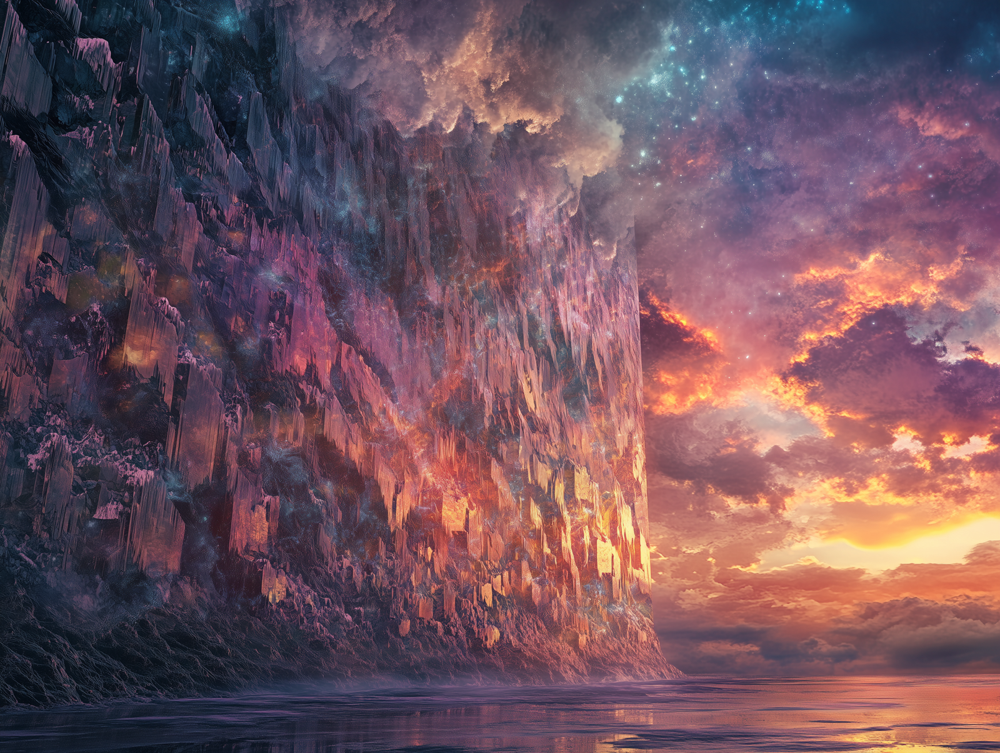

# Dunmari Frontier - Session 121

>[!info] Clash Along the Sunset Gate: in which the party faces wolf riders
> *Featuring: [Seeker](<../../../people/pcs/dunmar-fellowship/seeker.md>), [Delwath](<../../../people/pcs/dunmar-fellowship/delwath.md>), [Kenzo](<../../../people/pcs/dunmar-fellowship/kenzo.md>), [Wellby](<../../../people/pcs/dunmar-fellowship/wellby.md>), [Riswynn](<../../../people/pcs/dunmar-fellowship/riswynn.md>)*
> *In the Feywild: Evening*
> *In Taelgar: June 8, 1749 DR to June 13, 1749 DR*
> *On Earth: Tuesday Mar 25, 2025*
> *[Emberwine](<../../../gazetteer/extraplanar/feywild/emberwine/emberwine.md>) and [Amberglow](<../../../gazetteer/extraplanar/feywild/amberglow/amberglow.md>)*

The Dunmar Fellowship crosses into Amberglow, and battles formidable wolf riders. 
## Session Info
### Summary
- The [Dunmar Fellowship](<../../../people/pcs/dunmar-fellowship/dunmar-fellowship.md>) departs [Sunwine Hall](<../../../gazetteer/extraplanar/feywild/emberwine/sunwine-hall.md>), traveling eastward in the [Feywild](<../../../cosmology/feywild.md>) towards the Sunset Gate.
- During the journey, they learn of unrest in [Chardon](<../../../gazetteer/greater-chardon/chardonian-empire/chardon/chardon.md>) via the [Crown of Purity](<../../../things/artifacts-of-power/crown-of-purity.md>)
- The party, with [Valeris](<../../../people/fey/valeris.md>), turns north after reaching the Sunset Gate, but [Ismara](<../../../people/fey/ismara.md>) departs, unwilling to face the dangers of [Amberglow](<../../../gazetteer/extraplanar/feywild/amberglow/amberglow.md>). 
- Crossing into [Amberglow](<../../../gazetteer/extraplanar/feywild/amberglow/amberglow.md>), the party avoids giants demanding blood as toll, and battles dangerous fey wolf riders from Duskmire, agents of [Lord Umbraeth](<../../../people/extraplanar-powers/archfey/lord-umbraeth.md>) hunting the [Cloudspinner](<../../../people/extraplanar-powers/archfey/cloudspinner.md>). 
- The party crosses a river, and reaches [Redsun Watch](<../../../gazetteer/extraplanar/feywild/amberglow/redsun-watch.md>), where a river of darkness pours through the Sunset Gate. 
### Timeline
- Jun 08, 1749 DR: Travel across [Emberwine](<../../../gazetteer/extraplanar/feywild/emberwine/emberwine.md>) towards the Sunset Gate
- Jun 09, 1749 DR: Travel across [Emberwine](<../../../gazetteer/extraplanar/feywild/emberwine/emberwine.md>) towards the Sunset Gate
-  Jun 10, 1749 DR: Reach the Sunset Gate and turn north
- Jun 11, 1749 DR: Travel north towards [Amberglow](<../../../gazetteer/extraplanar/feywild/amberglow/amberglow.md>), following the Sunset Gate
- Jun 12, 1749 DR: Cross into [Amberglow](<../../../gazetteer/extraplanar/feywild/amberglow/amberglow.md>), avoiding cursed giants demanding blood, and continue north
- Jun 13, 1749 DR: Encounter and defeat hunters from Duskmire. Travel north, passing a dry river, and reaching [Redsun Watch](<../../../gazetteer/extraplanar/feywild/amberglow/redsun-watch.md>), which is encased in darkness flowing like a river from the east. 
## Narrative 

Our session begins as the party soars over [Emberwine](<../../../gazetteer/extraplanar/feywild/emberwine/emberwine.md>) on exotic griffins with peacock plumage—except for [Wellby](<../../../people/pcs/dunmar-fellowship/wellby.md>), who proudly guides his newly trained wyvern. Their fey companions [Valeris](<../../../people/fey/valeris.md>) (a cursed satyr) and [Ismara](<../../../people/fey/ismara.md>) (a scholarly documentarian) travel alongside them as they journey east toward the Sunset Gate.

During the journey, troubling news reaches [Riswynn](<../../../people/pcs/dunmar-fellowship/riswynn.md>) through the [Crown of Purity](<../../../things/artifacts-of-power/crown-of-purity.md>), which she continues to struggle to wrest from the taint of generations of control by members of [The Cleansed](<../../../groups/the-cleansed.md>). Chardon has fallen into chaos, with riots led by a group calling themselves the [Eightfold Flame](<../../../groups/chardonian-organizations/eightfold-flame.md>) and preaching the evil of [chalyte](<../../../things/materials/chalyte.md>), and a power vacuum left by the absent [Magistros](<../../../people/chardonians/mitus-verina-auratan.md>), who is negotiating [Nayan Karnas](<../../../people/dunmari/nayan-karnas.md>)' surrender in [Darba](<../../../gazetteer/greater-dunmar/realms/dunmar/coastal-dunmar/darba/darba.md>). 

Encouraged by [Seeker](<../../../people/pcs/dunmar-fellowship/seeker.md>)'s questions, [Ismara](<../../../people/fey/ismara.md>) explains that unlike the mundane world (what she calls the [Material Plane](<../../../cosmology/material-plane.md>)), the [Feywild](<../../../cosmology/feywild.md>) changes through the will of the archfey rather than natural processes and cataclysm. She speaks of [Fate's Ruin](<../../../gazetteer/extraplanar/feywild/fate-s-ruin.md>), a fey realm near of her home in [Gleamwater](<../../../gazetteer/extraplanar/feywild/gleamwater.md>), transformed by the [Rust Baron](<../../../people/extraplanar-powers/archfey/rust-baron.md>) from artistic mountains into decay, and how [Amberglow](<../../../gazetteer/extraplanar/feywild/amberglow/amberglow.md>) lost its color after the disappearance of the [Cloudspinner](<../../../people/extraplanar-powers/archfey/cloudspinner.md>). 

The party reaches the Sunset Gate, a massive, shimmering wall capturing all the colors of sunset, stretching endlessly upward. Parts reflect light brilliantly while others appear as crystal or frozen oil paint, constantly shifting and warm to the touch. Although the party notes some cracks in the wall through which a person might attempt to pass, [Valeris](<../../../people/fey/valeris.md>) and [Ismara](<../../../people/fey/ismara.md>) warn that time flows differently through the gate: those who enter might emerge in seconds—or in years.

Turning north, the party follows the line of sunset towards [Amberglow](<../../../gazetteer/extraplanar/feywild/amberglow/amberglow.md>), after saying farewell to [Ismara](<../../../people/fey/ismara.md>). As they fly northward, the landscape becomes increasingly bleached and desaturated—signs of Amberglow's corruption. After some time, the party finally reaches Amberglow, departing [Emberwine](<../../../gazetteer/extraplanar/feywild/emberwine/emberwine.md>). As they cross the border, soaring on griffons and a wyvern, four enormous humanoids below yell up at them, demanding "one vial of blood each" as toll. The party circles higher and continues their journey after [Valeris](<../../../people/fey/valeris.md>) confirms nothing good comes from giving [fey](<../../../species/extraplanar/fey.md>) creatures blood. 

Later, they spot distant figures—three giant wolves carrying armed riders with dozens of smaller wolves running alongside them. When the wolf riders begin pursuing them, the party realizes they can't outrun these endurance hunters indefinitely and formulate a battle plan.

The battle unfolds dramatically: [Wellby](<../../../people/pcs/dunmar-fellowship/wellby.md>) rains arrows from above, [Delwath](<../../../people/pcs/dunmar-fellowship/delwath.md>) unleashes an ice storm from a distance, [Kenzo](<../../../people/pcs/dunmar-fellowship/kenzo.md>) leaps from his griffin to engage the enemies directly, and [Seeker](<../../../people/pcs/dunmar-fellowship/seeker.md>) uses telekinesis to fling a rider from its mount. The tide turns when one wolf unleashes a terrifying psychic howl that blasts through the minds of [Kenzo](<../../../people/pcs/dunmar-fellowship/kenzo.md>), [Delwath](<../../../people/pcs/dunmar-fellowship/delwath.md>), and [Riswynn](<../../../people/pcs/dunmar-fellowship/riswynn.md>). [Kenzo](<../../../people/pcs/dunmar-fellowship/kenzo.md>) is temporarily knocked unconscious, but [Riswynn](<../../../people/pcs/dunmar-fellowship/riswynn.md>) summons a pillar of celestial light that obliterates smaller wolves and heals her allies, and eventually the enemies are defeated.

After the battle, [Seeker](<../../../people/pcs/dunmar-fellowship/seeker.md>) identifies the fallen enemies as Duskhounds—lieutenants of [Lord Umbraeth](<../../../people/extraplanar-powers/archfey/lord-umbraeth.md>), the Gloomshaper, whose realm of Duskmire has expanded into the edges of [Amberglow](<../../../gazetteer/extraplanar/feywild/amberglow/amberglow.md>) since [Cloudspinner](<../../../people/extraplanar-powers/archfey/cloudspinner.md>)'s disappearance. [Seeker](<../../../people/pcs/dunmar-fellowship/seeker.md>) recalls that [Lord Umbraeth](<../../../people/extraplanar-powers/archfey/lord-umbraeth.md>)'s servants had captured at least one [Amberlight](<../../../gazetteer/extraplanar/feywild/amberglow/amberlight.md>), potentially allowing them to track the [Cloudspinner](<../../../people/extraplanar-powers/archfey/cloudspinner.md>).

As they continue northward, they spot a strange, unnaturally white river surrounded by dead trees. Beyond it lies their ultimate destination: [Redsun Watch](<../../../gazetteer/extraplanar/feywild/amberglow/redsun-watch.md>). From a distance, all that can be seen among the river of darkness flowing from [Hollowdark](<../../../gazetteer/extraplanar/feywild/hollowdark.md>) is the upper third of one tower, still catching sunlight while the rest of the keep has been swallowed by inky night, coming from massive tear in the Sunset Gate. Our session ends as the party halts to plan their approach.

## Detailed Outline

### Scene 1
- The party is flying over the rolling fields of Emberwine in the Feywild, accompanied by two fae companions: Valeris (a brutally honest satyr seeking redemption) and Ismara (a fae scholar from Gleamwater).
- They've recently left the Sunwine Hall, court of Lord Sovin, after spending approximately two days there after Delwath was defeated by duelist Arendelle, spending time telling stories in payment for his loss. 
- Wellby successfully trained a wyvern that had been trapped in a mirror for nearly a year and now rides it while the others fly on colorful griffins.
- Through Riswynn's crown, they learn of unrest in Chardon with riots led by the Eightfold Flame and conflicts with the Chelite trade.
- The party journeys eastward toward the Sunset Gate before planning to turn north to Red Sun Watch, where they hope to find clues about the Cloud Spinner's prison.
- During their travels, Seeker exchanges knowledge with Ismara about the differences between the Feywild and the mundane world.
- After several days, they reach the Sunset Gate, an enormous wall that divides light from darkness in the Feywild.
- Despite some curiosity about crossing through the gate, they decide to continue northward toward Red Sun Watch as originally planned.

### Scene 2
- The party travels north along the Sunset Gate through an uninhabited region of Emberwine, noticing the landscape becoming increasingly desaturated as they approach Amberglow.
- Ismara, concerned about the dangers ahead, bids farewell to the party and turns south to find a Dreamwarden who can guide her across Nocturne Vale.
- Flying over a line of low hills, the party encounters four enormous (15-20 foot tall) humanoids who demand a toll of "one vial of blood each" to pass.
- The party refuses to pay the blood toll and flies away, continuing their northward journey along the Sunset Gate.
- Seeker and the others discuss the nature of the Sunset Gate, learning it functions as a barrier between light and darkness rather than just a physical barrier for creatures.
- After several hours of flying, Wellby spots 2-3 small figures on mounts with a pack of something moving around them, heading in the party's direction.
- The party decides to investigate these approaching figures.

### Scene 3
- The party spots three giant wolves (15-20 feet long) with mounted riders and dozens of smaller wolves, likely a hunting party.
- As the party turns to get a better look, the wolf riders wheel toward them with weapons drawn.
- The party decides to flee initially, noticing they can slightly outpace the wolves but might eventually tire.
- After discussing strategy, they decide to slow down and engage the wolf riders at an optimal distance.
- The party plans their battle formation - spreading out to avoid area effects, with Wellby planning to fly higher and attack from above.
- Delwath offers to cast Fly on some party members to maximize mobility.
- The party begins preparations for combat, with plans to use Kenzo's Ice Storm spell at extended range.

### Scene 4
- The party prepares for combat against the wolf riders, establishing their positions in a tactical formation.
- Wellby dives from the wyvern to a height of 300 feet and initiates combat with a successful arrow shot against one of the riders.
- Delwath casts Ice Storm with extended range, dealing significant damage to the lead wolf and rider while creating difficult terrain.
- Kenzo dramatically closes the distance by jumping from his griffin and using Raven's Whistle to swiftly move 270 feet, engaging one of the wolf riders directly on the ground.
- The wolf riders attack Kenzo, who deflects most of the damage but takes some hits from a shadowy horned rider wielding a greatsword.
- Seeker uses telekinesis enhanced by crystal charges to lift one rider off its wolf and fling it backward, effectively restraining it.
- Delwath casts a second Ice Storm, killing numerous smaller wolves while damaging the larger riders and wolves.
- The party learns that the shadowy wolf riders are resistant to cold damage and appear to be powerful creatures (CR 8).

### Scene 5
- Kenzo attacks the restrained wolf rider, landing multiple successful strikes with both Forest Soul and unarmed attacks.
- A pack of smaller wolves swarms Kenzo, dealing significant damage to him.
- The giant wolf and its rider attack Kenzo, overwhelming him with multiple devastating attacks and reducing him to 0 hit points.
- Seeker maintains his telekinetic hold on one rider before using his ladder construct to kill another.
- Delwath and Riswynn use dimension door to teleport directly to Kenzo's aid.
- Riswynn casts Conjure Celestial, creating a pillar of radiant light that destroys all the smaller wolves and heals Kenzo.
- The wolf riders unleash a psychic howl that damages Kenzo, Delwath, and Riswynn.
- Wellby continues to fire arrows from above with deadly accuracy.
- One wolf rider teleports away after Riswynn's attack shatters its horn.
- As the battle turns against them, the remaining wolf flees but is struck down by Delwath's opportunity attack.
- The final dust count (shadow rider) retaliates, firing three arrows at Delwath and restraining him with a well-placed shot.

### Scene 6
- One of the giant wolves attacks Seeker's ladder construct in a rage, nearly destroying it after its rider was killed.
- Riswynn continues to move her celestial light pillar strategically, destroying more wolf minions and damaging the larger threats.
- Wellby fires a lightning arrow that kills the restrained wolf and damages nearby enemies.
- Delwath transforms into a cloud of butterflies to escape being restrained and flies through Riswynn's healing pillar.
- Kenzo charges the last giant wolf, successfully stunning it with his first strike before unleashing a devastating series of attacks.
- The wolf rider teleports behind Kenzo to attack but fails to land significant blows.
- Seeker uses his damaged ladder to attack the stunned wolf while restraining another rider with telekinesis.
- The combined assault of the party overwhelms the remaining enemies, with Kenzo delivering the final series of strikes that finish off the last shadow rider.

### Scene 7
- The party discovers Wellby's wyvern has flown off, and Wellby uses his armor and boots of speed to catch up to it.
- Seeker identifies the wolf riders as duskhounds, lieutenants of Lord Umbriath (the Gloom Shaper) who rules the realm north of Amberglow.
- Valeris confirms that Lord Umbriath's territory has expanded significantly since the Cloud Spinner's disappearance.
- The party takes a short rest to recover abilities and heal wounds after the battle.
- As they continue their journey, they spot a white river surrounded by dead trees about 20 miles ahead.
- Beyond the river, approximately 60 miles away, they see a wall of impenetrable darkness where the Sunset Gate appears torn open.
- Approaching closer, they observe variations in the darkness - some areas are denser while others allow faint light to penetrate.
- They identify Red Sun Watch as a partially visible tower with golden decorations standing above the darkness, its upper third still catching sunlight.

