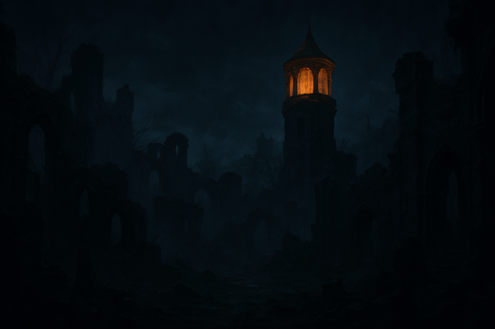
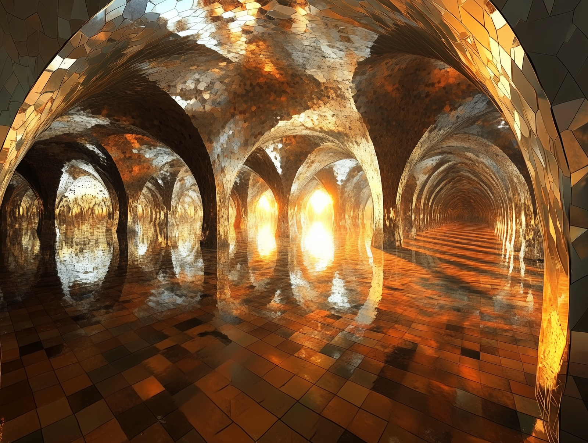

# Dunmari Frontier - Session 122

>[!info] Shadows Beneath Redsun Watch: in which the party banishes ancient darkness
> *Featuring: [Delwath](<../../../people/pcs/dunmar-fellowship/delwath.md>), [Kenzo](<../../../people/pcs/dunmar-fellowship/kenzo.md>), [Wellby](<../../../people/pcs/dunmar-fellowship/wellby.md>), [Riswynn](<../../../people/pcs/dunmar-fellowship/riswynn.md>), [Seeker](<../../../people/pcs/dunmar-fellowship/seeker.md>)*
> *In the Feywild: Evening*
> *In Taelgar: June 13, 1749 DR*
> *On Earth: Thursday Apr 03, 2025*
> *Location: Redsun Watch and its underground vaults, Feywild*

The party overcomes supernatural darkness and deadly foes to cleanse the depths beneath Redsun Watch, activating a long-lost beacon.

## Session Info
### Summary
- The party stealthily approaches Redsun Watch, avoiding patrols and sensing a malevolent force in the darkened towers.
- A harrowing battle erupts atop the lit tower, during which the group narrowly saves Wellby from death and destroys several shadowy horrors.
- Exploration below reveals impenetrable magical darkness, forcing the party to rely on divination and stone sense for guidance.
- After surviving haunted stairways and panic-inducing whispers, the group accesses ancient underground tunnels.
- Discovering a ruined fountain chamber, the party investigates fruitlessly before venturing deeper, where darkness accumulates in a mirrored vault.
- Riswynn channels divine power through Sunbeam, burning away the ageless gloom and reigniting a beacon beneath Redsun Watch.
### Timeline
- Jun 13, 1749 DR, later: Infiltrate Redsun Watch, avoiding or defeating the minions of Harrow and Wend, and light the Cloudspinner's beacon. 
## Narrative

Our session begins at the  edge of night in the Feywild, with the party paused on the border of Amberglow near Redsun Watch, where the darkness of Hollowdark had breached the Sunset Gate, forming a river of impenetrable shadow. The only sign of hope was a distant tower, faintly lit with a lingering ember of sunset. The group, wary of the dangers ahead, discussed the possibility of finding a clue about or beacon or guide to the Prismwell, a place tied to the Cloudspinner’s lost power, hidden within the keep, as Count Vashan had described in a moment of lucidity. 

Scouting, Kenzo reached out with his senses, detecting a powerful, malevolent presence in a nearby tower, shaping the darkness and extending its reach into Amberglow. Below, the courtyard seethed with fragments of terror—echoes of fear and whispers in the dark—while a patrol of cruel, lazy minds drifted through the gloom. Deciding on caution, the party left their mounts with the cursed satyr Valeris, who refused to enter the darkness, and advanced on foot. Wellby sent a summoned bat ahead to scout, but as it crossed the ruined walls and entered the courtyard, it was destroyed by a sudden wave of power.

Wary and seeking more information, Seeker cast clairvoyance targeting the lit tower. Through the sensor, he saw an open platform bathed in gentle golden light, untouched by the surrounding darkness. The room was empty, save for rubble and a trapdoor from which slow, root-like tendrils of shadow crept. No source for the light was visible, and the silence was unbroken, leaving the party to ponder their next move. Deciding to head for the light tower, the party advances quietly into the darkness, which swallows all sunlight and presses in with a heavy, oppressive presence. Patrols roam the area, but the group manages to avoid detection, though Seeker nearly stumbles into a bush before correcting course. The land is barren, with only the occasional dead bush breaking the monotony.

As they reach the outer wall, the darkness deepens, resisting even Delwath's magical sight, which reveals only shifting patches of fog, and the sense of something lurking just out of view grows stronger. The party notes that the darkness seems to flow toward one of the towers, the same one where Kenzo sensed a malevolent presence. Unable to see further, the group decides to bypass the courtyard’s dangers by magical means. Seeker, Riswynn, Delwath, and Kenzo will use Dimension Door to reach the top of the glowing tower, while Wellby prepares to fly up stealthily. With their plan set, they ready themselves to confront whatever awaits above.

The party arrived atop the ruined tower by means of Delwath and Seeker’s magic, with Wellby flying up to join them moments later. The platform was bathed in a strangely peaceful, shifting light, which lulled Riswynn, Seeker, and Wellby into a sense of perfect safety, dulling their sense of danger. Delwath, more wary, used his arcane sight to peer through a trapdoor, glimpsing a collapsed floor and a stairway descending into thick darkness below. As the group investigated, a massive shadowy beast—part wyvern, part rider—approached from above, bearing two smaller, clinging creatures. Delwath and Kenzo, unclouded by the light’s charm, quickly roused Seeker and Wellby from their stupor—Kenzo using his cleansing touch, Dalwath with urgent persuasion. The party braced for battle.

The battle began with Wellby loosing an arrow at the great shadow, dazing it. Combat was joined as Kenzo’s animated tattoo lashed out, landing heavy blows. The shadowy beast swept overhead, its riders dropping to the stone and exuding an aura that stifled speech and sapped strength. One grappled Wellby, restraining him, while the other lashed at Kenzo. Delwath banished one of the riders, and Seeker conjured a clay construct to batter the main foe. As combat progressed, unnoticed by the party, a grotesque, many-toothed creature with a glaring eye clambered over the wall, slashing Wellby and attempting to terrify Riswynn, who resisted its gaze. The battle intensified: Wellby broke free and retreated, Kenzo pummeled the shadow beast, and the creature unleashed a deathly wail, marking several party members for death and felling Welby with a brutal assault. As the fight raged on, Delwath and Seeker pressed the attack, and Riswynn, shaking off the creature’s psychic assault, prepared to strike back.

The battle reached its climax with Wellby lying unconscious and near death, while a wounded, flying monster hovered thirty feet above him. Riswynn, unable to reach Wellby in time, advanced and struck the creature with her hammer, Shatterstorm. The blow shattered the monster’s aura, releasing a wave of thunder that left several party members deafened and wounded, and forced Wellby closer to death. However, Riswynn’s attack, empowered by Searing Smite, engulfed the creature in flames, destroying it and ending its suffocating magic. Kenzo then leapt upward, using his reach to strike at another airborne foe. After several missed blows, he landed two decisive hits with a flurry of strikes, bringing the creature down. He pressed the attack against the remaining enemy, the Fearsmith, landing another solid blow. Delwath finished the combat, landing a critical strike and unleashing a powerful smite that left the Fearsmith bloodied and prone. With another attack, Delwath finished the creature. As the dust settled, Riswynn rushed to Wellby’s side and cast Spare the Dying, halting his slide toward death. The lingering curse faded, and she restored him with healing magic. The party, battered but alive, took a moment to recover, their enemies defeated and Wellby saved from the brink. 

After the tense battle, the party regrouped atop a tower in Redsun Watch, eyeing a trapdoor leading down. Seeker’s clay construct scouted ahead, opening the trapdoor and descending the ladder. Moments later, the construct returned, signaling the way is clear, but the ladder leading down collapsed under its weight. The group lowered a rope ladder and descended to a lower floor, where the ground is cracked and a vast hole opens into impenetrable darkness. Here, even darkvision fails; only Delwath can see, and only faintly. Magical attempts to create light are smothered by the thick, unnatural gloom.

Before descending further, the party debates their next move. They experiment with the Amberlight lantern, but it remains inert without attunement. Seeker begins the hour-long process of attuning to the lantern, while Riswynn performs a divination ritual, seeking guidance. The answer comes from the [Bahrazel](<../../../gods-and-religions/gods/embodied-gods/bahrazel/bahrazel.md>): the afterimage of the Cloudspinner’s light lingers, hidden beneath the darkness, like roots beneath the earth. With that clue, Seeker tries stone sense, and confirms the presence of extensive underground excavations beneath all three towers. The party decides to continue instead of completing their rest, wary of the oppressive darkness and the dangers lurking below.

The party descended in single file down the spiraling staircase clinging to the outer wall of the ruined tower, Delwath leading with a rope, Kenzo behind, and Riswynn and Wellby near the rear. The air was thick with drifting fog, and as they moved lower, the darkness deepened until even Delwath’s Tanshi-enhanced sight could not pierce it. The stairs clung to the edge of a vast, empty shaft, and the group moved slowly, wary of the drop. As they crept downward, Wellby and Riswynn began to hear unsettling whispers and footsteps behind them. The sense of being pursued grew until Riswynn, overcome by fear, broke from the line and rushed forward, knocking Seeker and the construct from the stairs. Only the rope and Wellby’s quick thinking—securing it with the immovable rod—kept them from falling into the void. The construct, strong and unafraid, climbed back up with Seeker in tow, and the group regrouped.

Further down, Delwath narrowly avoided a collapse as several stairs gave way beneath him. Eventually, the stairs ended in darkness, and the party found themselves at the tower’s base, unable to see or find an exit. Seeker transformed into a giant scorpion to scout, guiding the others as they searched for a way down. Amidst the rubble, they discovered a section of floor that seemed hollow beneath. As spectral terrors pressed in from outside, Riswynn cast Passwall, opening a passage into a tunnel below. The party leapt through, escaping the darkness above as it began to seep after them. Seeker, transforming back from a scorpion, used his magic to seal the entrance: he conjured a massive stone block, blocking the opening created by Paswall and cutting off most of the darkness seeping in from above.

The group advanced through vaulted stone corridors, their magical lights strangely ineffective against the gloom, relying instead on darkvision. They reached a central chamber where three tunnels met beneath the courtyard. In the center stood the remains of an ancient fountain: a ring of stone at their feet, with a deep, empty basin below, and a collapsed pillar above. Darkness trickled down from the ceiling, drifting toward the passage leading to the dark tower.

Exploring further, they found the other tunnels led only to collapsed or blocked chambers, with no sign of recent passage. Attempts to interact with the basin—pouring water, casting light—had no effect. Investigation revealed no hidden doors or magical auras, only the remnants of old plumbing and cracked stone. With few options left, the party debated whether to risk the tunnel beneath the dark tower, wary of the dangers that might await, but recognizing it as the only unexplored path.

Deciding they had no other good options, the party advanced through a narrow tunnel, shadows drifting alongside them. The darkness thickened as they entered a vaulted chamber, where black mist clung to the walls and pooled across a polished, mirror-like floor. Crystals hung from the ceiling, their surfaces swirling with trapped darkness. The gloom, seeping from the rubble room and the fountain above, had accumulated here for ages, unable to escape.

The group debated how to disperse the darkness—considering airlocks, pressure changes, and magical light. Attempts to burn away the shadows with sacred flame proved fruitless. Riswynn, after discussion, resolved to unleash her most powerful magic. She raised her shield, marked with the symbol of the [Bahrazel](<../../../gods-and-religions/gods/embodied-gods/bahrazel/bahrazel.md>), and called forth a Sunbeam. Brilliant sunlight erupted, reflecting from the crystals and the floor, illuminating the arches and passageways. The session ended as the sunlight echoed and reinforced itself, burning away the darkness that had long haunted the chamber. 

