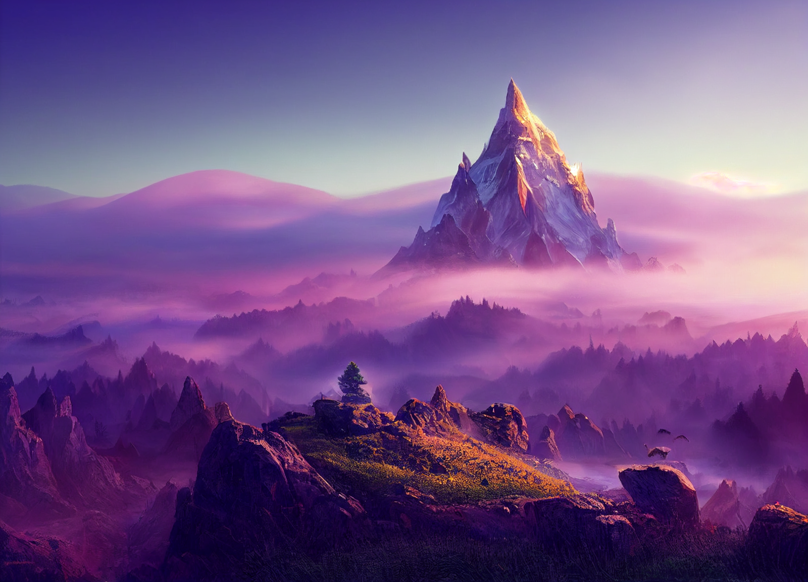

# Dunmari Frontier - Seeker Solo Session 2

>[!info] Crystal Peak Chaos: in which a wild magic storm is quelled
> *Featuring: [Seeker](<../../../people/pcs/dunmar-fellowship/seeker.md>), [Raven](<../../../people/pcs/dunmar-fellowship/guests/raven.md>), [Spirala](<../../../people/pcs/dunmar-fellowship/guests/spirala.md>), [Mikasa](<../../../people/pcs/dunmar-fellowship/guests/mikasa.md>)*
> *In Taelgar: Oct 03, 1748 DR to Oct 12, 1748 DR*
> *On Earth: Saturday Nov 05, 2022*
> *[Crystal Peak](<../../../gazetteer/extraplanar/feywild/crystal-peak.md>) in the [Feywild](<../../../cosmology/feywild.md>)*

Seeker and his companions subdue a wild magic storm at [Crystal Peak](<../../../gazetteer/extraplanar/feywild/crystal-peak.md>), receive mysterious gifts, and set off for further adventures.
## Session Info
### Summary
- Seeker and companions, Raven, Spirala, and Mikasa, venture to [Crystal Peak](<../../../gazetteer/extraplanar/feywild/crystal-peak.md>) to tackle a wild magic storm.
- The party ascends Crystal Peak, encountering a rolling stone and a crater leading to a cave with a crashed geode.
- Seeker vanishes using a spell and discovers [Illaran](<../../../people/fey/illaran.md>), a fey master of the mountain who reveals the cause of the chaos.
- [Illaran](<../../../people/fey/illaran.md>) leads the party to confront living spells and a petrified creature whose destruction by [Mikasa](<../../../people/pcs/dunmar-fellowship/guests/mikasa.md>) ends the wild magic storm.
- With the storm quelled, [Seeker](<../../../people/pcs/dunmar-fellowship/seeker.md>) receives mysterious crystalized magic from [Illaran](<../../../people/fey/illaran.md>) as the party prepares to continue their journey.

### Timeline
- **Afternoon, in the feywild**: [Seeker](<../../../people/pcs/dunmar-fellowship/seeker.md>) meets [Raven](<../../../people/pcs/dunmar-fellowship/guests/raven.md>), [Spirala](<../../../people/pcs/dunmar-fellowship/guests/spirala.md>), and [Mikasa](<../../../people/pcs/dunmar-fellowship/guests/mikasa.md>) who are also coming to help solve the wild magic storm. 
- **Slightly later afternoon, in the feywild**: [Seeker](<../../../people/pcs/dunmar-fellowship/seeker.md>), [Raven](<../../../people/pcs/dunmar-fellowship/guests/raven.md>), [Spirala](<../../../people/pcs/dunmar-fellowship/guests/spirala.md>), and [Mikasa](<../../../people/pcs/dunmar-fellowship/guests/mikasa.md>) travel to the Crystal Peaks, where the wild magic storm is growing; enter the mountain; meet the strange fey creature [Illaran](<../../../people/fey/illaran.md>); fight off animated spells; and stop the wild magic storm.

## Narrative
We begin in the court of the [Chanceweaver](<../../../people/extraplanar-powers/archfey/prince-of-luck.md>), as [Seeker](<../../../people/pcs/dunmar-fellowship/seeker.md>) meets his companions who will venture into the wild magic storm: [Raven](<../../../people/pcs/dunmar-fellowship/guests/raven.md>), a Winter Knight from [Shimmersong](<../../../gazetteer/extraplanar/feywild/shimmersong.md>), also bordering the wild magic storm; [Spirala](<../../../people/pcs/dunmar-fellowship/guests/spirala.md>), a light cleric from [Shimmersong](<../../../gazetteer/extraplanar/feywild/shimmersong.md>); and [Mikasa](<../../../people/pcs/dunmar-fellowship/guests/mikasa.md>), a samurai from a distant fey realm, who is helping in exchange for passage home from the [Chanceweaver](<../../../people/extraplanar-powers/archfey/prince-of-luck.md>). [Raven](<../../../people/pcs/dunmar-fellowship/guests/raven.md>) and [Spirala](<../../../people/pcs/dunmar-fellowship/guests/spirala.md>) know the way, so the party sets out from the [Chanceweaver](<../../../people/extraplanar-powers/archfey/prince-of-luck.md>)’s court towards the Crystal Peak, at the center of the wild magic storm.

After some time traveling through the wonders of the [Feywild](<../../../cosmology/feywild.md>), the party approaches the Crystal Peak, a mountain entirely made of gems and crystals. Between [Spirala](<../../../people/pcs/dunmar-fellowship/guests/spirala.md>)’s flight, [Raven](<../../../people/pcs/dunmar-fellowship/guests/raven.md>) and [Mikasa](<../../../people/pcs/dunmar-fellowship/guests/mikasa.md>)’s ability to scale sheer walls, and [Seeker](<../../../people/pcs/dunmar-fellowship/seeker.md>) polymorphing into a dragonfly getting to the top is easy. Except for when [Seeker](<../../../people/pcs/dunmar-fellowship/seeker.md>) casts Polymorph, something breaks off from the top of the mountain and a giant round stone comes hurling down the mountainside. [Raven](<../../../people/pcs/dunmar-fellowship/guests/raven.md>) and [Mikasa](<../../../people/pcs/dunmar-fellowship/guests/mikasa.md>) are able to dodge out of the way, fortunately. 

The top of the mountain has a giant crater, as if something crashed into it, leaving an open gash that leads down into a cave structure below. The cave is almost like a massive bubble in the mountain, and at the bottom is a crashed geode, split open. Descending to investigate, giant dragonfly [Seeker](<../../../people/pcs/dunmar-fellowship/seeker.md>) is swarmed and attacked by an animated cloud of crystal fragments. [Raven](<../../../people/pcs/dunmar-fellowship/guests/raven.md>) and [Mikasa](<../../../people/pcs/dunmar-fellowship/guests/mikasa.md>) run down the walls of the cave, trying to draw the attention of the clouds of crystal fragments, while [Spirala](<../../../people/pcs/dunmar-fellowship/guests/spirala.md>) and [Seeker](<../../../people/pcs/dunmar-fellowship/seeker.md>) fly down. 

As the party deals with the crystal shards, [Seeker](<../../../people/pcs/dunmar-fellowship/seeker.md>) casts Catapult to try to break one of the swarms to pieces, and vanishes, appearing in another cave, that looks inhabited. The rest of the party manages to deal with the crystal fragments, and find their way to the room [Seeker](<../../../people/pcs/dunmar-fellowship/seeker.md>) is in, on the next level down.

Here, the party meets [Illaran](<../../../people/fey/illaran.md>), a strange fey creature with wild hair, a multicolored frizzy mess, and clearly a master of this crystal mountain domain. [Illaran](<../../../people/fey/illaran.md>) is somewhat shifty, and not completely straightforward with the party. But it seems that after the crash, which leaked some kind of uncontrolled magic, [Illaran](<../../../people/fey/illaran.md>) summoned a creature with a nose for gems to help, and it ended up swallowing the shards of the geode. After which things started to go heywire, and magic got weird. [Illaran](<../../../people/fey/illaran.md>) tried to kill the creature with magic, but it fled, deeper into the mountain. Somehow, the creature needs to be destroyed, and the geode shards retrieved and destroyed, to end the chaos. Unfortunately, [Illaran](<../../../people/fey/illaran.md>) admits, the spells he cast came alive (some aftereffect of the geode, he thinks), and might be waiting for the party. Still, it is the only way, he says, so the party proceeds.

[Illaran](<../../../people/fey/illaran.md>) leads them to another cave, with polished reflective crystal walls, where they find a portal to the deep cave where the creature, a xorn, can be found. The creature has been petrified by the chaotic magic, turned to a statue of stone - surrounded by living versions of all the spells that [Illaran](<../../../people/fey/illaran.md>) or the party cast in the mountain, which immediately attack. While [Raven](<../../../people/pcs/dunmar-fellowship/guests/raven.md>), [Spirala](<../../../people/pcs/dunmar-fellowship/guests/spirala.md>), and [Seeker](<../../../people/pcs/dunmar-fellowship/seeker.md>) try to hold off the wild magic, [Mikasa](<../../../people/pcs/dunmar-fellowship/guests/mikasa.md>) lunges for the statute, attempting to crack it in two to shatter the magic crystal and end the wild magic storm. 

[Spirala](<../../../people/pcs/dunmar-fellowship/guests/spirala.md>) manages to temporarily paralyze one of the spells with Dispel Magic, and [Raven](<../../../people/pcs/dunmar-fellowship/guests/raven.md>) holds off a number of smaller, weaker spells, along with the echo of the giant dragonfly [Seeker](<../../../people/pcs/dunmar-fellowship/seeker.md>) polymorphed into. However, [Illaran](<../../../people/fey/illaran.md>)’s lightning bolt and force hand, as well as [Seeker](<../../../people/pcs/dunmar-fellowship/seeker.md>)’s catapult, are real trouble. Fortunately, [Mikasa](<../../../people/pcs/dunmar-fellowship/guests/mikasa.md>) is able to crack open the statue. As it cracks, the room vibrates for a moment, and with a last wild burst of chaotic magic energy, the storm ends and magic begins to rebalance.

We end as [Seeker](<../../../people/pcs/dunmar-fellowship/seeker.md>), [Spirala](<../../../people/pcs/dunmar-fellowship/guests/spirala.md>), and [Raven](<../../../people/pcs/dunmar-fellowship/guests/raven.md>) continue their journey to [Shimmersong](<../../../gazetteer/extraplanar/feywild/shimmersong.md>) and beyond, in search of the fey crossing that will reunite [Seeker](<../../../people/pcs/dunmar-fellowship/seeker.md>) with his friends, as [Mikasa](<../../../people/pcs/dunmar-fellowship/guests/mikasa.md>) returns to receive her favor from the [Chanceweaver](<../../../people/extraplanar-powers/archfey/prince-of-luck.md>) and go home. But not before a grateful [Illaran](<../../../people/fey/illaran.md>) gifts [Seeker](<../../../people/pcs/dunmar-fellowship/seeker.md>) fragments of crystalized magic, from a mysterious source, to do with what he will. 

The source of the geode, which caused the wild magic storm and the living spells, remains mysterious; and [Illaran](<../../../people/fey/illaran.md>) won't reveal where he came by or created the crystalized magic he gave to [Seeker](<../../../people/pcs/dunmar-fellowship/seeker.md>). But, at least to [Seeker](<../../../people/pcs/dunmar-fellowship/seeker.md>)'s eyes, they seem unrelated. 
