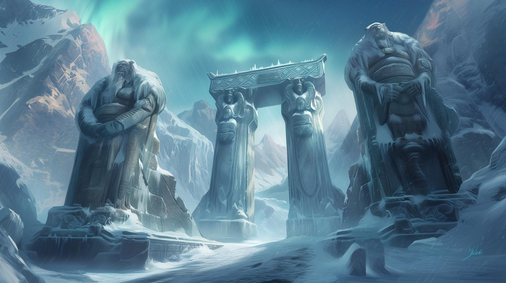
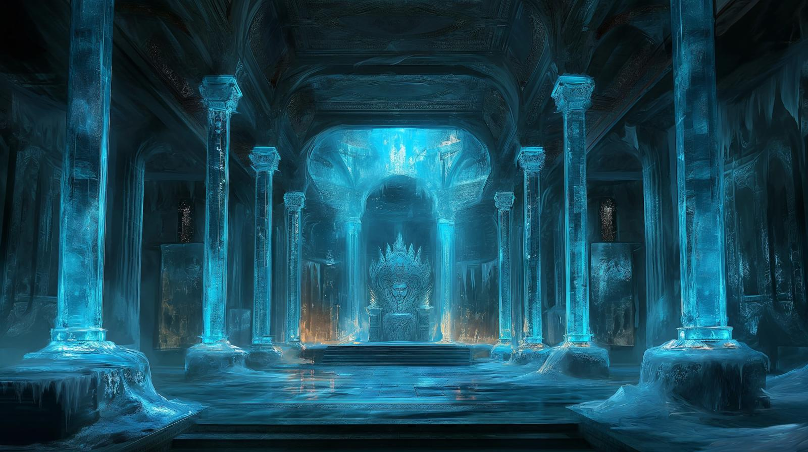

# Dunmari Frontier - Session 92

>[!info] Giants, Ice Worms, and Shapeshifers: in which a battle forges a new alliance
> *Featuring: [Seeker](<../../../people/pcs/dunmar-fellowship/seeker.md>), [Delwath](<../../../people/pcs/dunmar-fellowship/delwath.md>), [Kenzo](<../../../people/pcs/dunmar-fellowship/kenzo.md>), [Wellby](<../../../people/pcs/dunmar-fellowship/wellby.md>), [Riswynn](<../../../people/pcs/dunmar-fellowship/riswynn.md>)*
> *In Taelgar: Mar 18, 1749 DR to Mar 21, 1749 DR*
> *On Earth: Tuesday Feb 06, 2024*
> *[Isenborg](<../../../gazetteer/northern-green-sea/isenborg.md>) and the [Ket](<../../../gazetteer/northern-green-sea/rivers/ket.md>) river valley*

The [Dunmar Fellowship](<../../../people/pcs/dunmar-fellowship/dunmar-fellowship.md>) gains King [Brimskarda](<../../../people/giants/brimskarda.md>)'s favor at [Isenborg](<../../../gazetteer/northern-green-sea/isenborg.md>) and forges an alliance with the Vargaldi after a fierce battle with an ice worm.
## Session Info
### Summary
- The [Dunmar Fellowship](<../../../people/pcs/dunmar-fellowship/dunmar-fellowship.md>) arrives at [Isenborg](<../../../gazetteer/northern-green-sea/isenborg.md>) to meet Frost Giant King [Brimskarda](<../../../people/giants/brimskarda.md>) and gain intelligence on the Vargaldi and the [Ket](<../../../gazetteer/northern-green-sea/rivers/ket.md>) river valley
- They impress [Brimskarda](<../../../people/giants/brimskarda.md>) with gifts and tales, learning of Frost Giant history and gaining his favor.
- They meet and persuade [Algerd](<../../../people/giants/algerd.md>), a frost giant historian, to journey with them in search of his sister.
- After several uneventful days traveling east, an ice worm attack leads to a battle; [Riswynn](<../../../people/pcs/dunmar-fellowship/riswynn.md>) is nearly digested before the creature is defeated.
- The party rescues two Vargaldi shape-shifters, who invite them to their hidden camp.

### Timeline
- Mar 18, 1749 DR, evening: Meet [Brimskarda](<../../../people/giants/brimskarda.md>), speak about dragons and giants. Feast with Brimskarda's court at [Isenborg](<../../../gazetteer/northern-green-sea/isenborg.md>).
- Mar 19, 1749 DR, morning: Meet [Algerd](<../../../people/giants/algerd.md>), recruit him to journey east. Leave [Isenborg](<../../../gazetteer/northern-green-sea/isenborg.md>).
- Mar 19, 1749 DR, afternoon: Reach the [Ket](<../../../gazetteer/northern-green-sea/rivers/ket.md>), follow the frozen river east. 
- Mar 20, 1749 DR: Travel east along the [Ket](<../../../gazetteer/northern-green-sea/rivers/ket.md>)
- Mar 21, 1749 DR: Fight and defeat an ice worm, rescuing two Vargaldi. 
- Mar 21, 1749 DR, early afternoon: Reach Vargald camp south of the [Ket](<../../../gazetteer/northern-green-sea/rivers/ket.md>)
## Narrative
We begin as the [Dunmar Fellowship](<../../../people/pcs/dunmar-fellowship/dunmar-fellowship.md>) makes a cautious approach towards the formidable and frost-laden steading of [Isenborg](<../../../gazetteer/northern-green-sea/isenborg.md>), the court of [Brimskarda](<../../../people/giants/brimskarda.md>), king of the frost giant kingdom of [Kaldhalla](<../../../gazetteer/northern-green-sea/kaldhalla.md>). The party's primary goal was to both introduce themselves and pry for crucial intelligence regarding the enigmatic Vargald, a people who live in the frozen wastes of the [Ket](<../../../gazetteer/northern-green-sea/rivers/ket.md>) river valley. [Seeker](<../../../people/pcs/dunmar-fellowship/seeker.md>) steers the skyship through the massive ice gates of [Isenborg](<../../../gazetteer/northern-green-sea/isenborg.md>), where they are greeted by an animated statue bidding them to introduce themselves. Arriving inside the steading of [Isenborg](<../../../gazetteer/northern-green-sea/isenborg.md>), carved in the bowl of a massive glacier, the party moors their ship at a respectful distance and use the rainbow bridge to make their descent. 

The party enters the steading's main hall, a cavernous space carved from the heart of a glacier and bathed in an eerily dim blue light, with tapestries on the walls depicting the heroic deeds of [Brimskarda](<../../../people/giants/brimskarda.md>) and his giant warriors. King [Brimskarda](<../../../people/giants/brimskarda.md>) receives them with a guarded attitude, but with an openness to host these diminutive guests with numerous heroic deeds to their names. The party, seizing the opportunity, lavished [Brimskarda](<../../../people/giants/brimskarda.md>) with gifts — an enormous meat pastry sculpted in the likeness of a mythical beast and a resplendent horn. Their offerings and recounted tales of dragon slayings and battles against the forces of darkness aimed to cement their place in Brimskarda's regard. The Frost Giant King reciprocated with stories of his own conquests and imparted wisdom on combating the lethal iceworms.

The feast that ensued was a spectacle of giant customs, the hall filled with Brimskarda's kin, all partaking in the hearty offerings with a blend of curiosity and intrigue towards their guests. Dewalth's subtle inquiries unveiled the layers of Frost Giant history, especially the history of [Vimfrost's War](<../../../events/1500s/vimfrost-s-war.md>), the great king [Bjarnfrost](<../../../people/giants/bjarnfrost.md>), and the eventual transition of power to Brimskarda. 

The next morning, the party met [Algerd](<../../../people/giants/algerd.md>), a socially-awkward historian without much status under Brimskarda's rule, which values might over knowledge. The party persuaded Algerd to travel east with them, in part with the hope that he could find his sister, who was driven out of the steading years ago. 

Departing [Isenborg](<../../../gazetteer/northern-green-sea/isenborg.md>) with [Algerd](<../../../people/giants/algerd.md>) in tow, the party journeyed east for two uneventful days. The afternoon of the third day, they spotted the rumblings of an ice worm, moving through the forest and bearing down on two elk. Suspecting the elk may be Vargaldi, the party entered into battle. The ice worm proved to be a formidable foe, swallowed and nearly digesting [Riswynn](<../../../people/pcs/dunmar-fellowship/riswynn.md>), but was defeated. 

The confrontation not only tested the party's skill in battle, but also led to an unexpected alliance with the Vargaldi, shape-shifting beings from a hidden village. The party's victory over the Ice Worm, marked by strategic combat and skillful extraction of the creature's valuable parts, forged a bond with the shape-shifters, who guiding the party to their concealed abode where a medley of villagers awaited, heralding the beginning of a new chapter in their adventure.

## Transcript
### Detailed Summary

#### Approach to Isenborg
- The party approaches the Frost Giant steading of Isenborg, seeking to introduce themselves to King Brimskarda and gather information on the Vargald.
- The party discusses their goals, considering the potential to impress the Frost Giant King and to inquire about local dangers such as iceworms and giant politics.
- As the party approaches Isenborg, they are struck by its massive structure and the vibrant aurora overhead, noting the activity within the steading and the living quarters carved into the glacier for dwarves.
- The party debates on how to present themselves to the Frost Giants, considering offering a ride on their skyship as a connection to giant heritage and discussing potential outcomes of their visit.
- As they navigate their ship through the giant's gate, a magical animated statue speaks, welcoming them and instructing them to introduce themselves. The party responds, highlighting their achievements and titles.
- The party observes giants within the steading and decides to park their ship at a respectful distance, using a rainbow bridge to descend. They consider the implications of participating in battle challenges as entertainment.
- Dewalth casts *fly* to hover up to the palace with some party members, while Wellby uses acrobatics to ascend the giant steps, impressing the watching giants with both their respect for giant court etiquette and their adaptability.
#### Meeting Brimskarda
- The party encounters three frost giants outside the steading, seemingly of noble or guard status, who are amused by the adventurers' small stature.
- The party enters the steading's main hall, which is carved from a glacier and lit by a dim, blue light, and is notably colder than the outside.
- King Brimskarda, a formidable frost giant in his prime, greets the party with a guarded smile, indicating his pleasure at having new guests.
- Kenzo attempts to gauge Brimskarda's power, learning he is equivalent to a level 17 entity with high strength, low dexterity, and immunity to cold.
- The party presents gifts to Brimskarda, including a giant baked meat shaped like a mythical beast, and a horn, aiming to gain favor and advice on traversing the eastern lands.
- Brimskarda shows appreciation for the gifts and invites the party to share their stories, specifically asking about their experiences with dragons.
- The party shares tales of their encounters and victories, including battles against dragons, demons, and the undead, aiming to impress Brimsgarda.
- Brimskarda, in return, shares his own tales of glory, focusing on his victories over dragons and ice worms, and provides advice on spotting and combating ice worms.
- During the storytelling, the party observes the steading's decorations, which depict Brimskarda's victories over various legendary creatures.
- Brimskarda dismisses the idea of trading monster parts for goods, indicating his subjects provide for him in honor of his might.
- The conversation turns to the dragons of the East, where Brimskarda informs the party of the dragon Vimfrost's legacy and the continued threat of his spawn.
- Brimskarda recounts his personal battles against dragons attacking his stronghold, particularly highlighting his victory over Grim Winter upon claiming his throne.
- Seeker inspects Brimskarda's sapphire-embedded circlet, attempting to discern if they are magical, but finds nothing overtly magical about them.
#### Feast in the Giant's Hall
- The feast begins with a woman in a dress leading six servants, two Stoneborn and four Dwarves, into the hall with a dinner setup including a whole roast goat and frozen blue-white melons.
- The woman sets down a giant platter with folding legs in the center of the hall, near the steps leading to the giant's throne, to serve as a table.
- Six additional giants, including two women, another man, and twin boys around the equivalent age of 8 years but 10 feet tall, enter the hall to join the feast.
- King Brimskarda and the giants give a weak smile and a welcoming gesture to the adventuring party, indicating a sense of curiosity about the guests.
- The giants engage in a boisterous and unorganized meal, eating directly from the roast and cracking open the ice melons with their fists.
- Dewalth ensures King Brimskarda notices the horn around the dragon's neck, a gift from the party, which the King appreciatively acknowledges.
- Dewalth expresses a desire to subtly gather information about the Dwarves and the history of the Frost Giant leadership, specifically inquiring about dwarves not under Brimskarda's protection, the previous king, and potential guides among the giants.
- The party learns about the transition of power from the previous king, [Bjarnfrost](<../../../people/giants/bjarnfrost.md>), to Brimskarda after a war with the dragon Vimfrost, the interim rule of Freyvirda who was allied with dragons, and Brimskarda's eventual rise to power by restoring the Frost Giants' dominance over the region.
#### The Giant Historian
- The party learns from King Brimskarda that there are two potential allies for their quest: widely traveled tribute collectors and a giant historian with a fascination for the east and local history.
- Dewalth expresses interest in the historian giant who is more focused on history than battle, believing he could provide valuable knowledge.
- The party decides to meet the giant historian, Algerd, who is found shoveling goat droppings and unaware of the party's interest in him.
- Algerd, intrigued by the party's skyship and their journey, agrees to join them with the condition of bringing his books and needing space to store them.
- Algerd shares his interest in writing a book about Vimfrost's war and its consequences, revealing his unique perspective on historical events and cultural dynamics.
- The party discusses the feasibility of creating a suitable environment on their ship for Algerd, including the possibility of growing his preferred glacier melons.
- Algerd formally joins the party, expressing his excitement to share his knowledge and continue his research during the journey.
- The party leaves the Frost Giant steading with their new giant crew member, aiming to follow the river to their next destination.
#### Fighting the Ice Worm
- The party departs the steading of Isenborg and travels eastward towards their goal, eventually encountering an Ice Worm while trying to rescue two elks on the frozen river.
- The elks, pursued by the Ice Worm, are revealed to be shape-shifters when they transform into humans after being rescued.
- The party successfully combats the Ice Worm, showcasing individual combat strategies and spell usage, culminating in the beast's defeat.
- Post-battle, the party harvests valuable parts from the Ice Worm, with members utilizing specific skills for optimal extraction.
- The rescued shape-shifters, now in human form, express gratitude and reveal they belong to a hidden village.
- The shape-shifters guide the party to their village, a camouflaged settlement within the forest inhabited by humans and various animals.
- The party is met by villagers, including humans, halflings, and animals, along with a woman in Deno'qai armor, signaling the start of a new interaction.

### Short Summary
Approaching the Frost Giant steading of Isenborg, the party aims to impress King Brimskarda to gain information on the Vargold and local dangers. They navigate cultural and physical challenges with creativity, using magic and acrobatics to ascend to the palace.

The party presents gifts and shares their heroic tales with King Brimsgarda in the frost giant steading, hoping to gain his favor and advice on navigating the eastern lands. Brimsgarda recounts his own victories against dragons and ice worms, provides strategic advice on combating such creatures, and discusses the legacy of dragon Vimfrost and his spawn.

During a feast in the Frost Giant's hall, the party carefully navigates social interactions with the giants, presenting gifts and subtly gathering information about the local politics, leadership transitions, and potential allies among the giants and dwarves.

The party recruits Algerd, a giant historian with unique knowledge and perspectives, as a new member for their journey. They prepare to leave the Frost Giant steading, ensuring Algerd's research and living conditions can be accommodated on their skyship.

The party, after leaving Isenborg, encounters and defeats an Ice Worm while attempting to rescue two shape-shifters. They successfully extract valuable parts from the worm and are led to a hidden village by the grateful shape-shifters, where they meet a diverse group of villagers.

