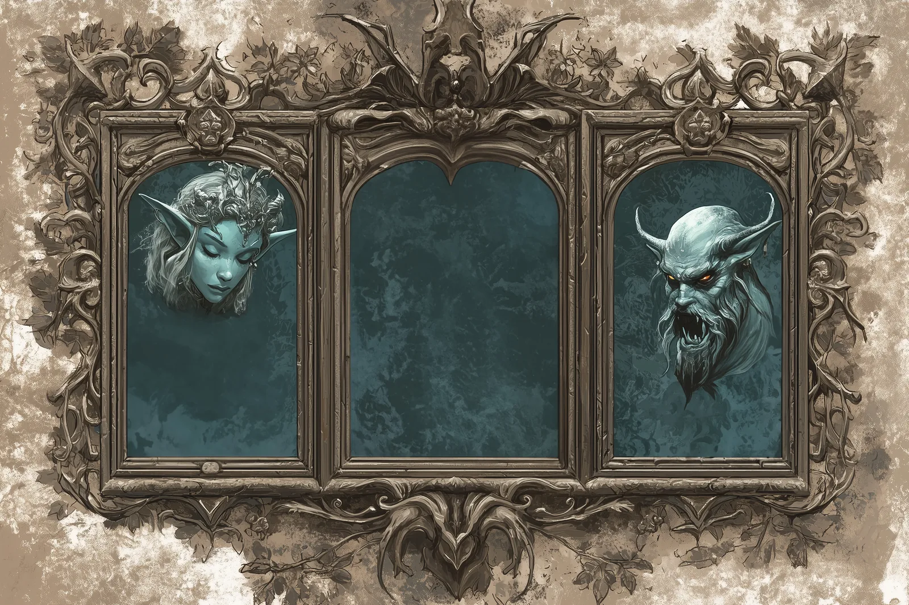

# Augury Mirrors

- :octicons-info-24:{ .lg .middle } __([Fey](<../../../creatures/fey/fey.md>) magic mirror)__  
    :simple-dungeonsanddragons:{ .middle} [Mechanics](https://www.dndbeyond.com/magic-items/5346832-augury-mirrors) 

{align="right"; width="400"}A set of three small silver mirrors, each about 1 foot square, that can fold up, set in an ornate iron frame depicting satyrs, dryads, and other fey creatures. The left mirror shows happy, smiling fey; the middle mirror is undecorated, and the right mirror shows angry, violent fey. When unfolded, can be used to cast Augury once per day. You reflection appears in the left mirror for a good result, the right mirror for a bad result, both left and right for both good and bad, and in the middle for not especially good or bad. 

