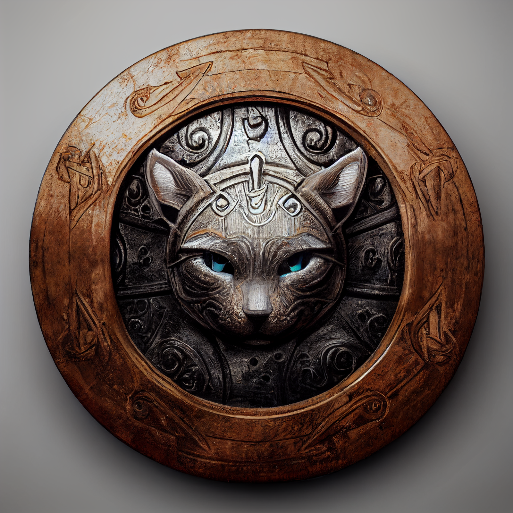

# Deno'qai Lynx Shield

- :octicons-info-24:{ .lg .middle } __Legendary Deno'qai Magical Shield__  
   Owned Dewalth  
    :simple-dungeonsanddragons:{ .middle} [Mechanics](https://www.dndbeyond.com/magic-items/5360068-lynx-denoqai-shield) 

{align="right"; width="400"}A magical shield of Deno'qai make, decorated with a lynx motif. This shield was originally made with the blessings of the [Tanshi](<../../../gods-and-religions/gods/tanshi/tanshi.md>) for [Balati](<../../../people/historical-figures/balati.md>), a Deno’qai hero in the [Great War](<../../../events/1500s/great-war.md>). After Balati fell in battle, the shield preserved by the Ko'zula tribe, along with Balati's [armor](<./deno-qai-scale-mail.md>). 

In DR 1748, this shield was [gifted](<../session-notes/session-53-dufr.md>) to [Delwath](<../../../people/pcs/dunmar-fellowship/delwath.md>) by [Enon](<../../../people/deno-qai/enon.md>), the Godcaller of the Ko'zula, to aid on his quest to rescue the [Meswati](<../../../gods-and-religions/gods/tanshi/meswati/meswati.md>). During the course of [Delwath's adventure](<../session-notes/session-54-dufr.md>), this shield gained the blessings of the six lost tanshi as [they were freed](<../session-notes/session-55-dufr.md>): [Midri](<../../../gods-and-religions/gods/tanshi/meswati/midri.md>), [K'onisati](<../../../gods-and-religions/gods/tanshi/meswati/k-onisati.md>), [Nisir](<../../../gods-and-religions/gods/tanshi/meswati/nisir.md>), [Taraka](<../../../gods-and-religions/gods/tanshi/meswati/taraka.md>), [Yalik'i](<../../../gods-and-religions/gods/tanshi/meswati/yalik-i.md>), and [Yezali](<../../../gods-and-religions/gods/tanshi/meswati/yezali.md>). Later, [Umli](<../../../people/other-nonhumans/umli.md>) [enhanced](<../session-notes/session-90-dufr.md>) the shield with [Skaer Steel](<../../../things/materials/skaer-steel.md>). 
