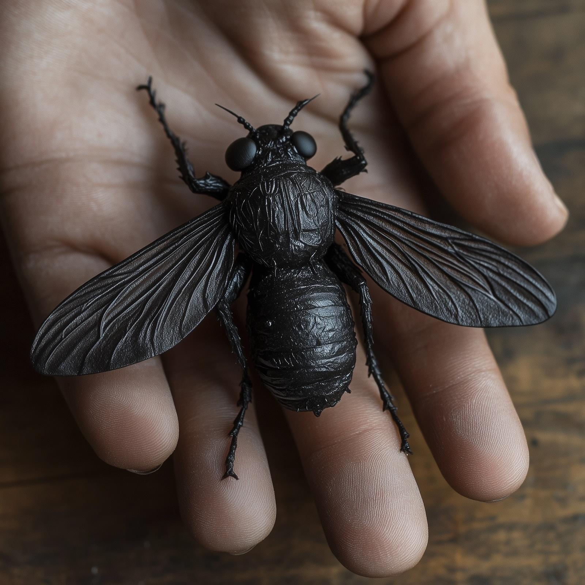

# Agata's Obsidian Fly

- :octicons-info-24:{ .lg .middle } __Rare [Fey](<../../../species/extraplanar/fey.md>) Magic Figurine__  
   Owned by [Wellby](<../../../people/pcs/dunmar-fellowship/wellby.md>)  
    :simple-dungeonsanddragons:{ .middle} [Mechanics](https://www.dndbeyond.com/magic-items/4831-figurine-of-wondrous-power-ebony-fly) 

{align="right"; width="400"}A sculpture of a small black obsidian fly, small enough to fit in the palm of a human hand. When a command word is spoken, it animates, turning into a giant fly; whomever summons it can speak the same word to turn it back into a figurine. The fly is hostile to anyone it does not recognize as its owner, and attacks immediately. It is kind of an asshole. 

The [Dunmar Fellowship](<../../../people/pcs/dunmar-fellowship/dunmar-fellowship.md>) found this figurine on [Agata Dustmother](<../../../people/fey/agata.md>) after [defeating her](<../session-notes/session-28-dufr.md>) in [Shakun’s Wellspring](<../../../gazetteer/greater-dunmar/realms/dunmar/eastern-dunmar/shakuns-wellspring.md>). Despite several attempts, have not been able to convince it to recognize a new owner. [Was fed to a giant velvet worm](<../session-notes/session-34-dufr.md>) in the [Elven Arborea Workshop](<../../../gazetteer/greater-dunmar/dunmari-basin/elven-arborea-workshop.md>), but survived. [Wellby](<../../../people/pcs/dunmar-fellowship/wellby.md>) learned from [Arryn](<../../../people/other-humans/arryn.md>), the mirror wizard at the edge of the ~Eastern Ocean~ that it cannot serve a new owner until its old owner is dead.

