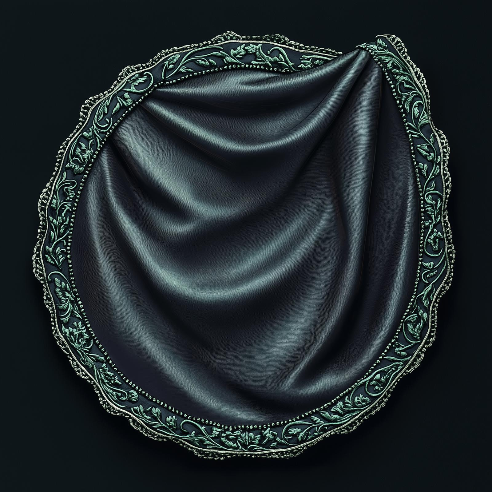

# The Dunmar Fellowship's Portal Hole

- :octicons-info-24:{ .lg .middle } __[Dunmari](<../../../gazetteer/greater-dunmar/realms/dunmar/dunmar.md>) Magical Container__  
    :simple-dungeonsanddragons:{ .middle} [Mechanics](https://www.dndbeyond.com/magic-items/4699-portable-hole) 

{align="right"; width="400"}This portable hole was received as a [gift](<../session-notes/session-42-dufr.md>) from [Basu](<../../../people/dunmari/basu.md>), a mystai of Laka, in exchange for helping clear the excess extraplanar energy from the [Elven Arborea Workshop](<../../../gazetteer/greater-dunmar/dunmari-basin/elven-arborea-workshop.md>) beneath the [Lakan Monastery](<../../../gazetteer/greater-dunmar/realms/dunmar/central-dunmar/tokra/lakan-monastery.md>), permeated with the essence of [Arborea](<../../../cosmology/spiritual-realms/arborea.md>). 

Upon receiving the portable hole, the Dunmar Fellowship was warned to follow these four rules:
- Never open an extradimensional portal instead another extradimensional portal
- No fire (or acid, or similar effects) in the hole, because eventually the silk of the cloth itself will burn and the item will be destroyed; 
- Be careful which direction you open it – if you put it on the ceiling everything will fall out; and 
- Don’t rip the material from the outside or especially from the inside, as any tear can rip apart and eject everything inside into a random other plane. 

