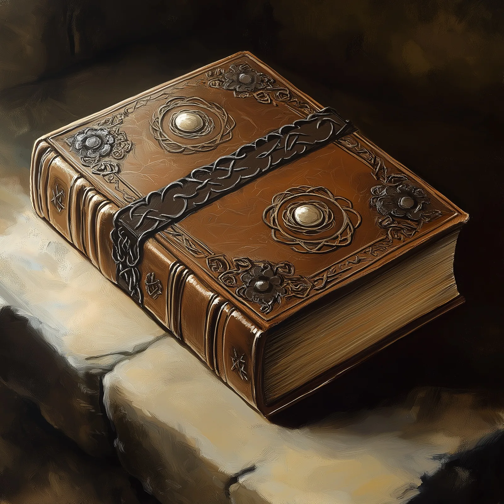

# Taurion's Manual of Stone Golems

- :octicons-info-24:{ .lg .middle } __(very rare [Drankorian](<../../../history/historical-realms/drankorian-empire.md>) magic book)__  
   Owned  
    :simple-dungeonsanddragons:{ .middle} [Mechanics](https://www.dndbeyond.com/magic-items/4950-manual-of-stone-golems) 

{width="right"}

