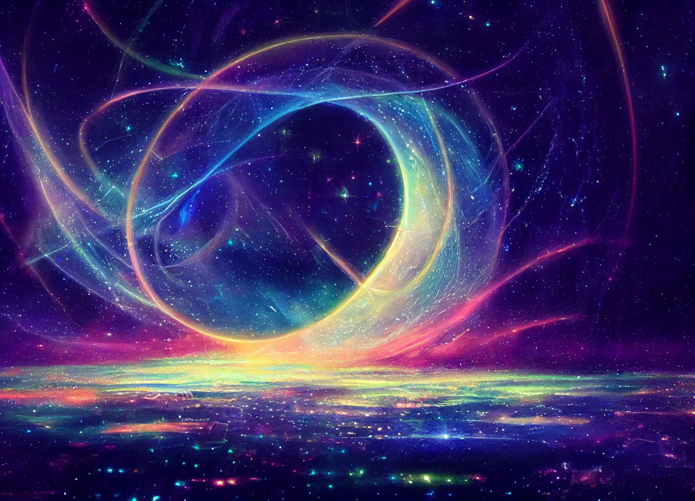

# Kenzo Spirit Journey in Bedez

As you step into the water, a voice, [Elazar](<../../../people/lizardfolk/elazar.md>)’s voice but also more than just his voice, begins to chant. In the beginning there was everything and nothing in this formless vastness in which thought had no meeting, came the Divine, who we call Bakar, embodied creation and destruction, life and death, form and void.

Bakar split this formless vastness and energy erupted forth: the chaotic, roiling energy of magic and the flowing silver calm of spirit. As Bakar willed, these energies collided, and from that collision the material the world was born, giving birth to the lands of Taelgar and its first inhabitants: the titans, the archfey,, the elder elementals, and the ancient dragons known as the great wyrms. The very fabric of the world itself resonated with the power of spirit and magic in those days.

But just as destruction without creation brings ruin, so did the unconstrained energy overflowing the world, and Bakar breathed out, reshaping everything. And in this long breath, the Tharzen Anzinakoa came, their steps bringing balance to the chaos of the land. 

As the voice continues chanting, you begin to see lights  forming in the darkness.

The voice continues: Bakar's breath ended with a chant, growing in complexity and power as the strands of magic and spirit were caught in the harmonics of their song. And when the chant ended, the world was sundered. The magic and power intertwined with Taelgar was fractured and separated, as Bakar's chant created the planes, the realms of magic and spirit, leaving Taelgar vibrating in the balance between the sea of magic and the sky of souls. 

The lights begin to grow bigger, shaping into an explosion of color frozen in time. The voice begins to fade, the last echoes chanting: the songs of the planes still linger in our world, though, in places attuned to their resonance, the echoes of the realms of magic, and the realms of spirits still linger. 

As you enter the lights, you see a vast sparkling world before you. You’re not sure if it is a vision or a dream, or something more physical, but dotted across the sky are endless points of light. This is a place you have been before, the  [Plane of Souls](<../../../cosmology/multiverse/plane-of-souls.md>) that you traveled through once with [Candrosa](<../../../people/dunmari/candrosa.md>)’s guidance. But now, here, you can see it much more clearly. You're floating, but you can also sense the loops and whorls in this place where it's energy touches the world of Taelgar, and you can see each time a loop, or a root, or a tendril, reaches down and touches the world, there's a ripple in the physical world, that echoes out from that point of contact vibrating with vital energy.

There is structure that you could not see before. There are echoes and harmonies in this plane, some echoing with the vibrations of the Hutsu plant that you experienced already. You can now see that strand of energy, a strand of ki that you might call a ki of souls, touching the plant of the ancestors and resonating. In the sky above you, you can see Amezza, the dreamberry tree, the twists of the dream world echoing around this place and touching the flowers. They begin to bud and form a resonance there, and you can see others. You can see how all of these resonances cluster near you around you,

yet somehow there are no ripples on the ground below you. You can see your staff in altered form next to you, vibrating with an energy of the abundance of life. This now you know, in the Lizardfolk language is called Ohana, the ki of nature, but more than nature, the ki of the vibrance of life, the overwhelming energy of life itself striving to grow. You can see darkness, too. You can see dreams twisted into the echoes of a nightmare, of darker things that also touch the world and leave ripples: bright red, the poisoned berries that the Lizardfolk call Arokatu, that gathers the energy of these dark nightmares, to be used with great caution.

In this place, this spirit realm, you can also sense something moving, something lapping at the waters of Taelgar in a circle round and around beneath you, drinking the energy of the spirit realms. You can't sense its form,  but you feel its presence, its thirst that cannot be slaked. You hear – not exactly disharmony, but an absence of the complex harmony and the resonances that should be here, a simple melody all that is left. 

Reaching out your spirit, you float through this realm, feeling for [Rai](<../../../people/pcs/great-war/rai.md>), choosing to reach forward into the twists and whorls of the dream world. You see, floating next to you now in this this dream realm, the two pieces of [jade](<../treasure/notable-items/jade-piece-of-rai-s-hand.md>) that were anchored to your staff, faint green lines passing between them. But then there are other lines of energy that are severed, and foreign energy, energy that that shouldn't be here in the dream, all the energy of magic, of the chaos below, of the elemental realms of pure magical energy itself, flaring out of these severed connections into nothingness. A confused, disoriented thought drifts from these severed connections, a vision of an elaborate stone door with eight chains crossing in a pattern in front of it, a giant hexagon in the center, a complex locking mechanism imbued with faint lines of magical energy. As you watch this image, this vision, the door is flickering between opened and closed, opened and closed. Every time it's closed you see a small flying lizard-like creature, ancient and worn, that you realize is the creature Dimitaur, standing in front of it, looking out towards you. Every time it's opened, all you can see are two dried, withered hands on either side of the door, pulling themselves forward, and you sense this is connected to [Apollyon](<../../../people/historical-figures/drankorian-emperors/apollyon.md>), the last emperor of [Drankor](<../../../history/drankorian-era/drankorian-empire.md>). 

Turning from this vision, you reach for the dream echoes of the Amezza tree, communing with it, developing relationships with the vast symphony of ki and spiritual energy here. As you commune, you sense the layers of the spirit world, that drift further and further from the material world until you reach darkness, where there are no souls, a place you sense is the [Land of the Dead](<../../../cosmology/multiverse/spiritual-realms/land-of-the-dead.md>), where you have been once before, a veil beyond which is the realm of the gods. There are silver threads that hang from the [Land of the Dead](<../../../cosmology/multiverse/spiritual-realms/land-of-the-dead.md>), and connect to the to the Hutsu vines, like they're sort of dripping down from there. 

Introducing yourself and opening yourself to the spirit world, you here a song begin, an interplay between the ki of the material world, of life and growth and physicality, and the ki of the spirit world, of hopes and dreams and imaginings. The music echoes and resonates with your own ki, growing in complexity and power, and it begins to swirl around you. And you can now, from this perspective, see how your ki can be tuned to different parts of the symphony, and you begin to here the disparate parts that make the melody complete. You are lost in the complexities and the music, learning and communing with the different flavors and harmonies of ki here, and as you do you feel the essence of these harmonies flowing into your staff, joining with the songs of [Bhishma](<../../../cosmology/gods/incorporeal-gods/dunmari-pantheon/bhishma.md>), of the Dunmari gods, of the melodies of the Divine realm, and even the echoes of the elven songs of the wood of the tree of your staff, and the Deno’qai songs of the [Elderwood](<../../../gazetteer/chasa-nahadi-watershed/elderwood.md>) and the Te’kula. 

As you learn to hear specific notes in these melodies, you listen for your companions. [Seeker](<../../../people/pcs/dunmar-fellowship/seeker.md>)’s melody is no where to be found, but you sense [Wellby](<../../../people/pcs/dunmar-fellowship/wellby.md>)’s song, a song of fascination with a strange place, a new place, and [Delwath](<../../../people/pcs/dunmar-fellowship/delwath.md>)’s song, a brightness to him that you have not seen before. 

Then you listen for your enemies. Reaching for [Grash](<../../../people/other-nonhumans/grash.md>)’s song, his essence, you find only darkness, a severed blackness disconnected from the harmonies of the divine realm, an undead soul that exists only on the material plane itself, decay clinging to it. Then, you listen for [Apollyon](<../../../people/historical-figures/drankorian-emperors/apollyon.md>)’s song, following the path through [Rai](<../../../people/pcs/great-war/rai.md>)’s dreams in the [Dreamworld](<../../../cosmology/multiverse/echo-realms/dreamworld.md>), the vision of the door stabilizing, nothing moving, everything frozen in time, but with the door open. You looking into the gloom and [Apollyon](<../../../people/historical-figures/drankorian-emperors/apollyon.md>)'s hands, and as you do, you realize [Apollyon](<../../../people/historical-figures/drankorian-emperors/apollyon.md>) has no presence here, not even a dark disconnected undead soul. There’s no black corruption, but also you can can tell that it is not the absence of a soul entirely, just that it is not here, no in the [Plane of Souls](<../../../cosmology/multiverse/plane-of-souls.md>). There is something that connects him to a soul, but it seems to drift back in darkness to beyond the door. 

As you move to drift away, to retreat from this vision, you see the glint of two eyes, just points of white in the darkness behind the open door, and those two eyes look at you, seem to pierce into your own soul. [Apollyon](<../../../people/historical-figures/drankorian-emperors/apollyon.md>) turns, the eyes turn, the scene shifts slightly, the head coming into focus, a dry, desiccated face, wrapped like a mummy but with the wrapping falling off, like it has been dried in the desert for centuries. But the eyes are bright, and staring right at you. Even calling for the protection of [Bhishma](<../../../cosmology/gods/incorporeal-gods/dunmari-pantheon/bhishma.md>), [Laka](<../../../cosmology/gods/incorporeal-gods/dunmari-pantheon/laka.md>), the Dunmari guards, the spirits of the jungle, they can do nothing to protect you, for this is arcane magic through which [Apollyon](<../../../people/historical-figures/drankorian-emperors/apollyon.md>) can see you.

You flee from [Apollyon](<../../../people/historical-figures/drankorian-emperors/apollyon.md>)’s glare, and turn to this spirit realm, as you begin to understand its topography, you explore and commune with the spirits, learning more about this realm. You sense the veil of the [Land of the Dead](<../../../cosmology/multiverse/spiritual-realms/land-of-the-dead.md>) more deeply, and you realize as you stare out here at the spirit realm, that there are  little like faint tendrils of of light and song that pierce through the veil of the dead. As you pay attention to this you realize that many of these tendrils seem to cluster around you: tendrils to [Bhishma](<../../../cosmology/gods/incorporeal-gods/dunmari-pantheon/bhishma.md>), to [Laka](<../../../cosmology/gods/incorporeal-gods/dunmari-pantheon/laka.md>), to [Shakun](<../../../cosmology/gods/incorporeal-gods/dunmari-pantheon/shakun.md>). They echo in the back of your head, the song of the gods, and you realize it has always been there, flowing through you, feeding into your ki. 