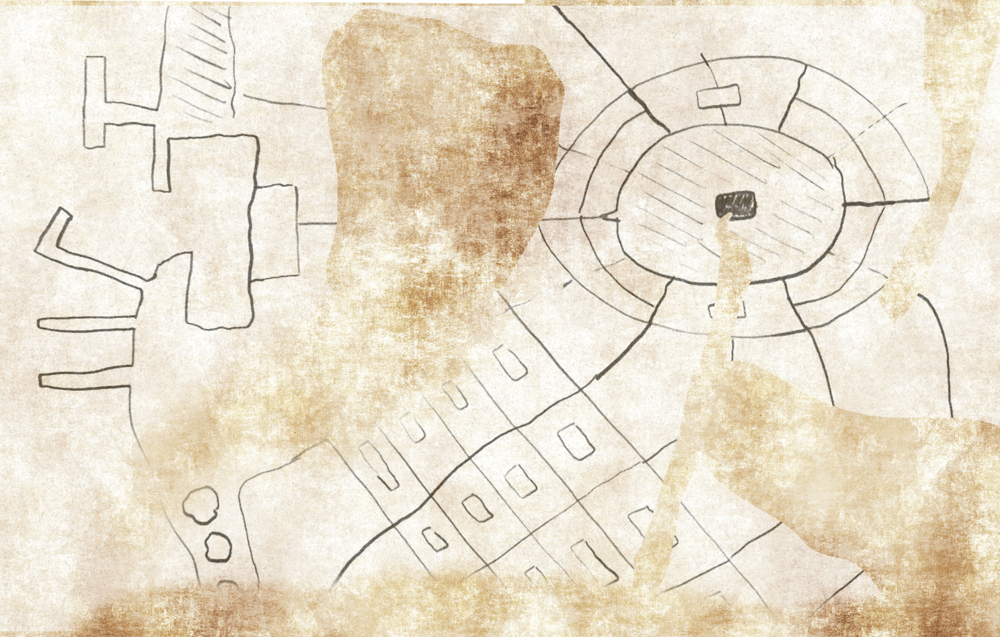

# An Annotated (Partial) Map of Drankor

**This is a partial copy of a copy of a report written by a Dunmari scholar based in [Kharsan](<../../../gazetteer/greater-dunmar/dunmari-basin/kharsan.md>) during the [Aatmaji Dynasty](<../../../groups/dunmari-dynasties/aatmaji-dynasty.md>), apparently based in part on a Drankorian treatise on urban form and urban planning. [Nuzkar](<../../../people/orcs/nuzkar.md>)'s annotations are in italics**

*I have not been able to reconstruct the full report, much less the original text, as too many pages are missing. However, it seems that prior to attacking [Drankor](<../../../history/drankorian-era/drankor.md>), the Nayan Aatmaji [Dasa](<../../../people/historical-figures/dunmari-rulers/dasa.md>) sought as much information as possible and hoped that at least a partially accurate map of [Drankor](<../../../history/drankorian-era/drankor.md>) could be produced. I have reproduced as much of the Dunmari map as I could, with annotations.*

*I believe there are four major areas seen on this map. In the northwest corner, the docks. In the northeast corner, the great plaza mentioned in the [Report of the Aagiri to Samraat Dasa](<./report-of-the-aagiri-to-samraat-dasa.md>). In the center to the south, an illustration of the street grid apparently common in parts of [Drankor](<../../../history/drankorian-era/drankor.md>), and the southwest, something seemingly referred to by the Dunmari as the Teeth of [Drankor](<../../../history/drankorian-era/drankor.md>). I have endeavored to copy what notes I can describing each of these places: what follows are the Dunmari notes I was able to reconstruct.*

***The Docks***
The docks of [Drankor](<../../../history/drankorian-era/drankor.md>) are described as "mighty piers rising of the river," made of "wood that does not rot and gleams with an inner light, shining and twinkling in the night as if stars danced along its surface." We believe a number of docks and quays were built against the riverbank, and there is evidence a large trade or customs house, "larger than the tallest trees of the elves, if lain on their side" which seemed to contain "the bustle and trade of a thousand ships from all corners of the empire, and beyond."

***The Great Plaza***
The Drankorian sources we can find describe a number of great plazas, and we believe that these large, open spaces were the center of life in the city. One source, apparently written by a visitor to the city, describes: "The vast markets of the Great Plaza, lit by dancing fire that hung from the trees, the trees themselves growing through the very stone of the city. The sweet smells of flowers and the living earth seem to blend with the fruit of the market in an intoxicating perfume of magic and wonder. Everywhere [elves](<../../../species/elves.md>), [Humans](<../../../species/humans.md>), peronar, and others trade and talk and sing. On one day alone I heard the tale of Edrae's Curse from a [halfling](<../../../species/halflings.md>) singer, bought the finest silver knives I have ever seen from a [stoneborn](<../../../species/stoneborn.md>) smith, and watched a pair of acrobats - a [human](<../../../species/humans.md>) and a peronar - fling themselves from the trees seeming to fly. I had been told of the magic of Drankor, but until you see it with your own eyes, you cannot truly know what it means." 

***The Streets of Drankor***
A number of fragmentary sources describe the regular streets of the city of [Drankor](<../../../history/drankorian-era/drankor.md>), "paved in marble" and surrounding "vast blocks of villas, workshops, and apartments." It seems these buildings typically had central courtyards, for another fragmentary book describes the proper treatment of courtyard trees, describing at length the care and magic required to grow lightfruits and sweetleaves. 

***The Teeth of Drankor***
It appears the river was lined with a series of defensive fortifications, towers of might and magic built in the early days of Drankor. We believe they fell into disuse as defensive measures, given that a fragment of a story describes "the great promenade that follows the mighty river and the teeth of the city, where light and warmth shines from the many windows in the many colored towers that rise along the banks of the river, like a forest of jewels." However, another source, again a fragment only, mentions how "...lightning shone from the top of the Sapphire Tower, striking in all directions, even to the warships south of the city on the rivers, and thus smote the raiders..."

