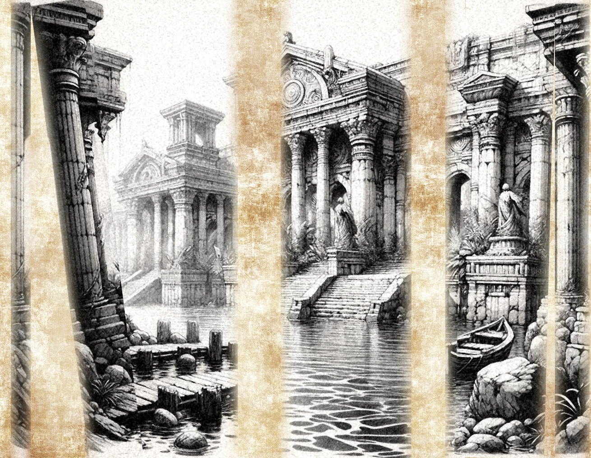
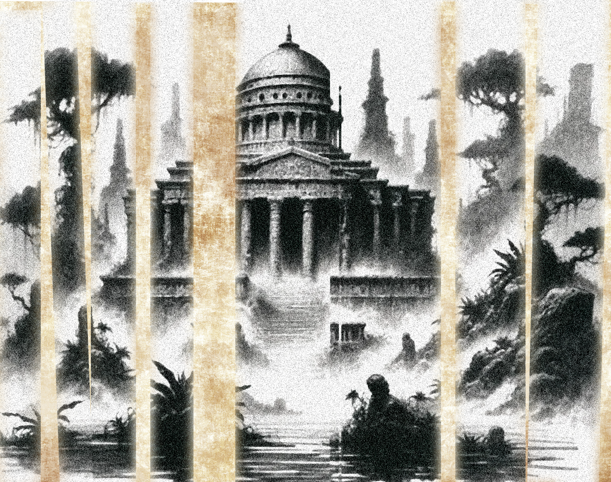

**This is a copy of a report written by the Aagiri, the mystai of Aagir, to Samraat Aatmaji Dasa, who was the last of the Aatmaji Dynasty, and died leading a Dunmari army into Drankor, ending the Aatmaji Dynasty and throwing Dunmar into chaos for a time. Nuzkar's editorial notes are marked in italics.**

*This report apparently described a scouting expedition to Drankor, led by the mystai of Aagir. It was accompanied, I think, by sketches and maps, which I have attempted to recover, but often this has not been possible*

The blessings of Aagir shine on you, and may his hand guide your spear in the days to come, in this the 205th year of the divine light of the Aatjmaji dynasty. 

*If my calculations are correct, this should be 1378 as the Chardonians count years, around 370 years ago.*

We have traveled far, Samraat, into much peril, to bring you this information. It is more than 600 miles from our southernmost fortifications near the confluence of the Hara and the Kharja to the city of Drankor itself, and not a journey to undertake lightly. While the Hara itself remains easy to navigate, once you get a hundred miles from the city, the shores of the river turn to fetid swamps. This, we believe must be the source of the rotted beasts that have attacked our fortifications so many times in the last decade. You can see the corpses of horses and cattle floating, bloated in the muck, and we could feel their eyes on us. Thank the gods that Aagir's fire protects us, and that the radiant wrath of the divine sent those few that approached our boats to a more peaceful rest in Chidya's arms. 

*We believe that this description is outdated. Our people have scouted far south along the Drogar (the Mahar, as the Dunmari name it), and the land to the west, where the Hara would flow, is bone-dry. The cliffs of the Garamjala rise along the western banks of the Drogar for hundreds upon hundreds of miles.*

Approaching the city of Drankor itself is a terrible sight. Legends tell of the might and magic of the Drankorian Empire, but nothing prepares you for the shear size of the city, even in ruins. South of the swamps, a jungle grows from the coast, humid and teeming with the buzzing of insects and vines and trees, but underneath the sickly smell of decay pervades. Aagir's divine presence is all that kept us from turning and fleeing from the overwhelming aura sense of foreboding that radiated from the air itself. 

And then we saw the city. Avenues wide enough for a score of horses to walk abreast, paved in marble. Great domes of monumental buildings, with spires reaching for the heavens. Vast plazas with statues the size of giants. Everywhere, the jungle trying to break through, but repulsed by the lingering magic of the city. 

As we approached the dockyards, the wharves made of some magical wood that seemed immune to decay, the quays of marble and silver, the sense of foreboding grew stronger and stronger, as if we could feel an evil will setting itself against us. Fear took us, and I believe that most of us would have turned and fled from the city at that moment had not Aagir's power flowed so mightily through our commander. 

We walked the broad avenue from the docks to a great plaza, huddled close in the aura of Aagir's blessing. The very air of the city was close and dark, and everywhere signs of corruption. The living vines of the jungle attacked us, seeking to bind us and draw us to twisted trees that split their trunks to swallow us hold, but the fire of Aagir that blazed through our swords and spears destroyed the corrupted flesh of these creatures. 

The plaza itself was full of nightmares - hundreds upon hundreds of skeletons, whose hands would grab at our feet as we walked. And yet we pressed forward, as Aagir's divine will cried out that the source of the malice that pervaded this city was still ahead. 

Eventually, we found a vast mausoleum or temple, larger and grander than the greatest of the Samraat tombs in Kharsan. Here, we are sure, is the will that drives the zombies and undead that ravage our lands from this accursed city. And yet we could not approach, for the structure itself was surrounded by billowing clouds of red mists. Whether brave or foolhardy, one of our company approached the mists, and we all felt the sadness of Jeevali's tears as his body aged to dust in an instant as the red mists grasped him. 

It took us two days of fighting through undead and the evil plants and monstrosities of the corrupted jungle to return to our ships, and nearly a third of our company was lost on the journey.

I write now with this knowledge. If we are to stop the incursions and conquer the darkness of Drankor itself, the grace of the gods willing, we must find a way past the red mists that protect the evil at the heart of the city, and we must find a way to wash that evil from the jungles as Jeevali washed the evil from our lands. 

Yours in service and may the strength of Aagir guide your will,
Aram of Kharsan, Secretary of the Aagiri

*Aram apparently enclosed some sketches and maps; I have been able to reconstruct two, but unfortunately none of the maps survived. Perhaps there are other copies to be found.*