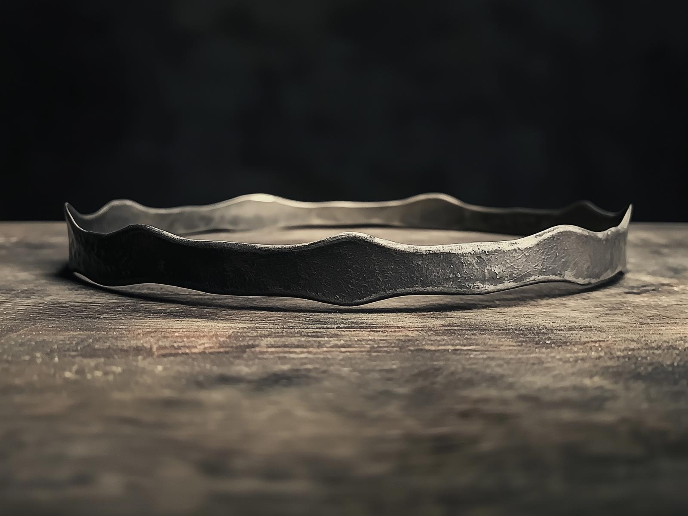
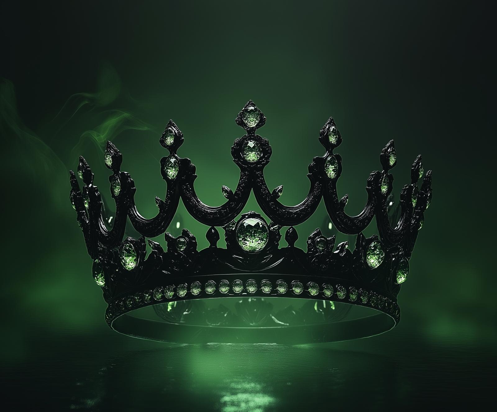

# The Crown of Purity Vision

Kenzo takes the Crown out of the Portable Hole, and amazingly it looks nothing like it did before. It now is made of silver, an elegant design with delicate ruby insets, with seven equal points in the front and decorated with dwarven runes and hammer motifs. 

He holds the new Crown to the mirror, and the mirror goes black, the scene shifting. You see is a study, plain, a simple desk, books in Chardonian. It looks old, maybe a hundred, a hundred and fifty years ago? It's hard to say exactly, but this has the air of a academic study, probably in Chardon. 

The crown itself, however, looks different. It is a plain, like wooden band. No decoration, nothing. 

You're in a study, and somebody looks like they are doing research, cataloging things. There is on their desk what seems to be the beginnings of a treatise on the historical greatness of Drankor. The writing is just in note form, and speaks of "How can how to bring back the might of empire?" Somebody seems obsessed. You see notes scattered across the page, referring to Apollyon, the lost scepter, the lost cloak, lost, everything lost. "Could this be the crown?"

And then you see hands gripping the plain wooden crown, followed by a brief flash of what seems to be almost light lightning, but barely visible, as the person who hands grabbed the crown falls over, seemingly dead. Somebody else walks in, somebody older, wearing plain robes with a serious face, blue eyes, and gray hair cut neat, an air of a master about him. He smiles as he reaches and grabs the crown, as time speeds up and the crown begins to shift its form to the black metal design with gray stones that Fausto possessed. But this is not Fausto. 

And then the scene shifts, time reversing, going backwards, the plain wooden band sitting dusty in a forgotten chest, not even radiating magic, lost, going back and back, part of a caravan traveling across Dunmar in a chest tossed carelessly, now not wooden, but a simple iron band tossed with dozens of other meaningless Drankorian artifacts. 

The scene shifts, and you see Apollyon standing in life, standing in front of the doors to his temple, wearing the crown, now an elaborate, elegant design adorned with diamonds, reflecting the full weight of the Imperial Regalia of Drankor, but still made of a black metal. Thousands upon thousands of tendrils of magic flowing out from it. Apollyon holds out the Scepter of Command as magic rips from him towards Cha'mutte, flying in the sky above him, who deflects it. Cha'mutte breathes and rends, and the red mist piles around Apollyon, as strand after strand, hundreds of strands break, thousands of strands break, the crown becoming more and more isolated as thousands upon thousands of tendrils are shredded by Cha'mutte. Thousands upon thousands of people, under the control of Apollyon through this crown, die and die and die until finally none are left. As Apollyon staggers back to the doors of his temple, he screams in frustration, and as the red mist reached to grab at his face, in desperation, he grabs a vial of black liquid from his pouch and drinks it. The walls of his temple seal up around him, and the crown is tossed from his head across Drankor skipping, and shattering. 

Time jumps suddenly back a long time back, skipping past how Apollyon found the crown, speeding back in time to the days of the Downfall Wars, on Hkar, in a temple to the Eight Divines, a view of the ocean out the window. Terrified people gathering on the walls of a great city, watching a giant armada bearing down on the island. The crown is sitting, now a plain circlet of steel, on a marble table. 

You can see a dozen men and women gathered, humans and elves, discussing and arguing. The argument ends, seemingly coming to a resolution, and one of the women, a young woman with dark skin, black hair, and a regal face, grabs the crown, puts it on her head. Time speeds up again, and you see lines of power radiate out from the crown, as the island breaks apart, and begins to walk, the crown now an elegant crystal.

The scene shifts once more, flying back even further, drifting far, far, far back into time, before humans even existed. Before the forests of the elves spread across the world, before the halfling travelers brought stories across the land. Back to when the Firstborn strode through the world, their footsteps shaping the land with though, back to the days of myth themselves. When the plane of magic was intertwined with the world itself. Then, you feel, through the mirror, perceiving with more than just your eyes, the riotous shattering, the stretching and pulling as the Divine Presence ripping the planes from one another. You see that something was caught when the world was pulled apart, some fragment of power of myth curled itself into a circlet and fell into the forest. A fragment of the ancient days when the world could be reshaped, frozen in material form, mindless but powerful, waiting, a chameleon always to adapt to whoever puts it on. And the mirror goes black.

