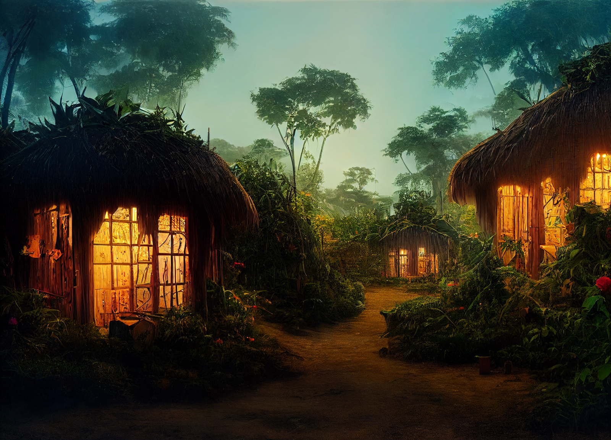
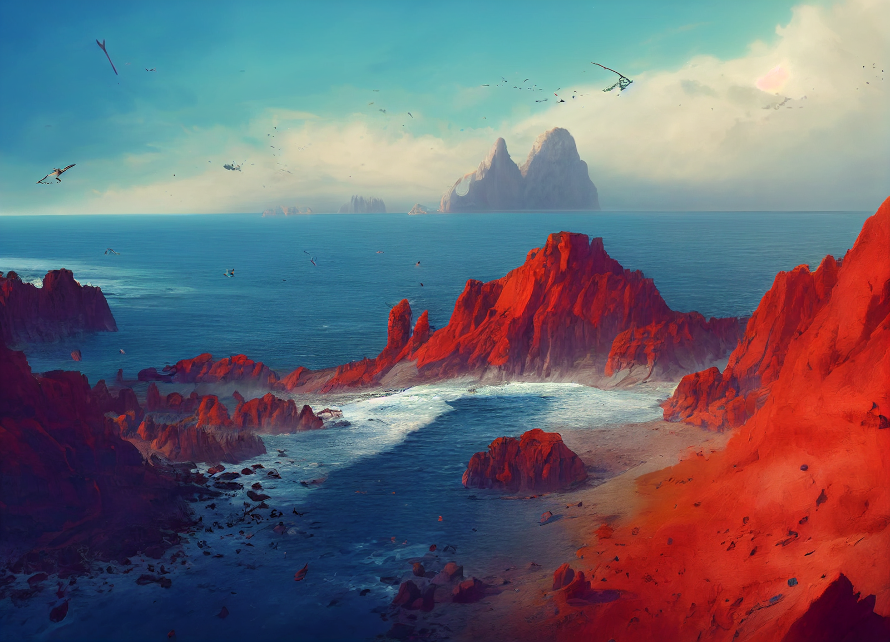
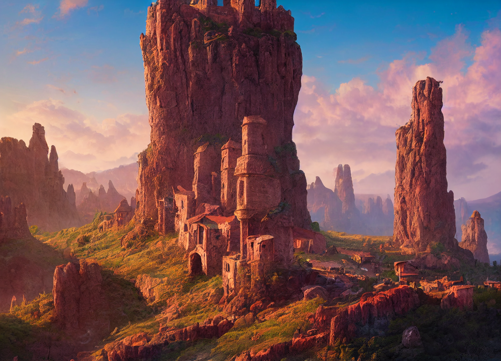

(Oct 21 - 25)

#### Part 1: Visions of friends. 

During the course of the week, one thing [Delwath](<../../../people/pcs/dunmar-fellowship/delwath.md>) does is scry on his friends. 

*[Seeker](<../../../people/pcs/dunmar-fellowship/seeker.md>)*: Despite repeated attempts, [Delwath](<../../../people/pcs/dunmar-fellowship/delwath.md>) fails to see any visions of [Seeker](<../../../people/pcs/dunmar-fellowship/seeker.md>). 

*[Kenzo](<../../../people/pcs/dunmar-fellowship/kenzo.md>)*: You look in on [Kenzo](<../../../people/pcs/dunmar-fellowship/kenzo.md>) several times over the course of the week. Once, you see him in what looks like a homely and comfortable hut, sitting and drinking tea with a lizardfolk man, speaking two different languages, neither of which you understand. It seems like the lizardfolk is teaching one of the languages to [Kenzo](<../../../people/pcs/dunmar-fellowship/kenzo.md>), and they both know the other language, but it is not one you have heard [Kenzo](<../../../people/pcs/dunmar-fellowship/kenzo.md>) speak much before. The scene is comfortable, and [Kenzo](<../../../people/pcs/dunmar-fellowship/kenzo.md>) seems at peace. Another time, you see [Kenzo](<../../../people/pcs/dunmar-fellowship/kenzo.md>) walking through a village in a jungle, of many small huts, lush plant life, flowers, arriving at a lake filled with lily pads that float peacefully in the evening light, a huge beast, a reptile of sorts with a massively long neck and a larger body than any you've seen before grazing in the water peacefully. Based on the time different of the light, you think this must be very far to the east. 

{width="400"}
{width="400"}

*[Wellby](<../../../people/pcs/dunmar-fellowship/wellby.md>)*: You look in on [Wellby](<../../../people/pcs/dunmar-fellowship/wellby.md>) several times as well. The first time you see him, he is in a small boat crowded with many people: several kenku, humans dressed in strange clothes, a human warrior, sailors, and an [Elves](<../../../species/children-of-the-embodied-gods/elves/elves.md>) but one who looks at home in the ocean, wearing armor with sea motifs. Again, judging by the light, he is very far to the east. The next time you see him, he is soaring in the air, flying on spectral bird wings, over an island of dry scrub and vibrant red rock pillars, dotted with hidden homes perched high on cliffs that no human could reach.

{width="400"}
{width="400"}

#### Part 2: Visions of allies. 

During your week of scrying, you also check in on several allies. 

From [Chardon](<../../../gazetteer/west-coast/chardonian-empire/chardon/chardon.md>): [Kaeso](<../../../people/chardonians/kaeso.md>), [Vola](<../../../people/chardonians/vola.md>), [Ulfgar Frostbeard](<../../../people/dwarves/ulfgar-frostbeard.md>), [Roscelia](<../../../people/chardonians/roscelia.md>), [Dee Wildcloak](<../../../people/halflings/dee-wildcloak.md>), and [Dain Goldhammer](<../../../people/dwarves/dain-goldhammer.md>) (all of whom you sent letters to from [Arendum](<../../../gazetteer/west-coast/chardonian-empire/chasa-river-valley/arendum.md>) before entering the [Elderwood](<../../../gazetteer/chasa-nahadi-watershed/elderwood.md>)). 

From [Dunmar](<../../../gazetteer/greater-dunmar/realms/dunmar/dunmar.md>): [Sura](<../../../people/dunmari/sura.md>), [Johar](<../../../people/dunmari/johar.md>), [Havdar](<../../../people/dunmari/havdar.md>). 

Elsewhere, you also check on [Marcella](<../../../people/chardonians/marcella.md>), and [Theba](<../../../people/deno-qai/theba.md>) and the people of the [Elderwood](<../../../gazetteer/chasa-nahadi-watershed/elderwood.md>). 

_In [Chardon](<../../../gazetteer/west-coast/chardonian-empire/chardon/chardon.md>):_ Ulfgar and [Roscelia](<../../../people/chardonians/roscelia.md>) are still in [Chardon](<../../../gazetteer/west-coast/chardonian-empire/chardon/chardon.md>), and there is not much to learn directly. You do gather from partial overheard conversations that [Fausto](<../../../people/chardonians/fausto.md>) has convinced much of the [Society of the Open Scroll](<../../../groups/chardonian-organizations/society-of-the-open-scroll.md>) that you have stolen from him, and while it is a little nebulous if the Magistros and the might of the Imperium is really committed to [Fausto](<../../../people/chardonians/fausto.md>)'s story, it would certainly be risky to return to [Chardon](<../../../gazetteer/west-coast/chardonian-empire/chardon/chardon.md>). 

[Kaeso](<../../../people/chardonians/kaeso.md>) is somewhere you have never seen before: a large inn, seemingly set over the water, a massive reconstructed skeleton of a huge beast, vastly larger than any whale or fish hanging from the ceiling. When you check in on him, he is sitting in thought with a drink. 

[Vola](<../../../people/chardonians/vola.md>) you check on a few times, not always successfully. She seems to be on the road, perhaps southeast of [Chardon](<../../../gazetteer/west-coast/chardonian-empire/chardon/chardon.md>)? The landscape is unfamiliar. She is not traveling alone, but you never manage a clear look at her companions the two times you manage to scry on her. 

[Dee Wildcloak](<../../../people/halflings/dee-wildcloak.md>), the halfling, is in [Darba](<../../../gazetteer/greater-dunmar/realms/dunmar/coastal-dunmar/darba/darba.md>), which you recognize from the harbor you sailed out of. She seems to be asking after a ship heading south, braving the crossing of the [Sea of Storms](<../../../gazetteer/greater-dunmar/sea-of-storms.md>). 

[Dain Goldhammer](<../../../people/dwarves/dain-goldhammer.md>), the dwarf, is on a ship, looking uncomfortable, sailing in warm blue waters, off the coast of a small island. The ship is not large, but big enough for maybe 10 people; [Dain Goldhammer](<../../../people/dwarves/dain-goldhammer.md>) seems to be speaking with a scholarly man in late middle age.

_In [Dunmar](<../../../gazetteer/greater-dunmar/realms/dunmar/dunmar.md>):_ You see [Johar](<../../../people/dunmari/johar.md>) several times, always either pacing in a small bare room or reading a small prayer book to [Laka](<../../../cosmology/gods/incorporeal-gods/dunmari/laka.md>) in Dunmari. You never see anyone else in the room after a few scries.

You see [Havdar](<../../../people/dunmari/havdar.md>) in front of a not-small army of Dunmari, brandishing his sword high, beating it on his shield. He speaks of the evil rot in the heart of [Dunmar](<../../../gazetteer/greater-dunmar/realms/dunmar/dunmar.md>), the curse that was laid upon him, and the need burn out the corruption with the cleansing power of steel.

Later, you see [Sura](<../../../people/dunmari/sura.md>) in the same camp, in a highly decorated tent. She is speaking quietly to a woman you don't recognize, about [Sura](<../../../people/dunmari/sura.md>)'s age, talking about her impatience with the Lakan monks and concern with [Havdar](<../../../people/dunmari/havdar.md>)'s new turn towards naked violence. You get the feeling that the Lakan monks are keeping [Tokra](<../../../gazetteer/greater-dunmar/realms/dunmar/central-dunmar/tokra/tokra.md>) from jumping to [Sura](<../../../people/dunmari/sura.md>)'s cause, and in its absence she is unwilling to launch an all-out war. 

_Elsewhere:_ You see [Theba](<../../../people/deno-qai/theba.md>) several times, always busy. [Mezzar](<../../../people/other-nonhumans/mezzar.md>)'s house in the [Bek'eni](<../../../groups/deno-qai-tribes/bek-eni.md>) village has been turned out, and from the stories and sights you see you gather it was the two poison elementals guarding the basement hoard there that convinced the village that [Mezzar](<../../../people/other-nonhumans/mezzar.md>) was not what he seemed in the end. There is still tension - many did well under [Mezzar](<../../../people/other-nonhumans/mezzar.md>)'s rule. And you gather that [Chardon](<../../../gazetteer/west-coast/chardonian-empire/chardon/chardon.md>) is increasingly fighting border skirmishes with other tribes. But every time you see her, [Theba](<../../../people/deno-qai/theba.md>) seems in good spirits. 

You see [Marcella](<../../../people/chardonians/marcella.md>) once. She is making her way down out of the mountains, and as you watch her she approaches a large inn complex at a crossroads. You don't recognize the glimpses you get in your vision of this area, and [Marcella](<../../../people/chardonians/marcella.md>) seems to trend cautiously and carefully, albeit openly on the road. There is snow blowing, and [Marcella](<../../../people/chardonians/marcella.md>) is wrapped in a warm cloak and furs, but seems to trend lightly over the snow.

#### Part 3: Visions of enemies. 

[Delwath](<../../../people/pcs/dunmar-fellowship/delwath.md>) is cautious scrying on enemies, and it can be a challenge. 

[Fausto](<../../../people/chardonians/fausto.md>) is either skilled at resisting scrying, or one or more rooms in his tower are protected from divination magic, for you catch only a few glimpses of him out and about in [Chardon](<../../../gazetteer/west-coast/chardonian-empire/chardon/chardon.md>). From what you see, he seems to be going about the normal business of a wizard in [Chardon](<../../../gazetteer/west-coast/chardonian-empire/chardon/chardon.md>), such as it is. Only once, you see him in the slums on the far side of the river, wearing a poor man's cloak and muddy, thin boots, flashing some coin to a man with a blank-eyed stare lying slumped on the side of a tavern. 

Scrying on [Kharsan](<../../../gazetteer/greater-dunmar/dunmari-basin/kharsan.md>), or [Grash](<../../../people/other-nonhumans/grash.md>), reveals a city in the midst of preparations for war. Unless you spend more time coming back to [Kharsan](<../../../gazetteer/greater-dunmar/dunmari-basin/kharsan.md>) again and again, it is hard to say war against who, exactly. But once you see [Grash](<../../../people/other-nonhumans/grash.md>) sweeping through the city, hand raised, and an army of undead following him. [Kadmos](<../../../people/chardonians/kadmos.md>) cannot be seen. But you do see his companions, briefly. They are apparently on the road, somewhere roughly your longitude, passing through rolling farmland and woods that reminds you a little bit of the [Chasa](<../../../gazetteer/chasa-nahadi-watershed/rivers/chasa.md>) river valley, but drier.