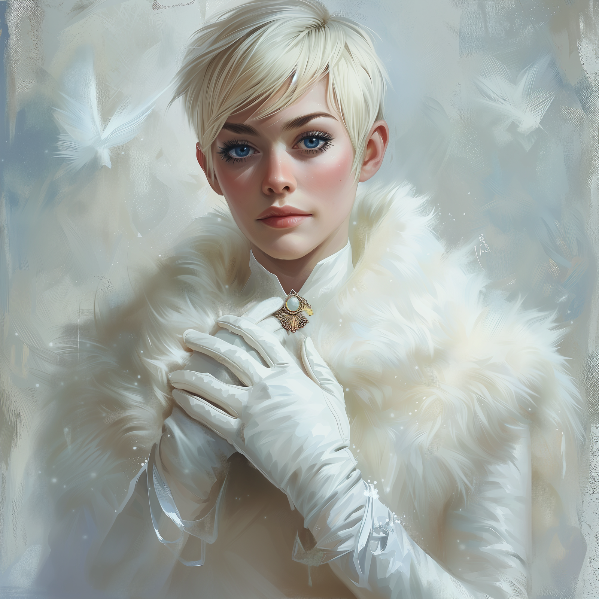

# Scrying, Feb/March 1749

## Apollyon

Delwath attempts to scry on [Apollyon](<../../../people/historical-figures/drankorian-emperors/apollyon.md>) a number of times. The first three attempts fail. 

The fourth attempt, in February, succeeds, revealing a dark chamber, maybe 20 feet by 40 feet, with stone walls. A skeletal creature – Apollyon – is sitting, seemingly in meditation, at the center of the chamber. There is no furniture here, but the walls are covered in paintings and murals of scenes from the life of Apollyon: Apollyon in battle against the elves of Rostare; Apollyon taking the cloak from the orcs; Apollyon raising and commanding an army of Drankorians. 

[Apollyon](<../../../people/historical-figures/drankorian-emperors/apollyon.md>) looks up - straight at the scrying sensor - as it appears. You catch a glimpse of his face – gaunt, but not entirely skeletal – before his appearance shifts and you see sitting in this chamber the Emperor Apollyon of old, whom you have seen in [Mirror of the Past](<../treasure/notable-items/mirror-of-the-past.md>). 

He stands, and walks to one of the chamber walls. With a flick of his hand, the wall shifts, revealing a corridor. He walks down the corridor, and steps into a larger chamber, a circular room with a high ceiling through which light illuminates the floor, which is covered in runes. As [Apollyon](<../../../people/historical-figures/drankorian-emperors/apollyon.md>) enters the runes light up, and at that moment five tombs raise from the ground. Each has a plain lid, and Apollyon lifts his hand the lids slide off.

Emerging from the tombs are what appear to be Riswynn, Delwath, Seeker, Wellby, and Kenzo. 

Apollyon laughs. 

And then the sensor is dispelled. 

## Chardon

[Delwath](<../../../people/pcs/dunmar-fellowship/delwath.md>) spends a significant amount of time scrying [Chardon](<../../../gazetteer/west-coast/chardonian-empire/chardon/chardon.md>), both people and especially a number of places, to get a sense of the city. 

For the most part, [the events in Dunmar](<../../../events/1700s/sibling-war.md>) don’t seem to have had a dramatic impact on Chardon. You catch the occasional discussion of news from the east, a variety of garbled rumors about hags and civil war. In many of them, you feature as allies of the hag and instigators of chaos - you seem to have some notoriety in Chardon. However, no one in Chardon seems too concerned with Dunmar and there does not seem to be a drumbeat for war.

You gather that, if anything, there is something of a conflict between the young Magistros, [Mitus Verina Auratan](<../../../people/chardonians/mitus-verina-auratan.md>), and some of the notable wizards of the Hetaeri Magica (a somewhat mysterious organization of wizards associated with the [Great Library](<../../../gazetteer/west-coast/chardonian-empire/chardon/great-library.md>) and the [University of Chardon](<../../../gazetteer/west-coast/chardonian-empire/chardon/university-of-chardon.md>), who manage rules about magic and magical training; Fausto is a prominent member). The Magistros, according to the rumors, sees no profit in war with Dunmar, and apparently the mages lost in the [Battle of Tokra](<../../../events/1700s/1748/12/battle-of-tokra.md>) were largely not official [Chardonian Legion](<../../../groups/chardonian-organizations/chardonian-legion.md>) wizards but mostly freelancers from the ranks of the University. Even the Hetaeri Magica, rumors report, is divided between those who wish war and those who council caution and peace. 

Nonetheless, there does seem to be a growing undercurrent of distrust of the Dunmari on the streets of Chardon, especially around [Precinct IV](<../../../gazetteer/west-coast/chardonian-empire/chardon/precinct-iv.md>), the University area. Outside [The Thirsty Scholar](<../../../gazetteer/west-coast/chardonian-empire/chardon/the-thirsty-scholar.md>), you see a group of students angrily turn away a Dunmari couple, taunting them, and these sights are not rare, although once when watching the port area, you do also see a soldier break up a fight between several Chardonians and a Dunmari man.

## Marcella

[Delwath](<../../../people/pcs/dunmar-fellowship/delwath.md>) scries on [Marcella](<../../../people/chardonians/marcella.md>) three times: once, the scry fails, but the other two succeed. 

In mid-February, he sees her traveling with three other people, moving quietly and quickly in single file along a barren, ashy plain. All are dressed in cloaks and breastplates, and carry swords and bows - these are clearly not mere commoners. They seem to be following the footprints of something, for they often stop to search the ground. Marcella goes last: her footsteps leave the footprints of the metal boots of a hobgoblin solider. 

Two weeks later, in early March, Marcella is camped near a marshy river. She is speaking quietly to a [lizardfolk](<../../../species/children-of-the-embodied-gods/lizardfolk/lizardfolk.md>) man, telling him that the creature is dead. It was a corrupted echo of the Shadowfell, a Sorrowsworn. The Rangers will keep watch for a few more weeks, she says, as the Sorrowsworn often appear in groups. 

## Kaeso

Delwath scries on [Kaeso](<../../../people/chardonians/kaeso.md>) twice. 

In early February, he is sitting quietly with [an old man](<../../../people/mawarans/yaz.md>) on the top of a tower overlooking the ocean, watching a storm crash against the cliffs. The man he is with is older than him, with white hair pulled back into a topknot, wrinkled laugh lines on his expressive face. You don’t recognize the person or the location, but Kaeso seems at peace.

A few weeks later, at the end of February, [Kaeso](<../../../people/chardonians/kaeso.md>) is sitting in a small room, drinking tea. The room is cozy - a bed piled with warm furs, a small table, a wardrobe, a warm fire burning in the hearth. Morning sunlight shines from the small window. Kaeso seems to be settled into this place. 

## Johar

[Delwath](<../../../people/pcs/dunmar-fellowship/delwath.md>) scries on [Johar](<../../../people/dunmari/johar.md>) several times, hoping to gain insight into the state of Sura’s camp. 

Around the middle of February, a week or so after you left the camp, most of Sura’s army departs, heading north. You see [Johar](<../../../people/dunmari/johar.md>), standing with [Sura](<../../../people/dunmari/sura.md>), watching many soldiers on horseback riding north in a long train. From the way they are standing together, you have the impression that there is someone else here, but you cannot see them, for some reason. 

Later, you see Johar clearly in a meeting with the Sonkar Mystai [Abha](<../../../people/dunmari/abha.md>), but strangely you cannot see or hear her - you only see and hear Johar’s side of the conversation. From what you can piece together, [Abha](<../../../people/dunmari/abha.md>) has been meeting regularly with [Sura](<../../../people/dunmari/sura.md>), and is acting as something of a go-between, but Johar mostly seems to be listening to a report or update, which you cannot hear, so it is hard to tell exactly how it is going. (meta: Delwath would know enough about magic at this point to realize this is probably the result of some kind of non-detection effect on Abha, which hides the target from all divination magic). 

By early March, [Johar](<../../../people/dunmari/johar.md>) is traveling northeast, probably heading for [Tokra](<../../../gazetteer/greater-dunmar/realms/dunmar/central-dunmar/tokra/tokra.md>), traveling with a small guard but not with Sura. From brief snatches of conversation, it seems he is returning at last to the [Lakan Monastery](<../../../gazetteer/greater-dunmar/realms/dunmar/central-dunmar/tokra/lakan-monastery.md>), bringing messages and letters to Speaker [Lara](<../../../people/dunmari/lara.md>) and a request for her to bring together the temple authorities and heads of the mystai from across [Dunmar](<../../../gazetteer/greater-dunmar/realms/dunmar/dunmar.md>) to Tokra for a conclave. 

## Havdar

Delwath scries on [Havdar](<../../../people/dunmari/havdar.md>) a number times in February and early March to get a sense of the border between Dunmar and Chardon. Mostly, you see the routine of army camp life. Havdar has at least a thousand troops, possibly more, camped on the western [~Songara Plains~](<../../../gazetteer/greater-dunmar/dunmari-basin/songara-plains.md>), near the edge of Dunmari territory. There does not seem to be significant active engagements with Chardonian troops – you don’t see signs of mass casualties or mobilization – although it is hard to know whether minor clashes have occurred. 

In early March, it seems the camp has swelled in size, at least doubled if not more. [Havdar](<../../../people/dunmari/havdar.md>) speaks frequently with scouts, commanders, and others. There seems to be some negotiations with Chardon – occasionally you will see a Chardonian messenger coming, or going – but Havdar is cautious. He never speaks of battle plans, or reads messages in a place you can see with your scrying. His primary command tent seems to regularly have some kind of ward on it, for it looks like an opaque white dome when viewed with scrying, and when Havdar enters the sensor cannot pass through.

## Radomir

Delwath scries on [Radomir](<../../../people/other-humans/radomir.md>) repeatedly over the course of February and early March. Sometimes the scry fails, but mostly you see the boring routine you’ve seen before. Chores around the small one-room house he lives in, always smoky from the fire burning in the hearth; bringing in wood; eating thin porridge and stew. Occasionally, he will spend a full day in bed, coughing. 

Over time, you get a better sense of the place where he lives. It seems to be on the edge of a village – there is a cart track that leads to his home, although it seems rarely used. The scrying sensor does not give a good view of the landscape, but there is a forest nearby, and lots of snow on the ground. Based on the time difference and the sun, Radomir is a good 1500 miles east of Tollen, but not that much further north. 

Once, you see another person. A woman, wearing white furs, gloves, with elegant features, blue eyes, somewhat younger than Radomir. She rides up to Radomir’s house on a horse, looks around as she dismounts, calling a greeting to Radomir, who is outside stacking wood. 

  
She walks up to him purposefully, and speaks quietly in a strange language (which Delwath quickly casts Tongues to decipher). 

“The [Rodnya Voknaz](<../../../groups/urskan-magical-organizations/rodnya-voknaz.md>) are not careless of your plight. You should have come to us right away, when you found the thing, for it has proved to be extremely interesting. But no matter, the past is the past and you have paid for your poor judgment.” 

She takes a small vial from a pouch, and hands it to Radomir. 

“Take this, it should at least help with the cough. And it might quiet the nightmares, a little.”

Radomir thanks her, calling her sister, and they talk quietly of his health for a few moments, before the woman tells Radomir she cannot linger for she has business at the border. As she leaves, she turns back to Radomir, saying, “You should know you are being watched. The Rodyna Voknaz trust you enough to leave you your wits and freedom, but not so much as to leave you totally unobserved. Please don’t do anything that would violate the terms of your surrender. You may think I don’t care, but I would not wish to see you dead.”

The woman then rides off. ​​

# Dream Messages, Feb/March 1749

### Sura

Delwath spends an evening in late February speaking to [Sura](<../../../people/dunmari/sura.md>) via the Dream spell. Much of the conversation is spent talking about surviving and recovering from losing a part of your life to being trapped in an extradimensional space, a thing that Sura never expected to find someone else who had experienced, much less survived. However, in the course of the conversation, [Delwath](<../../../people/pcs/dunmar-fellowship/delwath.md>) learns a few useful updates on the state of negotiations:

- [Abha](<../../../people/dunmari/abha.md>) is serving as the chief negotiator and go-between. Sura finds her hard to talk to, but scrupulously fair, and she is one of the few people Karnas trusts. [Karnas](<../../../people/dunmari/nayan-karnas.md>) and [Sura](<../../../people/dunmari/sura.md>) have still not spoken, but the accusations that Sura is under [Agata](<../../../people/fey/agata.md>)’s influence have stopped, suddenly. Sura remains quite angry at her brother but is slowly beginning to believe he is as much a victim of Agata’s traps and tricks as she is. She has sent letters to [Govir](<../../../people/dunmari/govir.md>) at the [Tokra Archives](<../../../gazetteer/greater-dunmar/realms/dunmar/central-dunmar/tokra/archives.md>), and asked him to see what he can piece together about Agata’s influence on [Dunmari history](<../../../gazetteer/greater-dunmar/realms/dunmar/dunmar.md#history>), which she is beginning to fear is quite significant. 
- Karnas and Sura have agreed to stand down their armies. Sura is sending the bulk of her troops to join Havdar’s camp along the Chardonian border, while a smaller fraction is heading east to reinforce [Shakun's Protection](<../../../cosmology/religions/five-siblings/shakun-s-protection.md>)and patrol the eastern border. 
- [Sura](<../../../people/dunmari/sura.md>) and [Karnas](<../../../people/dunmari/nayan-karnas.md>) will remain for some time, while negotiations continue. [Johar](<../../../people/dunmari/johar.md>) will leave soon to ask Speaker [Lara](<../../../people/dunmari/lara.md>) to summon a conclave of the head priests and leaders of the mystai, and [Karnas](<../../../people/dunmari/nayan-karnas.md>) is sending messages west asking the same. 
- However, no one is quite sure exactly how to proceed once a conclave is formed, other than to hope the gods have some clear message, but this does not feel urgent as it will take some months for the conclave to gather and thus it feels like there is plenty of time for the gods to make their will known. Current negotiations are largely over the structure of the conclave and what it will be empowered to decide.