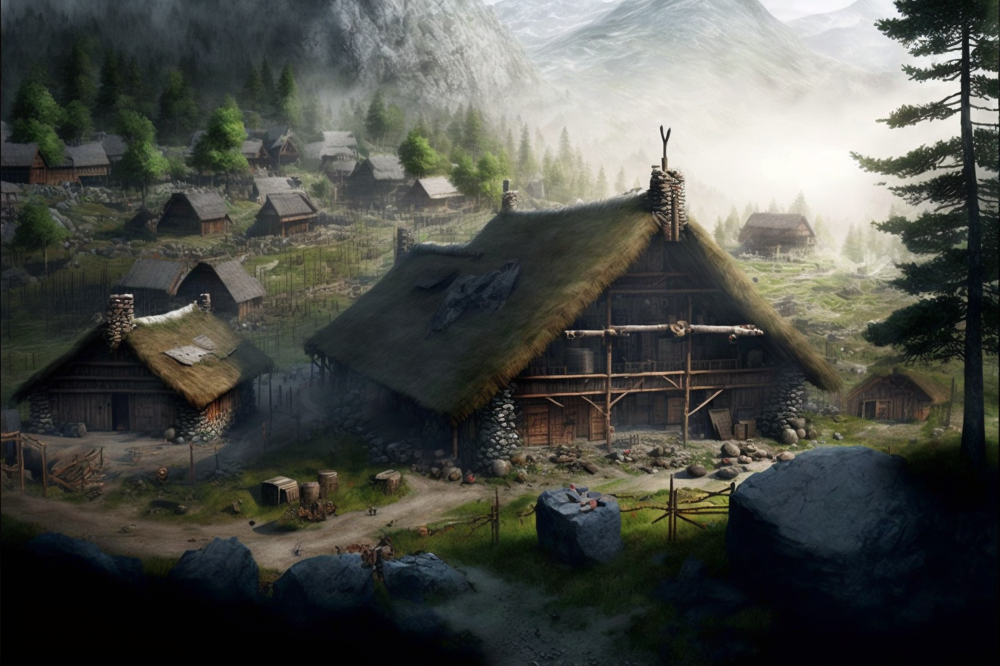
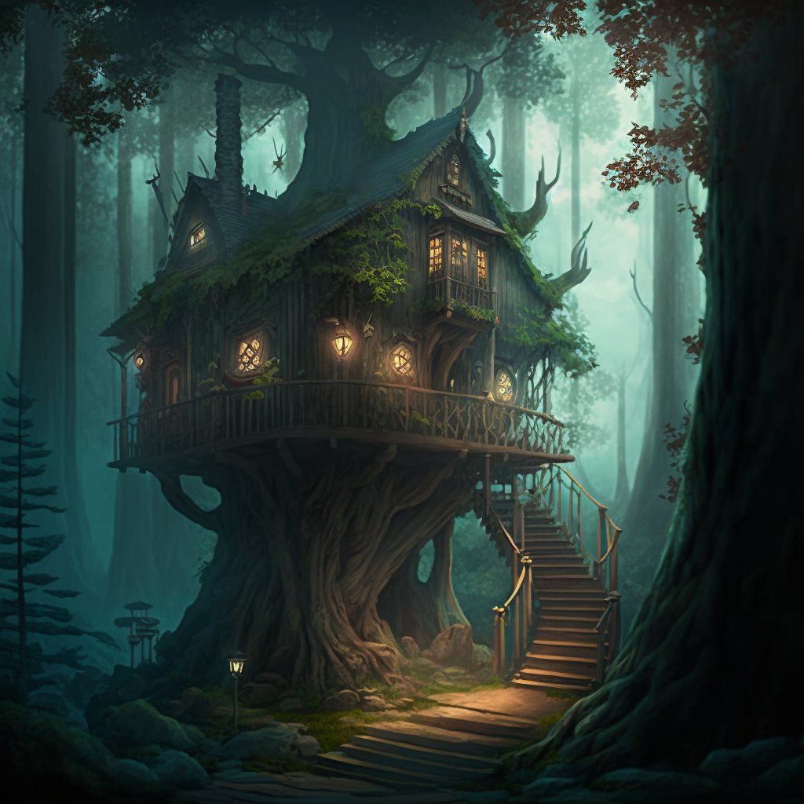

## Timeline

- Oct 14, 1748 DR - Oct 21, 1748 DR: Rest, gather information, celebrate, and commune with the [Meswati](<../../../cosmology/gods/tanshi/meswati/meswati.md>) at the Ko'zula village.
- Oct 21, 1748 DR - Oct 23, 1748 DR:Wander into the mountains, looking for [Safri](<../../../people/deno-qai/safri.md>). Find a likely place to camp in the afternoon of Oct 23.
- Oct 24, 1748 DR:Wait at camp.
- Oct 25, 1748 DR:Meet [Safri](<../../../people/deno-qai/safri.md>), in deer form. Descend to [Safri](<../../../people/deno-qai/safri.md>)'s valley, and speak with her. 
- Oct 26, 1748 DR:Teleport via trees to the slopes of [Sentinel Range](<../../../gazetteer/sentinel-range/sentinel-range.md>)
- Oct 26, 1748 DR - Oct 28, 1748 DR: Ride out of the mountains, past the growing storm around [Stormcaller Tower](<../../../gazetteer/greater-dunmar/dunmari-basin/stormcaller-tower.md>). 
- Oct 29, 1748 DR: Ride south, reaching settled lands
- Oct 30, 1748 DR - Nov 03, 1748 DR: Gather rumors around [Karawa](<../../../gazetteer/greater-dunmar/realms/dunmar/eastern-dunmar/karawa.md>)
- Nov 04, 1748 DR: Turn east for the fey portal
- Nov 04, 1748 DR - Nov 11, 1748 DR: Ride east, find the fey portal
- Nov 11, 1748 DR - Nov 15, 1748 DR: Wait in camp
- Nov 14, 1748 DR: [Riswynn](<../../../people/pcs/dunmar-fellowship/riswynn.md>) arrives
- Nov 15, 1748 DR: The [Dunmar Fellowship](<../../../people/pcs/dunmar-fellowship/dunmar-fellowship.md>) is reuinted
## Narrative

#### With the Deno'qai

After returning from the [Forest of Nightmares](<../../../gazetteer/far-north/forest-of-nightmares.md>), [Delwath](<../../../people/pcs/dunmar-fellowship/delwath.md>) spends some time with the Ko'zula, and in communion with the Meswati, learning about the lost tanshi who have now been found, about the history of this place and these people, about the stories that tie them to the tanshi, before leaving to seek out a way to reunite with his companions. 

During this time, [Delwath](<../../../people/pcs/dunmar-fellowship/delwath.md>) also spends hours scrying: [Scrying Delwath Oct 21](<../scrying-and-spying/scrying-delwath-oct-21.md>).

The most promising tales [Delwath](<../../../people/pcs/dunmar-fellowship/delwath.md>) hears are of [Safri](<../../../people/deno-qai/safri.md>), a woman who appears in the woods, sometimes taking the form of an old woman but often in animal form, who knows the magic of the mountains and the alpine forests, and is powerful. Although [Delwath](<../../../people/pcs/dunmar-fellowship/delwath.md>) also hears tales of elven cities hidden in the south, where he may be able to find a guide to lead him through the [Feywild](<../../../cosmology/multiverse/echo-realms/feywild/feywild.md>) in the ancient elven way, he decides to head into the mountains in search of [Safri](<../../../people/deno-qai/safri.md>). 
#### Meeting Safri

After a several day journey into the mountains and a few days waiting in camp (during which time [Delwath](<../../../people/pcs/dunmar-fellowship/delwath.md>) scrys some more: [Scrying Delwath Oct 26](<../scrying-and-spying/scrying-delwath-oct-26.md>)), [Safri](<../../../people/deno-qai/safri.md>) appears in the form of a deer, and leads [Delwath](<../../../people/pcs/dunmar-fellowship/delwath.md>) to her forest valley home.

Here, [Delwath](<../../../people/pcs/dunmar-fellowship/delwath.md>) and [Safri](<../../../people/deno-qai/safri.md>) talk. He hears tales of the Meswati, and asks of [Drankor](<../../../history/drankorian-era/drankorian-empire.md>) and artifacts of power. While she knows little of [Drankor](<../../../history/drankorian-era/drankorian-empire.md>), she does talk about artifacts and how to destroy them. Nothing that was made cannot be unmade, she says, though the stronger the magic, the more the physical form resists destruction. She talks of volcanos where the [Elemental Plane of Fire](<../../../cosmology/multiverse/energy-realms/elemental-realms/elemental-plane-of-fire/elemental-plane-of-fire.md>) touches the material world, or intense storms from the Plane of Air where lightning strikes which extraplanar power, as places where even the most powerful artifacts can be destroyed. 

She also mentions [the story](<../../../people/other-humans/radomir.md#safris-tale>) of [Radomir](<../../../people/other-humans/radomir.md>), a foreigner she met also asking after how to destroy artifacts. 

In the morning, she opens a portal in a tree, connecting it to another one far away, on the slopes of the [Sentinel Range](<../../../gazetteer/sentinel-range/sentinel-range.md>), and [Delwath](<../../../people/pcs/dunmar-fellowship/delwath.md>) steps through. 
#### Dunmar Rumors

Over the next week or so, [Delwath](<../../../people/pcs/dunmar-fellowship/delwath.md>) rides across the planes of [Dunmar](<../../../gazetteer/greater-dunmar/realms/dunmar/dunmar.md>), hiding his true identity. He hears lots of stories.

Some are about [Delwath](<../../../people/pcs/dunmar-fellowship/delwath.md>), another [Elves](<../../../species/children-of-the-embodied-gods/elves/elves.md>) in these lands who saved both [Karawa](<../../../gazetteer/greater-dunmar/realms/dunmar/eastern-dunmar/karawa.md>) and [Tokra](<../../../gazetteer/greater-dunmar/realms/dunmar/central-dunmar/tokra/tokra.md>) (it does not seem to be public knowledge that you freed [Sura](<../../../people/dunmari/sura.md>), for [Delwath](<../../../people/pcs/dunmar-fellowship/delwath.md>) is neither blamed or praised for this action in the rumors you hear).

Many other are about [Sura](<../../../people/dunmari/sura.md>). Her camp is to the west, on the Parhaz river, a tributary of the [Hara](<../../../gazetteer/greater-dunmar/rivers/hara-watershed/hara.md>) that joins north of [Tokra](<../../../gazetteer/greater-dunmar/realms/dunmar/central-dunmar/tokra/tokra.md>) (probably only a few days journey from where you met [Saka](<../../../people/dunmari/saka.md>), and maybe a 4-5 day march to [Tokra](<../../../gazetteer/greater-dunmar/realms/dunmar/central-dunmar/tokra/tokra.md>)). 

But most of the stories are about [Havdar](<../../../people/dunmari/havdar.md>): how his sword (the sword you gave him, from [Agata's lair](<../../../gazetteer/greater-dunmar/dunmari-basin/agata-s-lair.md>)) was cursed by the Chardonians working in league with [Nayan Karnas](<../../../people/dunmari/nayan-karnas.md>), and how it turned on him, turning him to stone during a battle in the north, against an emaciated, nearly undead band of gnolls. The battle was nearly lost, but his troops rallied and [Aagir](<../../../cosmology/gods/incorporeal-gods/dunmari-pantheon/aagir.md>) blessed the strikes of [Aram](<../../../people/dunmari/aram.md>) and turned the tide of battle. [Havdar](<../../../people/dunmari/havdar.md>)'s stone body was taken back to camp, and the story goes that the Lakan monks snuck out at night and cured him, showing [Laka](<../../../cosmology/gods/incorporeal-gods/dunmari-pantheon/laka.md>)'s favor to [Sura](<../../../people/dunmari/sura.md>)'s cause (but done secretly for fear of the might of the [Chardon](<../../../gazetteer/west-coast/chardonian-empire/chardon/chardon.md>) mages, allied with Karnas). In the past weeks, since his cure, [Havdar](<../../../people/dunmari/havdar.md>) has been everywhere, seemingly, recruiting for [Sura](<../../../people/dunmari/sura.md>)'s armies -- both people and horses, usually willingly given (but you hear whispers - sometimes not so willingly taken). These are popular stories - people speak of him with awe, with wonder, sometimes with a tinge of fear. It is rumored that since his cure he has refused let the sword out of his sight (for fear of evil magic, it is said), and some people say he has turned the curse to his advantage, petrifying his enemies with a blow from his blade.

By Nov 4, [Delwath](<../../../people/pcs/dunmar-fellowship/delwath.md>) is feeling anxious to reunite with his friends, and also hears from [Riswynn](<../../../people/pcs/dunmar-fellowship/riswynn.md>) that she is on her way from [Tokra](<../../../gazetteer/greater-dunmar/realms/dunmar/central-dunmar/tokra/tokra.md>) with news and letters. Turning east, he arrives at the fey crossing on Nov 11, and scries ([Scrying Delwath Nov 15](<../scrying-and-spying/scrying-delwath-nov-15.md>)) until Nov 15th, when the party is reunited.