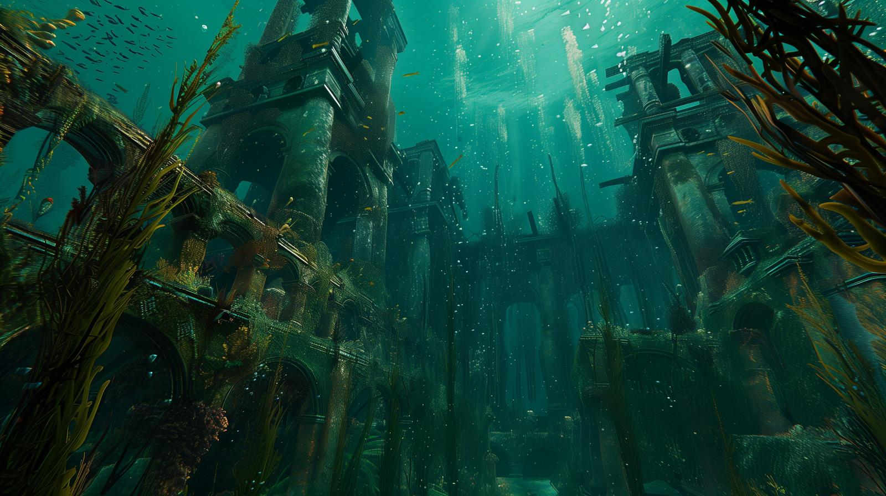
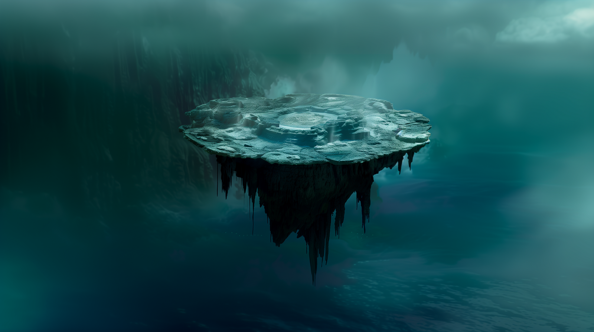

# Dunmari Frontier - Session 101

>[!info] Into the Plane of Water: in which the party battles merfolk and finds halfling prisoners
> *Featuring: [Seeker](<../../../people/pcs/dunmar-fellowship/seeker.md>), [Delwath](<../../../people/pcs/dunmar-fellowship/delwath.md>), [Kenzo](<../../../people/pcs/dunmar-fellowship/kenzo.md>), [Wellby](<../../../people/pcs/dunmar-fellowship/wellby.md>), [Riswynn](<../../../people/pcs/dunmar-fellowship/riswynn.md>)*
> *In Taelgar: May 11, 1749 DR*
> *On Earth: Tuesday Jun 18, 2024*
> *[Elemental Plane of Water](<../../../cosmology/multiverse/energy-realms/elemental-realms/elemental-plane-of-water.md>)*

The Dunmar Fellowship defeats the Herald of Gazankoa, battles merfolk, and discovers captive halflings in the Elemental Plane of Water.

***19 days until Apollyon's escape***
## Session Info
### Summary
- The Dunmar Fellowship prepares and then defeats the Herald of Gazankoa, gaining entry into the Elemental Plane of Water.
- The party battles merfolk guards on a coral platform, securing the area and gathering intelligence.
- Seeker uses clairvoyance to spy on merfolk huts, while Delwath and Kenzo gather information from the guards and surroundings.
- The party interrogates a surviving merfolk guard, learning about captive halflings and their forced labor sorting artifacts.
- Following a bioluminescent trail, the Fellowship discovers a coral tower and bubble structure where Milo Thistlefoot and other halflings are held.

### Timeline
- May 11, 1749 DR, noon: Defeat the Herald of Gazankoa guarding the portal. Enter the [Plane of Water](<../../../cosmology/multiverse/energy-realms/elemental-realms/elemental-plane-of-water.md>). Defeat the [Merfolk](<../../../species/unusual-species/merfolk.md>) guards on the far side. Find signs of [Milo Thistlefoot](<../../../people/halflings/milo-thistlefoot.md>) and Tilly Brineheart and their halfling crew. 
- May 11, 1749 DR, afternoon: Rest briefly on the portal platform. Follow a bioluminescent trail. Find a strange coral and rock complex encased in a bubble-like membrane. Enter; find [Milo Thistlefoot](<../../../people/halflings/milo-thistlefoot.md>) and his crew.

## Narrative
We begin as the party prepares to battle the herald of Gazankoa, guarding the portal to the [Elemental Plane of Water](<../../../cosmology/multiverse/energy-realms/elemental-realms/elemental-plane-of-water.md>). [Delwath](<../../../people/pcs/dunmar-fellowship/delwath.md>), [Kenzo](<../../../people/pcs/dunmar-fellowship/kenzo.md>), and [Wellby](<../../../people/pcs/dunmar-fellowship/wellby.md>) are positioned outside the portal hall, invisible, while [Riswynn](<../../../people/pcs/dunmar-fellowship/riswynn.md>) and [Seeker](<../../../people/pcs/dunmar-fellowship/seeker.md>) use Dimension Door to appear just before combat begins. [Wellby](<../../../people/pcs/dunmar-fellowship/wellby.md>), invisible, gets the jump on the creature and knocks its massive trident from its hands with a well-placed arrow, and, using his boots of speed, grabs the trident and swims away. [Delwath](<../../../people/pcs/dunmar-fellowship/delwath.md>) uses sickening radiance, covering the portal. The creature then attacks, grappling [Wellby](<../../../people/pcs/dunmar-fellowship/wellby.md>) with its tentacles in retaliation for taking its trident. Wellby is freed, however, by [Seeker](<../../../people/pcs/dunmar-fellowship/seeker.md>)'s magic: his telekinesis spell pulls the creature away, and into the sickening radiance aura. [Kenzo](<../../../people/pcs/dunmar-fellowship/kenzo.md>) attacks with a flurry of blows, stunning the creature. Despite some of the kelp animating and attacking, and a blast of water from the portal that pins [Kenzo](<../../../people/pcs/dunmar-fellowship/kenzo.md>) agains the wall, the combination of [Delwath](<../../../people/pcs/dunmar-fellowship/delwath.md>)'s attacks, [Riswynn](<../../../people/pcs/dunmar-fellowship/riswynn.md>)'s Sunbeam, and [Seeker](<../../../people/pcs/dunmar-fellowship/seeker.md>)'s Telekinesis finished off the creature. 

With the creature defeated and [Riswynn](<../../../people/pcs/dunmar-fellowship/riswynn.md>) healing the party with her divine magic, the party enters the portal, after [Delwath](<../../../people/pcs/dunmar-fellowship/delwath.md>) turns everybody but [Riswynn](<../../../people/pcs/dunmar-fellowship/riswynn.md>) invisible. Entering the [Plane of Water](<../../../cosmology/multiverse/energy-realms/elemental-realms/elemental-plane-of-water.md>), the party sees a coral platform suspended in an infinite expanse of water, lit by bioluminescent light, and surrounded by various structures including a series of huts hanging off one side of the platform, a small guard tower, a structure that looks like a docking station for large creatures, and manta ray pens. [Riswynn](<../../../people/pcs/dunmar-fellowship/riswynn.md>), visible, triggers a frantic melee, as the merfolk guards move in several directions: some flee to try to get on manta ray mounts, some race to wake their companions from the other guard shift, and some engage [Riswynn](<../../../people/pcs/dunmar-fellowship/riswynn.md>) in battle. The guards, however, are outmatched by the [Dunmar Fellowship](<../../../people/pcs/dunmar-fellowship/dunmar-fellowship.md>), who defeat them before any are able to escape or wake their companions. 

With the guards defeated, the party quickly gets undercover to figure out their next steps. [Seeker](<../../../people/pcs/dunmar-fellowship/seeker.md>), using clairvoyance, spies on one of the huts, finding four sleeping merfolk and some gear. [Delwath](<../../../people/pcs/dunmar-fellowship/delwath.md>), using detect magic, searched the guards. finding a broken wooden pipe and other treasures potentially connected to [Milo Thistlefoot](<../../../people/halflings/milo-thistlefoot.md>) and the [Stormdancer](<../../../things/ships/stormdancer.md>); [Kenzo](<../../../people/pcs/dunmar-fellowship/kenzo.md>) spoke with the seaweed, who talked about danger from small feet, and a nasty one who controlled water, but was stopped by friends. [Riswynn](<../../../people/pcs/dunmar-fellowship/riswynn.md>) examined the silver rapier taken from the captain of the merfolk guards, realizing it may have been [Milo Thistlefoot](<../../../people/halflings/milo-thistlefoot.md>)'s weapon. [Wellby](<../../../people/pcs/dunmar-fellowship/wellby.md>) investigated the manta ray pen, learning they were elementals, but docile and tame, apparently used as mounts and beasts of burden by the merfolk; Wellby was able to ride one with only a little effort. 

Before departing, the party deals with the off-duty guards, asleep in their huts, killing all but one, and questioning the survivor. From him, they learned the basic situation regarding the captive halflings, who were being put to work sorting artifacts from the city of Omi. After leaving the survivor tied up in a hut, the party searched further and took a brief rest. During the rest, [Delwath](<../../../people/pcs/dunmar-fellowship/delwath.md>) scried on [Milo Thistlefoot](<../../../people/halflings/milo-thistlefoot.md>), observing him transformed into a shark-headed halfling with tentacle arms, working with similar creatures at an archaeological sorting station, cruelly supervised by [Merfolk](<../../../species/unusual-species/merfolk.md>) guards. 

 After some debate between going straight for the [Jade Piece of Rai's Hand](<../treasure/jade-piece-of-rai-s-hand.md>), or going to rescue the halflings first, the party eventually decided to rescue the halflings first. Following the bioluminescent trail, the party travels through the pitch blackness of the [Elemental Plane of Water](<../../../cosmology/multiverse/energy-realms/elemental-realms/elemental-plane-of-water.md>), guided only by the glowing markers and the manta rays' faint silver light. An hour later, [Wellby](<../../../people/pcs/dunmar-fellowship/wellby.md>) spotted a large coral tower in the distance, attached to a floating, translucent bubble of some semi-opaque membrane; two merfolk guards watched from the tower, but did not appear to be paying much attention to their surroundings. 

[Seeker](<../../../people/pcs/dunmar-fellowship/seeker.md>) was able to create a temporary hole in the bubble using dispel magic, and the party quickly entered. Inside, the water was inky black, and difficult to move through, filled with debris. Using shape water to clear the way, the party moved slowly, dodging sharp coral, until they reached the underside of a platform of some kind. [Wellby](<../../../people/pcs/dunmar-fellowship/wellby.md>) scouted above, seeing clear water, halfling prisoners, and merfolk guards. Telepathically contacting a halfling, he learned that the halflings had been searching for pictograms, part of a larger scheme to undercover the history of the Sentient Ocean. The session ends as the party planned to rescue the halflings and learn more next session. 
