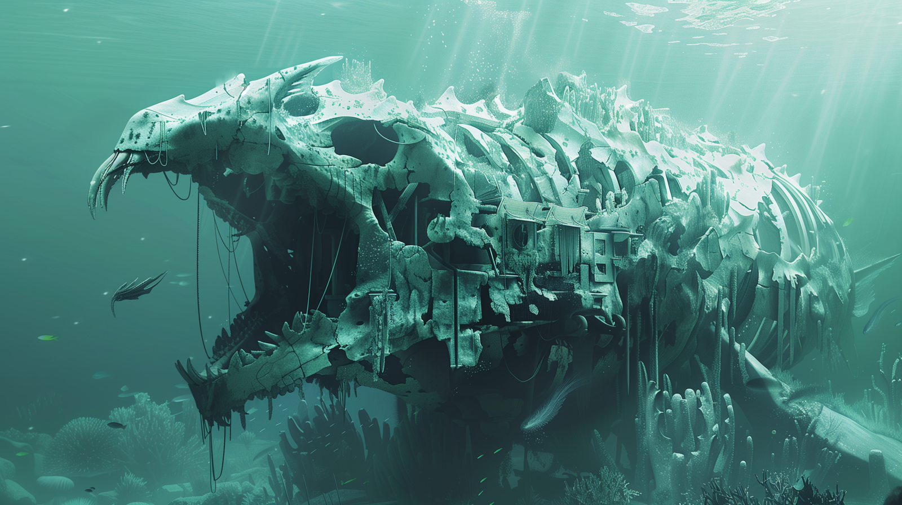

# Dunmari Frontier - Session 102

>[!info] The Fourth Jade: in which the party rescues halflings and battles Buruli
> *Featuring: [Seeker](<../../../people/pcs/dunmar-fellowship/seeker.md>), [Delwath](<../../../people/pcs/dunmar-fellowship/delwath.md>), [Kenzo](<../../../people/pcs/dunmar-fellowship/kenzo.md>), [Wellby](<../../../people/pcs/dunmar-fellowship/wellby.md>), [Riswynn](<../../../people/pcs/dunmar-fellowship/riswynn.md>)*
> *In Taelgar: May 11, 1749 DR*
> *On Earth: Sunday Jun 30, 2024*
> *Elemental Plane of Water*

The Dunmar Fellowship rescues halflings from captivity, battles the merfolk Buruli, and escapes with a valuable jade piece via a rainbow bridge to Vindristjarna.

***19 days until Apollyon's escape***
## Session Info
### Summary
- The Dunmar Fellowship rescues Milo Thistlefoot, Tilly Brineheart, and other halflings from a prison complex.
- The party navigates the Elemental Plane of Water, encountering various sea creatures.
- They locate and infiltrate Buruli's temple to Gazankoa, built within a leviathan skeleton.
- A fierce battle ensues; the party dispels darkness, retrieves the jade piece, and fights off tentacles.
- Kenzo escapes with the jade, aided by Seeker's inspiration, as the party uses a rainbow bridge to flee to Vindristjarna, where Buruli is ultimately defeated.

### Timeline
- May 11, 1749 DR, evening: Rescue [Milo Thistlefoot](<../../../people/halflings/milo-thistlefoot.md>), Tilly Brineheart, and other halflings. Travel to Buruli's temple to Gazankoa. 
- May 12, 1749 DR, morning: Arrive at the temple to Gazankoa. Attack Buruli, recover [Jade Piece of Rai's Hand](<../treasure/jade-piece-of-rai-s-hand.md>), flee to [Vindristjarna](<../../../things/ships/vindristjarna.md>). 

## Narrative
We begin in a prison complex, where the [Dunmar Fellowship](<../../../people/pcs/dunmar-fellowship/dunmar-fellowship.md>) came to rescue [Milo Thistlefoot](<../../../people/halflings/milo-thistlefoot.md>), Tilly Brineheart, and the crew of the [Stormdancer](<../../../things/ships/stormdancer.md>). The halflings here have forced to work sorting artifacts from the excavations under the merfolk city of Omi, which are being reassembled by a [Merfolk](<../../../species/unusual-species/merfolk.md>) scholar. With his ghostly gaze, Delwath was able to see this merfolk, sorting pictographs and mosaics. These pictographs depicted alien whirlpools and strange forms, possibly names of places or beings, likely indicating something about the origins of the Sentient Ocean. Milo suggested the party wait half an hour until the work shift is over, and rescue the prisoners once they are escorted back to their cells. In the mean time, he recounts [his story](<../tales-and-stories/milo-s-story.md>). 

After the guards lock the halflings in their cells, the party approached. Wellby picked the locks, and Seeker used dispel magic to transform Tilly back into a halfling, giving her one of their two potions from [Kazuro](<../../../people/other-nonhumans/kazuro.md>). Tilly thanked the party and inquired about their identities and goals; Wellby explained they were there to rescue the halflings and mentioned potential combat on the way out. With the halflings freed, Seeker again used dispel magic to open a portal in the barrier, and the party with their new halfling allies escaped into the darkness of the [Elemental Plane of Water](<../../../cosmology/multiverse/energy-realms/elemental-realms/elemental-plane-of-water.md>). 

As the party regrouped, Tilly mentioned the crew's attempt to escape, thwarted by a tentacled creature -- presumably the herald of Gazankoa the party had killed. With the rest of halflings -- except Milo and Tilly -- still in shark form, the party departed for the jade, after informing the halflings they had a small task they had to accomplish before leaving the [Elemental Plane of Water](<../../../cosmology/multiverse/energy-realms/elemental-realms/elemental-plane-of-water.md>). 

The party, with Tilly, Milo, and their crew of halfling sharks in tow, set off through the dark ocean waters. As they traveled further from the prison complex, they started to see signs of life, such as  glowing phosphorescent fish and a massive, shadowy creature swimming below them unaware of their presence, 200-300 feet long, with many fins and a gigantic tail. 

After six hours of travel, Kenzo sensed the jade was closer, within 10 miles or so, and soon after Tilly sensed the presence of a structure -- a small complex -- ahead. Scouting with clairvoyance, Seeker saw the [Jade Piece of Rai's Hand](<../treasure/jade-piece-of-rai-s-hand.md>) within a whirlpool, mounted on a vibrating shell, surrounded by a large chamber resembling a rib cage and merfolk guards. Using Riswynn's summoned celestial ally (who shapeshifted into an octopus) as a distraction, the party dashed towards the entrance the temple of Gazankoa, constructed inside a massive floating leviathan skeleton. 

The battle was quickly joined, with the party fighting to retrieve the jade from its whirlpool in the center of Buruli's audience chamber. Milo and Wellby engaged the merfolk guards, and Delwath summoned a sickening radiance, but Buruli plunged the battle into maddening darkness, momentarily throwing the party into chaos. Seeker attempted to dispel the spell, momentarily failing until the mote of fate gifted by [Tharandros](<../../../people/other-nonhumans/tharandros.md>) changed the outcome. With the darkness dispelled, and Tilly stilling the whirlpool with her magic, Kenzo dashed through the boiling water around the jade, and grabbed the jade embedded in the conch shell. Trying to escape, Kenzo experienced a momentary illusion of being surrounded by enemies but was reassured by Seeker's runes of inspiration, shaking off the effect. 

Buruli, however, was not done, and summoned swarming tentacles that grappled and restrained Kenzo, preventing him from fleeing with the jade. As the rest of the party engaged with the merfolk, Wellby attempted to free Kenzo. Noticing that the tentacles ignored the merfolk wearing amulets of Gazankoa, he managed to grab an amulet from one of the merfolk warriors, with the aid of Seeker's inspiration, and toss it to Kenzo. 

As Kenzo moved to flee, Buruli teleported next to him, speaking words of death to drain Kenzo's life force. As Seeker activated the rainbow bridge to [Vindristjarna](<../../../things/ships/vindristjarna.md>), Kenzo retreated, fleeing over the bridge. The rest of the party quickly moved to escape, while Tilly summoned a draconic spirit to guard the bridge. Buruli charged across the bridge, emerging on a prepared [Vindristjarna](<../../../things/ships/vindristjarna.md>) above the deserts of [Xurkhaz](<../../../gazetteer/istaros-watershed/xurkhaz/xurkhaz.md>), and was quickly killed by [Faldrak](<../../../people/dwarves/faldrak-bronzehammer.md>) on the icicle turret and [Delwath](<../../../people/pcs/dunmar-fellowship/delwath.md>) with his sword. 

As the session ends, the party rescued the suffocating halflings with water breathing and dispel magic, while Kenzo smashed the conch, revealing the [Jade Piece of Rai's Hand](<../treasure/jade-piece-of-rai-s-hand.md>) and a metal object humming with the residual energy of the [Elemental Plane of Water](<../../../cosmology/multiverse/energy-realms/elemental-realms/elemental-plane-of-water.md>). The jade, as it fuses with the other three pieces, reveals a vision of the final piece of jade, in a jungle cave. 
