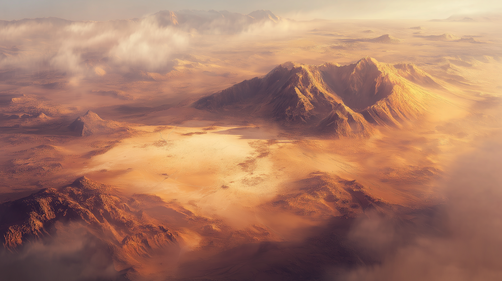
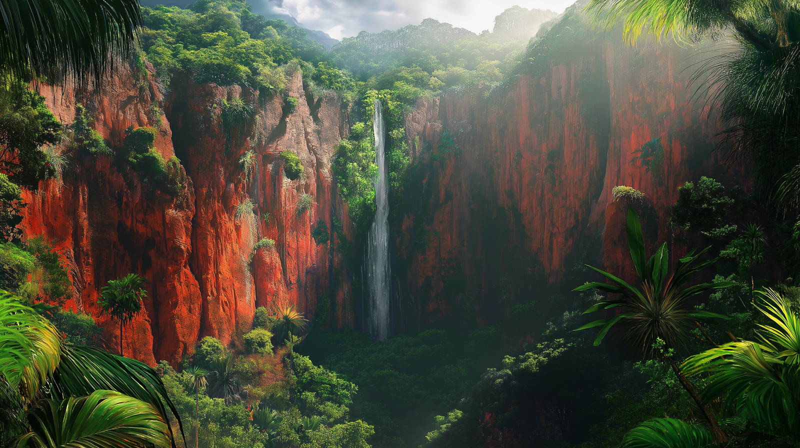

# Dunmari Frontier - Session 104

>[!info] The Tower of the Colossus: in which the party defeats a giant construct
> *Featuring: [Seeker](<../../../people/pcs/dunmar-fellowship/seeker.md>), [Delwath](<../../../people/pcs/dunmar-fellowship/delwath.md>), [Kenzo](<../../../people/pcs/dunmar-fellowship/kenzo.md>), [Wellby](<../../../people/pcs/dunmar-fellowship/wellby.md>)*
> *In Taelgar: May 14, 1749 DR to May 16, 1749 DR*
> *On Earth: Thursday Aug 08, 2024*
> *Tower of the Colossus*

The party investigates and defeats a colossal construct in the Tower of the Colossus, retrieves hidden treasures, and returns to Vindristjarna to continue their quest.
## Session Info
### Summary
- Kenzo's simulacrum defeats pirate Wellby and heads to Darba.
- The party flies over a desert and spots a white marble tower, deciding to investigate.
- Inside the tower, they find and defeat a colossal construct, discovering buried floors and hidden treasures.
- Further exploration reveals a stone golem, which they defeat, and retrieve valuable scrolls and books.
- The party teleports back to Vindristjarna, now flying over southern jungles, and plans to explore red cliffs for the Jade Piece of Rai's Hand.
### Timeline
- May 14, 1749 DR, late afternoon: [Delwath](<../../../people/pcs/dunmar-fellowship/delwath.md>)'s scry spell reveals the victory of Kenzo's simulacrum over pirate Wellby. The simulacrum starts the journey to [Darba](<../../../gazetteer/greater-dunmar/realms/dunmar/coastal-dunmar/darba/darba.md>) to provide information to [Abha](<../../../people/dunmari/abha.md>) and others.
- May 14, 1749 DR, evening: [Vindristjarna](<../../../things/ships/vindristjarna.md>) flies over the [Garamjala Plateau](<../../../gazetteer/drankorian-hinterland/garamjala-plateau/garamjala-plateau.md>), into the night
- May 15, 1749 DR, morning: The party spots a white marble tower in the desert, and departs to investigate.
- May 15, 1749 DR, late morning: The party enters the Tower of the Colossus, and defeats the partially intact giant colossus trapped there. Further exploration reveals buried floors and a hidden treasure room.
- May 15, 1749 DR, evening: The party rests in the Tower of the Colossus.
- May 16, 1749 DR, morning: The party enters the hidden archive, defeats a stone golem, reads some fragile scrolls, and teleports away with [treasure](<../hoards/tower-of-the-colossus-treasure.md>), returning to [Vindristjarna](<../../../things/ships/vindristjarna.md>) as it is now flying over the southern jungles south of the [Garamjala Plateau](<../../../gazetteer/drankorian-hinterland/garamjala-plateau/garamjala-plateau.md>).
- May 16, 1749 DR, afternoon: [Vindristjarna](<../../../things/ships/vindristjarna.md>) arrives at the cliff face and caves where the last [Jade Piece of Rai's Hand](<../treasure/jade-piece-of-rai-s-hand.md>) seemed to be only days ago.

## Narrative
We begin the session under the relentless desert sun, as the party stands in tense anticipation of news from Kenzo's simulacrum, sent to battle the pirate Wellby doppleganger. [Delwath](<../../../people/pcs/dunmar-fellowship/delwath.md>) casts scry at a predetermined time, revealing the Kenzo simulacrum aboard a pirate ship, surrounded by six pirates, and facing Wellby. An arrow from Wellby is deftly deflected by the clone, but he is quickly surrounded. As the skirmish ensues, the Kenzo simulacrum's agile maneuvers allow him to knock Wellby into the ocean with his fist of planar power. Pursuing Wellby into the water, after drinking his potion of transformation, Kenzo's clone forces the pirate Wellby underwater until he vanishes, and heads for [Darba](<../../../gazetteer/greater-dunmar/realms/dunmar/coastal-dunmar/darba/darba.md>) to continue his mission. The party continues their flight over a vast desert. In the evening, they pass over a shimmering, shallow lake swarms with something moving around the edges, appearing like a swarm of ants at this height. 

That night, the evening of May 15th, [Kenzo](<../../../people/pcs/dunmar-fellowship/kenzo.md>) dreams vividly of the jade they seek, which cracks, turns into mist, and is carried into an ocean storm. Upon waking, [Kenzo](<../../../people/pcs/dunmar-fellowship/kenzo.md>) realizes he can no longer sense the jade. Soon after sunrise, as they traverse the changing desert landscape, the party observes rocky cliffs and a partially buried white marble tower, and decide to investigate.

Using clairvoyance, [Seeker](<../../../people/pcs/dunmar-fellowship/seeker.md>) investigates the Tower of the Colossus, seeing a room on the top floor, with six shattered windows, a cracked roof, sand, and various debris, as well as a loud rhythmic thumping coming from below. They party informs Faldrick to keep the ship flying south for 24 hours, and come investigate if they are not back in that time. 

Descending towards the mostly buried tower under the oppressive desert heat, the party enters the top floor of the tower. Some investigation reveals that the thumping is coming from a massive construct, a powerful being seemingly trapped in the tower on the floor below. [Seeker](<../../../people/pcs/dunmar-fellowship/seeker.md>) recalls an old Dunmari legend that spoke of the White Fang and its shaking walls, a white tower with a pounding sound, perhaps linked to this construct. Attempting telepathic communication, Wellby's efforts result only in the construct moving more regularly.

Venturing further, Wellby sees a damaged face with a flickering light in one eye. [Delwath](<../../../people/pcs/dunmar-fellowship/delwath.md>)’s Detect Thoughts spell finds no cognitive activity from the construct. As the construct rises, revealing Drakorian runes on its forehead, the party debates what to do, when suddenly a beam of powerful light shoots from the one remaining eye of the Colossus, striking [Wellby](<../../../people/pcs/dunmar-fellowship/wellby.md>). 

Debating strategies and the possibility of retreat, the party decides instead to use Sickening Radiance to weaken the construct. [Delwath](<../../../people/pcs/dunmar-fellowship/delwath.md>) casts Sanctuary on himself for protection before attempting Sickening Radiance. The construct's attacks cause severe damage, but Delwath successfully casts the spell and retreats. The construct continues to pound the staircase harder, but after multiple rounds of Sickening Radiance, it falls. Confirming the creature's death, the party feels a mix of relief and remorse. They prepare to investigate the sand-filled levels of the tower further.

In order to explore what is beneath the mountains of sand on the lower floors, Seeker decides to polymorph into a giant badger to burrow through the sand. He discovers another floor and an interior wall with a door, but he can’t open it in badger form, instead turning back into a dwarf and casting Dimension Door.

Inside a dusty, abandoned room with fragile scrolls and locked chests, [Seeker](<../../../people/pcs/dunmar-fellowship/seeker.md>) encounters a waking stone creature. His attempt to trap it with Wall of Stone fails, and the creature slows him, but he is able to escape. After some discussion, and realizing that something in the magical walls of the tower prevents extraplanar portals from working, the party gives up on attempting to trap the creature in the [Mirror of Soul Trapping](<../treasure/mirror-of-soul-trapping.md>), and instead plan to teleport back to the room with the stone golem, defeat it, and then rest until [Seeker](<../../../people/pcs/dunmar-fellowship/seeker.md>) can teleport them all back to [Vindristjarna](<../../../things/ships/vindristjarna.md>). 

This is easily done, as a single stone golem is no match for the combined might of the party. The next morning, after a rest, the party carefully explores, and retrieves the [treasure](<../hoards/tower-of-the-colossus-treasure.md>) in two large stone chests, although not before setting off a trap that removes the air from the room, forcing the party to work quickly before they run out of breath. Carefully retrieving scrolls and books, the party returns to [Vindristjarna](<../../../things/ships/vindristjarna.md>) with another successful teleport spell from [Seeker](<../../../people/pcs/dunmar-fellowship/seeker.md>).

 

As they arrive back on [Vindristjarna](<../../../things/ships/vindristjarna.md>), the ship has reached the jungles of the coast, with the [Sea of Storms](<../../../gazetteer/drankorian-hinterland/sea-of-storms.md>) visible not far on the southern horizon. The party decides to first investigate the red cliffs where the [Jade Piece of Rai's Hand](<../treasure/jade-piece-of-rai-s-hand.md>) once could be sensed, before turning south for the storms. 
