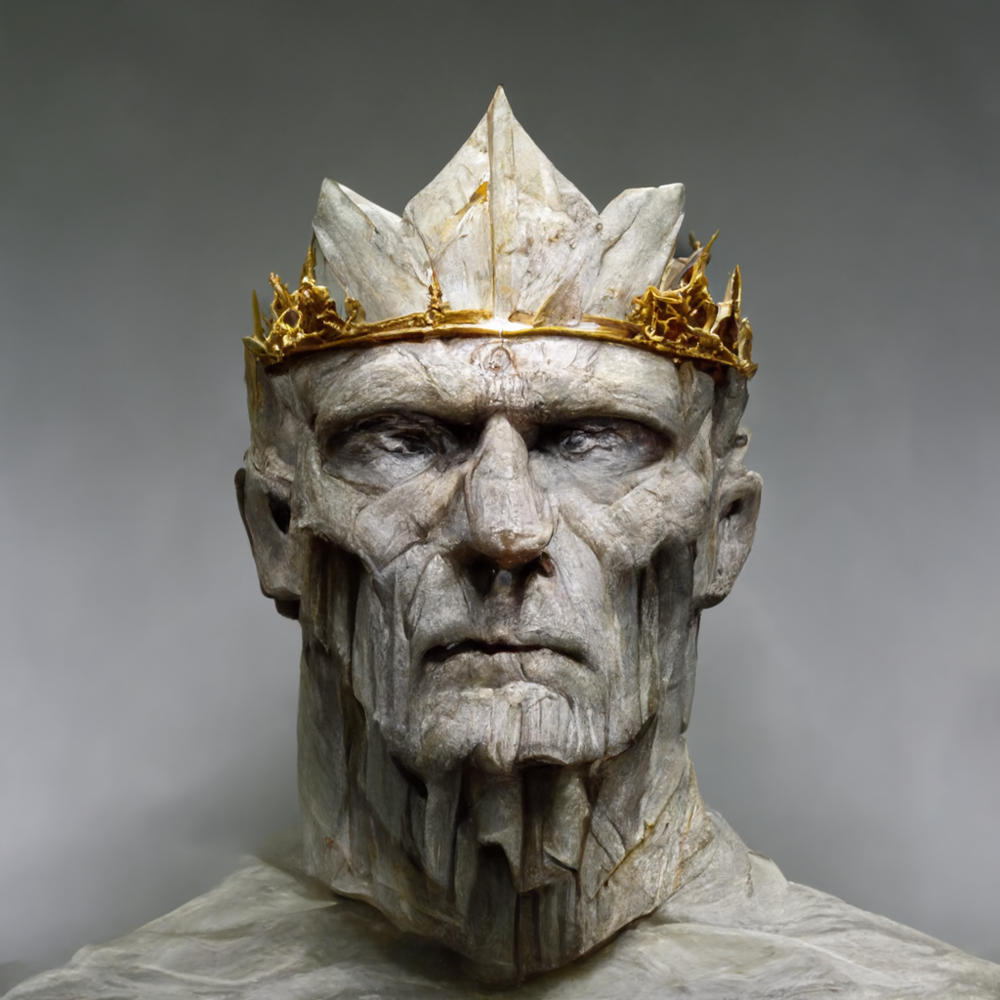

**(Saturday, Dec 26th, 2020; in Taelgar, evening April 15th)

Huddled by the side of a prominence of blue granite jutting out of the plains of [Dunmar](<../../../gazetteer/greater-dunmar/realms/dunmar/dunmar.md>), surrounded by a small calm spot in the howling storm, [Kenzo](<../../../people/pcs/dunmar-fellowship/kenzo.md>), [Delwath](<../../../people/pcs/dunmar-fellowship/delwath.md>), [Riswynn](<../../../people/pcs/dunmar-fellowship/riswynn.md>), [Seeker](<../../../people/pcs/dunmar-fellowship/seeker.md>), and [Wellby](<../../../people/pcs/dunmar-fellowship/wellby.md>) contemplate the stars. Specifically, the fact that one of the most prominent constellations in the sky, the [Fox and Hunter](<../../../cosmology/gods/demigods/fox-and-hunter.md>), is missing, although the rest of the sky does not look much different from what you would expect.

After some puzzled conversation about the nature of time and the stars, [Seeker](<../../../people/pcs/dunmar-fellowship/seeker.md>) recalls that he has read several studies of Dwarven scholars that, in other planes, and in particular the mirror realms, the echo realms that reflect and are like and yet unlike the world of Taelgar, time often runs differently. But whether this is such a place is not clear. 

Turning to the small camp, the party decides that the dead person buried under the sign of the [The Sibyl](<../../../cosmology/gods/incorporeal-gods/mos-numena/the-sibyl.md>), the goddess of knowledge and magic, among other things, part of the Eightfold Way religion of Chardon and other places, would not mind being dug up under the circumstances. Despite sparks of lightning collecting on [Wellby](<../../../people/pcs/dunmar-fellowship/wellby.md>) during the excavation, [Seeker](<../../../people/pcs/dunmar-fellowship/seeker.md>) proceeds to move the earth and expose the body. This is a [human male](<../../../people/chardonians/alban.md>) in early stages of decomposition, buried in a shroud but without much else. It is hard to infer much from this body, but the general impression of [Kenzo](<../../../people/pcs/dunmar-fellowship/kenzo.md>) at least is this is relatively modern style Chardonian clothing. So, with some uncertainty, the party concludes this is probably not someone from hundreds of years ago.

Meanwhile, [Wellby](<../../../people/pcs/dunmar-fellowship/wellby.md>) has been trying to speak with the [tower](<../../../gazetteer/greater-dunmar/dunmari-basin/stormcaller-tower.md>), without much success, beyond a few scattered images: the tower, a large storm moving towards it, a man standing in robes on the platform, a flash of light, and blinding pain.

Deciding to climb the tower to the platform, [Kenzo](<../../../people/pcs/dunmar-fellowship/kenzo.md>) starts up with a rope, nearly falling before being stabilized by the guiding runes of [Seeker](<../../../people/pcs/dunmar-fellowship/seeker.md>) directing his grasp. On the platform, he drops down a rope and the remainder of the party climbs up. On the platform jutting out from [Stormcaller Tower](<../../../gazetteer/greater-dunmar/dunmari-basin/stormcaller-tower.md>) is a pool of water, covering perhaps the most distant third of the platform, in a marble basin, and cascading over the edge of the platform into nothingness. Set on a marble pillar in the middle of the pool is a iron globe, made of bands of iron running in circles and crossing each other, almost like an armillary sphere. In the other direction, there is a wide archway leading into the white marble tower at the far end of the platform.

Caught in blowing gusts of wind, the party begins to explore. Trying to examine the globe more closely draws an attack from some kind of water creature that seems to be protecting the pool, appearing out of the basin and lunging, a water snake of sorts. By a combination of [Riswynn](<../../../people/pcs/dunmar-fellowship/riswynn.md>)’s ability to shape water, [Delwath](<../../../people/pcs/dunmar-fellowship/delwath.md>)’s mage hand, and some careful maneuvering, the party is able to learn a few things about the globe, with [Delwath](<../../../people/pcs/dunmar-fellowship/delwath.md>) being struck once by the water snake but avoiding being pulled underwater by using his oil of slipperness beforehand. The globe has Drankorian writing on it, some kind of fragment of an incantation of binding and control, very powerful, and is magical, with a complex enchantment containing hints of conjuration, enchantment, and illusion magic. 

Deciding to avoid trying to fight the water snake for now, as lightning crackles along the walls of the tower, and still unsure who or what [Wellby](<../../../people/pcs/dunmar-fellowship/wellby.md>) has been telepathically communicating with, the party ventures into [Stormcaller Tower](<../../../gazetteer/greater-dunmar/dunmari-basin/stormcaller-tower.md>). The room they enter is a large, white marble room, taking up nearly half the space in this floor, decorated only with five white marble pillars topped by empty silver sockets. Stairs to either side lead up and down. Through an archway into another room, there is a eight foot tall bust of a [giant](<../../../people/giants/hralgar.md>), just the shoulders and head, carved in stone. The features are somewhat indistinct, with a flat nose, no hair, a long stretched out face, and elaborately decorated in gold and silver. Where the eyes should be are instead empty sockets, looking like something was removed; similarly, there is a five-pointed stone crown on its head, each point topped with a silver setting, empty. 

{width="400"}
As the crackle of lightning increases, the party decides to head up the stairs, climbing through mist and fog, until they emerge, exiting the tower, onto the side of a rocky, barren mountain. Clouds obscure the land below, but ahead an enormous hall, many times human-sized, stands on the flattened top of the mountain. Large, booming footfalls are coming towards the party from within.

Everyone except [Wellby](<../../../people/pcs/dunmar-fellowship/wellby.md>) hides as a giant emerges from the hall. Maybe 25 feet tall, dark gray skin, purple-ish hair tied in a topknot behind his head, dressed in fine silk robes, his appearance only marred by the fact that he is missing both his eyes. He stops on the enormous steps to sit in the sun when [Wellby](<../../../people/pcs/dunmar-fellowship/wellby.md>) calls out to him. The giant in turn asks if he is here for omens and stories, and offers information in trade. In the ensuing conversation is becomes apparent that the giant, who’s name is [Hralgar](<../../../people/giants/hralgar.md>), perceives [Wellby](<../../../people/pcs/dunmar-fellowship/wellby.md>)’s tales of [Raven's Hold](<../../../gazetteer/greater-dunmar/dunmari-basin/raven-s-hold.md>) and its history to be in the future, not the past. During the conversation, [Hralgar](<../../../people/giants/hralgar.md>) informs them it is the year 5031 by the true reckoning of time, which would be towards the end of the [Drankorian Empire](<../../../history/drankorian-era/drankorian-empire.md>) if this matches Dwarven reckoning of time. 

[Hralgar](<../../../people/giants/hralgar.md>) offers [Wellby](<../../../people/pcs/dunmar-fellowship/wellby.md>) a story in exchange for his tale, and [Wellby](<../../../people/pcs/dunmar-fellowship/wellby.md>) eventually begins describing [Stormcaller Tower](<../../../gazetteer/greater-dunmar/dunmari-basin/stormcaller-tower.md>) and asks [Hralgar](<../../../people/giants/hralgar.md>) for information about the storm and the tower. [Hralgar](<../../../people/giants/hralgar.md>) is distrubed, describing the tower as a place he knows, a place he passed by as a storm once, the place where a wizard lives or lived, a wizard named Eudomes, a Drankorian. [Stormcaller Tower](<../../../gazetteer/greater-dunmar/dunmari-basin/stormcaller-tower.md>) itself is far older, Elvish in construction, but long abandoned until the Drankorians re-inhabited it. [Hralgar](<../../../people/giants/hralgar.md>) would occasionally speak and trade with Eudomes, passing across the plains as a great storm. Eudomes once told him he had a great omen to trade; [Hralgar](<../../../people/giants/hralgar.md>) traveled as the wind across the plains, watching the cities below. But he cannot remember more, and seems puzzled and confused by the fact that he cannot see, and cannot find his eyes, and does not believe there is a stairway to the tower from here. 

As [Hralgar](<../../../people/giants/hralgar.md>) becomes increasing agitated and confused, it slowly dawns on the party that they may not have ever left the tower. As they discuss freeing [Hralgar](<../../../people/giants/hralgar.md>), and ask him how he would leave, he gets down on his knees, feeling for the supposed stairs, a chain starts to appear around his wrist, his arm pulled and slammed into the floor behind him, as the mountain fades. 

On the top floor of the tower the giant [Hralgar](<../../../people/giants/hralgar.md>) is chained to the floor, in an enormous room that takes up the entire space of the floor. The ceiling, perhaps once a beautiful glass, is shattered and open to the night sky above. [Hralgar](<../../../people/giants/hralgar.md>), in pain but seemingly clear-headed, recounts the events leading up to his capture: the wizard Eudomes and others like him falling out with the Emperor of [Drankor](<../../../history/drankorian-era/drankor.md>), but had received omens of a great plague and the fall of [Drankor](<../../../history/drankorian-era/drankor.md>). Whether wanting to stop it, or profit from it, or just use the power of [Hralgar](<../../../people/giants/hralgar.md>) to protect themselves, they lured him to [Stormcaller Tower](<../../../gazetteer/greater-dunmar/dunmari-basin/stormcaller-tower.md>) and bound him with ancient, powerful magics. 

[Hralgar](<../../../people/giants/hralgar.md>) himself only became conscious a month ago, and says he could free himself if only he could see. The party hypothesizes that perhaps Society of the Open Scroll treasure hunters came here, took the gems from the statue, and awakened [Hralgar](<../../../people/giants/hralgar.md>), which then set off the storm. Deciding to at least explore the rest of the tower, perhaps learn more about Eudomes, [Hralgar](<../../../people/giants/hralgar.md>), the events at the end of the [Drankorian Empire](<../../../history/drankorian-era/drankorian-empire.md>), and how to free this giant, the party prepares to head out, while [Hralgar](<../../../people/giants/hralgar.md>) warns them to hurry, as he is not sure how long he can keep his mind clear.
