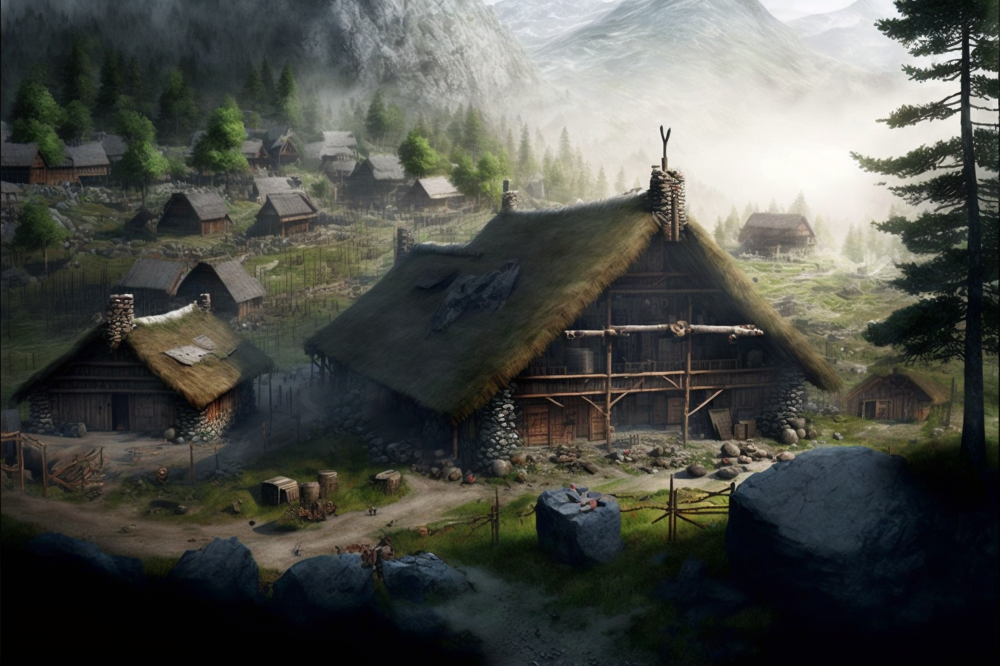
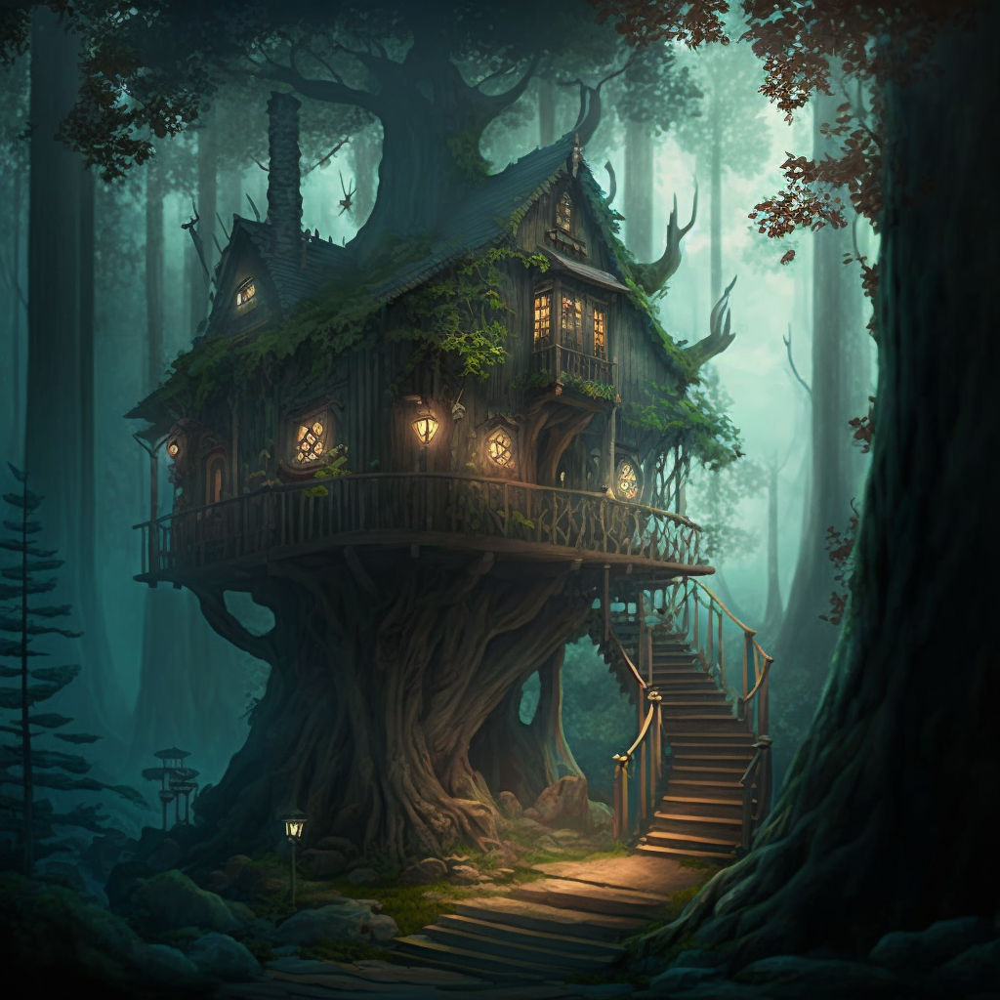

## Timeline
**Sept 30**: Arrive in northern forests, meet hunting party of Deno'qai of the [Ko'zula](<../../../groups/deno-qai/northern-tribes/ko-zula.md>) tribe, spend the night in their camp. 
**Oct 1**: Leave camp, travel with a guide named [Zevi](<../../../people/deno-qai/zevi-of-the-ko-zula.md>) back to the main village of the [Ko'zula](<../../../groups/deno-qai/northern-tribes/ko-zula.md>)
**Oct 2**: Travel through the forest with [Zevi](<../../../people/deno-qai/zevi-of-the-ko-zula.md>), arrive in village, meet the village leader [Ninu](<../../../people/deno-qai/ninu.md>), learn story of the Meswati, the silent tanshi
**Oct 3**: Spend the day in the village
**Oct 4**: Spend the day in the village
**Oct 5**: Leave for hunting camp near the [Forest of Nightmares](<../../../gazetteer/far-north/forest-of-nightmares.md>), travel 
**Oct 6**: Arrive at the hunting camp, meet [Aristaea](<../../../people/pcs/dunmar-fellowship/guests/aristaea.md>) Mountainhands and [Iascaire](<../../../people/pcs/dunmar-fellowship/guests/iascaire.md>)
**Oct 7**: Set up from camp with [Aristaea](<../../../people/pcs/dunmar-fellowship/guests/aristaea.md>) and [Iascaire](<../../../people/pcs/dunmar-fellowship/guests/iascaire.md>) for the [Forest of Nightmares](<../../../gazetteer/far-north/forest-of-nightmares.md>). Arrive at the battlefield of the Battle without Hope. Fight haunted spirits, uncover the location of a shadow armband, destroy it, freeing [Yalik'i](<../../../cosmology/gods/tanshi/yalik-i.md>) and [Nisir](<../../../cosmology/gods/tanshi/nisir.md>). Depart late afternoon, walk through the night.
**Oct 8**: Arrive at the site of the Battle of Darkfire in the mid-morning. Remove the armband from the dead body of a massive demon while fighting demonic beasts and trees. Destroy armband, freeing [Yezali](<../../../cosmology/gods/tanshi/yezali.md>). Head back to safety of [Ko'zula](<../../../groups/deno-qai/northern-tribes/ko-zula.md>) land to rest.
**Oct 9**: Arrive in [Ko'zula](<../../../groups/deno-qai/northern-tribes/ko-zula.md>) land in the afternoon, rest until morning.
**Oct 10**: Walk all day and night back into the [Forest of Nightmares](<../../../gazetteer/far-north/forest-of-nightmares.md>), towards the site of the Battle of Endless Dark
**Oct 11**: Arrive at the site of the Battle of Endless Dark around midday. Meet the ghost of a betrayed giant, slain by Deno'qai, learn that the tanshi and a hobgoblin army are trapped through a portal to a shadow realm. Kill Hobgoblins guarding the portal on the shadow side. Rest, and return to banish the tanshi [Taraka](<../../../cosmology/gods/tanshi/taraka.md>) from the shadow realm back to their home plane. Flee, closing the portal with the Hobgoblins trapped inside. Rest briefly, then leave for the site of the Battle of the [Yemo'te](<../../../gazetteer/far-north/yemo-te.md>). 
**Oct 12**: Arrive at the battlefield on the banks of the [Yemo'te](<../../../gazetteer/far-north/yemo-te.md>). Fight cursed undead hobgoblin wizard and skeletal minions. Destroy armband, freeing the tanshi [Midri](<../../../cosmology/gods/tanshi/midri.md>) and [K'onisati](<../../../cosmology/gods/tanshi/k-onisati.md>)
**Oct 13**: Travel back to [Ko'zula](<../../../groups/deno-qai/northern-tribes/ko-zula.md>) village. Rest in the woods on the way.
**Oct 14**: Arrive back at the [Ko'zula](<../../../groups/deno-qai/northern-tribes/ko-zula.md>) village; celebrate. Part ways with [Iascaire](<../../../people/pcs/dunmar-fellowship/guests/iascaire.md>) and [Aristaea](<../../../people/pcs/dunmar-fellowship/guests/aristaea.md>). 
**Oct 15 - Oct 21**: Rest, gather information, celebrate, and commune with the Meswati at the [Ko'zula](<../../../groups/deno-qai/northern-tribes/ko-zula.md>) village.
**Oct 21 - Oct 23**: Wander into the mountains, looking for [Safri](<../../../people/deno-qai/safri.md>). Find a likely place to camp in the afternoon of Oct 23.
**Oct 24**: Wait at camp.
**Oct 25**: Meet [Safri](<../../../people/deno-qai/safri.md>), in deer form. Descend to [Safri](<../../../people/deno-qai/safri.md>)'s valley, and speak with her. 
**Oct 26**: Teleport via trees to the slopes of [Sentinel Range](<../../../gazetteer/sentinel-range/sentinel-range.md>)
**Oct 26 - Oct 28**: Ride out of the mountains, past the growing storm around [Stormcaller Tower](<../../../gazetteer/greater-dunmar/dunmari-basin/stormcaller-tower.md>). 
**Oct 29**: Ride south, reaching settled lands
**Oct 30 - Nov 3**: gather rumors around [Karawa](<../../../gazetteer/greater-dunmar/realms/dunmar/eastern-dunmar/karawa.md>)
**Nov 4**: Turn east for the fey portal
**Nov 4 - Nov 11**: Ride east, find the fey portal
**Nov 11 - Nov 15**: Wait in camp
**Nov 14**: [Riswynn](<../../../people/pcs/dunmar-fellowship/riswynn.md>) arrives
**Nov 15**: Party is reunited

## Session Notes

### Prequel

We begin as [Delwath](<../../../people/pcs/dunmar-fellowship/delwath.md>) arrives in the vast northern forests, in the late afternoon, the only sign of civilization a campfire in the distance. Approaching the campfire, [Delwath](<../../../people/pcs/dunmar-fellowship/delwath.md>) sees a hunting camp of maybe a dozen Deno'qai, surprised and awed to see an [Elves](<../../../species/children-of-the-embodied-gods/elves/elves.md>) speaking their tongue. The leader of the hunting band introduces himself as [Kaslan](<../../../people/deno-qai/kaslan.md>), and he speaks with [Delwath](<../../../people/pcs/dunmar-fellowship/delwath.md>) briefly about the lost tanshi, the Meswati, when [Delwath](<../../../people/pcs/dunmar-fellowship/delwath.md>) says he is here to find them. 

[Kaslan](<../../../people/deno-qai/kaslan.md>) insists [Delwath](<../../../people/pcs/dunmar-fellowship/delwath.md>) come to the [Ko'zula](<../../../groups/deno-qai/northern-tribes/ko-zula.md>) village and speak with [Ninu](<../../../people/deno-qai/ninu.md>), the chief. Spending the night in camp, [Delwath](<../../../people/pcs/dunmar-fellowship/delwath.md>) hears something of how the [Ko'zula surived the Great War](<../../../groups/deno-qai/northern-tribes/ko-zula.md#history>). A young boy, [Zevi](<../../../people/deno-qai/zevi-of-the-ko-zula.md>), is assigned to guide him the next morning, and they arrive a few days later. 

In the village, [Delwath](<../../../people/pcs/dunmar-fellowship/delwath.md>) is welcomed with a feast, and meets [Ninu](<../../../people/deno-qai/ninu.md>). From her, he learns stories of the Meswati. To begin her tale, she brings out two fragments of broken armbands, melted and split, which [Delwath](<../../../people/pcs/dunmar-fellowship/delwath.md>) recognizes immediately, for one is identical to the armband he touched before being teleported to the shadow realm. It has been in the village for many years, and no one thought anything of it. Last year, a deathless warlock wearing the second armband emerged from the [Forest of Nightmares](<../../../gazetteer/far-north/forest-of-nightmares.md>) and attacked the village. A warrior from the village, [Jotha](<../../../people/deno-qai/jotha.md>) was gravely wounded near death, and grasped the deathless creature to hold it to the ground for her companions to butcher, but as she touched the armband she vanished. [Iascaire](<../../../people/pcs/dunmar-fellowship/guests/iascaire.md>), a druid skilled in the manipulation of fire, destroyed both, hoping it would do something, but nothing happened. 

This was the exact moment that [Delwath](<../../../people/pcs/dunmar-fellowship/delwath.md>) fell from the sky outside [Kharsan](<../../../gazetteer/greater-dunmar/dunmari-basin/kharsan.md>).

As [Delwath](<../../../people/pcs/dunmar-fellowship/delwath.md>) mentions this, [Ninu](<../../../people/deno-qai/ninu.md>) tells [Delwath](<../../../people/pcs/dunmar-fellowship/delwath.md>) that the Deno'qai have long though the Meswati were trapped, somehow, by the evil magic of [Cha'mutte](<../../../people/extraplanar-powers/cha-mutte.md>), for most believe that cannot truly be killed as long as they are not forgotten. [Delwath](<../../../people/pcs/dunmar-fellowship/delwath.md>) suggests that it is likely these armbands that have trapped the Meswati, for one, [Yezali](<../../../cosmology/gods/tanshi/yezali.md>), was trapped with him. Destroying the armbands that captured each tanshi, then, may be the key to freeing them. 

Asking where the other armbands may be found, [Ninu](<../../../people/deno-qai/ninu.md>) tells [Delwath](<../../../people/pcs/dunmar-fellowship/delwath.md>) that a stoneborn, [Aristaea](<../../../people/pcs/dunmar-fellowship/guests/aristaea.md>), knows the [Forest of Nightmares](<../../../gazetteer/far-north/forest-of-nightmares.md>) well, and is at a hunting camp with [Iascaire](<../../../people/pcs/dunmar-fellowship/guests/iascaire.md>), the druid. [Ninu](<../../../people/deno-qai/ninu.md>) suggests they would help [Delwath](<../../../people/pcs/dunmar-fellowship/delwath.md>) with his quest. 

Deciding to head to the hunting camp, [Delwath](<../../../people/pcs/dunmar-fellowship/delwath.md>) first meets with [Enon](<../../../people/deno-qai/enon.md>), the Godcaller of the [Ko'zula](<../../../groups/deno-qai/northern-tribes/ko-zula.md>), who gifts him a [shield](<../treasure/treasure-from-solo-adventures/deno-qai-lynx-shield.md>) and [armor](<../treasure/treasure-from-solo-adventures/deno-qai-scale-mail.md>) carried by [Balati](<../../../people/historical-figures/balati.md>), a Deno'qai hero of the [Great War](<../../../events/1500s/great-war.md>), to aid him on his quest. 

### Part 1

We begin in the hunting camp, where [Delwath](<../../../people/pcs/dunmar-fellowship/delwath.md>) meets [Aristaea](<../../../people/pcs/dunmar-fellowship/guests/aristaea.md>) and [Iascaire](<../../../people/pcs/dunmar-fellowship/guests/iascaire.md>), and they discuss the battlefields of the [Forest of Nightmares](<../../../gazetteer/far-north/forest-of-nightmares.md>): the Battle of Darkfire, where [Yezali](<../../../cosmology/gods/tanshi/yezali.md>) fell; the Battle of Ye'mote, where [Midri](<../../../cosmology/gods/tanshi/midri.md>) and [K'onisati](<../../../cosmology/gods/tanshi/k-onisati.md>) fell; the Battle of Endless Dark, where [Taraka](<../../../cosmology/gods/tanshi/taraka.md>) fell; and the Battle without Hope, where [Yalik'i](<../../../cosmology/gods/tanshi/yalik-i.md>) and [Nisir](<../../../cosmology/gods/tanshi/nisir.md>) fell. 

After looking at some maps and discussing routes, the group decides to head for the Battle without Hope first. Traveling through the [Forest of Nightmares](<../../../gazetteer/far-north/forest-of-nightmares.md>) is eerie, for there is almost no sound, no animals, just the occasional creak of the trees in the wind and the whisper of ghosts in the distance, the occasional hint out of the corner of your eye that something is moving in the distance. 

The battlefield on which the Battle without Hope was fought is now a deserted, abandoned Deno'qai village, a small collection of huts in a clearing in the woods. But there are odd signs of a simlacrum of life: clothes still on a line, rotting away but neatly hung, a fire pit where bones have been piled but there is no fuel or meat to cook. 

In the village, the party encounters flashbacks of the past, of the battle that happened here. [Aristaea](<../../../people/pcs/dunmar-fellowship/guests/aristaea.md>) sees the central green filled with warriors prepared for battle, when hundreds and hundreds of Hobgoblins accompanied by flying demons emerge from shadow portals and attack. An air of malaise hangs over the village and infects the warriors, for they don't attack, just stand waiting to be slaughtered. The only one who reacts is the priest, who shapeshifts into a giant bird to battle the hobgoblin commander, who is wearing one of [Cha'mutte's Shadow Armbands](<../treasure/treasure-from-solo-adventures/cha-muttes-shadow-armband.md>). 

The vision fades as the rest of the party fights a shadow creature with long spikes for arms. As the shadow creature is killed, and the party continues to explore, another vision, this time experienced by [Delwath](<../../../people/pcs/dunmar-fellowship/delwath.md>). The battle continuing, the tanshi bolstering the Godcaller, fighting across the village square with the hobgoblin commander. 

This continues, exploring the village and fighting with nightmare visions of the past, while the occasional creature of sorrow and despair attacks, and eventually the party pieces together the scene of battle, that the Godcaller fought the commander to a standstill, but the hobgoblin wizard spoke a word and struck him dead. As the Godcaller falls, two spirits -- tanshi -- attack the wizard, striking him down, but vanishing as they struggle to remove the armband from the hobgoblin's dead body. Identifying the location where the wizard fell, the party digs up his dead body after killing more of the sorrow creatures, and destroys the armband with [Iascaire](<../../../people/pcs/dunmar-fellowship/guests/iascaire.md>)'s fire magic, freeing [Yalik'i](<../../../cosmology/gods/tanshi/yalik-i.md>) and[Nisir](<../../../cosmology/gods/tanshi/nisir.md>)

After a short rest, the party then heads to the Battle of Darkfire. Approaching the battlefield, the party sees the vast body of a dead demon lying a clearing, [Cha'mutte’s Shadow Armband](<../treasure/treasure-from-solo-adventures/cha-muttes-shadow-armband.md>) around his wrist. Beginning to approach, the trees and beasts of the forest, flush with demonic energy, attack. The trees are vulnerable to [Iascaire](<../../../people/pcs/dunmar-fellowship/guests/iascaire.md>)'s fire, and [Delwath](<../../../people/pcs/dunmar-fellowship/delwath.md>) uses the magic of [Narengril](<../treasure/treasure-from-the-elderwood/narengril.md>) to create a magic circle impenetrable by demons. Still, the battle is difficult, as the armband cannot be harmed by fire while on the demon's wrist. Eventually, [Delwath](<../../../people/pcs/dunmar-fellowship/delwath.md>)'s shadow beast severs the armband from the demon's wrist, and [Iascaire](<../../../people/pcs/dunmar-fellowship/guests/iascaire.md>) is able to destroy the armband with fire before the party is overwhelmed, freeing [Yezali](<../../../cosmology/gods/tanshi/yezali.md>). 

We end the session as the party retreats to rest in the safety of the [Ko'zula](<../../../groups/deno-qai/northern-tribes/ko-zula.md>) forests. 

### Part 2

We begin as the party returns to the [Forest of Nightmares](<../../../gazetteer/far-north/forest-of-nightmares.md>), heading for the Battle of Endless Dark. Approaching the battlefield, the party finds a maze of trees and thickets, completely in magical darkness. At the center of the maze, the party finds a skeleton of a giant, a portal to a shadow realm, and the ghost of the giant. He calls himself [Zegron](<../../../people/historical-figures/zegron.md>), and he is hoping the party is here to punish those who fled, cowardly, from their duty in battle. Apparently this giant was in [Cha'mutte](<../../../people/extraplanar-powers/cha-mutte.md>)'s army, and is angry with the Hobgoblins still hiding in the shadow realm, who would not fight. 

The party agrees to go into the shadow realm to fight the Hobgoblins, hoping perhaps to free [Taraka](<../../../cosmology/gods/tanshi/taraka.md>) as well. Emerging into a flat, featureless plain of shadow, the party sees a small group of Hobgoblins who seem to be watching the portal, and in the distance, a much larger army that seems to be constantly chasing campfires that blink in and out in the darkness. The party struggles to defeat the organized hobgoblin attack, led by a wizard, low on spells but still dangerous, flying above the battlefield. Nonetheless eventually the Hobgoblins are killed. The wizard commander is missing an arm, and with it the [Cha'mutte’s Shadow Armband](<../treasure/treasure-from-solo-adventures/cha-muttes-shadow-armband.md>) he carried, presuambly. 

Exiting the portal, the party speaks with [Zegron](<../../../people/historical-figures/zegron.md>), who thanks them for dealing with the traitors, and indicates where to dig to find the wizard's arm as he vanishes. Digging up the arm, the party is faced with a dilemma. Destroying the armband would free [Taraka](<../../../cosmology/gods/tanshi/taraka.md>), but also the large hobgoblin army trapped with them. Eventually, they devise a plan to send in [Delwath](<../../../people/pcs/dunmar-fellowship/delwath.md>) to attempt to banish both [Taraka](<../../../cosmology/gods/tanshi/taraka.md>) and himself back to the material plane, leaving the Hobgoblins trapped, and then close the portal here by attuning to the armband. Amazingly, the plan works, and both [Taraka](<../../../cosmology/gods/tanshi/taraka.md>) and [Delwath](<../../../people/pcs/dunmar-fellowship/delwath.md>) make it back.

After a brief rest, the group then heads for the final battlefield, the Battle of Ye'mote. The battlefield is on the banks of the [Yemo'te](<../../../gazetteer/far-north/yemo-te.md>) river. A broken bridge crosses the river, and forest is littered with signs of an ancient battlefield: small mounds where the plants have grown over dead bodies, bits of rusting armor and weapons sticking from the ground, white filaments of fungus wrapping many of the bodies in cocoons. 

Across the river the party can see the rotted body of a hobgoblin warlock, with a shadow armband. As they move to approach, hoards of undead attack. The relentless swarms of undead fall easily in battle, but they seem to be endless, until [Aristaea](<../../../people/pcs/dunmar-fellowship/guests/aristaea.md>) strikes the warlock down with a critical strike of divine energy. As the undead fall away, [Iascaire](<../../../people/pcs/dunmar-fellowship/guests/iascaire.md>) destroys the last armband, freeing [Midri](<../../../cosmology/gods/tanshi/midri.md>) and [K'onisati](<../../../cosmology/gods/tanshi/k-onisati.md>). 

We end as the party returns to the [Ko'zula](<../../../groups/deno-qai/northern-tribes/ko-zula.md>) village to celebrate, and [Delwath](<../../../people/pcs/dunmar-fellowship/delwath.md>) bids farewell to [Iascaire](<../../../people/pcs/dunmar-fellowship/guests/iascaire.md>) and [Aristaea](<../../../people/pcs/dunmar-fellowship/guests/aristaea.md>). 

### Postscript

#### Traveling

After returning from the [Forest of Nightmares](<../../../gazetteer/far-north/forest-of-nightmares.md>), [Delwath](<../../../people/pcs/dunmar-fellowship/delwath.md>) spends some time with the [Ko'zula](<../../../groups/deno-qai/northern-tribes/ko-zula.md>), and in communion with the Meswati, learning about the lost tanshi who have now been found, about the history of this place and these people, about the stories that tie them to the tanshi, before leaving to seek out a way to reunite with his companions. 

{width="500"}

During this time, [Delwath](<../../../people/pcs/dunmar-fellowship/delwath.md>) also spends hours scrying: [Scrying Delwath Oct 21](<../scrying-and-spying/scrying-delwath-oct-21.md>).

The most promising tales [Delwath](<../../../people/pcs/dunmar-fellowship/delwath.md>) hears are of [Safri](<../../../people/deno-qai/safri.md>), a woman who appears in the woods, sometimes taking the form of an old woman but often in animal form, who knows the magic of the mountains and the alpine forests, and is powerful. Although [Delwath](<../../../people/pcs/dunmar-fellowship/delwath.md>) also hears tales of elven cities hidden in the south, where he may be able to find a guide to lead him through the [Feywild](<../../../cosmology/multiverse/echo-realms/feywild/feywild.md>) in the ancient elven way, he decides to head into the mountains in search of [Safri](<../../../people/deno-qai/safri.md>). 

After a several day journey into the mountains and a few days waiting in camp (during which time [Delwath](<../../../people/pcs/dunmar-fellowship/delwath.md>) scrys some more: [Scrying Delwath Oct 26](<../scrying-and-spying/scrying-delwath-oct-26.md>)), [Safri](<../../../people/deno-qai/safri.md>) appears in the form of a deer, and leads [Delwath](<../../../people/pcs/dunmar-fellowship/delwath.md>) to her forest valley home.

{width="600"}

Here, [Delwath](<../../../people/pcs/dunmar-fellowship/delwath.md>) and [Safri](<../../../people/deno-qai/safri.md>) talk. He hears tales of the Meswati, and asks of [Drankor](<../../../history/drankorian-era/drankorian-empire.md>) and artifacts of power. While she knows little of [Drankor](<../../../history/drankorian-era/drankorian-empire.md>), she does talk about artifacts and how to destroy them. Nothing that was made cannot be unmade, she says, though the stronger the magic, the more the physical form resists destruction. She talks of volcanos where the [Elemental Plane of Fire](<../../../cosmology/multiverse/energy-realms/elemental-realms/elemental-plane-of-fire.md>) touches the material world, or intense storms from the Plane of Air where lightning strikes which extraplanar power, as places where even the most powerful artifacts can be destroyed. 

She also mentions [the story](<../../../people/other-humans/radomir.md#safris-tale>) of [Radomir](<../../../people/other-humans/radomir.md>), a foreigner she met also asking after how to destroy artifacts. 

In the morning, she opens a portal in a tree, connecting it to another one far away, on the slopes of the [Sentinel Range](<../../../gazetteer/sentinel-range/sentinel-range.md>), and [Delwath](<../../../people/pcs/dunmar-fellowship/delwath.md>) steps through. 

#### Dunmar Rumors

Over the next week or so, [Delwath](<../../../people/pcs/dunmar-fellowship/delwath.md>) rides across the planes of [Dunmar](<../../../gazetteer/greater-dunmar/realms/dunmar/dunmar.md>), hiding his true identity. He hears lots of stories.

Some are about [Delwath](<../../../people/pcs/dunmar-fellowship/delwath.md>), another [Elves](<../../../species/children-of-the-embodied-gods/elves/elves.md>) in these lands who saved both [Karawa](<../../../gazetteer/greater-dunmar/realms/dunmar/eastern-dunmar/karawa.md>) and [Tokra](<../../../gazetteer/greater-dunmar/realms/dunmar/central-dunmar/tokra/tokra.md>) (it does not seem to be public knowledge that you freed [Sura](<../../../people/dunmari/sura.md>), for [Delwath](<../../../people/pcs/dunmar-fellowship/delwath.md>) is neither blamed or praised for this action in the rumors you hear).

Many other are about [Sura](<../../../people/dunmari/sura.md>). Her camp is to the west, on the Parhaz river, a tributary of the [Hara](<../../../gazetteer/greater-dunmar/rivers/hara-watershed/hara.md>) that joins north of [Tokra](<../../../gazetteer/greater-dunmar/realms/dunmar/central-dunmar/tokra/tokra.md>) (probably only a few days journey from where you met [Saka](<../../../people/dunmari/saka.md>), and maybe a 4-5 day march to [Tokra](<../../../gazetteer/greater-dunmar/realms/dunmar/central-dunmar/tokra/tokra.md>)). 

But most of the stories are about [Havdar](<../../../people/dunmari/havdar.md>): how his sword (the sword you gave him, from [Agata's lair](<../../../gazetteer/greater-dunmar/dunmari-basin/agata-s-lair.md>)) was cursed by the Chardonians working in league with [Nayan Karnas](<../../../people/dunmari/nayan-karnas.md>), and how it turned on him, turning him to stone during a battle in the north, against an emaciated, nearly undead band of gnolls. The battle was nearly lost, but his troops rallied and [Aagir](<../../../cosmology/gods/incorporeal-gods/dunmari/aagir.md>) blessed the strikes of [Aram](<../../../people/dunmari/aram.md>) and turned the tide of battle. [Havdar](<../../../people/dunmari/havdar.md>)'s stone body was taken back to camp, and the story goes that the Lakan monks snuck out at night and cured him, showing [Laka](<../../../cosmology/gods/incorporeal-gods/dunmari/laka.md>)'s favor to [Sura](<../../../people/dunmari/sura.md>)'s cause (but done secretly for fear of the might of the [Chardon](<../../../gazetteer/west-coast/chardonian-empire/chardon/chardon.md>) mages, allied with Karnas). In the past weeks, since his cure, [Havdar](<../../../people/dunmari/havdar.md>) has been everywhere, seemingly, recruiting for [Sura](<../../../people/dunmari/sura.md>)'s armies -- both people and horses, usually willingly given (but you hear whispers - sometimes not so willingly taken). These are popular stories - people speak of him with awe, with wonder, sometimes with a tinge of fear. It is rumored that since his cure he has refused let the sword out of his sight (for fear of evil magic, it is said), and some people say he has turned the curse to his advantage, petrifying his enemies with a blow from his blade.

By Nov 4, [Delwath](<../../../people/pcs/dunmar-fellowship/delwath.md>) is feeling anxious to reunite with his friends, and also hears from [Riswynn](<../../../people/pcs/dunmar-fellowship/riswynn.md>) that she is on her way from [Tokra](<../../../gazetteer/greater-dunmar/realms/dunmar/central-dunmar/tokra/tokra.md>) with news and letters. Turning east, he arrives at the fey crossing on Nov 11, and scries ([Scrying Delwath Nov 15](<../scrying-and-spying/scrying-delwath-nov-15.md>)) until Nov 15th, when the party is reunited.

## Treasures, Boons, and Rewards

- [Delwath](<../../../people/pcs/dunmar-fellowship/delwath.md>) learned the Deno'qai language from his time with the [Te'kula](<../../../groups/deno-qai/te-kula.md>) and the northern Deno'qai, the [Ko'zula](<../../../groups/deno-qai/northern-tribes/ko-zula.md>).
- [Deno'qai Lynx Shield](<../treasure/treasure-from-solo-adventures/deno-qai-lynx-shield.md>)
- [Deno'qai Scale Mail](<../treasure/treasure-from-solo-adventures/deno-qai-scale-mail.md>)
- [Cha'mutte’s Shadow Armband](<../treasure/treasure-from-solo-adventures/cha-muttes-shadow-armband.md>)