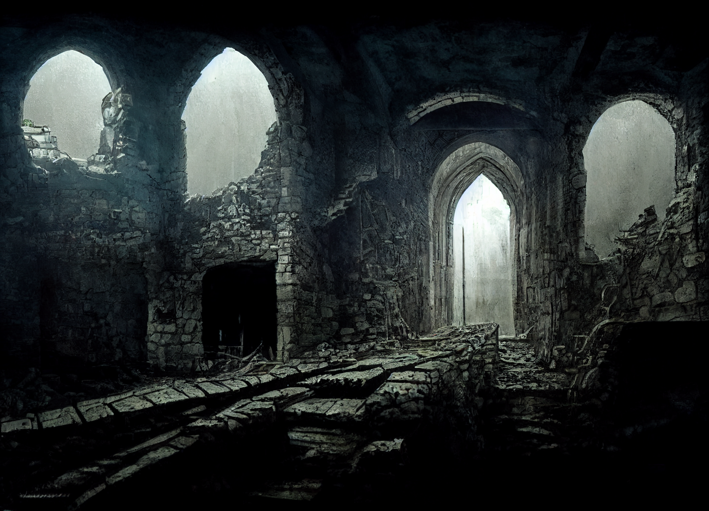

## Timeline

**Aug 24**: Vanish from [Chardon](<../../../gazetteer/west-coast/chardonian-empire/chardon/chardon.md>) after using the [Chalice of the Runepriest](<../../../things/artifacts-of-power/chalice-of-the-runepriest.md>); appear in [Heart of the Mountain](<../../../cosmology/multiverse/spiritual-realms/divine-realms/heart-of-the-mountain.md>); speak with the [Bahrazel](<../../../cosmology/gods/embodied-gods/bahrazel.md>); rest.
**Aug 25**: Venture into the realm of [Morkalan](<../../../cosmology/multiverse/echo-realms/shadowfell/morkalan.md>); figure out the mystery, kill [Hagrim](<../../../people/dwarves/hagrim.md>), send his soul to the gods for judgment.
**Aug 26:** Appear near the [statue of the Stoneborn Warrior](<../../../gazetteer/greater-dunmar/dunmari-basin/stoneborn-statue-dungeon.md>) in northern [Dunmar](<../../../gazetteer/greater-dunmar/realms/dunmar/dunmar.md>); two companions return to their lives; [Thror](<../../../people/pcs/dunmar-fellowship/guests/thror.md>) stays to help and seek redemption.

## Session Notes

### Session 1

We begin in a vast cavern with a still pool in the center, a place in [Heart of the Mountain](<../../../cosmology/multiverse/spiritual-realms/divine-realms/heart-of-the-mountain.md>), the realm of the [Bahrazel](<../../../cosmology/gods/embodied-gods/bahrazel.md>), the dwarven gods. [Riswynn](<../../../people/pcs/dunmar-fellowship/riswynn.md>), [Rothfis](<../../../people/pcs/dunmar-fellowship/guests/rothfis.md>), [Merash](<../../../people/pcs/dunmar-fellowship/guests/merash.md>), and [Thror](<../../../people/pcs/dunmar-fellowship/guests/thror.md>) find themselves transported here. In [Riswynn](<../../../people/pcs/dunmar-fellowship/riswynn.md>)'s case, by the [Chalice of the Runepriest](<../../../things/artifacts-of-power/chalice-of-the-runepriest.md>); in everyone else's, by divine magic, and not necessarily by choice. 

As the sound of hammers banging against anvils and the smell of iron permeates the chamber, the party feels they are in the presence of the gods. All, but [Riswynn](<../../../people/pcs/dunmar-fellowship/riswynn.md>), owing a debt, which the [Bahrazel](<../../../cosmology/gods/embodied-gods/bahrazel.md>) now claim, a physical token of this debt appearing out of the water in the pool. To redeem their debts to the [Bahrazel](<../../../cosmology/gods/embodied-gods/bahrazel.md>), the party is to travel to the [Shadowfell](<../../../cosmology/multiverse/echo-realms/shadowfell/shadowfell.md>) domain of [Morkalan](<../../../cosmology/multiverse/echo-realms/shadowfell/morkalan.md>), where they will find the dwarf [Hagrim](<../../../people/dwarves/hagrim.md>), whose evil deeds created the place, and either send him to damnation or atonement with the power of the [Chalice of the Runepriest](<../../../things/artifacts-of-power/chalice-of-the-runepriest.md>). 

As the party rests before preparing to depart, they see scenes of the history of the Chalice of the Runepriest:

- The chalice started as a mark of safety, a place of refuge from war in the new kingdom of [Nardith](<../../../gazetteer/greater-dunmar/realms/nardith/nardith.md>). It was taken north, later, by a group of soldiers, traveling to find refugees, gathering lists of names of those who were lost in the [Great War](<../../../events/1500s/great-war.md>), with the hope the chalice can help lead them to safety. 
- In the north, these warriors found success, finding hundreds upon hundreds of refugees, hiding in the dark. On the way back, the long march across the plains, they are sustained by the chalice. 
- Until a fire giant, [Odim Mavdyrson](<../../../people/historical-figures/odim-mavdyrson.md>), attacked the refugees, screaming about vengeance for his father, trolls with him. 
- The refugees flee with the chalice, to a massive Stoneborn statue on the plains. They build hasty fortifications, a grim warrior bearing a large two-handed axe and an iron helm leading the way. Carrying the chalice. 
- Then flames flickering at the end of the fight. The grim warrior turning on his companions, dwarf fighting dwarf, the warrior screaming that death is all that is left. The chalice, lying forgotten. The smoke gradually growing thicker and thicker as the grim warrior, the refugees, the trolls, all flicker out one by one and vanish. The chalice left, abandoned.

The party steps through the waters of the pool, with the chalice, and arrives in [Morkalan](<../../../cosmology/multiverse/echo-realms/shadowfell/morkalan.md>), a land of dim light, constantly cloudy skies, a slow muddy river, and a pervasive grayness, seemingly a distorted echo of the land around the Stoneborn statue from the vision of the chalice' history. The party heads for lights that seem to mark a settlement at the base of a series of cliffs along the left bank of the river. 

{width="500"}

Approaching the village, [Riswynn](<../../../people/pcs/dunmar-fellowship/riswynn.md>) and [Merash](<../../../people/pcs/dunmar-fellowship/guests/merash.md>) approach the dull-looking [Dwarves](<../../../species/children-of-the-embodied-gods/dwarves/dwarves.md>) on patrol. One leaves, apparently to alert [Morkalan](<../../../cosmology/multiverse/echo-realms/shadowfell/morkalan.md>) of newcomers, and the other carries out halting conversation. He seems almost robotic, patrolling because it is what soldiers do, and [Morkalan](<../../../cosmology/multiverse/echo-realms/shadowfell/morkalan.md>) insists, but he does not stop the party from proceeding to the small village nestled in the base of the cliffs.

The village of [Bleakhold](<../../../cosmology/multiverse/echo-realms/shadowfell/bleakhold.md>) is unnaturally quiet, despite smalls signs of life, and there is little sign of people. The party fails to convince an older woman dwarf to speak with them, but does find a smith who opens his door to them. His name is [Dworic](<../../../people/dwarves/dworic.md>), and he is surprised by newcomers, but tells the party that [Morkalan](<../../../cosmology/multiverse/echo-realms/shadowfell/morkalan.md>) is always watching, testing their loyalty; that the people on the top of the cliffs are human; that somewhere out in the wastes with the trolls, where the disloyal are sent, is the Mad Priest, who talks of other [Dwarves](<../../../species/children-of-the-embodied-gods/dwarves/dwarves.md>) as if [Morkalan](<../../../cosmology/multiverse/echo-realms/shadowfell/morkalan.md>) is not all there is in the universe. [Dworic](<../../../people/dwarves/dworic.md>) also tells them of a boy, [Tak](<../../../people/dwarves/tak.md>), who also believes there are other [Dwarves](<../../../species/children-of-the-embodied-gods/dwarves/dwarves.md>) out there, but who is missing. He lives next door with his father. 

The party goes to speak with [Tak](<../../../people/dwarves/tak.md>)'s father, [Rurik](<../../../people/dwarves/rurik.md>), and after come convincing and bribery with [Rothfis](<../../../people/pcs/dunmar-fellowship/guests/rothfis.md>)' bread, cheese, and ale from his tavern, they learn that [Tak](<../../../people/dwarves/tak.md>) wanders off, looking for the ghosts to talk to (especially his mother), and speaking of other [Dwarves](<../../../species/children-of-the-embodied-gods/dwarves/dwarves.md>). He usually comes back, but this time he has been gone for too long. Taking some crude, homemade clay soldiers that [Tak](<../../../people/dwarves/tak.md>) liked to play with as a young boy to remind him of his father, the party leaves to search for [Tak](<../../../people/dwarves/tak.md>).

After traveling along the muddy river, and climbing the cliff, they find him, hiding in a cave and being attacked wight-like [Dwarves](<../../../species/children-of-the-embodied-gods/dwarves/dwarves.md>). The party moves quickly to deal with the undead, and while some of them turn out to have magic, the lightning bolts of [Thror](<../../../people/pcs/dunmar-fellowship/guests/thror.md>), the quick fists of [Rothfis](<../../../people/pcs/dunmar-fellowship/guests/rothfis.md>), [Merash](<../../../people/pcs/dunmar-fellowship/guests/merash.md>) exploding maul, and [Riswynn](<../../../people/pcs/dunmar-fellowship/riswynn.md>)'s hammer [Shatterstorm](<../treasure/treasure-from-raven-s-hold/shatterstorm.md>) defeat the undead. 

With the undead defeated, the party rescues [Tak](<../../../people/dwarves/tak.md>), who leads them to the ghost of [Nora Silverspark](<../../../people/dwarves/nora-silverspark.md>), where we end the session. 

### Session 2

We begin as the party speaks with the ghost of [Nora Silverspark](<../../../people/dwarves/nora-silverspark.md>). Although [Nora](<../../../people/dwarves/nora-silverspark.md>) is reluctant to trust the party, and not sure what, if anything they can do for her or to help this place, some persuasion and the sight of the [Chalice of the Runepriest](<../../../things/artifacts-of-power/chalice-of-the-runepriest.md>) convinces her to tell her story and help the party understand [Hagrim](<../../../people/dwarves/hagrim.md>), who is now calling himself [Morkalan](<../../../cosmology/multiverse/echo-realms/shadowfell/morkalan.md>). [Nora](<../../../people/dwarves/nora-silverspark.md>) tells the story of the [history of the chalice](<../../../things/artifacts-of-power/chalice-of-the-runepriest.md#history-of-the-chalice>), adding some detail. She says [Hagrim](<../../../people/dwarves/hagrim.md>) broke in battle against [Odim Mavdyrson](<../../../people/historical-figures/odim-mavdyrson.md>), perhaps because of some old mind-wounds from the [Great War](<../../../events/1500s/great-war.md>), and when he ordered his troops to attack her, she would not fight back, and was slaughtered. In [Hagrim](<../../../people/dwarves/hagrim.md>)'s death, this place grew from his evil acts, and has gotten darker since. None can leave and those who wander into the battlefield from the mortal realm are, in many cases, drawn into [Morkalan](<../../../cosmology/multiverse/echo-realms/shadowfell/morkalan.md>) against their will. [Hagrim](<../../../people/dwarves/hagrim.md>), [Morkalan](<../../../cosmology/multiverse/echo-realms/shadowfell/morkalan.md>) now, she says, does not even remember the past. 

From her, they learn that the Mad Priest is actually [Hagrim](<../../../people/dwarves/hagrim.md>)'s cousin, [Delig Firebrand](<../../../people/dwarves/delig-firebrand.md>), and if anyone could speak of [Hagrim](<../../../people/dwarves/hagrim.md>)'s childhood it would be him. As far as she knows, he is still alive in the ashy wastelands, which [Tak](<../../../people/dwarves/tak.md>) says is home to trolls you eat your soul. 

After some debate, the party decides to go look for [Delig Firebrand](<../../../people/dwarves/delig-firebrand.md>), in the wastes, hoping to get a sense of [Hagrim](<../../../people/dwarves/hagrim.md>). 

{width="500"}

On the way, through the wastes, they fight off a shadowy, necrotic troll, that saps the strength of whomever attacks it. But managing to defeat it, they find [Delig Firebrand](<../../../people/dwarves/delig-firebrand.md>). He has lost most of his memories, constantly forgetting who he is talking to, and thinking everyone in the party to be named [Riswynn](<../../../people/pcs/dunmar-fellowship/riswynn.md>). But he does talk occasionally about his past, and [Hagrim](<../../../people/dwarves/hagrim.md>), and how after the [Great War](<../../../events/1500s/great-war.md>) he was a changed man, damaged, with eyes that looked strange. Sometimes he would talk about the evil tentacled creatures that would devour your brain, and shudder. After a pint from [Rothfis](<../../../people/pcs/dunmar-fellowship/guests/rothfis.md>) and some conversation, [Delig Firebrand](<../../../people/dwarves/delig-firebrand.md>) seems exhausted, so the party leaves him to rest and heads to find [Morkalan](<../../../cosmology/multiverse/echo-realms/shadowfell/morkalan.md>)/[Hagrim](<../../../people/dwarves/hagrim.md>), at the mirror version of the Stoneborn statue.

Approaching the Stoneborn statue, and [Hagrim](<../../../people/dwarves/hagrim.md>)'s lair, the party makes their way through ghosts of his memories, aided by [Thror](<../../../people/pcs/dunmar-fellowship/guests/thror.md>)'s fly spell and [Riswynn](<../../../people/pcs/dunmar-fellowship/riswynn.md>)'s holy aura driving undead away. 

{width="500"}
{width="500"}
Passing into the dungeon, the party makes their way through a chamber of bones that begin to animate, breaks open the door to [Hagrim](<../../../people/dwarves/hagrim.md>)'s final resting place, and confronts his ghost. [Hagrim](<../../../people/dwarves/hagrim.md>) is angry, accusing the party of reminding him of his horrible past, saying he had free himself of his cursed memories until they arrived. And battle is joined, as he insists there is nothing for the party here, and they should leave him to his domain. As he takes damage from the party, and is worn down, he becomes fainter and fainter, but insists he cannot be defeated, and he will be back to finish the job. 

As the ghost of [Hagrim](<../../../people/dwarves/hagrim.md>) fades, [Riswynn](<../../../people/pcs/dunmar-fellowship/riswynn.md>) pours the water of the Chalice on his spirit, and tells the [Bahrazel](<../../../cosmology/gods/embodied-gods/bahrazel.md>) that he deserves redemption, that his evil was at least in part a result of compulsion, or damage from mind flayers in the [Great War](<../../../events/1500s/great-war.md>), and that she believes he yearns for his home. As the water pours from the chalice, the shadows begin to dissolve, and we end the session as the party emerges into the sunlight, surrounded by the bewildered [Dwarves](<../../../species/children-of-the-embodied-gods/dwarves/dwarves.md>) of [Bleakhold](<../../../cosmology/multiverse/echo-realms/shadowfell/bleakhold.md>) now delivered to the plains of [Dunmar](<../../../gazetteer/greater-dunmar/realms/dunmar/dunmar.md>) in late August. 

[Merash](<../../../people/pcs/dunmar-fellowship/guests/merash.md>) and [Rothfis](<../../../people/pcs/dunmar-fellowship/guests/rothfis.md>) return to their homes, but [Thror](<../../../people/pcs/dunmar-fellowship/guests/thror.md>) stays with [Riswynn](<../../../people/pcs/dunmar-fellowship/riswynn.md>) to help the refugees. As the ghost of [Nora](<../../../people/dwarves/nora-silverspark.md>) fades, she tells [Riswynn](<../../../people/pcs/dunmar-fellowship/riswynn.md>) where to find her body, and gifts her the [Silverspark Gauntlets](<../treasure/treasure-from-solo-adventures/silverspark-gauntlets.md>) she bore. 

### Postscript

Over the next 6 weeks, until mid-October, [Riswynn](<../../../people/pcs/dunmar-fellowship/riswynn.md>) and [Thror](<../../../people/pcs/dunmar-fellowship/guests/thror.md>) guide the refugees south to a joyous and somber reunion in [Tharn Todor](<../../../gazetteer/greater-dunmar/realms/nardith/tharn-todor.md>). It takes time and care and patience to help them reintegrate into normal society.

[Riswynn](<../../../people/pcs/dunmar-fellowship/riswynn.md>), during this time, sends messages to her companions, learning that [Wellby](<../../../people/pcs/dunmar-fellowship/wellby.md>), [Seeker](<../../../people/pcs/dunmar-fellowship/seeker.md>), [Delwath](<../../../people/pcs/dunmar-fellowship/delwath.md>), and[Kenzo](<../../../people/pcs/dunmar-fellowship/kenzo.md>) faced a green dragon, and then were scattered across Taelgar by strange magic. But they are meeting again near [Stormcaller Tower](<../../../gazetteer/greater-dunmar/dunmari-basin/stormcaller-tower.md>), so [Riswynn](<../../../people/pcs/dunmar-fellowship/riswynn.md>) sets out again to meet them in mid October. 

During this time, she passes through [Tokra](<../../../gazetteer/greater-dunmar/realms/dunmar/central-dunmar/tokra/tokra.md>), collecting a few letters for the party and checking in with [Dag Hardstone](<../../../people/dwarves/dag-hardstone.md>) and his family, as well as [Vistra Fireforge](<../../../people/dwarves/vistra-fireforge.md>). [Tokra](<../../../gazetteer/greater-dunmar/realms/dunmar/central-dunmar/tokra/tokra.md>) is tense, with tensions between [Sura](<../../../people/dunmari/sura.md>) and the army of [Nayan Karnas](<../../../people/dunmari/nayan-karnas.md>) high; Vistra reports that [Sura](<../../../people/dunmari/sura.md>) holds the hearts of the people here, but without the blessing of the Lakan monks few are willing to risk open war. 

Gathering letters to deliver, [Riswynn](<../../../people/pcs/dunmar-fellowship/riswynn.md>) heads east, connecting with [Delwath](<../../../people/pcs/dunmar-fellowship/delwath.md>) at his camp near the [Feywild](<../../../cosmology/multiverse/echo-realms/feywild/feywild.md>) crossing where the rest of the party should arrive. 

## Treasures, Boons, Rewards
- [Silverspark Gauntlets](<../treasure/treasure-from-solo-adventures/silverspark-gauntlets.md>) 