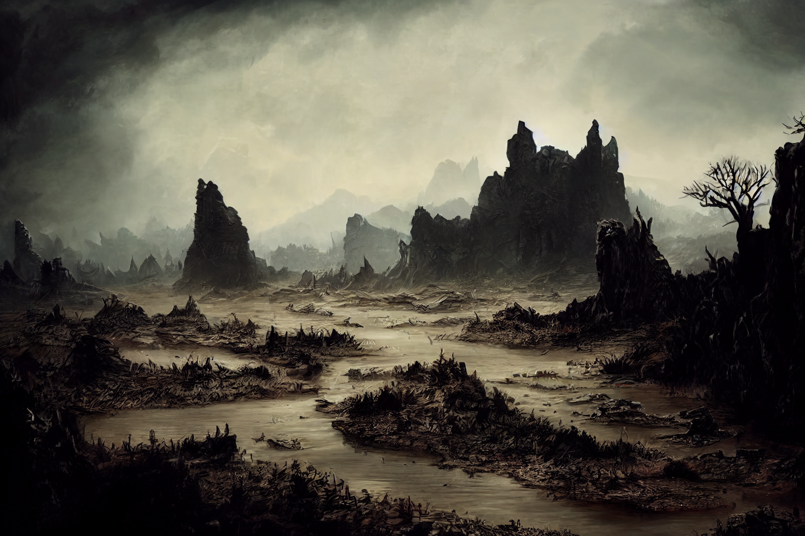

# Dunmari Frontier - Riswynn Solo Session 1

>[!info] Chalice of Redemption: in which debts to the gods are repaid
> *Featuring: [Riswynn](<../../../people/pcs/dunmar-fellowship/riswynn.md>), [Rothfis](<../../../people/pcs/dunmar-fellowship/guests/rothfis.md>), [Merash](<../../../people/pcs/dunmar-fellowship/guests/merash.md>), [Thror](<../../../people/pcs/dunmar-fellowship/guests/thror.md>)*
> *In Taelgar: Aug 24, 1748 DR to Aug 25, 1748 DR*
> *On Earth: Monday Sep 12, 2022*
> *[Heart of the Mountain](<../../../cosmology/multiverse/spiritual-realms/divine-realms/heart-of-the-mountain.md>) and [Morkalan](<../../../cosmology/multiverse/echo-realms/shadowfell/morkalan.md>)*

[Riswynn](<../../../people/pcs/dunmar-fellowship/riswynn.md>) meets three other [dwarves](<../../../species/children-of-the-embodied-gods/dwarves/dwarves.md>) in the [Heart of the Mountain](<../../../cosmology/multiverse/spiritual-realms/divine-realms/heart-of-the-mountain.md>), all indebted to the [Bahrazel](<../../../cosmology/gods/embodied-gods/bahrazel/bahrazel.md>), and they embark on a quest to redeem an evil dwarf in the [Shadowfell](<../../../cosmology/multiverse/echo-realms/shadowfell/shadowfell.md>) realm of Morkalan. 
## Session Info
### Summary
- [Riswynn](<../../../people/pcs/dunmar-fellowship/riswynn.md>), [Thror](<../../../people/pcs/dunmar-fellowship/guests/thror.md>), [Merash](<../../../people/pcs/dunmar-fellowship/guests/merash.md>), and [Rothfis](<../../../people/pcs/dunmar-fellowship/guests/rothfis.md>) are summoned to the [Heart of the Mountain](<../../../cosmology/multiverse/spiritual-realms/divine-realms/heart-of-the-mountain.md>) by the [Bahrazel](<../../../cosmology/gods/embodied-gods/bahrazel/bahrazel.md>).
- They are tasked by the [Bahrazel](<../../../cosmology/gods/embodied-gods/bahrazel/bahrazel.md>) to travel to the [Shadowfell](<../../../cosmology/multiverse/echo-realms/shadowfell/shadowfell.md>) domain of [Morkalan](<../../../cosmology/multiverse/echo-realms/shadowfell/morkalan.md>) to confront the dwarf [Hagrim](<../../../people/dwarves/hagrim.md>).
- Visions reveal the history of the [Chalice of the Runepriest](<../../../things/artifacts-of-power/chalice-of-the-runepriest.md>), once a beacon of hope, later lost after a deadly conflict.
- In [Morkalan](<../../../cosmology/multiverse/echo-realms/shadowfell/morkalan.md>), the party finds [Bleakhold](<../../../cosmology/multiverse/echo-realms/shadowfell/bleakhold.md>), a village under the constant scrutiny of [Morkalan](<../../../cosmology/multiverse/echo-realms/shadowfell/morkalan.md>), and learns of a missing boy, [Tak](<../../../people/dwarves/tak.md>).
- They rescue [Tak](<../../../people/dwarves/tak.md>) from undead dwarves and are led to the ghost of [Nora Silverspark](<../../../people/dwarves/nora-silverspark.md>).

### Timeline
- Aug 24, 1748 DR: Vanish from [Chardon](<../../../gazetteer/west-coast/chardonian-empire/chardon/chardon.md>) after using the [Chalice of the Runepriest](<../../../things/artifacts-of-power/chalice-of-the-runepriest.md>); appear in [Heart of the Mountain](<../../../cosmology/multiverse/spiritual-realms/divine-realms/heart-of-the-mountain.md>); speak with the [Bahrazel](<../../../cosmology/gods/embodied-gods/bahrazel/bahrazel.md>); rest.
- Aug 25, 1748 DR, morning: Venture into the realm of [Morkalan](<../../../cosmology/multiverse/echo-realms/shadowfell/morkalan.md>)

## Narrative
We begin in a vast cavern with a still pool in the center, a place in [Heart of the Mountain](<../../../cosmology/multiverse/spiritual-realms/divine-realms/heart-of-the-mountain.md>), the realm of the [Bahrazel](<../../../cosmology/gods/embodied-gods/bahrazel/bahrazel.md>), the dwarven gods. [Riswynn](<../../../people/pcs/dunmar-fellowship/riswynn.md>), [Rothfis](<../../../people/pcs/dunmar-fellowship/guests/rothfis.md>), [Merash](<../../../people/pcs/dunmar-fellowship/guests/merash.md>), and [Thror](<../../../people/pcs/dunmar-fellowship/guests/thror.md>) find themselves transported here. In [Riswynn](<../../../people/pcs/dunmar-fellowship/riswynn.md>)'s case, by the [Chalice of the Runepriest](<../../../things/artifacts-of-power/chalice-of-the-runepriest.md>); in everyone else's, by divine magic, and not necessarily by choice. 

As the sound of hammers banging against anvils and the smell of iron permeates the chamber, the party feels they are in the presence of the gods. All, but [Riswynn](<../../../people/pcs/dunmar-fellowship/riswynn.md>), owing a debt, which the [Bahrazel](<../../../cosmology/gods/embodied-gods/bahrazel/bahrazel.md>) now claim, a physical token of this debt appearing out of the water in the pool. To redeem their debts to the [Bahrazel](<../../../cosmology/gods/embodied-gods/bahrazel/bahrazel.md>), the party is to travel to the [Shadowfell](<../../../cosmology/multiverse/echo-realms/shadowfell/shadowfell.md>) domain of [Morkalan](<../../../cosmology/multiverse/echo-realms/shadowfell/morkalan.md>), where they will find the dwarf [Hagrim](<../../../people/dwarves/hagrim.md>), whose evil deeds created the place, and either send him to damnation or atonement with the power of the [Chalice of the Runepriest](<../../../things/artifacts-of-power/chalice-of-the-runepriest.md>). 

As the party rests before preparing to depart, they see scenes of the history of the Chalice of the Runepriest:

- The chalice started as a mark of safety, a place of refuge from war in the new kingdom of [Nardith](<../../../gazetteer/greater-dunmar/realms/nardith/nardith.md>). It was taken north, later, by a group of soldiers, traveling to find refugees, gathering lists of names of those who were lost in the [Great War](<../../../events/1500s/great-war.md>), with the hope the chalice can help lead them to safety. 

- In the north, these warriors found success, finding hundreds upon hundreds of refugees, hiding in the dark. On the way back, the long march across the plains, they are sustained by the chalice. 

- Until a fire giant, [Odim Mavdyrson](<../../../people/historical-figures/odim-mavdyrson.md>), attacked the refugees, screaming about vengeance for his father, trolls with him. 

- The refugees flee with the chalice, to a massive Stoneborn statue on the plains. They build hasty fortifications, a grim warrior bearing a large two-handed axe and an iron helm leading the way. Carrying the chalice. 

- Then flames flickering at the end of the fight. The grim warrior turning on his companions, dwarf fighting dwarf, the warrior screaming that death is all that is left. The chalice, lying forgotten. The smoke gradually growing thicker and thicker as the grim warrior, the refugees, the trolls, all flicker out one by one and vanish. The chalice left, abandoned.

The party steps through the waters of the pool, with the chalice, and arrives in [Morkalan](<../../../cosmology/multiverse/echo-realms/shadowfell/morkalan.md>), a land of dim light, constantly cloudy skies, a slow muddy river, and a pervasive grayness, seemingly a distorted echo of the land around the Stoneborn statue from the vision of the chalice' history. The party heads for lights that seem to mark a settlement at the base of a series of cliffs along the left bank of the river. 

{width="500"}

Approaching the village, [Riswynn](<../../../people/pcs/dunmar-fellowship/riswynn.md>) and [Merash](<../../../people/pcs/dunmar-fellowship/guests/merash.md>) approach the dull-looking [Dwarves](<../../../species/children-of-the-embodied-gods/dwarves/dwarves.md>) on patrol. One leaves, apparently to alert [Morkalan](<../../../cosmology/multiverse/echo-realms/shadowfell/morkalan.md>) of newcomers, and the other carries out halting conversation. He seems almost robotic, patrolling because it is what soldiers do, and [Morkalan](<../../../cosmology/multiverse/echo-realms/shadowfell/morkalan.md>) insists, but he does not stop the party from proceeding to the small village nestled in the base of the cliffs.

The village of [Bleakhold](<../../../cosmology/multiverse/echo-realms/shadowfell/bleakhold.md>) is unnaturally quiet, despite smalls signs of life, and there is little sign of people. The party fails to convince an older woman dwarf to speak with them, but does find a smith who opens his door to them. His name is [Dworic](<../../../people/dwarves/dworic.md>), and he is surprised by newcomers, but tells the party that [Morkalan](<../../../cosmology/multiverse/echo-realms/shadowfell/morkalan.md>) is always watching, testing their loyalty; that the people on the top of the cliffs are human; that somewhere out in the wastes with the trolls, where the disloyal are sent, is the Mad Priest, who talks of other [Dwarves](<../../../species/children-of-the-embodied-gods/dwarves/dwarves.md>) as if [Morkalan](<../../../cosmology/multiverse/echo-realms/shadowfell/morkalan.md>) is not all there is in the universe. [Dworic](<../../../people/dwarves/dworic.md>) also tells them of a boy, [Tak](<../../../people/dwarves/tak.md>), who also believes there are other [Dwarves](<../../../species/children-of-the-embodied-gods/dwarves/dwarves.md>) out there, but who is missing. He lives next door with his father. 

The party goes to speak with [Tak](<../../../people/dwarves/tak.md>)'s father, [Rurik](<../../../people/dwarves/rurik.md>), and after come convincing and bribery with [Rothfis](<../../../people/pcs/dunmar-fellowship/guests/rothfis.md>)' bread, cheese, and ale from his tavern, they learn that [Tak](<../../../people/dwarves/tak.md>) wanders off, looking for the ghosts to talk to (especially his mother), and speaking of other [Dwarves](<../../../species/children-of-the-embodied-gods/dwarves/dwarves.md>). He usually comes back, but this time he has been gone for too long. Taking some crude, homemade clay soldiers that [Tak](<../../../people/dwarves/tak.md>) liked to play with as a young boy to remind him of his father, the party leaves to search for [Tak](<../../../people/dwarves/tak.md>).

After traveling along the muddy river, and climbing the cliff, they find him, hiding in a cave and being attacked wight-like [Dwarves](<../../../species/children-of-the-embodied-gods/dwarves/dwarves.md>). The party moves quickly to deal with the undead, and while some of them turn out to have magic, the lightning bolts of [Thror](<../../../people/pcs/dunmar-fellowship/guests/thror.md>), the quick fists of [Rothfis](<../../../people/pcs/dunmar-fellowship/guests/rothfis.md>), [Merash](<../../../people/pcs/dunmar-fellowship/guests/merash.md>) exploding maul, and [Riswynn](<../../../people/pcs/dunmar-fellowship/riswynn.md>)'s hammer [Shatterstorm](<../treasure/treasure-from-raven-s-hold/shatterstorm.md>) defeat the undead. 

With the undead defeated, the party rescues [Tak](<../../../people/dwarves/tak.md>), who leads them to the ghost of [Nora Silverspark](<../../../people/dwarves/nora-silverspark.md>), where we end the session. 
