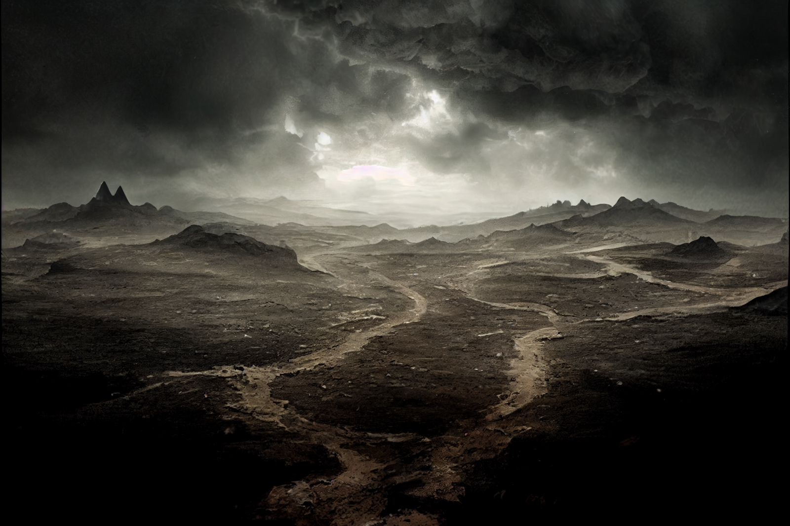
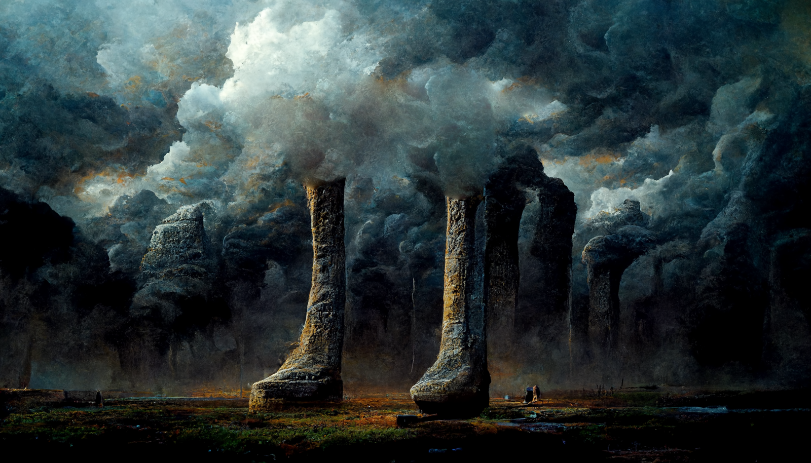
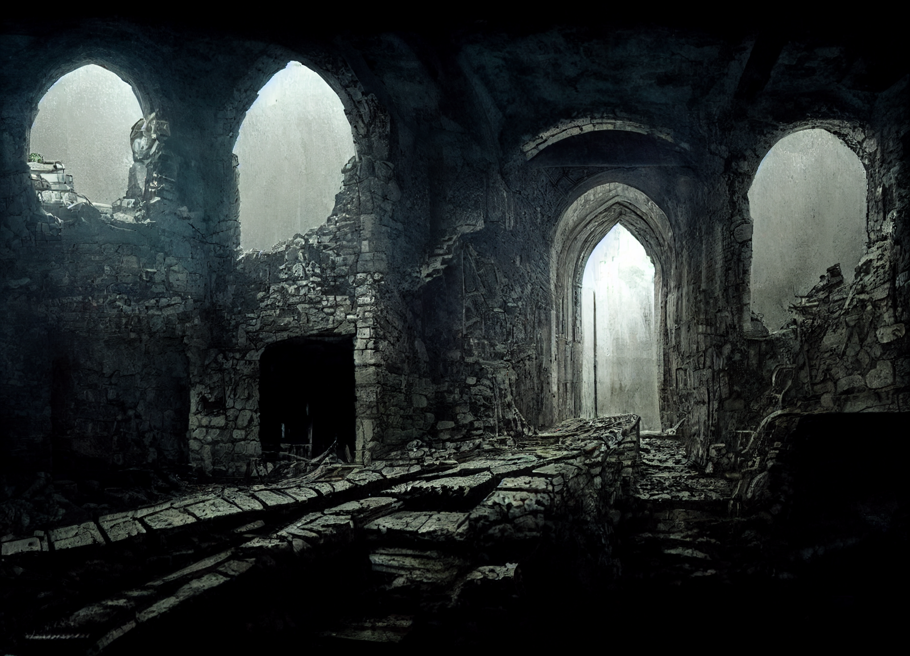

# Dunmari Frontier - Riswynn Solo Session 2

>[!info] Redemption of Hagrim: in which a ghostly past is confronted
> *Featuring: [Riswynn](<../../../people/pcs/dunmar-fellowship/riswynn.md>), [Rothfis](<../../../people/pcs/dunmar-fellowship/guests/rothfis.md>), [Merash](<../../../people/pcs/dunmar-fellowship/guests/merash.md>), [Thror](<../../../people/pcs/dunmar-fellowship/guests/thror.md>)*
> *In Taelgar: Aug 25, 1748 DR to Nov 15, 1748 DR*
> *On Earth: Monday Sep 26, 2022*
> *[Morkalan](<../../../cosmology/multiverse/echo-realms/shadowfell/morkalan.md>)*

Riswynn and her companions uncover the story of [Morkalan](<../../../cosmology/multiverse/echo-realms/shadowfell/morkalan.md>) and redeem the ghost of [Hagrim](<../../../people/dwarves/hagrim.md>).
## Session Info
### Summary
- [Riswynn](<../../../people/pcs/dunmar-fellowship/riswynn.md>) and her companions learn of [Hagrim](<../../../people/dwarves/hagrim.md>)'s transformation into the evil [Morkalan](<../../../cosmology/multiverse/echo-realms/shadowfell/morkalan.md>) from his victim, [Nora Silverspark](<../../../people/dwarves/nora-silverspark.md>).
- They defeat a necrotic troll in the ashy wastelands and encounter Hagrim's cousin, [Delig Firebrand](<../../../people/dwarves/delig-firebrand.md>).
- After battling Hagrim's ghost and invoking the [Bahrazel](<../../../cosmology/gods/embodied-gods/bahrazel/bahrazel.md>), Riswynn redeems his spirit with the [Chalice of the Runepriest](<../../../things/artifacts-of-power/chalice-of-the-runepriest.md>), dissipating the darkness.
- [Riswynn](<../../../people/pcs/dunmar-fellowship/riswynn.md>) and [Thror](<../../../people/pcs/dunmar-fellowship/guests/thror.md>) help the freed Dwarves of [Bleakhold](<../../../cosmology/multiverse/echo-realms/shadowfell/bleakhold.md>) reintegrate into society, leading them to [Tharn Todor](<../../../gazetteer/greater-dunmar/realms/nardith/tharn-todor.md>).
- [Riswynn](<../../../people/pcs/dunmar-fellowship/riswynn.md>) prepares to reunite with her scattered companions, gathering news and messages in [Tokra](<../../../gazetteer/greater-dunmar/realms/dunmar/central-dunmar/tokra/tokra.md>).

### Timeline
- Aug 25, 1748 DR, afternoon: Decipher the mystery of [Morkalan](<../../../cosmology/multiverse/echo-realms/shadowfell/morkalan.md>) and kill [Hagrim](<../../../people/dwarves/hagrim.md>), sending his soul to the gods for judgment.
- Aug 26, 1748 DR: Appear near the [statue of the Stoneborn Warrior](<../../../gazetteer/greater-dunmar/dunmari-basin/stoneborn-statue-dungeon.md>) in northern [Dunmar](<../../../gazetteer/greater-dunmar/realms/dunmar/dunmar.md>); [Merash](<../../../people/pcs/dunmar-fellowship/guests/merash.md>) and [Rothfis](<../../../people/pcs/dunmar-fellowship/guests/rothfis.md>) return to their lives; [Thror](<../../../people/pcs/dunmar-fellowship/guests/thror.md>) stays to help and seek redemption.
- Aug 27, 1748 DR - Oct 04, 1748 DR: [Thror](<../../../people/pcs/dunmar-fellowship/guests/thror.md>) and [Riswynn](<../../../people/pcs/dunmar-fellowship/riswynn.md>) guide the freed dwarves of [Morkalan](<../../../cosmology/multiverse/echo-realms/shadowfell/morkalan.md>)south to [Nardith](<../../../gazetteer/greater-dunmar/realms/nardith/nardith.md>)
- Oct 05, 1748 DR: [Riswynn](<../../../people/pcs/dunmar-fellowship/riswynn.md>) and freed dwarves arrive in [Tharn Todor](<../../../gazetteer/greater-dunmar/realms/nardith/tharn-todor.md>).
- Oct 06, 1748 DR - Oct 11, 1748 DR: [Riswynn](<../../../people/pcs/dunmar-fellowship/riswynn.md>) rests in [Tharn Todor](<../../../gazetteer/greater-dunmar/realms/nardith/tharn-todor.md>) and gathers news
- Oct 12, 1748 DR: [Riswynn](<../../../people/pcs/dunmar-fellowship/riswynn.md>) departs for [Tokra](<../../../gazetteer/greater-dunmar/realms/dunmar/central-dunmar/tokra/tokra.md>)
- Oct 13, 1748 DR - Oct 25, 1748 DR: [Riswynn](<../../../people/pcs/dunmar-fellowship/riswynn.md>) travels across [Dunmar](<../../../gazetteer/greater-dunmar/realms/dunmar/dunmar.md>) towards [Tokra](<../../../gazetteer/greater-dunmar/realms/dunmar/central-dunmar/tokra/tokra.md>).
- Oct 26, 1748 DR: [Riswynn](<../../../people/pcs/dunmar-fellowship/riswynn.md>) arrives in [Tokra](<../../../gazetteer/greater-dunmar/realms/dunmar/central-dunmar/tokra/tokra.md>). Gathers letters and information.
- Oct 27, 1748 DR - Nov 13, 1748 DR: [Riswynn](<../../../people/pcs/dunmar-fellowship/riswynn.md>) travels east to meet her companions again
- Nov 14, 1748 DR: [Riswynn](<../../../people/pcs/dunmar-fellowship/riswynn.md>) and [Delwath](<../../../people/pcs/dunmar-fellowship/delwath.md>) are reunited on the arid plains of the [Nashtkar](<../../../gazetteer/greater-dunmar/dunmari-basin/nashtkar.md>)

## Narrative
We begin as the party speaks with the ghost of [Nora Silverspark](<../../../people/dwarves/nora-silverspark.md>). Although [Nora](<../../../people/dwarves/nora-silverspark.md>) is reluctant to trust the party, and not sure what, if anything they can do for her or to help this place, some persuasion and the sight of the [Chalice of the Runepriest](<../../../things/artifacts-of-power/chalice-of-the-runepriest.md>) convinces her to tell her story and help the party understand [Hagrim](<../../../people/dwarves/hagrim.md>), who is now calling himself [Morkalan](<../../../cosmology/multiverse/echo-realms/shadowfell/morkalan.md>). [Nora](<../../../people/dwarves/nora-silverspark.md>) tells the story of the [history of the chalice](<../../../things/artifacts-of-power/chalice-of-the-runepriest.md#history-of-the-chalice>), adding some detail. She says [Hagrim](<../../../people/dwarves/hagrim.md>) broke in battle against [Odim Mavdyrson](<../../../people/historical-figures/odim-mavdyrson.md>), perhaps because of some old mind-wounds from the [Great War](<../../../events/1500s/great-war.md>), and when he ordered his troops to attack her, she would not fight back, and was slaughtered. In [Hagrim](<../../../people/dwarves/hagrim.md>)'s death, this place grew from his evil acts, and has gotten darker since. None can leave and those who wander into the battlefield from the mortal realm are, in many cases, drawn into [Morkalan](<../../../cosmology/multiverse/echo-realms/shadowfell/morkalan.md>) against their will. [Hagrim](<../../../people/dwarves/hagrim.md>), [Morkalan](<../../../cosmology/multiverse/echo-realms/shadowfell/morkalan.md>) now, she says, does not even remember the past. 

From her, they learn that the Mad Priest is actually [Hagrim](<../../../people/dwarves/hagrim.md>)'s cousin, [Delig Firebrand](<../../../people/dwarves/delig-firebrand.md>), and if anyone could speak of [Hagrim](<../../../people/dwarves/hagrim.md>)'s childhood it would be him. As far as she knows, he is still alive in the ashy wastelands, which [Tak](<../../../people/dwarves/tak.md>) says is home to trolls you eat your soul. 

After some debate, the party decides to go look for [Delig Firebrand](<../../../people/dwarves/delig-firebrand.md>), in the wastes, hoping to get a sense of [Hagrim](<../../../people/dwarves/hagrim.md>). 

On the way, through the wastes, they fight off a shadowy, necrotic troll, that saps the strength of whomever attacks it. But managing to defeat it, they find [Delig Firebrand](<../../../people/dwarves/delig-firebrand.md>). He has lost most of his memories, constantly forgetting who he is talking to, and thinking everyone in the party to be named [Riswynn](<../../../people/pcs/dunmar-fellowship/riswynn.md>). But he does talk occasionally about his past, and [Hagrim](<../../../people/dwarves/hagrim.md>), and how after the [Great War](<../../../events/1500s/great-war.md>) he was a changed man, damaged, with eyes that looked strange. Sometimes he would talk about the evil tentacled creatures that would devour your brain, and shudder. After a pint from [Rothfis](<../../../people/pcs/dunmar-fellowship/guests/rothfis.md>) and some conversation, [Delig Firebrand](<../../../people/dwarves/delig-firebrand.md>) seems exhausted, so the party leaves him to rest and heads to find [Morkalan](<../../../cosmology/multiverse/echo-realms/shadowfell/morkalan.md>)/[Hagrim](<../../../people/dwarves/hagrim.md>), at the mirror version of the Stoneborn statue.

Approaching the Stoneborn statue, and [Hagrim](<../../../people/dwarves/hagrim.md>)'s lair, the party makes their way through ghosts of his memories, aided by [Thror](<../../../people/pcs/dunmar-fellowship/guests/thror.md>)'s fly spell and [Riswynn](<../../../people/pcs/dunmar-fellowship/riswynn.md>)'s holy aura driving undead away. 

Passing into the dungeon, the party makes their way through a chamber of bones that begin to animate, breaks open the door to [Hagrim](<../../../people/dwarves/hagrim.md>)'s final resting place, and confronts his ghost. [Hagrim](<../../../people/dwarves/hagrim.md>) is angry, accusing the party of reminding him of his horrible past, saying he had free himself of his cursed memories until they arrived. And battle is joined, as he insists there is nothing for the party here, and they should leave him to his domain. As he takes damage from the party, and is worn down, he becomes fainter and fainter, but insists he cannot be defeated, and he will be back to finish the job. 

As the ghost of [Hagrim](<../../../people/dwarves/hagrim.md>) fades, [Riswynn](<../../../people/pcs/dunmar-fellowship/riswynn.md>) pours the water of the Chalice on his spirit, and tells the [Bahrazel](<../../../cosmology/gods/embodied-gods/bahrazel/bahrazel.md>) that he deserves redemption, that his evil was at least in part a result of compulsion, or damage from mind flayers in the [Great War](<../../../events/1500s/great-war.md>), and that she believes he yearns for his home. As the water pours from the chalice, the shadows begin to dissolve, and we end the session as the party emerges into the sunlight, surrounded by the bewildered [Dwarves](<../../../species/children-of-the-embodied-gods/dwarves/dwarves.md>) of [Bleakhold](<../../../cosmology/multiverse/echo-realms/shadowfell/bleakhold.md>) now delivered to the plains of [Dunmar](<../../../gazetteer/greater-dunmar/realms/dunmar/dunmar.md>) in late August. 

[Merash](<../../../people/pcs/dunmar-fellowship/guests/merash.md>) and [Rothfis](<../../../people/pcs/dunmar-fellowship/guests/rothfis.md>) return to their homes, but [Thror](<../../../people/pcs/dunmar-fellowship/guests/thror.md>) stays with [Riswynn](<../../../people/pcs/dunmar-fellowship/riswynn.md>) to help the refugees. As the ghost of [Nora](<../../../people/dwarves/nora-silverspark.md>) fades, she tells [Riswynn](<../../../people/pcs/dunmar-fellowship/riswynn.md>) where to find her body, and gifts her the [Silverspark Gauntlets](<../treasure/notable-items/silverspark-gauntlets.md>) she bore. 

Over the next 6 weeks, until mid-October, [Riswynn](<../../../people/pcs/dunmar-fellowship/riswynn.md>) and [Thror](<../../../people/pcs/dunmar-fellowship/guests/thror.md>) guide the refugees south to a joyous and somber reunion in [Tharn Todor](<../../../gazetteer/greater-dunmar/realms/nardith/tharn-todor.md>). It takes time and care and patience to help them reintegrate into normal society.

[Riswynn](<../../../people/pcs/dunmar-fellowship/riswynn.md>), during this time, sends messages to her companions, learning that [Wellby](<../../../people/pcs/dunmar-fellowship/wellby.md>), [Seeker](<../../../people/pcs/dunmar-fellowship/seeker.md>), [Delwath](<../../../people/pcs/dunmar-fellowship/delwath.md>), and[Kenzo](<../../../people/pcs/dunmar-fellowship/kenzo.md>) faced a green dragon, and then were scattered across the world by strange magic. But they are meeting again near [Stormcaller Tower](<../../../gazetteer/greater-dunmar/dunmari-basin/stormcaller-tower.md>), so [Riswynn](<../../../people/pcs/dunmar-fellowship/riswynn.md>) sets out again to meet them in mid October. 

During this time, she passes through [Tokra](<../../../gazetteer/greater-dunmar/realms/dunmar/central-dunmar/tokra/tokra.md>), collecting a few letters for the party and checking in with [Dag Hardstone](<../../../people/dwarves/dag-hardstone.md>) and his family, as well as [Vistra Fireforge](<../../../people/dwarves/vistra-fireforge.md>). [Tokra](<../../../gazetteer/greater-dunmar/realms/dunmar/central-dunmar/tokra/tokra.md>) is tense, with tensions between [Sura](<../../../people/dunmari/sura.md>) and the army of [Nayan Karnas](<../../../people/dunmari/nayan-karnas.md>) high; Vistra reports that [Sura](<../../../people/dunmari/sura.md>) holds the hearts of the people here, but without the blessing of the Lakan monks few are willing to risk open war. 

Gathering letters to deliver, [Riswynn](<../../../people/pcs/dunmar-fellowship/riswynn.md>) heads east, connecting with [Delwath](<../../../people/pcs/dunmar-fellowship/delwath.md>) at his camp near the [Feywild](<../../../cosmology/multiverse/echo-realms/feywild/feywild.md>) crossing where the rest of the party should arrive. 
