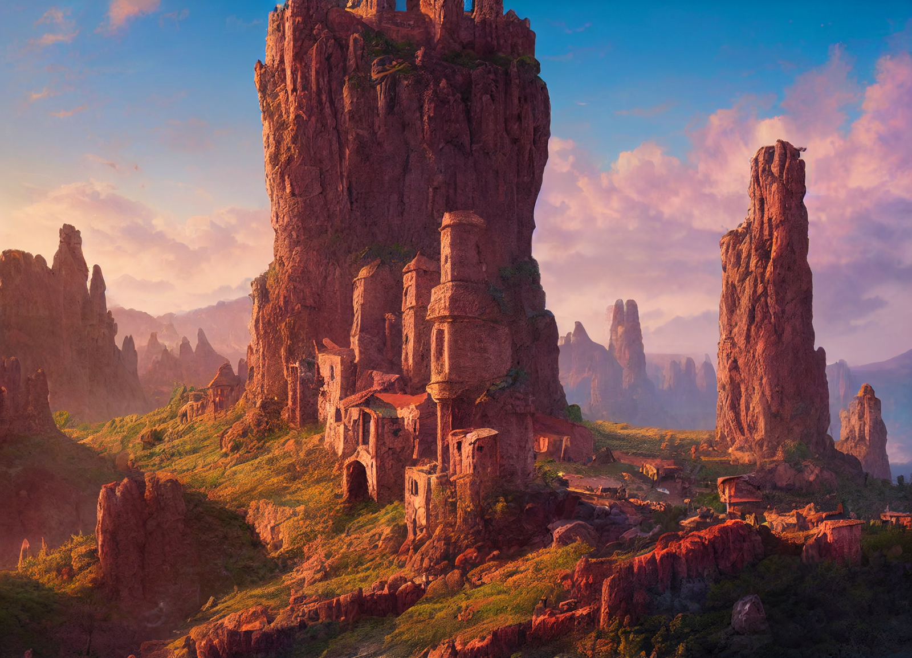

# Dunmari Frontier - Wellby Solo Session 1 (Prequel)

>[!info] Smoke and Secrets: in which Wellby aids in an escape and gathers tales
> *Featuring: [Wellby](<../../../people/pcs/dunmar-fellowship/wellby.md>)*
> *In Taelgar: Sep 30, 1748 DR to Oct 12, 1748 DR*
> *On Earth: Friday Oct 14, 2022*
> *Aboard the [Wave Dancer](<../../../things/ships/wave-dancer.md>), [Eastern Green Sea](<../../../gazetteer/eastern-green-sea/eastern-green-sea.md>)*

[Wellby](<../../../people/pcs/dunmar-fellowship/wellby.md>) helps a halfling ship escape pirates and learns of kidnapped Kenku experts on the [Feywild](<../../../cosmology/multiverse/echo-realms/feywild/feywild.md>) in [Wahacha](<../../../gazetteer/eastern-green-sea/wahacha.md>).

## Session Info

***Wellby learns the Eastros trade language from the crew of the Wave Dancer.***
### Summary
- [Wellby](<../../../people/pcs/dunmar-fellowship/wellby.md>) teleports onto the [Wave Dancer](<../../../things/ships/wave-dancer.md>), a halfling ship fleeing from hobgoblin pirates.
- He sabotages the pirates' ship, allowing the [Wave Dancer](<../../../things/ships/wave-dancer.md>) to escape.
- During the journey, [Wellby](<../../../people/pcs/dunmar-fellowship/wellby.md>) hears stories of exotic cities and trades.
- Wellby arrives in [Wahacha](<../../../gazetteer/eastern-green-sea/wahacha.md>), learning of kidnapped kenku knowledgeable about the [Feywild](<../../../cosmology/multiverse/echo-realms/feywild/feywild.md>).

### Timeline
- Sep 30, 1748 DR, afternoon: Land on the [Wave Dancer](<../../../things/ships/wave-dancer.md>), which is in the midst of fleeing hobgoblin pirates. Help halflings escape in the night.
- Oct 01, 1748 DR - Oct 11, 1748 DR:  Sail east across the [Green Sea](<../../../gazetteer/green-sea.md>) on the halfling trader [Wave Dancer](<../../../things/ships/wave-dancer.md>)
- Oct 12, 1748 DR: Arrive at the port of [Wahacha](<../../../gazetteer/eastern-green-sea/wahacha.md>) in the Vermillion Archipelago, the islands of the kenku. Speak with [Makha](<../../../people/kenku/makha.md>), learn about raiders and missing people; learn that two recently kidnapped kenku named [Skoda](<../../../people/kenku/skoda.md>) and [Nahto](<../../../people/kenku/nahto.md>) could point you towards someone who could help you get back to your friends. Spend the night in [Wahacha](<../../../gazetteer/eastern-green-sea/wahacha.md>).

## Narrative
We begin as [Wellby](<../../../people/pcs/dunmar-fellowship/wellby.md>) lands, teleported from far away, onto the deck of the [Wave Dancer](<../../../things/ships/wave-dancer.md>), a halfling trader making its way east, in the eastern half of [Green Sea](<../../../gazetteer/green-sea.md>). The [Wave Dancer](<../../../things/ships/wave-dancer.md>) is fleeing hobgoblin pirates from the Devil’s Spine, unwilling to give over their cargo of dragon hide from [Praznitsky](<../../../gazetteer/northern-green-sea/praznitsky.md>), and hoping for cover of darkness to slip away. [Wellby](<../../../people/pcs/dunmar-fellowship/wellby.md>) uses the [Raven Whistle](<../treasure/notable-items/raven-whistle.md>) to fly back towards the hobgoblin ship, where despite the constant hail of arrows, he manages to land on the crow’s nest, kill the sailor there, and, while obscured by the smoke from his pyrotechnic arrow, set the mainsail on fire. Although the Hobgoblins get the fire under control quickly, the sail is done for and the pirate ship slows enough to allow the [Wave Dancer](<../../../things/ships/wave-dancer.md>) – aided by magical fog created by the navigator, [Corrin Wildheart](<../../../people/halflings/corrin-wildheart.md>) – to escape in the night. 

Over the next 10 days, as the [Wave Dancer](<../../../things/ships/wave-dancer.md>) makes it way to the kenku port of [Wahacha](<../../../gazetteer/eastern-green-sea/wahacha.md>) in the eastern isles, [Wellby](<../../../people/pcs/dunmar-fellowship/wellby.md>) talks with the halflings on the ship. He tells his tale, and listens to stories of the halflings. They tell of [Praznitsky](<../../../gazetteer/northern-green-sea/praznitsky.md>), a closed city in the north, part of the country of Ursk, where none are allowed across the bridge from the harbors and warehouses to the main city, and the people trade dragon hide. They tell [Medju](<../../../gazetteer/eastern-green-sea/medju.md>), the great spice city in the south, the terminus of trade routes from strange lands across the desert, where you can buy and sell almost anything in the markets of  the obscenely wealthy spice lords. They tell of the anchored island, [Quanyi](<../../../gazetteer/eastern-green-sea/quanyi.md>), where sea [elves](<../../../species/children-of-the-embodied-gods/elves/elves.md>) live and harvest magical salt from the warm tropical oceans on their shores. And they tell of [Wahacha](<../../../gazetteer/eastern-green-sea/wahacha.md>), their destination, a small port in the [Vermillion Isles](<../../../gazetteer/eastern-green-sea/vermillion-isles.md>), inhabited by kenku since time immemorial. 

{width="500"}

{width="500"}

We end as the [Wave Dancer](<../../../things/ships/wave-dancer.md>) arrives in [Wahacha](<../../../gazetteer/eastern-green-sea/wahacha.md>), and [Wellby](<../../../people/pcs/dunmar-fellowship/wellby.md>) is given a tour of the island by [Makha](<../../../people/kenku/makha.md>), the harbor master and unofficial town spokesperson. From [Makha](<../../../people/kenku/makha.md>), [Wellby](<../../../people/pcs/dunmar-fellowship/wellby.md>) learns that the two kenku wanderers and explorers who could tell him where to find someone who knows about the [Feywild](<../../../cosmology/multiverse/echo-realms/feywild/feywild.md>) have recently been kidnapped, by raiders from the sea who have been causing trouble in the last month. 
