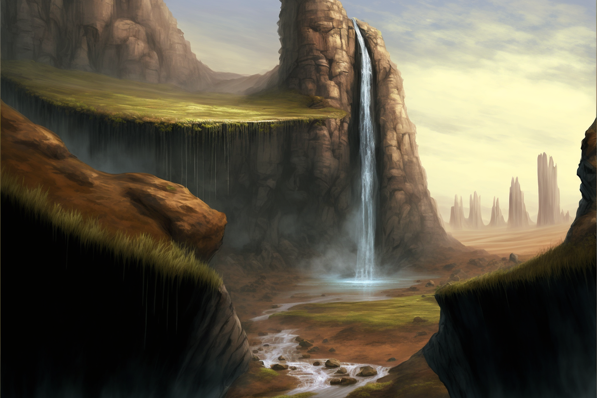
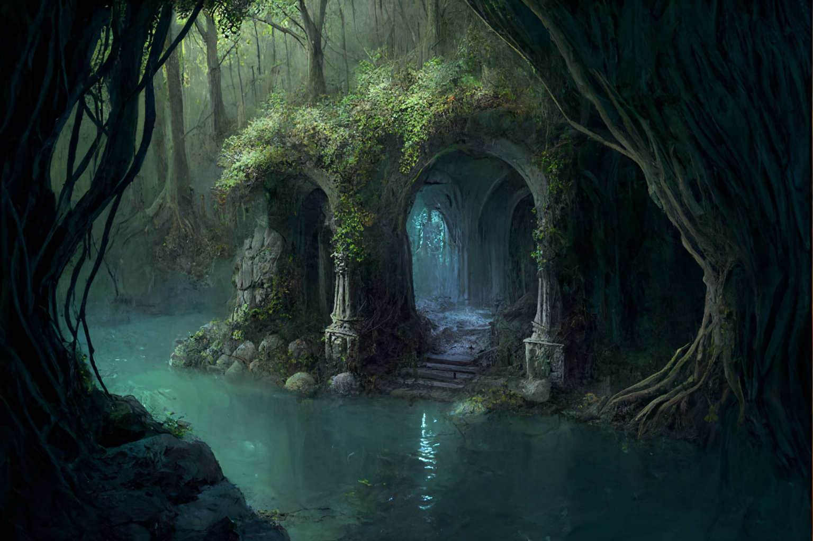
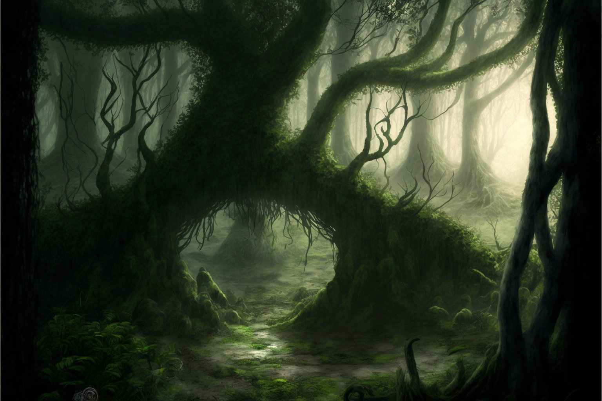

**(Sunday, Dec 4th, 2022; in the [Feywild](<../../../cosmology/multiverse/echo-realms/feywild/feywild.md>), evening; in Taelgar, Nov 15th)**

Our session begins at Lastlight Falls in the fey realm of [Amberglow](<../../../cosmology/multiverse/echo-realms/feywild/amberglow.md>), where [Seeker](<../../../people/pcs/dunmar-fellowship/seeker.md>) has come with the aid of [Caulaus](<../../../people/pcs/dunmar-fellowship/guests/caulaus.md>), [Raven](<../../../people/pcs/dunmar-fellowship/guests/raven.md>), and [Spirala](<../../../people/pcs/dunmar-fellowship/guests/spirala.md>), though [Raven](<../../../people/pcs/dunmar-fellowship/guests/raven.md>) and [Spirala](<../../../people/pcs/dunmar-fellowship/guests/spirala.md>) have returned to [Shimmersong](<../../../cosmology/multiverse/echo-realms/feywild/shimmersong.md>).  [Kenzo](<../../../people/pcs/dunmar-fellowship/kenzo.md>) is waiting, and [Wellby](<../../../people/pcs/dunmar-fellowship/wellby.md>) arrives shortly afterward. Lastlight Falls is a place close to the [Cloudspinner](<../../../people/extraplanar-powers/cloudspinner.md>)'s attention, and the session begins with her [memories](<../../../people/extraplanar-powers/cloudspinner.md#97cec2>). 

{width="600"}

[Kenzo](<../../../people/pcs/dunmar-fellowship/kenzo.md>) and [Wellby](<../../../people/pcs/dunmar-fellowship/wellby.md>) are introduced to [Caulaus](<../../../people/pcs/dunmar-fellowship/guests/caulaus.md>), which involves a bit of discussion over [Caulaus](<../../../people/pcs/dunmar-fellowship/guests/caulaus.md>)' evident confusion over the current time. [Caulaus](<../../../people/pcs/dunmar-fellowship/guests/caulaus.md>) speaks of [Drankor](<../../../history/drankorian-era/drankor.md>), and a battle against dragons, and fleeing. But even after questioning, he remembers little else: his appointment ceremony with [Helea](<../../../people/historical-figures/drankorian-emperors/helea.md>), a feast with [elves](<../../../species/children-of-the-embodied-gods/elves/elves.md>) perhaps on the frontier somewhere, but no details the party asks after. 

As [Seeker](<../../../people/pcs/dunmar-fellowship/seeker.md>), [Wellby](<../../../people/pcs/dunmar-fellowship/wellby.md>), and [Kenzo](<../../../people/pcs/dunmar-fellowship/kenzo.md>) great each other in reunion, attention turns to [Typhina](<../../../people/fey/typhina.md>), who warns [Seeker](<../../../people/pcs/dunmar-fellowship/seeker.md>) telepathically that there are dangers here, and she has enemies. The grove she defended, and the place where she claims she can be resurrected, is near, and she suggests heading there quickly, as [Wellby](<../../../people/pcs/dunmar-fellowship/wellby.md>) spies flying creatures in the distance, but closing fast. 

The party sets off at a quick pace, hoping to outrun the creatures, while [Typhina](<../../../people/fey/typhina.md>) describes the Heartwood Grove and the tree of the essence of wood. However, the creatures gain, slowly but surely, and the party is forced to find a defensible position, recognizing they are harpies. The battle is not that difficult, except that [Seeker](<../../../people/pcs/dunmar-fellowship/seeker.md>) is lured and charmed by them, as they keep insisting that he give them [Dasoclese](<../../../people/fey/agata.md>) (which [Typhina](<../../../people/fey/typhina.md>) says is her name, here, once, long ago). It seems they are seeking revenge against her, for some slight in the distant past. Still, the battle progresses, and as the harpies die one by one, they shift their forms into [Fey](<../../../species/children-of-the-divine/fey/fey.md>) women of different forms. As some turn to flee and [Kenzo](<../../../people/pcs/dunmar-fellowship/kenzo.md>) stuns the rest, the battle ends. 

The party bargins to exchange the answers to three questions, and agreeing not to use her charms or songs on any of them for a day, for the lives of the remaining harpies. From the harpies, they learn that Dasocles is an ancient fey, who once claimed to be a guardian of these parts. The harpies seek revenge on her, for the wrongs she did to their people. And they do not know how to end their curse, except perhaps should the [Cloudspinner](<../../../people/extraplanar-powers/cloudspinner.md>) return. 

[Typhina](<../../../people/fey/typhina.md>) explains some of her history with the harpies, and claims not to have cursed them; instead, she simply kept them from the forest as gently as she could (although later relevalations call the true of this into question). 

From here, the party proceeds, crossing the dry riverbed of the River of Time that no longer flows here, and finding the grotto of the nymph [Melusine](<../../../people/fey/melusine.md>), supposedly an old friend and ally of [Typhina](<../../../people/fey/typhina.md>).

{width="600"}

The party speaks with [Typhina](<../../../people/fey/typhina.md>) and [Melusine](<../../../people/fey/melusine.md>), about [Agata](<../../../people/fey/agata.md>), and the fey, and [Typhina's story](<../treasure/treasure-from-agata/ring-of-the-warded-mind.md#typhinas-story>), but come to no real conclusions and decide to continue to the Heartwood Grove.

The party arrives in the grove, seeing the massive tree before them, and [Seeker](<../../../people/pcs/dunmar-fellowship/seeker.md>) steps forward to give the [Ring of the Warded Mind](<../treasure/treasure-from-agata/ring-of-the-warded-mind.md>) to the tree, when evil laughter begins to echo through the woods. Emerging from the ring, reformed, is not [Typhina](<../../../people/fey/typhina.md>), but [Agata](<../../../people/fey/agata.md>) Dustmother, who has been pretending to be [Typhina](<../../../people/fey/typhina.md>) for months. 

{width="600"}

[Agata](<../../../people/fey/agata.md>) greets the party cheerfully, thanking them for the chaos they have caused in her name ("The best civil war is always one where every side believes they are righteous"), and offers to send them back to the material plane. Before she can finish speaking, [Wellby](<../../../people/pcs/dunmar-fellowship/wellby.md>) attacks, and the battle is joined. The party, however, has gotten much stronger since they last faced [Agata](<../../../people/fey/agata.md>), and she does not present a lethal danger. [Caulaus](<../../../people/pcs/dunmar-fellowship/guests/caulaus.md>) with his echo deal an incredible amount of damage, including the killing blow, aided by [Kenzo](<../../../people/pcs/dunmar-fellowship/kenzo.md>)'s stunning strike.

[Kenzo](<../../../people/pcs/dunmar-fellowship/kenzo.md>) speaks with the elder tree of the grove, asking what is to be done. The grove asks for a new guardian, and [Caulaus](<../../../people/pcs/dunmar-fellowship/guests/caulaus.md>) agrees to take on the role, until the [Cloudspinner](<../../../people/extraplanar-powers/cloudspinner.md>) returns and he can make amends for the wrongs he cannot remember. And so [Agata](<../../../people/fey/agata.md>) is imprisoned in a tree, a fate she imposed on so many, and the party listens to [Caulaus](<../../../people/pcs/dunmar-fellowship/guests/caulaus.md>)' story before they leave, which [Kenzo](<../../../people/pcs/dunmar-fellowship/kenzo.md>) [records](<../collected-stories/caulaus-story.md>).

We end the session as the party returns to Lastlight Falls and exits the [Feywild](<../../../cosmology/multiverse/echo-realms/feywild/feywild.md>) at sunset, to see [Delwath](<../../../people/pcs/dunmar-fellowship/delwath.md>) camped, waiting for them on the other side. 

