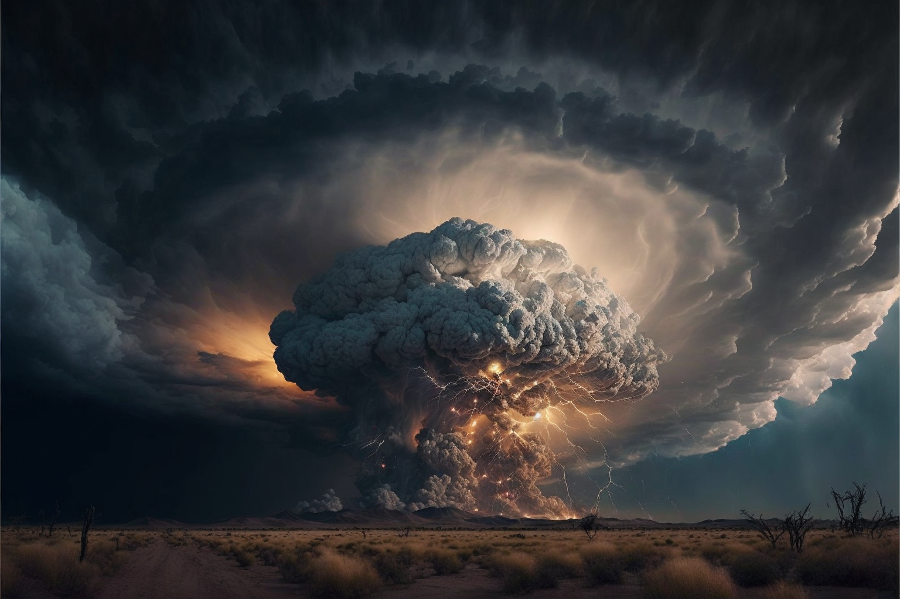

# Session 63, Dunmar Frontier
*in which the party journeys across Dunmar to Stormcaller Tower.*

**In the real world:** Monday, Jan 16th, 2023
**In Taelgar:** 15 Nov 1748 - 23 Nov 1748

## Summary

[Delwath](<../../../people/pcs/dunmar-fellowship/delwath.md>), [Riswynn](<../../../people/pcs/dunmar-fellowship/riswynn.md>), [Seeker](<../../../people/pcs/dunmar-fellowship/seeker.md>), [Wellby](<../../../people/pcs/dunmar-fellowship/wellby.md>), and [Kenzo](<../../../people/pcs/dunmar-fellowship/kenzo.md>) travel incognito across the plains of [Dunmar](<../../../gazetteer/greater-dunmar/realms/dunmar/dunmar.md>) to [Stormcaller Tower](<../../../gazetteer/greater-dunmar/dunmari-basin/stormcaller-tower.md>), using magic to gather what information they can along the way. [Havdar](<../../../people/dunmari/havdar.md>)'s curse is lifted. They arrive at the [Stormcaller Tower](<../../../gazetteer/greater-dunmar/dunmari-basin/stormcaller-tower.md>) where [Hralgar](<../../../people/giants/hralgar.md>)'s storm is intense, and must make a decision.

## Notes and Information

Start: 15 Nov 1748, late evening, camped outside the fey crossing at Lastlight Falls
End: 23 Nov 1748, late afternoon, camped outside the storm surrounding [Stormcaller Tower](<../../../gazetteer/greater-dunmar/dunmari-basin/stormcaller-tower.md>)

#### Eudomes’ Mirror:
- [Mace of Terror Vision](<../mirror-visions/mace-of-terror-vision.md>) (retcon from [Session 50 (DuFr)](<./session-50-dufr.md>))
- [Hralgar's Eyes Vision](<../mirror-visions/hralgar-s-eyes-vision.md>) (retcon from [Session 50 (DuFr)](<./session-50-dufr.md>))
- (DR:: 1748-11-15) [Cha'mutte Armband Vision](<../mirror-visions/cha-mutte-armband-vision.md>) see in The Mirror of the Past (recharge:: mirror)

#### Divine Inspiration
- (DR:: 1748-11-20): Riswynn's prayers are granted by the Bahrazel, freeing Havdar from his cursed sword. (recharge:: "divine inspiration")
#### Commune
| Question                                                                 | Answer      | Date        |
| :------------------------------------------------------------------------ | :----------- | :----------- |
| Will Kadmos help [Grash](<../../../people/other-nonhumans/grash.md>)?                                          | **YES**     | 20 Nov 1748 |
| Will Kadmos steal from [Grash](<../../../people/other-nonhumans/grash.md>)?                                    | **NO**      | 20 Nov 1748 |
| Is Kadmos heading for us?                                            | **NO**      | 20 Nov 1748 |
| Is [Grash](<../../../people/other-nonhumans/grash.md>) working for Fausto?                                     | **NO**      | 21 Nov 1748 |
| Is Fausto working for [Grash](<../../../people/other-nonhumans/grash.md>)?                                     | **NO**      | 21 Nov 1748 |
| Are [Grash](<../../../people/other-nonhumans/grash.md>) and Fausto working for Apollyon? | **YES**     | 21 Nov 1748 |
| Can a person be restored after being Cleasned?                           | **UNCLEAR** | 22 Nov 1748 |
| Are we being hunted by enslaved monsters of Fausto's?                | **YES**     | 22 Nov 1748 |
| Are they within a week of us?                                            | **NO**      | 22 Nov 1748 |
| Was Apollyon behind [Sura](<../../../people/dunmari/sura.md>)'s kidnapping?          | **NO**      | 23 Nov 1748 |

## Timeline

- (DR:: 1748-11-15): *(evening)* [Wellby](<../../../people/pcs/dunmar-fellowship/wellby.md>), [Seeker](<../../../people/pcs/dunmar-fellowship/seeker.md>), [Kenzo](<../../../people/pcs/dunmar-fellowship/kenzo.md>), [Delwath](<../../../people/pcs/dunmar-fellowship/delwath.md>) and [Riswynn](<../../../people/pcs/dunmar-fellowship/riswynn.md>) talk and catch up. Use the mirror to look at Cha'mutte’s Shadow Armband before sleep.
- (DR:: 1748-11-16): [Kenzo](<../../../people/pcs/dunmar-fellowship/kenzo.md>) is uncursed by [Riswynn](<../../../people/pcs/dunmar-fellowship/riswynn.md>), sacrificing his Horn of Silent Alarm in the process; [Riswynn](<../../../people/pcs/dunmar-fellowship/riswynn.md>) speaks with [Johar](<../../../people/dunmari/johar.md>) via sending. Party travels west towards [Stormcaller Tower](<../../../gazetteer/greater-dunmar/dunmari-basin/stormcaller-tower.md>).
- (DR:: 1748-11-17): Travel west; speak with [Johar](<../../../people/dunmari/johar.md>) via Sending; scry on Hektor.
- (DR:: 1748-11-18): Travel west; learn [Johar](<../../../people/dunmari/johar.md>) is meeting with Samraat [Nayan Karnas](<../../../people/dunmari/nayan-karnas.md>); detour around some ogres.
- (DR:: 1748-11-19): Arrive south of [Raven's Hold](<../../../gazetteer/greater-dunmar/dunmari-basin/raven-s-hold.md>). Scout, discover it is quiet; camp early.
- (DR:: 1748-11-20):  [Riswynn](<../../../people/pcs/dunmar-fellowship/riswynn.md>)'s prayers are answered and [Havdar](<../../../people/dunmari/havdar.md>)'s cursed sword is destroyed by the Baharazel, freeing him of its influence. Send a message with sending to apologize. Travel west.
- (DR:: 1748-11-21): Travel west.
- (DR:: 1748-11-22): Travel west.
- (DR:: 1748-11-123): *(mid-afternoon)* Arrive at [Stormcaller Tower](<../../../gazetteer/greater-dunmar/dunmari-basin/stormcaller-tower.md>), spend time planning and scouting with spells. 
## Narrative

We begin as the party settles in for the night outside Lastlight Falls, after a long evening of talking and reconnecting. In the morning, [Riswynn](<../../../people/pcs/dunmar-fellowship/riswynn.md>) prepares the magic she needs to attempt to free [Kenzo](<../../../people/pcs/dunmar-fellowship/kenzo.md>) from the cursed chain bound to his soul from his encounter with [Motua](<../../../people/extraplanar-powers/motua.md>). The ritual succeeds, with the aid of the prayers of [Delwath](<../../../people/pcs/dunmar-fellowship/delwath.md>) to the tanshi and [Seeker](<../../../people/pcs/dunmar-fellowship/seeker.md>)'s runic inspiration magic, and [Kenzo](<../../../people/pcs/dunmar-fellowship/kenzo.md>) is freed, at the cost of the Horn of Silent Alarm carried for many months. 

Over the course of the next week, the party falls into a routine as they hurry across the plains of [Dunmar](<../../../gazetteer/greater-dunmar/realms/dunmar/dunmar.md>), now sprung to life with the monsoon rains.

[Riswynn](<../../../people/pcs/dunmar-fellowship/riswynn.md>) prays each morning to the Baharazel, asking them to free [Havdar](<../../../people/dunmari/havdar.md>) of the curse that binds him to the Medusa Blade, taken from [Agata's lair](<../../../gazetteer/greater-dunmar/dunmari-basin/agata-s-lair.md>) and gifted to [Havdar](<../../../people/dunmari/havdar.md>) by the party. As the party travels, they send messages to [Johar](<../../../people/dunmari/johar.md>) via sending, and [Delwath](<../../../people/pcs/dunmar-fellowship/delwath.md>) keeps an eye on the movements of Kadmos and company via scrying. 

From brief conversations, they learn that [Johar](<../../../people/dunmari/johar.md>) is alive, and well enough treated, although he has not been allowed to see Samraat [Nayan Karnas](<../../../people/dunmari/nayan-karnas.md>), apparently because of the Samraat's (perhaps justifiably?) paranoid belief that [Agata](<../../../people/fey/agata.md>) is somehow behind [Sura](<../../../people/dunmari/sura.md>)'s reemergence. Not trusting [Johar](<../../../people/dunmari/johar.md>) to be who he says he is, Karnas has summoned a wizard from Chardon and a mystai of [Sonkar](<../../../cosmology/gods/incorporeal-gods/dunmari/sonkar.md>) who are both gifted with the power of true sight, who will vouch for [Johar](<../../../people/dunmari/johar.md>) before he can speak with Karnas. From brief visions via scrying, they learn that Kadmos continues east, towards [Kharsan](<../../../gazetteer/greater-dunmar/dunmari-basin/kharsan.md>), through the [Garamjala Desert](<../../../gazetteer/greater-dunmar/garamjala-plateau/garamjala-desert.md>).

Half way through the journey, the party arrives south of [Raven's Hold](<../../../gazetteer/greater-dunmar/dunmari-basin/raven-s-hold.md>), and stops early to scout. Flying above the fort and castle, [Wellby](<../../../people/pcs/dunmar-fellowship/wellby.md>) sees no signs of habitation. A mass grave outside the [dwarven outpost](<../../../gazetteer/greater-dunmar/dunmari-basin/dwarven-outpost-raven-s-hold.md>) is the only new change since the party was last here, many months ago. Recalling the news from [Tharn Todor](<../../../gazetteer/greater-dunmar/realms/nardith/tharn-todor.md>), the party infers this must been the remains of [Inakara](<../../../people/other-nonhumans/inakara.md>) and her kin, the worshippers of mind flayers slain by Magran Boulderbeard and a company of [Dwarves](<../../../species/children-of-the-embodied-gods/dwarves/dwarves.md>) some months ago. 

The next day, the [Bahrazel](<../../../cosmology/gods/embodied-gods/bahrazel.md>) answer [Riswynn](<../../../people/pcs/dunmar-fellowship/riswynn.md>)'s prayers. In her morning prayers, she is briefly transported, seeing a vision of [Havdar](<../../../people/dunmari/havdar.md>) in camp, waking and immediately reaching for his sword, when his hands are grasped by those of an old [dwarf](<../../../species/children-of-the-embodied-gods/dwarves/dwarves.md>), and a voice in Dwarven echos, saying, "No. You are free," as the sword turns to a snake and begins to slither away, before shattering to dust. Scrying over the course of the day reveals [Havdar](<../../../people/dunmari/havdar.md>) unsettled and deep in thought, and then blaming Chardon for the curse, advocating for immediate war. This prompts the party to reach out via Sending, apologizing for the party's mistake in gifting him the sword, saying they had no knowledge of its curse, to which [Havdar](<../../../people/dunmari/havdar.md>) can only reply: "Shit. Really?" The [Bahrazel](<../../../cosmology/gods/embodied-gods/bahrazel.md>) also, during the course of the journey, answer some of the parties questions. 

A week after leaving the camp at Lastlight Falls, the party arrives outside the [Stormcaller Tower](<../../../gazetteer/greater-dunmar/dunmari-basin/stormcaller-tower.md>), where [Hralgar](<../../../people/giants/hralgar.md>)'s storm has grown in strength and size, now stretching several miles across the plains. The rain has turned the ground to mud and water pools everywhere. 

Between [Seeker](<../../../people/pcs/dunmar-fellowship/seeker.md>)'s clairvoyance and [Kenzo](<../../../people/pcs/dunmar-fellowship/kenzo.md>)'s ability to commune with nature and the land, it is clear that [Hralgar](<../../../people/giants/hralgar.md>) is lost more deeply in his mind than before, and the storm is more intense. The eye that previously left the tower open to the sky is gone, and lightning and thunder echos from the clouds. 

We end as the party contemplates their next move, and whether a journey into the [Dreamworld](<../../../cosmology/multiverse/spiritual-realms/proximate-realms/dreamworld.md>) is necessary to calm [Hralgar](<../../../people/giants/hralgar.md>) and allow them to approach.