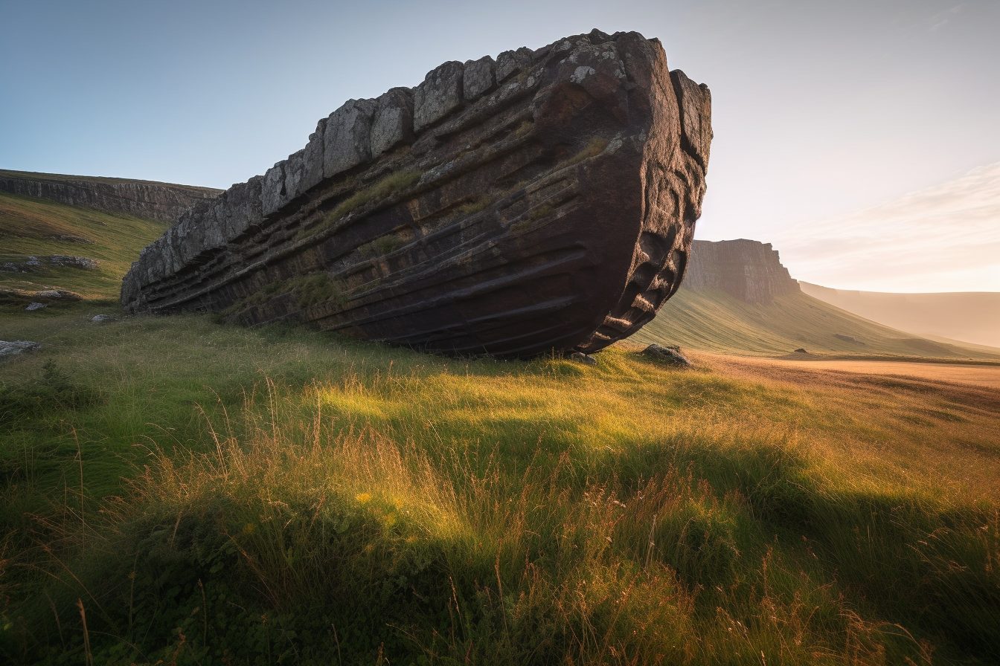
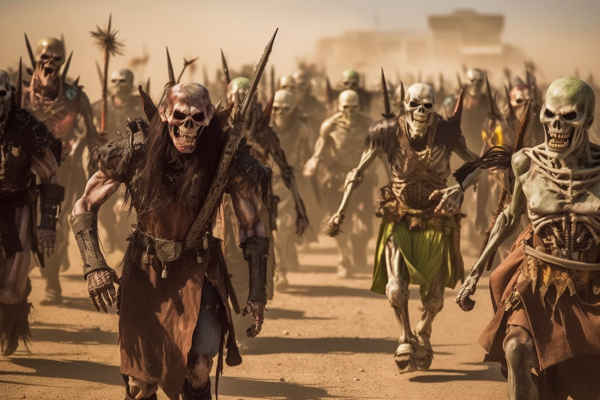

*in which the party repairs the skyship [Vindristjarna](<../../../things/ships/vindristjarna.md>)

**In the real world:** Thursday, March 30th, 2023
**In Taelgar:** 24 Nov 1748 to 29 Nov 1748 

## Summary
[Kenzo](<../../../people/pcs/dunmar-fellowship/kenzo.md>), [Wellby](<../../../people/pcs/dunmar-fellowship/wellby.md>), [Seeker](<../../../people/pcs/dunmar-fellowship/seeker.md>), [Delwath](<../../../people/pcs/dunmar-fellowship/delwath.md>), and [Riswynn](<../../../people/pcs/dunmar-fellowship/riswynn.md>) camp at the ruins of [Vindristjarna](<../../../things/ships/vindristjarna.md>), working to repair the control mechanisms that let it fly. 

## Notes and Information

Start: evening, Nov 24th 1748
End: night, Nov 29th 1748

## Timeline

- (DR:: 1748-11-24): *(evening)* Return to the crash of [Vindristjarna](<../../../things/ships/vindristjarna.md>) by evening with [Hralgar](<../../../people/giants/hralgar.md>)'s wind blessing.
- (DR:: 1748-11-25): Work on skyship. Convert [Delwath](<../../../people/pcs/dunmar-fellowship/delwath.md>)'s shield to an adamantine harness to hold phasing stone.
- (DR:: 1748-11-26): Work on skyship, finishing the stone helm on which the phasing stone will be mounted; scry on [Kharsan](<../../../gazetteer/greater-dunmar/dunmari-basin/kharsan.md>), Kadmos.
- (DR:: 1748-11-27):  Work on skyship, converting gold and silver to wire to construct the channeling device. Meet [Alesh](<../../../people/dunmari/alesh.md>); speak with her about events in [Dunmar](<../../../gazetteer/greater-dunmar/realms/dunmar/dunmar.md>) and give her letter and sending stone for [Sura](<../../../people/dunmari/sura.md>). Sending with Ulfgar and [Govir](<../../../people/dunmari/govir.md>), who both agree to do research.
- (DR:: 1748-11-28): Continue to work on the channeling device; scry [Kharsan](<../../../gazetteer/greater-dunmar/dunmari-basin/kharsan.md>) and see army leaving. [Seeker](<../../../people/pcs/dunmar-fellowship/seeker.md>) dreams of shadow hunter threatening that he is coming.
- (DR:: 1748-11-29): Finish work on [Vindristjarna](<../../../things/ships/vindristjarna.md>). [Seeker](<../../../people/pcs/dunmar-fellowship/seeker.md>) attunes to the phasing stone, begins to practice flying. Shadow dogs attack at midnight.

## Narrative

We begin at dusk, at site of the crashed [airship](<../../../things/ships/vindristjarna.md>), as the party settles in for the night and begins to determine what is necessary to repair [Vindristjarna](<../../../things/ships/vindristjarna.md>). From the notes and information gleaned in [Hralgar](<../../../people/giants/hralgar.md>)'s library, [Seeker](<../../../people/pcs/dunmar-fellowship/seeker.md>), [Riswynn](<../../../people/pcs/dunmar-fellowship/riswynn.md>), and [Delwath](<../../../people/pcs/dunmar-fellowship/delwath.md>) are able to determine that three steps are necessary to repair the ship: the construction of an adamantine harness for the phasing stone; the construction of stone console to hold the phasing stone apparatus; and the construction of a gold and silver focus to channel the energy. 

Over the next two days, [Seeker](<../../../people/pcs/dunmar-fellowship/seeker.md>) and [Riswynn](<../../../people/pcs/dunmar-fellowship/riswynn.md>) work to construct the adamantine harness and the stone console to mount the phasing stone to, guided by [Riswynn](<../../../people/pcs/dunmar-fellowship/riswynn.md>)'s magic and the knowledge of both the [Dwarves](<../../../species/children-of-the-embodied-gods/dwarves/dwarves.md>). During these days of work, [Wellby](<../../../people/pcs/dunmar-fellowship/wellby.md>) and [Kenzo](<../../../people/pcs/dunmar-fellowship/kenzo.md>) tend the camp and keep watch, and Delawth scrys, seeing Kadmos and company marching in the desert to the south, in the heart of the [Garamjala](<../../../gazetteer/greater-dunmar/garamjala-plateau/garamjala-desert.md>). 

On the third day, November 27th, [Riswynn](<../../../people/pcs/dunmar-fellowship/riswynn.md>) and [Seeker](<../../../people/pcs/dunmar-fellowship/seeker.md>) construct considerable quantities of gold and silver thread with [Riswynn](<../../../people/pcs/dunmar-fellowship/riswynn.md>)'s magic, to shape and forge the final piece of the control apparatus for [Vindristjarna](<../../../things/ships/vindristjarna.md>). [Wellby](<../../../people/pcs/dunmar-fellowship/wellby.md>), however, sees a rider on the horizon, and heads to scout, finding [Alesh](<../../../people/dunmari/alesh.md>) riding towards the former site of the [Stormcaller Tower](<../../../gazetteer/greater-dunmar/dunmari-basin/stormcaller-tower.md>).

From [Alesh](<../../../people/dunmari/alesh.md>), the party gets news about [Dunmar](<../../../gazetteer/greater-dunmar/realms/dunmar/dunmar.md>). She is riding from [Karawa](<../../../gazetteer/greater-dunmar/realms/dunmar/eastern-dunmar/karawa.md>) to [Sura](<../../../people/dunmari/sura.md>)'s camp, and stopped to investigate the weird lack of a storm near [Stormcaller Tower](<../../../gazetteer/greater-dunmar/dunmari-basin/stormcaller-tower.md>), called the Tower of the Wild Wind by the Dunmari. Among bits of personal gossip and historical trivia, the party learns that a band of [Orcs](<../../../species/children-of-the-embodied-gods/orcs/orcs.md>) (the Dustthorn Horde, the remnants of [Agata](<../../../people/fey/agata.md>)'s allies) attacked the border near [Karawa](<../../../gazetteer/greater-dunmar/realms/dunmar/eastern-dunmar/karawa.md>), desperate for food. Several were captured and told their interrogators that [Agata](<../../../people/fey/agata.md>) was behind Karnas' ascension to the throne, and he was working for her. 

[Alesh](<../../../people/dunmari/alesh.md>) also reported that [Cintra](<../../../people/dunmari/cintra.md>) has been consumed with dreams, and says that [Shakun](<../../../cosmology/gods/incorporeal-gods/dunmari/shakun.md>) told her: "My aunts and uncles are playing a dangerous game. That the armies of [Karnas](<../../../people/dunmari/nayan-karnas.md>) and [Sura](<../../../people/dunmari/sura.md>) must meet, but not in battle, or the silence will spread and [Dunmar](<../../../gazetteer/greater-dunmar/realms/dunmar/dunmar.md>) will be no more." Few know quite what to make of this, but at least in [Karawa](<../../../gazetteer/greater-dunmar/realms/dunmar/eastern-dunmar/karawa.md>) it is still believed the greater danger is from the East. Wanting to convince [Sura](<../../../people/dunmari/sura.md>) to march her armies East to be ready to meet [Grash](<../../../people/other-nonhumans/grash.md>) if needed, the party writes a letter to [Sura](<../../../people/dunmari/sura.md>) and gives [Alesh](<../../../people/dunmari/alesh.md>) the letter and a Sending Stone to deliver, as she departs. 

Meanwhile, [Seeker](<../../../people/pcs/dunmar-fellowship/seeker.md>) and [Riswynn](<../../../people/pcs/dunmar-fellowship/riswynn.md>) convert 800 gold and 800 silver coins into several pounds of metal wire, and begin to construct the phasing stone apparatus, using a perfect emerald from [Grimbaskal](<../../../people/other-nonhumans/mezzar.md>)'s Hoard as a gemstone focus. As the day progresses, [Riswynn](<../../../people/pcs/dunmar-fellowship/riswynn.md>) also speaks via Sending with Ulfgar, in Chardon, and [Govir](<../../../people/dunmari/govir.md>), in [Tokra](<../../../gazetteer/greater-dunmar/realms/dunmar/central-dunmar/tokra/tokra.md>), both of whom agree to research what they can about Apollyon and his magical artifacts, and will be available for scrying to read notes at sunset in a week's time. 

The next day, [Seeker](<../../../people/pcs/dunmar-fellowship/seeker.md>) and [Riswynn](<../../../people/pcs/dunmar-fellowship/riswynn.md>) continue to work on the channeling device, while [Delwath](<../../../people/pcs/dunmar-fellowship/delwath.md>) scries [Kharsan](<../../../gazetteer/greater-dunmar/dunmari-basin/kharsan.md>) and sees [Grash](<../../../people/other-nonhumans/grash.md>)'s army leaving. 

That evening, the night of Nov 28th, [Seeker](<../../../people/pcs/dunmar-fellowship/seeker.md>) has a dream, a shadow hunter threatening that he is coming soon for them. 

The next day, Nov 29th, is spent finishing the work on [Vindristjarna](<../../../things/ships/vindristjarna.md>). By evening, the ship is ready for flight, and [Seeker](<../../../people/pcs/dunmar-fellowship/seeker.md>) attunes to the phasing stone and begins to practice flying. 

The session ends around midnight, as the party is awakened by the howls of hunting dogs, lead by the shadow hunter from [Seeker](<../../../people/pcs/dunmar-fellowship/seeker.md>)'s dreams. 