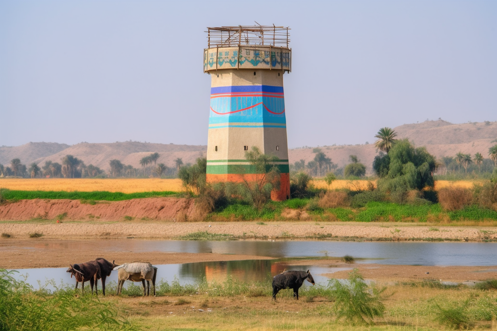

*in which the party defeats the shadow hunters, and heads east

**In the real world:** Monday, April 11th, 2023
**In Taelgar:** 29 Nov 1748 to 4 Dec 1748

## Summary

## Notes and Information

Start: night, Nov 29th 1748
End: early morning, Dec 4th
## Timeline

- Nov 29, 1748 DR: *(midnight)* Shadow hunters attack at midnight. Defeated, but not before the shadow assassin knocked [Kenzo](<../../../people/pcs/dunmar-fellowship/kenzo.md>) unconscious and attempts to flee with him.
- Nov 30, 1748 DR: [Seeker](<../../../people/pcs/dunmar-fellowship/seeker.md>) spends the day learning to control and fly [Vindristjarna](<../../../things/ships/vindristjarna.md>), while the rest of the party prepares for the journey east.
- Dec 1, 1748 DR: [Kenzo](<../../../people/pcs/dunmar-fellowship/kenzo.md>) attunes to the phasing stone and spends the day learning to control and fly [Vindristjarna](<../../../things/ships/vindristjarna.md>); speak with [Sura](<../../../people/dunmari/sura.md>) via Sending Stone
- Dec 2, 1748 DR: [Riswynn](<../../../people/pcs/dunmar-fellowship/riswynn.md>) asks the Baharazel about their chosen course of action; [Delwath](<../../../people/pcs/dunmar-fellowship/delwath.md>)'s lynx spirit leaves to take letters to Lakan monks; take off flying east, with [Kenzo](<../../../people/pcs/dunmar-fellowship/kenzo.md>) and [Seeker](<../../../people/pcs/dunmar-fellowship/seeker.md>) alternating piloting; fly 22 hours
- Dec 3, 1748 DR: Continue flying east, [Kenzo](<../../../people/pcs/dunmar-fellowship/kenzo.md>) and [Seeker](<../../../people/pcs/dunmar-fellowship/seeker.md>) alternating over 22 hours
- Dec 4, 1748 DR: See at the edge of the [Orcs](<../../../species/children-of-the-embodied-gods/orcs/orcs.md>) territory from the air, maybe 40-50 miles distant, in the early morning light.

## Narrative

The session begins as the party is awakened by the howls of shadow dogs, the same chalyte zombie assassins created by [Fausto](<../../../people/chardonians/fausto.md>) that chased [Kenzo](<../../../people/pcs/dunmar-fellowship/kenzo.md>), [Seeker](<../../../people/pcs/dunmar-fellowship/seeker.md>), [Wellby](<../../../people/pcs/dunmar-fellowship/wellby.md>), and [Delwath](<../../../people/pcs/dunmar-fellowship/delwath.md>) down on the flight from [Chardon](<../../../gazetteer/west-coast/chardonian-empire/chardon/chardon.md>). 

{width="300"}{width="300"}

While [Delwath](<../../../people/pcs/dunmar-fellowship/delwath.md>) peels off to fight a flying shadow demon, and [Seeker](<../../../people/pcs/dunmar-fellowship/seeker.md>) begins to steer the skyship towards the fight, the rest of the party engages. [Kenzo](<../../../people/pcs/dunmar-fellowship/kenzo.md>) attacks the lead assassin, while [Riswynn](<../../../people/pcs/dunmar-fellowship/riswynn.md>) summons a sunbeam to blast away the shadows and [Wellby](<../../../people/pcs/dunmar-fellowship/wellby.md>) takes careful aim at everything he can see. But the shadow dogs vanish into the darkness, even as [Seeker](<../../../people/pcs/dunmar-fellowship/seeker.md>) animates the [Ladder](<../../../people/pcs/dunmar-fellowship/companions/ladder.md>) to stand guard, and emerge, surrounding [Seeker](<../../../people/pcs/dunmar-fellowship/seeker.md>), on the deck of the ship. Under heavy attack, [Seeker](<../../../people/pcs/dunmar-fellowship/seeker.md>) polymorphs himself into a giant ape-like yeti, while [Kenzo](<../../../people/pcs/dunmar-fellowship/kenzo.md>) is brought down by a blast of necrotic energy from the assassin, who, leaving the dogs to distract the party, begins to flee with [Kenzo](<../../../people/pcs/dunmar-fellowship/kenzo.md>). For a moment it looks like things will be okay, with [Riswynn](<../../../people/pcs/dunmar-fellowship/riswynn.md>) healing [Kenzo](<../../../people/pcs/dunmar-fellowship/kenzo.md>), but then [Riswynn](<../../../people/pcs/dunmar-fellowship/riswynn.md>) is driven off by the shadow assassin's fear spell, [Kenzo](<../../../people/pcs/dunmar-fellowship/kenzo.md>) is knocked out again, and it is only [Wellby](<../../../people/pcs/dunmar-fellowship/wellby.md>)'s perfect shot that brings down the shadow assassin before he can escape with [Kenzo](<../../../people/pcs/dunmar-fellowship/kenzo.md>)'s unconscious body. The shadow assassin turns, in death, to a normal, if ragged looking [human](<../../../species/humans/humans.md>) man, a pallid, haunted look on his face in death. As the rest of the party cleans up the shadow dogs, [Wellby](<../../../people/pcs/dunmar-fellowship/wellby.md>) tends to [Kenzo](<../../../people/pcs/dunmar-fellowship/kenzo.md>)'s wounds, stabilizing him. 

The next morning, the party prepares for the journey east while [Seeker](<../../../people/pcs/dunmar-fellowship/seeker.md>) continues to practice with [Vindristjarna](<../../../things/ships/vindristjarna.md>). The day passes uneventfully after the chaos of the night before; [Delwath](<../../../people/pcs/dunmar-fellowship/delwath.md>) hunts and preserves some antelope for the trip, and [Riswynn](<../../../people/pcs/dunmar-fellowship/riswynn.md>) continues to clear rubble from the deck of the ship. Deciding that having two people able to control [Vindristjarna](<../../../things/ships/vindristjarna.md>) would speed the journey, the party plans on taking the next day for [Kenzo](<../../../people/pcs/dunmar-fellowship/kenzo.md>) to learn the workings of the phasing stone, before heading east.

Around lunchtime the next day, December 1st, [Kenzo](<../../../people/pcs/dunmar-fellowship/kenzo.md>)'s practice is interrupted by [Sura](<../../../people/dunmari/sura.md>)'s voice coming from the Sending Stone. [Sura](<../../../people/dunmari/sura.md>) tells the party that, while she appreciates the warnings of danger to the east, she cannot march her army across the plains while leaving [Tokra](<../../../gazetteer/greater-dunmar/realms/dunmar/central-dunmar/tokra/tokra.md>) unwatched in her rear, especially not with a small force of Chardonian mages still camped outside the city. [Sura](<../../../people/dunmari/sura.md>) says that they plan to ride for [Tokra](<../../../gazetteer/greater-dunmar/realms/dunmar/central-dunmar/tokra/tokra.md>), to claim the city and expel the Chardonians. [Sura](<../../../people/dunmari/sura.md>) tells them that in about 20 days, is the [Day of Atonement](<../../../time/holidays-and-festivals/dunmari-festivals/day-of-atonement.md>), [Sonkar](<../../../cosmology/gods/incorporeal-gods/dunmari/sonkar.md>)'s Day, which begins the most holy month of the year, and she will not wage war then, and neither will the Samraat [Nayan Karnas](<../../../people/dunmari/nayan-karnas.md>). So [Tokra](<../../../gazetteer/greater-dunmar/realms/dunmar/central-dunmar/tokra/tokra.md>) must be taken soon, or not at all. 

There is some debate, about whether the better course of action is to march her army east, now, to defend the borders should the party fail, or whether to take [Tokra](<../../../gazetteer/greater-dunmar/realms/dunmar/central-dunmar/tokra/tokra.md>) as planned first, to secure her position before [Grash](<../../../people/other-nonhumans/grash.md>) marches west, should he succeed in acquiring the [Cloak of Rainbows](<../../../things/artifacts-of-power/cloak-of-rainbows.md>).

Wanting the guidance of the gods, the next morning, before the party heads east, [Riswynn](<../../../people/pcs/dunmar-fellowship/riswynn.md>) prays and asks the [Bahrazel](<../../../cosmology/gods/embodied-gods/bahrazel.md>) for insight. Although the gods often speak in riddles, the message [Riswynn](<../../../people/pcs/dunmar-fellowship/riswynn.md>) hears is one of fortification, of strength, that buildings with strong foundations last longer than those with weak roots. Eventually the party agrees this is probably guiding them to leave [Sura](<../../../people/dunmari/sura.md>) to strengthen her position, that she will be better prepared for [Grash](<../../../people/other-nonhumans/grash.md>), if needed, with a solid foundation in the central plains. [Kenzo](<../../../people/pcs/dunmar-fellowship/kenzo.md>) also meditates, and feels the strength of [Dunmar](<../../../gazetteer/greater-dunmar/realms/dunmar/dunmar.md>) as a solid core that maintains [Shakun](<../../../cosmology/gods/incorporeal-gods/dunmari/shakun.md>)'s Protection, and that if the center were lost the protection would fall anyway. But again, no clear, obvious right course of action. 

Speaking to [Sura](<../../../people/dunmari/sura.md>) one final time, [Kenzo](<../../../people/pcs/dunmar-fellowship/kenzo.md>) argues the most important thing is to be united, and if [Sura](<../../../people/dunmari/sura.md>) believes that taking [Tokra](<../../../gazetteer/greater-dunmar/realms/dunmar/central-dunmar/tokra/tokra.md>) is what must happen for an army to be ready to face [Grash](<../../../people/other-nonhumans/grash.md>) should he turn west, the party will not argue against that. [Kenzo](<../../../people/pcs/dunmar-fellowship/kenzo.md>) agrees to send a letter to the Lakan monks, reporting on all that has happened. As he finishes, a spirit steps from [Delwath](<../../../people/pcs/dunmar-fellowship/delwath.md>)'s shield, a lynx, and takes the letter, before racing at speed across the plains for [Tokra](<../../../gazetteer/greater-dunmar/realms/dunmar/central-dunmar/tokra/tokra.md>). 

Over the next two days, the party falls into a routine. [Seeker](<../../../people/pcs/dunmar-fellowship/seeker.md>) pilots the ship for 11 hours, often taking [Vindristjarna](<../../../things/ships/vindristjarna.md>) as high as it can go, into the freezing clouds far, far above the desert, often removing his shirt to feel the cold wind on his bare skin. Then, the ship lands for an hour, for [Kenzo](<../../../people/pcs/dunmar-fellowship/kenzo.md>) to attune to the phasing stone, and [Seeker](<../../../people/pcs/dunmar-fellowship/seeker.md>) rests while [Kenzo](<../../../people/pcs/dunmar-fellowship/kenzo.md>) flies through the night. The cycle then repeats, allowing the party to travel 220 miles per day. 

{width="800"}

On the morning of Dec 4th, the party spies a fertile green crescent along the edge of banks of a river, cattle grazing, and orderly wheat fields watched over by a colorful guard tower on the banks of the river. We end, in the pre-dawn light, as the party considers their course of action, maybe 50 miles from the homeland of the [Orcs](<../../../species/children-of-the-embodied-gods/orcs/orcs.md>) they have come to find.

{width="800"}

