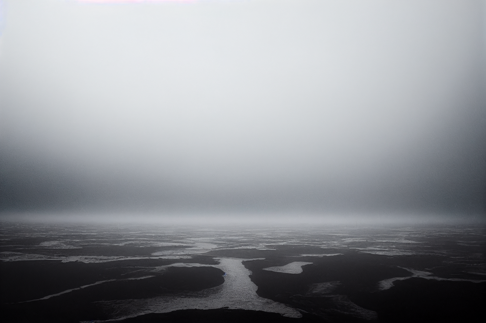
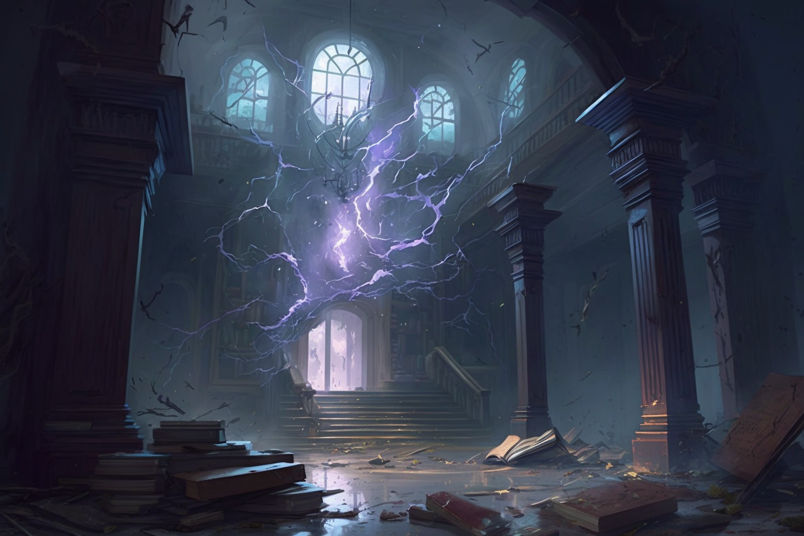
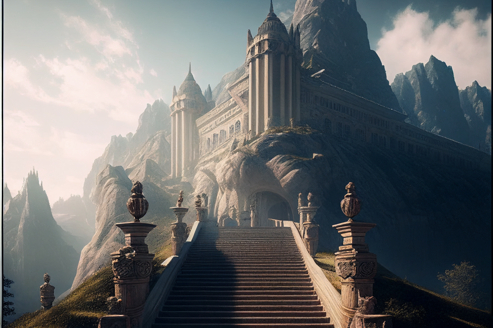

## Notes and Information
*in which the party enters the tower and finds Hralgar*

[Delwath](<../../../people/pcs/dunmar-fellowship/delwath.md>), [Seeker](<../../../people/pcs/dunmar-fellowship/seeker.md>), [Riswynn](<../../../people/pcs/dunmar-fellowship/riswynn.md>), and [Wellby](<../../../people/pcs/dunmar-fellowship/wellby.md>) chase a possessed [Kenzo](<../../../people/pcs/dunmar-fellowship/kenzo.md>) into the storm, braving lightning and wind to reach [Stormcaller Tower](<../../../gazetteer/greater-dunmar/dunmari-basin/stormcaller-tower.md>). There, they meet the giant [Hralgar](<../../../people/giants/hralgar.md>) in his dreamscape, and tell tales that lead him to a clear understanding of his situation. 

Start: 23 Nov 1748, late afternoon, camped outside the storm surrounding [Stormcaller Tower](<../../../gazetteer/greater-dunmar/dunmari-basin/stormcaller-tower.md>)
End: 23 Nov 1748, evening, in Hralgar's dreamscape

#### Character Advancement
- [Seeker](<../../../people/pcs/dunmar-fellowship/seeker.md>), struck full on by a magical lightning blast in [Hralgar](<../../../people/giants/hralgar.md>)'s storm, infused with the giant's magic, learned the Shocking Grasp cantrip while nearly being fried to death. 

## Timeline

- Nov 23, 1748 DR: *(late afternoon)* Enter the storm around [Stormcaller Tower](<../../../gazetteer/greater-dunmar/dunmari-basin/stormcaller-tower.md>), chasing a possessed [Kenzo](<../../../people/pcs/dunmar-fellowship/kenzo.md>). Dodge animated storm elementals protecting the approach. Reach [Hralgar](<../../../people/giants/hralgar.md>)'s dreamscape, bring [Hralgar](<../../../people/giants/hralgar.md>) back to himself with stories. 

## Narrative

We begin as the party stands outside the swirling storm around [Stormcaller Tower](<../../../gazetteer/greater-dunmar/dunmari-basin/stormcaller-tower.md>), listening to the news the winds bring, while deciding what to do as [Kenzo](<../../../people/pcs/dunmar-fellowship/kenzo.md>) mediates and communes with the storm, trying to learn more of it. Suddenly, [Kenzo](<../../../people/pcs/dunmar-fellowship/kenzo.md>) is possessed, his eyes flashing lightning, and he begins to walk into the storm. Having to act quickly, [Riswynn](<../../../people/pcs/dunmar-fellowship/riswynn.md>) and [Wellby](<../../../people/pcs/dunmar-fellowship/wellby.md>) get the animals settled while [Delwath](<../../../people/pcs/dunmar-fellowship/delwath.md>) and [Seeker](<../../../people/pcs/dunmar-fellowship/seeker.md>) get [Hralgar's Eyes](<../treasure/treasure-from-stormcaller-tower/hralgar-s-eyes.md>) from the [Portable Hole](<../treasure/treasure-from-tokra/portable-hole.md>), hoping to convince Hraglar-as-[Kenzo](<../../../people/pcs/dunmar-fellowship/kenzo.md>) to make the storm safe. To no avail, for [Kenzo](<../../../people/pcs/dunmar-fellowship/kenzo.md>) says that the weather is wonderful and charges ahead. Forced to chase, the party plunges into the storm. Enduring intense lightning strikes and thunderous wind that makes conversation impossible, the party  pushes through the storm, following [Kenzo](<../../../people/pcs/dunmar-fellowship/kenzo.md>). 

Deep into the storm, [Hralgar](<../../../people/giants/hralgar.md>)'s whispers echo in [Wellby](<../../../people/pcs/dunmar-fellowship/wellby.md>)'s mind, asking him what he would like to see. Asking for a vision of the place where the [Cloak of Rainbows](<../../../things/artifacts-of-power/cloak-of-rainbows.md>) rests, [Wellby](<../../../people/pcs/dunmar-fellowship/wellby.md>) feels a splitting pain in his head and then his vision is carried away, blown east on the wind, seeing a river, farms, irrigation canals in the desert, a castle built into the cliffs, and sitting on the throne of the castle is an [orc](<../../../species/children-of-the-embodied-gods/orcs/orcs.md>), wearing the [Cloak of Rainbows](<../../../things/artifacts-of-power/cloak-of-rainbows.md>). 

As [Kenzo](<../../../people/pcs/dunmar-fellowship/kenzo.md>) picks up the pace, and lightning strikes [Riswynn](<../../../people/pcs/dunmar-fellowship/riswynn.md>), the party finally makes it to the tower itself, the great cliff of stone that they now know is a crashed airship, [Vindristjarna](<../../../things/ships/vindristjarna.md>). [Kenzo](<../../../people/pcs/dunmar-fellowship/kenzo.md>) is glowing now, lightning flashing from his eyes, as he turns and runs up the path to the tower. He turns angry, shouting 'Go!', as he disappears into the tower itself, a wall of wind and clouds forming behind him. 

Attempting to follow, [Delwath](<../../../people/pcs/dunmar-fellowship/delwath.md>) uses the magic of the tanshi to clear some of the fog, revealing storm elementals hiding in wait. Deciding to get past them quickly, the party launches into the air, between [Wellby](<../../../people/pcs/dunmar-fellowship/wellby.md>)'s wings and [Delwath](<../../../people/pcs/dunmar-fellowship/delwath.md>)'s spells, and briefly harasses the elementals to keep them occupied as the party hurries past in the air. 

Arriving at the tower, the party flies up to the fourth floor, where the statue of Hraglar sits. The storm seems to echo inside the tower, lightning illuminating the walls

Ascending the stairs to the top floor of the tower, the party is not surprised to emerge in a mountaintop domain, giant-sized stairs leading to a massive palace in the distance, as this happened last time as well. Walking down the stairs is a giant, blind, being led by a much smaller person -- [Kenzo](<../../../people/pcs/dunmar-fellowship/kenzo.md>). The giant, [Hralgar](<../../../people/giants/hralgar.md>), invites them to come speak and tell tales. [Kenzo](<../../../people/pcs/dunmar-fellowship/kenzo.md>) seems not to recognize anyone in the party, and says he is the giant Jorundr, a friend and companion of [Hralgar](<../../../people/giants/hralgar.md>)'s. 

Settling in the palace, the party proceeds to tell stories, trying to lead [Hralgar](<../../../people/giants/hralgar.md>) to the idea that he is trapped by telling tales that hint in that direction. After some discussion, during which it is clear that [Hralgar](<../../../people/giants/hralgar.md>) believes it is still during the [Drankorian Empire](<../../../history/drankorian-era/drankorian-empire.md>), when a man named [Akaston](<../../../people/historical-figures/drankorian-emperors/akaston.md>) is Emperor, the party launches into their tales. [Delwath](<../../../people/pcs/dunmar-fellowship/delwath.md>) tells of his time trapped in the shadow realm, of the tanshi, the Meswati and how they were freed. [Hralgar](<../../../people/giants/hralgar.md>) seems to see echoes of this future on [Delwath](<../../../people/pcs/dunmar-fellowship/delwath.md>), and is confused, as he says [Delwath](<../../../people/pcs/dunmar-fellowship/delwath.md>)'s life seems a circle. 

Pausing in thought he turns to [Wellby](<../../../people/pcs/dunmar-fellowship/wellby.md>) as he begins to speak who tells a story of a wizard who trapped a prince, building a prison for him that the prince would forget was a prison. The story resonants, but not how [Wellby](<../../../people/pcs/dunmar-fellowship/wellby.md>) intended. [Hralgar](<../../../people/giants/hralgar.md>) hears only his own shame and anger in this tale, telling [Wellby](<../../../people/pcs/dunmar-fellowship/wellby.md>) that doom is coming, and there are fates worse than dreaming. 

[Seeker](<../../../people/pcs/dunmar-fellowship/seeker.md>) then tells the tale of the Heroes of the [Great War](<../../../events/1500s/great-war.md>), how they found a flying castle, had many adventures, and eventually defeated [Cha'mutte](<../../../people/extraplanar-powers/cha-mutte.md>). [Hralgar](<../../../people/giants/hralgar.md>) focuses on [Seeker](<../../../people/pcs/dunmar-fellowship/seeker.md>) for the first time, sensing something about him, speaking of a phasing stone, the ancient core that powers skyships, and which apparently was the crystallized magic that crashed into the Crystal Mountain in the [Feywild](<../../../cosmology/multiverse/echo-realms/feywild/feywild.md>) and eventually became [Seeker](<../../../people/pcs/dunmar-fellowship/seeker.md>)'s gauntlet. He tells [Seeker](<../../../people/pcs/dunmar-fellowship/seeker.md>) if anyone should carry it, it should be a [dwarf](<../../../species/children-of-the-embodied-gods/dwarves/dwarves.md>), and then speaks of the crashed skyship on the plains.

Finally [Riswynn](<../../../people/pcs/dunmar-fellowship/riswynn.md>) tells her story, the story of her journey to [Morkalan](<../../../cosmology/multiverse/echo-realms/shadowfell/morkalan.md>) and the people who were trapped there, how the object she bore, the [Chalice of the Runepriest](<../../../things/artifacts-of-power/chalice-of-the-runepriest.md>), was the key to liberating those trapped from their prison. 

With [Riswynn](<../../../people/pcs/dunmar-fellowship/riswynn.md>)'s story, and [Delwath](<../../../people/pcs/dunmar-fellowship/delwath.md>) commenting on how similar each day was in the shadow realm, and encouragement from the rest of the party, he seems to finally notice the lack of weather here in his dreamscape. Something breaks in him, and he speaks through [Kenzo](<../../../people/pcs/dunmar-fellowship/kenzo.md>) as lightning flashes from [Kenzo](<../../../people/pcs/dunmar-fellowship/kenzo.md>)'s eyes and fingers, saying he knows the eyes are here, and to give them to him. As [Hralgar](<../../../people/giants/hralgar.md>) grabs [Wellby](<../../../people/pcs/dunmar-fellowship/wellby.md>) lifting high into the air, [Wellby](<../../../people/pcs/dunmar-fellowship/wellby.md>) sees what looks like a ghosty, haunted echo of [Hralgar](<../../../people/giants/hralgar.md>) flicking behind him, and [Hralgar](<../../../people/giants/hralgar.md>) agrees to [tell his story](<../tales-and-stories/hralgar-s-story.md>), seeming to come back to his full memory, realizing that this place is not real and that he has dreamed of [Kenzo](<../../../people/pcs/dunmar-fellowship/kenzo.md>), and [Kenzo](<../../../people/pcs/dunmar-fellowship/kenzo.md>) has dreamed of him. And he asks for his eyes again. 

And then [Kenzo](<../../../people/pcs/dunmar-fellowship/kenzo.md>) opens his eyes, confused, shaken from the possession by [Hralgar](<../../../people/giants/hralgar.md>)'s lucidity, a [blur of memories](<../dreams-and-visions/kenzo-s-memories-of-hraglar.md>) coming back to him in a rush, recalling the words of the binding spell that ensnared [Hralgar](<../../../people/giants/hralgar.md>) and how to break it, by reciting the first lines of A Lament for Lost Thunder, an elvish poem by Nelawe. 

As the party rushes down the stairs, they emerge by the statue and attempt to find a way to return the eyes while reciting the poem, but the sounds of thrashing from above quickly make it clear this is the wrong approach. We end as the party rushes back up the stairs, to the sight of the haunted, ghostly version of [Hralgar](<../../../people/giants/hralgar.md>) attempting to strangle the giant in the [dreamworld](<../../../cosmology/multiverse/spiritual-realms/proximate-realms/dreamworld.md>). 

