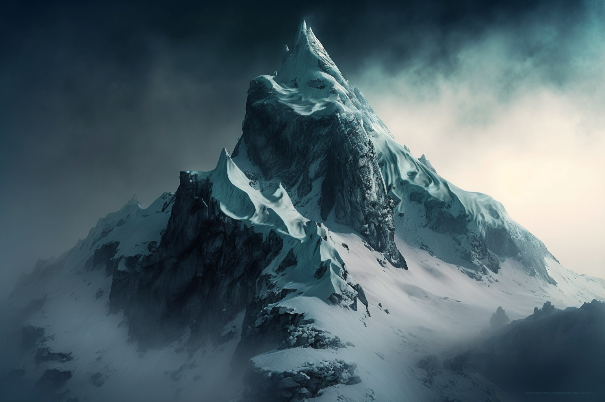
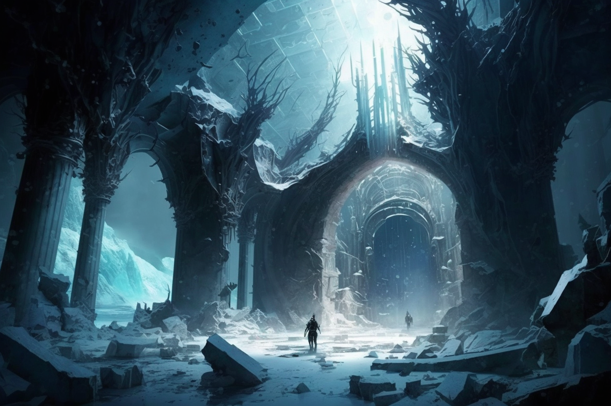
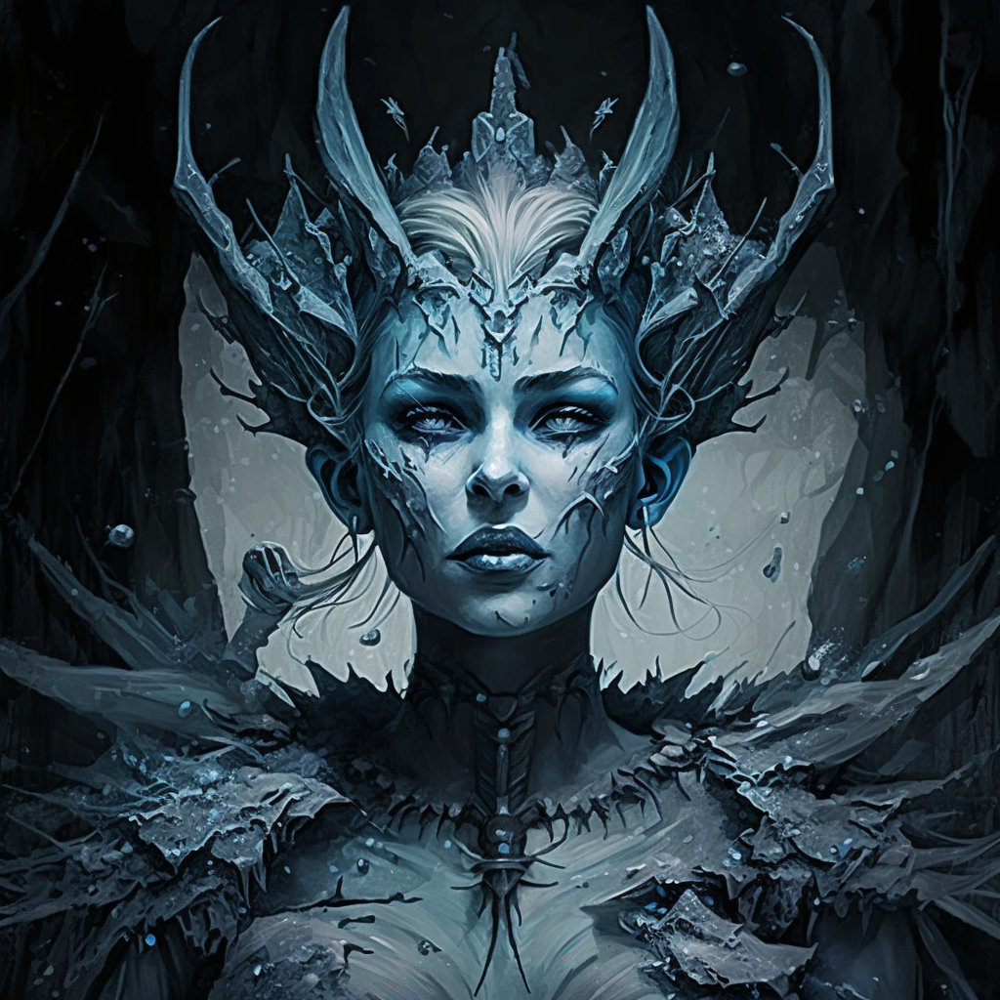

# Dunmari Frontier - Session 72

>[!info] Ice Heart: in which the party confronts an ice maiden
> *Featuring: [Seeker](<../../../people/pcs/dunmar-fellowship/seeker.md>), [Delwath](<../../../people/pcs/dunmar-fellowship/delwath.md>), [Kenzo](<../../../people/pcs/dunmar-fellowship/kenzo.md>), [Wellby](<../../../people/pcs/dunmar-fellowship/wellby.md>), [Riswynn](<../../../people/pcs/dunmar-fellowship/riswynn.md>)*
> *In Taelgar: Nov 23, 1748 DR to Nov 24, 1748 DR*
> *On Earth: Thursday Mar 02, 2023*
> *[Hralgar's Palace](<../../../gazetteer/sentinel-range/hralgar-s-palace.md>) in the [Sentinels](<../../../gazetteer/sentinel-range/sentinel-range.md>)*

The [Dunmar Fellowship](<../../../people/pcs/dunmar-fellowship/dunmar-fellowship.md>) learns valuable information from [Hralgar](<../../../people/giants/hralgar.md>) and defeats an ice maiden now inhabiting his [ancient palace](<../../../gazetteer/sentinel-range/hralgar-s-palace.md>).

## Session Info
### Summary
- [Hralgar](<../../../people/giants/hralgar.md>) shares knowledge about the [Drankorian Empire](<../../../history/drankorian-era/drankorian-empire.md>), skyships, and powerful magic.
- He invites the party to journey to his old palace to retrieve a [Phasing Stone](<../../../things/magic-items/phasing-stones.md>), and offers lore on volcanoes connected to the elemental [Plane of Fire](<../../../cosmology/multiverse/energy-realms/elemental-realms/elemental-plane-of-fire/elemental-plane-of-fire.md>)
- [Hralgar](<../../../people/giants/hralgar.md>) parts with the party, granting them a wind blessing for swift travel.
- The party arrives at [Hralgar's ruined palace](<../../../gazetteer/sentinel-range/hralgar-s-palace.md>) and encounters an ice maiden.
- After failed negotiations, they battle and defeat the ice maiden and her icy crystal heart.

### Timeline
- Nov 23, 1748 DR, night: Listen to Hralgar's stories into the night
- Nov 24, 1748 DR: The party says goodbye to [Hralgar](<../../../people/giants/hralgar.md>) and receives his wind blessing, allowing them to travel quickly as clouds to his ruined palace in the mountains. Scout, and find dark shadows boiling out of the basement, and a icy structure on the main floor. Parlay with an ice maiden, until she brags of freezing travelers on the passes and [Wellby](<../../../people/pcs/dunmar-fellowship/wellby.md>) shoots. Defeat her ice maiden form, and then crush her heart of ice and crystal, destroying her. 

### The Mirror of the Past
- Nov 24, 1748 DR: [Mirror of the Past](<../treasure/notable-items/mirror-of-the-past.md>) used to look at the Enchiridion of the [Occulta Ludum](<../../../groups/drankorian-societies/occulta-ludum.md>), seeing the [Enchiridion of the Occulta Ludum Viision](<../mirror-visions/enchiridion-of-the-occulta-ludum-viision.md>). recharge mirror

## Narrative
We begin at camp, as [Hralgar](<../../../people/giants/hralgar.md>) returns from hunting with a brace of antelope and [Delwath](<../../../people/pcs/dunmar-fellowship/delwath.md>) begins to cook a late dinner. [Hralgar](<../../../people/giants/hralgar.md>) and the party talk, and [Dunmar Fellowship](<../../../people/pcs/dunmar-fellowship/dunmar-fellowship.md>) hears [Hralgar](<../../../people/giants/hralgar.md>)'s story and learned a little of [Drankor](<../../../history/drankorian-era/drankorian-empire.md>), about the skyship [Vindristjarna](<../../../things/ships/vindristjarna.md>), about [Apollyon](<../../../people/historical-figures/drankorian-emperors/apollyon.md>) and the [Omnis Pura](<../../../groups/drankorian-societies/omnis-pura.md>), and about volcanoes and how to destroy powerful magic. 

[Hralgar](<../../../people/giants/hralgar.md>) spent his younger days uninterested in the doings of [Humans](<../../../species/children-of-divine-creation/humans/humans.md>), paying little attention to them on the plains below, during the Golden Age of [Drankor](<../../../history/drankorian-era/drankorian-empire.md>). Visitors came, and went - [Dwarves](<../../../species/children-of-the-embodied-gods/dwarves/dwarves.md>), [Stoneborn](<../../../species/children-of-the-embodied-gods/stoneborn/stoneborn.md>), [Humans](<../../../species/children-of-divine-creation/humans/humans.md>) - and they spoke of ancient magic, of myths and stories. When the Golden Age ended in civil war, and the [Omnis Pura](<../../../groups/drankorian-societies/omnis-pura.md>) came to power, things became more difficult, and some time later he was trapped by [Eudomes](<../../../people/historical-figures/eudomes.md>), during [Apollyon](<../../../people/historical-figures/drankorian-emperors/apollyon.md>)'s reign. [Hralgar](<../../../people/giants/hralgar.md>) knew of [Apollyon](<../../../people/historical-figures/drankorian-emperors/apollyon.md>) as a powerful wizard, an artificer of great skill who wielded the magic of command. His lair, on a circular island south and west of [Drankor](<../../../history/drankorian-era/drankor.md>) in the [Sea of Storms](<../../../gazetteer/greater-dunmar/sea-of-storms.md>), was shielded and could not be approached even by power storm giants traveling as the wind. 

[Hralgar](<../../../people/giants/hralgar.md>) also spoke of the skyship [Vindristjarna](<../../../things/ships/vindristjarna.md>), and the [Phasing Stones](<../../../things/magic-items/phasing-stones.md>) that once powered the great kingdoms of the giants. Their power is weakened now, but there is still enough magic left that they could be used to make [Vindristjarna](<../../../things/ships/vindristjarna.md>) fly again. [Hralgar](<../../../people/giants/hralgar.md>) once had one in his palace in the mountains, which he invites the party to take, although he warns them that it has been a millennium since he was last there, and who knows what might inhabit it now.  Should they find it, on the lower floor that was once his library is a great pillar that will reveal runes describing the construction and repair of skyships when lightning magic is channeled into it. He also tells the party of a little book that contains his notes and research on the history of [Vindristjarna](<../../../things/ships/vindristjarna.md>). 

Finally, he describes places in the Taelgar he knows of that contain volcanoes, some of which may retain lingering connections to the [Elemental Plane of Fire](<../../../cosmology/multiverse/energy-realms/elemental-realms/elemental-plane-of-fire/elemental-plane-of-fire.md>): far to the north, stretching west to east across the central mountains; continuing to the northern coast of [Green Sea](<../../../gazetteer/green-sea.md>) and the island that the [Humans](<../../../species/children-of-divine-creation/humans/humans.md>) called [Irrla](<../../../gazetteer/eastern-green-sea/irrla.md>); and also the islands in the [Nevos Sea](<../../../gazetteer/west-coast/nevos-sea.md>). [Hralgar](<../../../people/giants/hralgar.md>) mentions that the fire giants may know more: they once lived in the mountains east of here, but whether any linger now he does not know. 

In the morning, [Dunmar Fellowship](<../../../people/pcs/dunmar-fellowship/dunmar-fellowship.md>) prepares to bid farwell to [Hralgar](<../../../people/giants/hralgar.md>). He bids a fond farewell to the party, thanking them, and gifting [Kenzo](<../../../people/pcs/dunmar-fellowship/kenzo.md>) a fragment of storm giant ki before vanishing. As he turns into the winds and departs, he also gives the party a wind blessing, allowing them to turn to clouds and travel on the wind until sunset. Before departing for the mountains, the party [looks at](<../mirror-visions/enchiridion-of-the-occulta-ludum-viision.md>) The [Enchiridion of the Occulta Ludum](<../../../things/books/enchiridion-of-the-occulta-ludum.md>) in [Eudomes](<../../../people/historical-figures/eudomes.md>)' Mirror.

Flying fast on the wind, the party reaches in the mountains and [Hralgar](<../../../people/giants/hralgar.md>)'s palace in only a few hours. 

Scouting as wisps of clouds, the party sees [Hralgar](<../../../people/giants/hralgar.md>)'s palace, looking much as it did in the dream world, but ruined, with the roof gone, as well as the upper stories. A structure of ice filled with elaborate ice sculptures sits at the back of the main floor, and shadows billow up from the lower level. Pacing back and forth is a woman, maybe 10 feet tall and seemingly made or coated in ice, jagged shards clinging to her and forming something like a crown. 

The party decides to negotiate, with [Delwath](<../../../people/pcs/dunmar-fellowship/delwath.md>) approaching to speak while [Wellby](<../../../people/pcs/dunmar-fellowship/wellby.md>) and [Kenzo](<../../../people/pcs/dunmar-fellowship/kenzo.md>) invisibly sneak to hide behind ice pillars, and [Riswynn](<../../../people/pcs/dunmar-fellowship/riswynn.md>) and [Seeker](<../../../people/pcs/dunmar-fellowship/seeker.md>) linger invisibly (but noisily) at the top of the stairs. The ice maiden speaks with [Delwath](<../../../people/pcs/dunmar-fellowship/delwath.md>), who asks about the shadows below. The woman seems not to care if they wish to venture there, telling [Delwath](<../../../people/pcs/dunmar-fellowship/delwath.md>) should he wish to journey into the nightmares of Kurome, it is no concern of hers. When asked about the phasing stone, her patience grows thin, and she tells [Delwath](<../../../people/pcs/dunmar-fellowship/delwath.md>) that he is welcome to seek it in Kurome's realm, but to go quickly either way, for there are foolish travelers to freeze in the wastes and her attention cannot long linger here. 

At that, [Wellby](<../../../people/pcs/dunmar-fellowship/wellby.md>) looses an arrow, and battle is joined. [Wellby](<../../../people/pcs/dunmar-fellowship/wellby.md>) and [Kenzo](<../../../people/pcs/dunmar-fellowship/kenzo.md>) have been sufficiently silent - and invisible - that they get the jump on everyone, and [Wellby](<../../../people/pcs/dunmar-fellowship/wellby.md>)'s arrow bursts into flame as it strikes true. The ice maiden is caught off guard as [Kenzo](<../../../people/pcs/dunmar-fellowship/kenzo.md>) lunges to attack as well, using his fist of planar power to push her across the ice. Staggering, [Delwath](<../../../people/pcs/dunmar-fellowship/delwath.md>) strikes her down with his sword and magic, only for her icy crystal heart to rise up and attack with blasts of cold. The air around her becomes bone-chilling, and those close to her begin to freeze. As [Seeker](<../../../people/pcs/dunmar-fellowship/seeker.md>) hits her with a psychic blast - turned to fire by his glove - and [Riswynn](<../../../people/pcs/dunmar-fellowship/riswynn.md>) with a blast of sacred fire, the icy heart staggers. A whirling storm of obscuring, blowing snow rises around her, and more blasts of cold shoot at the party, nearly killing [Kenzo](<../../../people/pcs/dunmar-fellowship/kenzo.md>) except for the blessing of the dwarven gods provided by [Riswynn](<../../../people/pcs/dunmar-fellowship/riswynn.md>), which keeps him from falling unconscious. Finally, [Delwath](<../../../people/pcs/dunmar-fellowship/delwath.md>) cracks the icy heart with bolts of pure magic. 

As silence falls, the wounded party gathers around as [Delwath](<../../../people/pcs/dunmar-fellowship/delwath.md>) makes a fire and a warming meal and the group rests as the session ends. 
