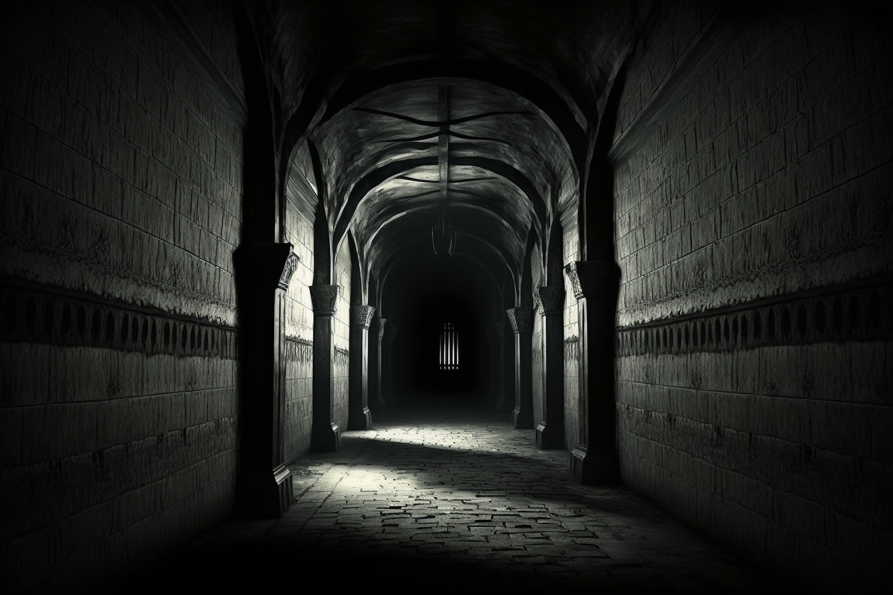
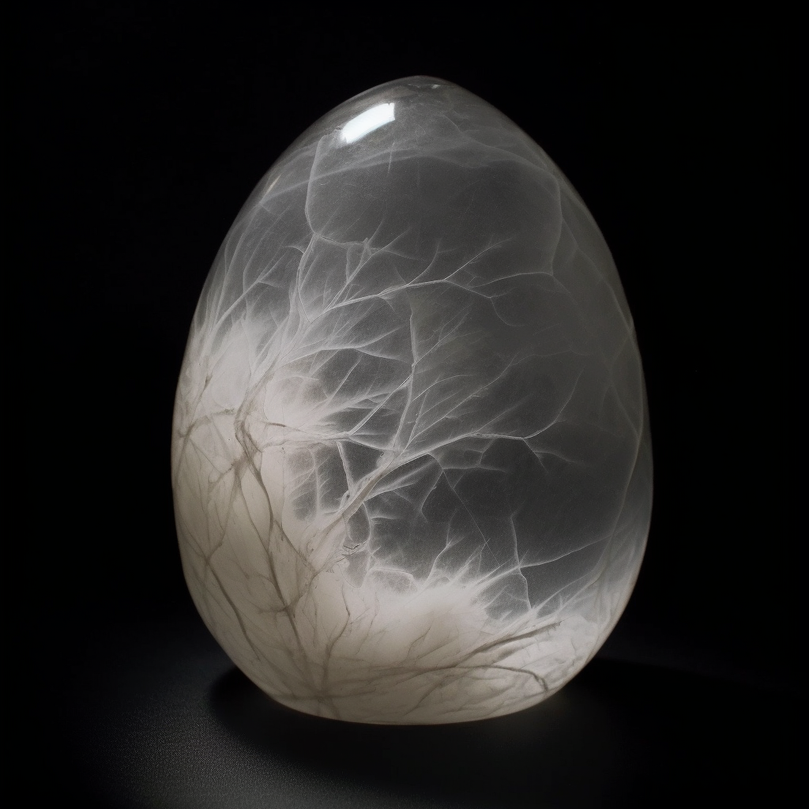
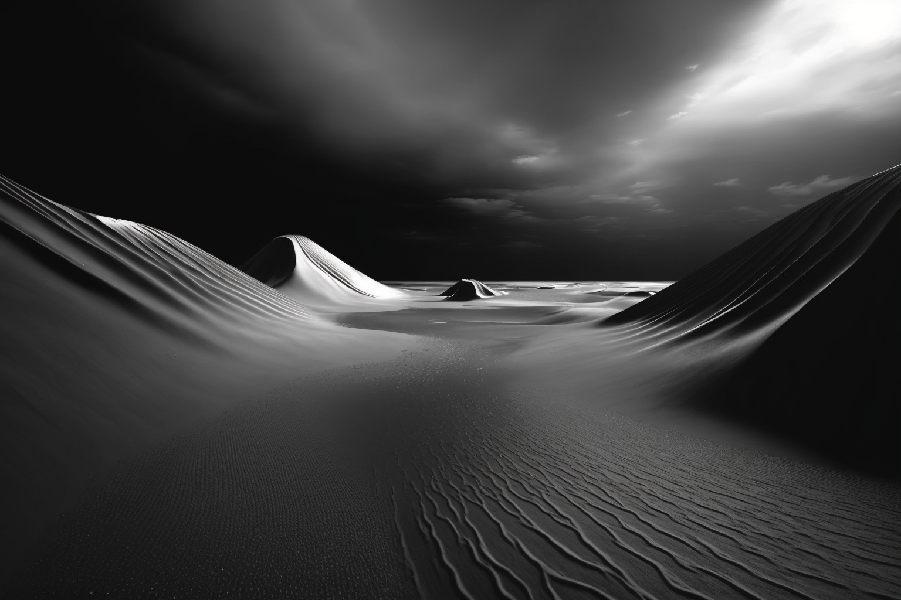

# Dunmari Frontier - Session 73

>[!info] Dreamworld Quest: in which the party braves the dreamworld to acquire the phasing stone
> *Featuring: [Seeker](<../../../people/pcs/dunmar-fellowship/seeker.md>), [Delwath](<../../../people/pcs/dunmar-fellowship/delwath.md>), [Kenzo](<../../../people/pcs/dunmar-fellowship/kenzo.md>), [Wellby](<../../../people/pcs/dunmar-fellowship/wellby.md>), [Riswynn](<../../../people/pcs/dunmar-fellowship/riswynn.md>)*
> *In Taelgar: Nov 24, 1748 DR*
> *On Earth: Friday Mar 17, 2023*
> *[Hralgar's Palace](<../../../gazetteer/sentinel-range/hralgar-s-palace.md>) in the [Sentinels](<../../../gazetteer/sentinel-range/sentinel-range.md>)*

The [Dunmar Fellowship](<../../../people/pcs/dunmar-fellowship/dunmar-fellowship.md>) navigates the dreamworld, captures the elusive [phasing stone](<../../../things/magic-items/phasing-stones.md>), and narrowly avoids freezing to death before returning to their [airship](<../../../things/ships/vindristjarna.md>).

## Session Info

***The party acquires treasure from Hralgar's library: a [Phasing Stone](<../../../things/magic-items/phasing-stones.md>), key to controlling the skyship [Vindristjarna](<../../../things/ships/vindristjarna.md>); notes on the mechanics of skyships; and three giant-sized books.***
### Summary
- The [Dunmar Fellowship](<../../../people/pcs/dunmar-fellowship/dunmar-fellowship.md>) experiences haunting visions after defeating the ice maiden.
- [Seeker](<../../../people/pcs/dunmar-fellowship/seeker.md>) eats remnants of magical ice; the party enters a mysterious, shifting library
- The party finds a shifting doorway leading to an endless corridor and an empty throne room.
- They manipulate the dreamworld with their thoughts, encounter a clockwork cat, and follow a giant hand, before using collective dreaming to capture the [phasing stone](<../../../things/magic-items/phasing-stones.md>) in the [Portable Hole](<../treasure/notable-items/portable-hole.md>).
- Having defeated the dream creature [Kurome](<../../../people/other-nonhumans/kurome.md>), the party seems to awaken in [Hralgar's library](<../../../gazetteer/sentinel-range/hralgar-s-palace.md>).
- Realizing they're still dreaming and slowly freezing to death, they wake up for real and warm themselves before gathering information at Hralgar's library and departing.

### Timeline
- Nov 24, 1748 DR, afternoon: Venture to the library, and find their way to the [dreamworld](<../../../cosmology/multiverse/spiritual-realms/proximate-realms/dreamworld.md>), where they encounter the tricks of Kurome. Recover the phasing stone, returning to a dream version of the real world. Wake themselves up before freezing to death. Record information from [Hralgar](<../../../people/giants/hralgar.md>)'s library about skyships. Depart to return to the crash of [Vindristjarna](<../../../things/ships/vindristjarna.md>) at dusk, with [Hralgar](<../../../people/giants/hralgar.md>)'s wind blessing.

## Narrative
We begin as the party finishes a short rest, warmed by [Delwath](<../../../people/pcs/dunmar-fellowship/delwath.md>)'s hot drinks. During the rest, visions of the cold thoughts and memories of the ice maiden, recently killed, haunt the visions of the party.

*The wind blows harshly, the gusts carrying swirling bits of ice and snow, the shattered remains of the ice maiden's heart, carrying her memories of winters past.*

*You see light snow blowing around a man walking alone, struggling to climb the sloping road - track, really - zigzagging up the side of the mountains towards the high pass. His horse is favoring her left side, and the man walks at her side. Although dressed in a heavy cloak and warm boots, he shivers occasionally, looking up at the mountains. The weather is not a serious threat to him, not yet, but as you begin to blow on the ice in your hand, it crackles, hissing and spattering, and the air begins to freeze. A gentle breath and a wave, and the frozen air drifts, growing and gathering into a stormcloud, then a blizzard. The traveler looks with dismay as the weather turns, the snow picking up, visibility dropping. Soon his body will be frozen on the road, and the slithering shadows below will have their fill of his last dreams of despair before his peaceful slide to a never ending sleep. 

*Another memory, another image of a traveler, freezing in the mountains. Again, and again, the years drifting back, until the crackle of the fire shakes you awake, and you look around at your companions, glad to see living flesh and blood and not frozen corpses.*

As the rest ends, [Seeker](<../../../people/pcs/dunmar-fellowship/seeker.md>) has wandered off from the fire, and is enjoying a meal of the remnants of magical ice that linger where the ice maiden was destroyed. The manages to quickly get everyone oriented, however, and heads into the darkness of the library, where even the powerful daylight of the driftglobes sheds only a weak, dim light. 

In the library, the party does not find the phasing stone, but does find a strange doorway that shifts appearance based on whomever looks at it. When [Delwath](<../../../people/pcs/dunmar-fellowship/delwath.md>)'s moth scout enters but does not return, the party ventures into the doorway, which opens into a long hallway that seems to continue endlessly in both directions. 

The corridor leads to an empty throne room, with an empty small side chamber next to it. As the party begins to better understand this place and realize they can attempt to shape it with their thoughts and wishes, a silver bowl of shaved ice appears that [Seeker](<../../../people/pcs/dunmar-fellowship/seeker.md>) tries to eat. The party experiments a bit with keeping [Seeker](<../../../people/pcs/dunmar-fellowship/seeker.md>) from the ice, and then decides to try to clear their minds.

[Kenzo](<../../../people/pcs/dunmar-fellowship/kenzo.md>) leads the group in meditation, and one by one the party clears their minds, except for [Seeker](<../../../people/pcs/dunmar-fellowship/seeker.md>), who is having trouble focusing on emptiness. The throne room vanishes, the ice melts, and all that is left is an empty expanse with small pools of silver water. A clockwork cat approaches one of the pools, and begins to drink. The mechanical cat approaches [Seeker](<../../../people/pcs/dunmar-fellowship/seeker.md>), and falls into a pile of gears at his touch; as the cat collapses, a wind picks up, cold with the taste of ice. A giant hand emerges from the ground, pointing in the direction of the wind.

[Seeker](<../../../people/pcs/dunmar-fellowship/seeker.md>), along with the heroic [Ladder](<../../../people/pcs/dunmar-fellowship/companions/ladder.md>) now sporting a dozen or more medals of honor, leaps to head in that direction, and the party follows. As the wind grows more intense, flashes of imagines can be seen, people struggling against snow and ice, freezing slowly until a round pulsating stone, the phasing stone, falls out of one of their hands. 

The party dives through the floor into an empty space, in which the phasing stone floats. 

After a few failed attempts to capture it, the party realizes that working together is the only way to outdream [Kurome](<../../../people/other-nonhumans/kurome.md>). [Seeker](<../../../people/pcs/dunmar-fellowship/seeker.md>) dreams a storm of hail and snow pelting the stone, which bursts into flame; [Delwath](<../../../people/pcs/dunmar-fellowship/delwath.md>) dreams a giant hunting bird of water, dowsing the stone, which turns to ice; [Riswynn](<../../../people/pcs/dunmar-fellowship/riswynn.md>) then dreams a wall of fire scorching the ice, and [Kenzo](<../../../people/pcs/dunmar-fellowship/kenzo.md>) adds a lightning storm with flying boulders crushing it. The stone turns to solid volcanic rock, and falls through the water bird, into [Wellby](<../../../people/pcs/dunmar-fellowship/wellby.md>)'s dreaming: the [Portable Hole](<../treasure/notable-items/portable-hole.md>). 

With that, the party seems to be awake in the library. Using the Dream Mirror, they realize that they are still dreaming, but quickly find their freezing bodies at the campsite, and wake themselves up. After another round of warming drinks, the party spends the last few hours of the afternoon copying notes and finding books in [Hralgar](<../../../people/giants/hralgar.md>)'s library before returning to the crashed airship via cloud travel at dusk.
