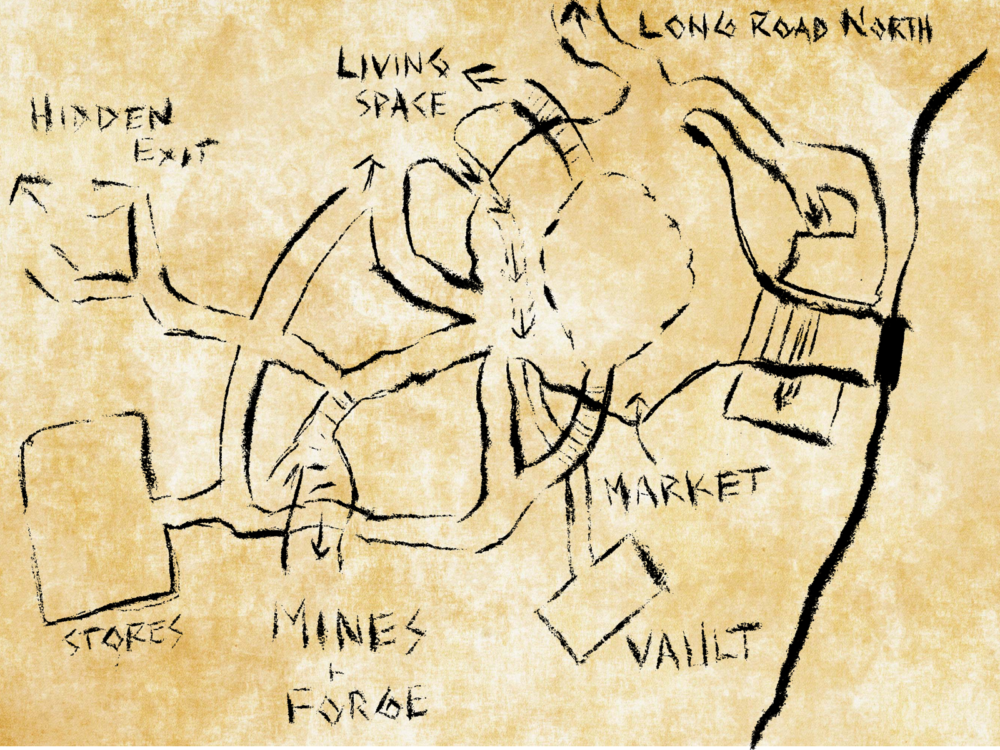

# Dunmari Frontier - Session 8

>[!info] Mountain Entry: in which the party discovers a hidden entrance and faces a cavern creature
> *Featuring: [Kenzo](<../../../people/pcs/dunmar-fellowship/kenzo.md>), [Wellby](<../../../people/pcs/dunmar-fellowship/wellby.md>), [Delwath](<../../../people/pcs/dunmar-fellowship/delwath.md>), [Seeker](<../../../people/pcs/dunmar-fellowship/seeker.md>), [Riswynn](<../../../people/pcs/dunmar-fellowship/riswynn.md>)*
> *In Taelgar: Apr 12, 1748 DR*
> *On Earth: Thursday Sep 03, 2020*
> *Dwarven Outpost (Raven's Hold)*

The Dunmar Fellowship uncovers a secret mountain passage and combats a roper to gain passage through the Dwarven Outpost.

## Session Info
### Summary
- The Dunmar Fellowship decides to find a hidden mountain route to bypass cursed insanity vines, using Riswynn's maps.
- Seeker and Wellby locate a series of stones with Dwarven runes, leading to a gorge entrance with an 'enter' inscription.
- The party braves the gorge waters, leaving supplies and horses behind, and finds a tunnel blocked by a metal plate.
- Riswynn triggers a chain mechanism, revealing further passages, a guard room, and illusionary rubble.
- A secret door opens to a cavern where Inakara and her kind propose an exchange: passage for defeating a cavern creature.
- The party engages in combat with a roper, struggling initially but ultimately triumphing by exploiting its limited mobility.

### Timeline
- Apr 12, 1748 DR, noon: Find Dwarven back door to the [Dwarven Outpost (Raven's Hold)](<../../../gazetteer/greater-dunmar/dunmari-basin/dwarven-outpost-raven-s-hold.md>), and enter via tunnel. 
- Apr 12, 1748 DR, early afternoon: Meet Inakara and the twisted creatures that now make the dwarven output here home. Fight and kill a roper.

## Narrative
The session begins on the road, at the edge of the mountains, with the party contemplating their next move. After some discussion of the relative merits of trying the front door, or searching in the mountains for a back door, either over the cliffs or via the hidden exit from the [dwarven outpost](<../../../gazetteer/greater-dunmar/dunmari-basin/dwarven-outpost-raven-s-hold.md>) marked on [Riswynn](<../../../people/pcs/dunmar-fellowship/riswynn.md>)’s maps, the party decides to try the mountain route. Heading east, the party aims for a mountain valley just to the west of [Raven's Hold](<../../../gazetteer/greater-dunmar/dunmari-basin/raven-s-hold.md>), hoping to find a route through or over and thus avoid the plains of cursed insanity vines encountered by [Ander Charmheart](<../../../people/halflings/ander-charmheart.md>) to ill effect.

[Riswynn](<../../../people/pcs/dunmar-fellowship/riswynn.md>)'s map of the [Dwarven Outpost (Raven's Hold)](<../../../gazetteer/greater-dunmar/dunmari-basin/dwarven-outpost-raven-s-hold.md>):

The area here is rough hilly terrain, with various loose erratic boulders and stones. Just before getting to the mountain stream flowing into the plains, [Seeker](<../../../people/pcs/dunmar-fellowship/seeker.md>) notices a volcanic boulder that seems very out of place, as there don’t seem to be active volcanoes here. Searching, he finds a faint impression of Dwarven runes, indicating the number 2300, and also realizes the boulder was probably not naturally deposited here. With some searching, [Seeker](<../../../people/pcs/dunmar-fellowship/seeker.md>) (assisted by [Wellby](<../../../people/pcs/dunmar-fellowship/wellby.md>)) finds another out of place stone, this time marked with the number 2100. Continuing to search up the river valley, they find stones every few hundred feet, counting down what seems to be a distance. When the numbers get down to about 500, the fast-flowing stream turns into a high sided mountain gorge and heads into the mountain. Instead of a number, Dwarven runes spelling “enter” are carved here.

The party heads into the gorge, first stopping to try to figure out if the water is safe. After forcing a rabbit, now named [Taster](<../../../people/pcs/dunmar-fellowship/companions/taster.md>), to drink some, and seeing it does not die, they head into the stream. Eventually, the walls become tighter and narrower, and the stream enters a tunnel, meaning once again the horses must be left behind, with most of the supplies, food, and gear. After another few hundred feet in the tunnel, with the floor gradually sloping up, but the ceiling staying level, the water gets deeper and deeper until the party cannot proceed without swimming underwater.

After some discussion, [Delwath](<../../../people/pcs/dunmar-fellowship/delwath.md>) scouts ahead and sees that the tunnel is blocked by a diagonal metal plate, with a chain on the wall of the tunnel. [Riswynn](<../../../people/pcs/dunmar-fellowship/riswynn.md>) dislodges and pulls on the chain, which causes the metal plate to slide into the floor, and redirects the flow of water to a grate in the ground. As the water drains, the party proceeds into the dark. The tunnels continue for some time, as the party passes a guard room with a mysterious lever and a secret door they decide not to pull, and an illusion of a pile of rubble, until coming to a blank wall.

With some investigation, [Wellby](<../../../people/pcs/dunmar-fellowship/wellby.md>) finds a mechanism to open a secret door. The door swings open, revealing a large cavern. The door itself opens onto a raised area, maybe 25’ feet on a side. Beyond, two large pools of water can be seen in the dark. Standing on the platform, turning in surprise as the door swings open, is a [quite unusual creature](<../../../people/other-nonhumans/inakara.md>). She is dwarf-sized, but clearly not a dwarf: she has bedraggled white hair, long black nails, and gray and purplish skin that looks mottled and bruised. About twenty or thirty others of her kind are in the cavern -- a few, looking better armed, on the platform with her, and the rest huddled around the shores of the pools. She speaks broken Dwarven, and immediately questions the party, hissing and licking her fingers as she talks. Eventually it becomes apparent that she wants the party to fight something for her, and will let them pass if they do this. Without giving much more information, she leads them down a passage towards a huge open cavern, the former trading hall of the outpost, and points, and kind of shoves the party out into the cavern, telling them to fight. Although a bit uncertain of her motives, the party proceeds. As the party warily creeps into the cavern, a tentacle flies out of the darkness, grabbing [Wellby](<../../../people/pcs/dunmar-fellowship/wellby.md>), as one of the stalagmites begins to move and send tentacles flying. [Wellby](<../../../people/pcs/dunmar-fellowship/wellby.md>) is drawn closer and closer, and bitten by its vicious stone teeth, as the party struggles to figure out how to penetrate its tough stony hide while dodging the flying tentacles. Eventually, though, the party realizes that this creature can barely move, and by staying out of range (and with a well-placed arrow from [Wellby](<../../../people/pcs/dunmar-fellowship/wellby.md>), heated to sear flesh by [Seeker](<../../../people/pcs/dunmar-fellowship/seeker.md>)), they wear down its defenses, defeating it as the session ends. 
