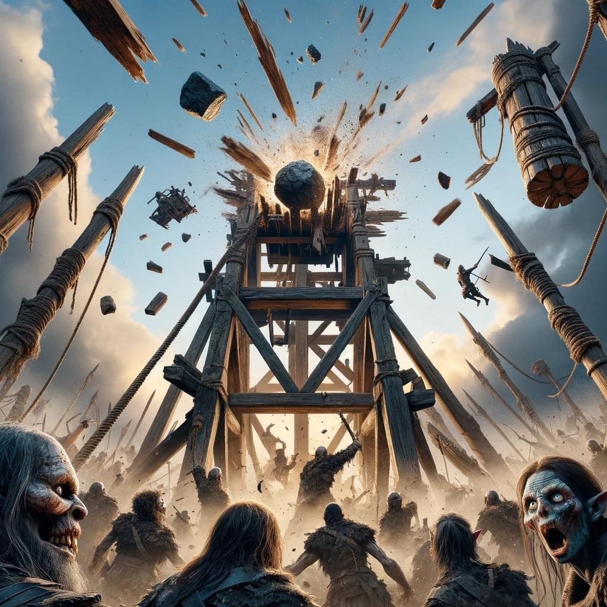

# Dunmari Frontier - Session 88

>[!info] The Battle for Uzgukhar: in which Grash is defeated and the Ring of Undying is destroyed
> *Featuring: [Seeker](<../../../people/pcs/dunmar-fellowship/seeker.md>), [Delwath](<../../../people/pcs/dunmar-fellowship/delwath.md>), [Kenzo](<../../../people/pcs/dunmar-fellowship/kenzo.md>), [Wellby](<../../../people/pcs/dunmar-fellowship/wellby.md>), [Riswynn](<../../../people/pcs/dunmar-fellowship/riswynn.md>)*
> *In Taelgar: Jan 17, 1749 DR to Jan 20, 1749 DR*
> *On Earth: Tuesday Nov 21, 2023*
> *[Uzgukhar](<../../../gazetteer/istaros-watershed/xurkhaz/uzgukhar.md>)*

The[Dunmar Fellowship](<../../../people/pcs/dunmar-fellowship/dunmar-fellowship.md>) destroys a trebuchet, defeats [Grash](<../../../people/other-nonhumans/grash.md>), and ends the undead siege on [Uzgukhar](<../../../gazetteer/istaros-watershed/xurkhaz/uzgukhar.md>), with [Wellby](<../../../people/pcs/dunmar-fellowship/wellby.md>) being killed and resurrected.

## Session Info
### Summary
- The [Dunmar Fellowship](<../../../people/pcs/dunmar-fellowship/dunmar-fellowship.md>) arrives at [Uzgukhar](<../../../gazetteer/istaros-watershed/xurkhaz/uzgukhar.md>) to find the city under siege by [Grash's armies](<../../../groups/orc-hordes/grash-s-horde.md>).
- [Seeker](<../../../people/pcs/dunmar-fellowship/seeker.md>) launches a boulder from [Vindristjarna](<../../../things/ships/vindristjarna.md>), destroying Grash's trebuchet
- The party confronts [Grash](<../../../people/other-nonhumans/grash.md>), who wields the [Ring of Undying](<../../../things/artifacts-of-power/ring-of-undying.md>), and after a fierce battle, they sever his hand and destroy the ring.
- [Wellby](<../../../people/pcs/dunmar-fellowship/wellby.md>) is killed by [Grash](<../../../people/other-nonhumans/grash.md>) but is resurrected by [Riswynn](<../../../people/pcs/dunmar-fellowship/riswynn.md>) using a powerful spell and a perfect diamond.
- With the Siege of Uzgukhar broken and [Grash](<../../../people/other-nonhumans/grash.md>) defeated, the party aids in clearing remaining threats and celebrates victory in the [War of the Cloak](<../../../events/1700s/war-of-the-cloak.md>) with the people of [Uzgukhar](<../../../gazetteer/istaros-watershed/xurkhaz/uzgukhar.md>).
### Timeline
- Jan 17, 1749 DR: [Vindristjarna](<../../../things/ships/vindristjarna.md>) flies over the [Plaguelands](<../../../gazetteer/istaros-watershed/plaguelands.md>) as the party races towards Uzguhkhar
- Jan 18, 1749 DR: [Vindristjarna](<../../../things/ships/vindristjarna.md>) flies over the [Plaguelands](<../../../gazetteer/istaros-watershed/plaguelands.md>) as the party races towards Uzguhkhar
- Jan 19, 1749 DR: [Vindristjarna](<../../../things/ships/vindristjarna.md>) flies over the [Plaguelands](<../../../gazetteer/istaros-watershed/plaguelands.md>) as the party races towards Uzguhkhar
- Jan 20, 1749 DR: The party arrives in [Uzgukhar](<../../../gazetteer/istaros-watershed/xurkhaz/uzgukhar.md>) soon after sunrise. [Riswynn](<../../../people/pcs/dunmar-fellowship/riswynn.md>) rejoins the group. Together, they destroy a massive trebuchet, fight off specters, and kill [Grash](<../../../people/other-nonhumans/grash.md>) in the [Battle for Uzgukhar](<../../../events/1700s/1749/battle-for-uzgukhar.md>). [Wellby](<../../../people/pcs/dunmar-fellowship/wellby.md>) is killed, and resurrected. The people of [Uzgukhar](<../../../gazetteer/istaros-watershed/xurkhaz/uzgukhar.md>) celebrate survival. 
## Narrative
We begin on [Vindristjarna](<../../../things/ships/vindristjarna.md>), racing towards [Uzgukhar](<../../../gazetteer/istaros-watershed/xurkhaz/uzgukhar.md>). The party uses the few days of travel to learn what they can about [Grash](<../../../people/other-nonhumans/grash.md>), and the [Ring of Undying](<../../../things/artifacts-of-power/ring-of-undying.md>), from the various stories collected by [Kenzo](<../../../people/pcs/dunmar-fellowship/kenzo.md>) and the maps and lore and [halfling](<../../../species/children-of-the-embodied-gods/halflings/halflings.md>) memories maintained by [Wellby](<../../../people/pcs/dunmar-fellowship/wellby.md>). 

Arriving a few hours after sunrise on January 20, 1748, the bombardment of [Uzgukhar](<../../../gazetteer/istaros-watershed/xurkhaz/uzgukhar.md>) has already begun. A massive trebuchet, at least 300 feet tall, stands on the battlefield, capable of slinging rocks big enough to crush walls and houses, from more than 1000 feet from the city. Lines of Undead, mostly orc zombies, pull on massive ropes to winch up the counterweight for another blast. It is clear that the city cannot survive a full day of this. Arrayed around the city in siege lines are many more Undead, supported by swarms of specters and shades swooping overhead. In trenches, shadow dogs wait for nightfall, when they can run through the city unchecked. 

The party quickly leaps into action. [Seeker](<../../../people/pcs/dunmar-fellowship/seeker.md>) creates a massive boulder, ten feet on a side, as [Vindristjarna](<../../../things/ships/vindristjarna.md>) rises to 300 feet above the battlefield. Even as shades and specters rush to intercept the ship, the boulder (decorated to look like a ladder) launches itself from the deck. Never before has a boulder fallen so precisely from such a great height. With a mighty crack, the flying boulder-ladder hits the center of the long arm of the trebuchet directly, splintering into hundreds of pieces and utterly destroying the siege machine and itself in the process. Later, [Seeker](<../../../people/pcs/dunmar-fellowship/seeker.md>) will build a memorial to the short-lived hero: "Lord Boulder, hero of the [Battle for Uzgukhar](<../../../events/1700s/1749/battle-for-uzgukhar.md>) smasher of the trebuchet, liberator of the missile stones, star among rocks”. 

With the trebuchet destroyed, the party fights off a group of shades and specters, and turns to find [Grash](<../../../people/other-nonhumans/grash.md>). He is standing, watching the battle, seemingly unconcerned with the arrival of a flying skyship, and is ready, waiting, for the party.

While [Seeker](<../../../people/pcs/dunmar-fellowship/seeker.md>) hides on the deck of [Vindristjarna](<../../../things/ships/vindristjarna.md>) slinging spells from a distance, the rest of the party engages. [Grash](<../../../people/other-nonhumans/grash.md>) fights viciously with his wicked glaive, every slash leaving a bleeding wound that makes movement painful, and his cloak of shadows protecting him and retaliating when cut or pierced. With the [Ring of Undying](<../../../things/artifacts-of-power/ring-of-undying.md>), he summons cursed chains that bind the arms of his enemies, weakening them and binding them closer to death. The party fights back with [Delwath](<../../../people/pcs/dunmar-fellowship/delwath.md>)'s sword, [Wellby](<../../../people/pcs/dunmar-fellowship/wellby.md>)'s bow, [Kenzo](<../../../people/pcs/dunmar-fellowship/kenzo.md>)'s fists, [Riswynn](<../../../people/pcs/dunmar-fellowship/riswynn.md>)'s divine sunbeam, and [Seeker](<../../../people/pcs/dunmar-fellowship/seeker.md>)'s incapacitating lance of psychic energy. [Grash](<../../../people/other-nonhumans/grash.md>) stumbles, but cannot die: when it seems he might die, the ring draws the life force of those around him to restore him to life again. 

As the battle progresses, and [Grash](<../../../people/other-nonhumans/grash.md>) slows, finally there is an opening to cut off his hand and take, and destroy, the [Ring of Undying](<../../../things/artifacts-of-power/ring-of-undying.md>). Wounded and close to unconsciousness, and bound in place by shadowy claws summoned by [Grash](<../../../people/other-nonhumans/grash.md>), [Kenzo](<../../../people/pcs/dunmar-fellowship/kenzo.md>), who has channeled [Motua](<../../../people/extraplanar-powers/motua.md>) and dodged [Grash](<../../../people/other-nonhumans/grash.md>)'s glaive the whole battle, summons the claws of [Lengau](<../../../people/other-nonhumans/lengau.md>), and slashes as [Grash](<../../../people/other-nonhumans/grash.md>)'s wrist, severing his hand. With an off-balance throw, he tosses the hand to [Wellby](<../../../people/pcs/dunmar-fellowship/wellby.md>), who barely grabs it, as the shadow claws slash at [Kenzo](<../../../people/pcs/dunmar-fellowship/kenzo.md>), dragging him to unconsciousness. [Wellby](<../../../people/pcs/dunmar-fellowship/wellby.md>), the [Ring of Undying](<../../../things/artifacts-of-power/ring-of-undying.md>) in hand, takes out a vial of Universal Solvent, and uses the last drop to dissolve the binds of the [Land of the Dead](<../../../cosmology/multiverse/spiritual-realms/land-of-the-dead.md>) that are wrapped around the ring, disintegrating it and unleashing a burst of necrotic energy that knocks [Wellby](<../../../people/pcs/dunmar-fellowship/wellby.md>) unconscious. [Grash](<../../../people/other-nonhumans/grash.md>), overcome with rage, shadow steps to [Wellby](<../../../people/pcs/dunmar-fellowship/wellby.md>), who is standing on a stone arch above the desert, and strikes him, once, twice with his glaive, and then pushed him to the ground below, dead. [Delwath](<../../../people/pcs/dunmar-fellowship/delwath.md>), seeing the ring destroyed, teleports to [Grash](<../../../people/other-nonhumans/grash.md>) and then, with a cut of his sword, kills him. 

The party retreats to [Vindristjarna](<../../../things/ships/vindristjarna.md>) as the Undead hordes begin to waver, and fall, every zombie, shade, or skeleton brought back by the power of the ring now unmade and returned to death. [Riswynn](<../../../people/pcs/dunmar-fellowship/riswynn.md>) prays to the [Bahrazel](<../../../cosmology/gods/embodied-gods/bahrazel/bahrazel.md>), channeling her magic through a perfect diamond, which sparkles and shatters with images of [Wellby](<../../../people/pcs/dunmar-fellowship/wellby.md>): a map, a compass, a ship on the open ocean searching for distant lands. As the spell completes, [Wellby](<../../../people/pcs/dunmar-fellowship/wellby.md>) is brought back to life, shaken. 

For the rest of the day, the party helps the [orcs](<../../../groups/orc-hordes/people-of-the-rainbow.md>) of [Uzgukhar](<../../../gazetteer/istaros-watershed/xurkhaz/uzgukhar.md>) destroy the few Undead and other creatures left in [Grash's armies](<../../../groups/orc-hordes/grash-s-horde.md>), as [Xurkhaz](<../../../gazetteer/istaros-watershed/xurkhaz/xurkhaz.md>) is saved and the [Cloak of Rainbows](<../../../things/artifacts-of-power/cloak-of-rainbows.md>) protected. 

We end that evening, as the celebrations of survival and mourning for the dead last long into the night in [Uzgukhar](<../../../gazetteer/istaros-watershed/xurkhaz/uzgukhar.md>), as the party hears stories of the [People of the Rainbow](<../../../groups/orc-hordes/people-of-the-rainbow.md>) from [Murook](<../../../people/orcs/murook.md>), [Lubash](<../../../people/orcs/lubash.md>), and [Azogar](<../../../people/orcs/azogar.md>), among many others. 
