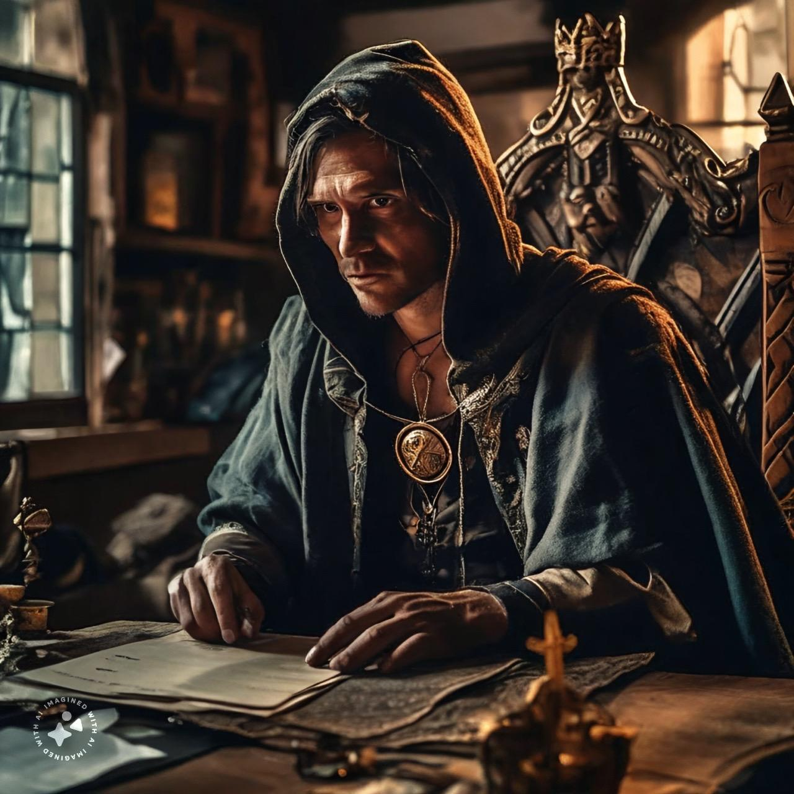

# Dunmari Frontier - Session 90

>[!info] Diplomatic Ventures: in which peace negotiations begin
> *Featuring: [Seeker](<../../../people/pcs/dunmar-fellowship/seeker.md>), [Delwath](<../../../people/pcs/dunmar-fellowship/delwath.md>), [Kenzo](<../../../people/pcs/dunmar-fellowship/kenzo.md>), [Wellby](<../../../people/pcs/dunmar-fellowship/wellby.md>), [Riswynn](<../../../people/pcs/dunmar-fellowship/riswynn.md>)*
> *In Taelgar: Jan 30, 1749 DR to Mar 09, 1749 DR*
> *On Earth: Friday Dec 22, 2023*
> *[Copper Hills](<../../../gazetteer/greater-dunmar/darba-highlands/copper-hills.md>)*

The [Dunmar Fellowship](<../../../people/pcs/dunmar-fellowship/dunmar-fellowship.md>) engages in intricate diplomacy to reconcile siblings [Sura](<../../../people/dunmari/sura.md>) and [Nayan Karnas](<../../../people/dunmari/nayan-karnas.md>), uncovering and dispelling suspicions manipulated by [Agata](<../../../people/fey/agata.md>).
## Session Info

***Delwath, Wellby, and Riswynn acquire [Skaer Steel](<../../../things/materials/skaer-steel.md>) weapons and shields from [Umli](<../../../people/other-nonhumans/umli.md>) in [Tollen](<../../../gazetteer/western-green-sea/tollen/tollen.md>)***
### Summary
- The [Dunmar Fellowship](<../../../people/pcs/dunmar-fellowship/dunmar-fellowship.md>) departs to Sura's camp in the [Copper Hills](<../../../gazetteer/greater-dunmar/darba-highlands/copper-hills.md>) to mediate a conflict between her and [Nayan Karnas](<../../../people/dunmari/nayan-karnas.md>).
- They share news of the [War of the Cloak](<../../../events/1700s/war-of-the-cloak.md>) and the [Battle for Uzgukhar](<../../../events/1700s/1749/battle-for-uzgukhar.md>), and learn of Karnas' distrust towards Sura due to Agata's alleged influence.
- Sura expresses her anger towards Karnas and agrees to meditate with Kenzo
- Using [Mirror of the Past](<../treasure/notable-items/mirror-of-the-past.md>), the party disproves a key piece of evidence Karnas held against Sura, causing him to rage.
- [Abha](<../../../people/dunmari/abha.md>) believes this revelation is the first step towards reconciliation, and the party leaves tokens of unity before heading to [Tollen](<../../../gazetteer/western-green-sea/tollen/tollen.md>)
### Timeline
- Jan 30, 1749 DR: (late morning) depart west for the [Copper Hills](<../../../gazetteer/greater-dunmar/darba-highlands/copper-hills.md>) on [Vindristjarna](<../../../things/ships/vindristjarna.md>), passing south of [Karawa](<../../../gazetteer/greater-dunmar/realms/dunmar/eastern-dunmar/karawa.md>) and the [Red Mesa](<../../../gazetteer/greater-dunmar/realms/dunmar/eastern-dunmar/red-mesa.md>) in the night
- Jan 31, 1749 DR: Watch the sun rise over the  [~Southern Tokra Plains~](<../../../gazetteer/greater-dunmar/dunmari-basin/southern-tokra-plains.md>); travel across the plains during the day, and reach and cross the [Hara](<../../../gazetteer/greater-dunmar/rivers/hara-watershed/hara.md>) river in the evening. Continue west through the night.
- Feb 01, 1749 DR:  Reach the outskirts of the [Copper Hills](<../../../gazetteer/greater-dunmar/darba-highlands/copper-hills.md>) in the morning. Speak with [Sura](<../../../people/dunmari/sura.md>) on [Vindristjarna](<../../../things/ships/vindristjarna.md>), then [Johar](<../../../people/dunmari/johar.md>). Send messages to the Sonkar Mystai [Abha](<../../../people/dunmari/abha.md>). Meditate with Sura in the evening. 
- Feb 02, 1749 DR: Meet with [Abha](<../../../people/dunmari/abha.md>). Meet with [Nayan Karnas](<../../../people/dunmari/nayan-karnas.md>) and use the [Mirror of the Past](<../treasure/notable-items/mirror-of-the-past.md>) to reveal [Agata](<../../../people/fey/agata.md>)'s meddling. Speak with [Abha](<../../../people/dunmari/abha.md>) again. Return to [Vindristjarna](<../../../things/ships/vindristjarna.md>).
- Feb 03, 1749 DR: Tie up loose ends in Sura's camp. 
- Feb 04, 1749 DR: Depart for [Tollen](<../../../gazetteer/western-green-sea/tollen/tollen.md>), via [Orenlas](<../../../gazetteer/istaros-watershed/orenlas/orenlas.md>). Travel to [Orenlas](<../../../gazetteer/istaros-watershed/orenlas/orenlas.md>), crossing the [~North Tokra Plains~](<../../../gazetteer/greater-dunmar/dunmari-basin/north-tokra-plains.md>). 
- Feb 05, 1749 DR: Travel towards [Orenlas](<../../../gazetteer/istaros-watershed/orenlas/orenlas.md>), passing over the [Hara](<../../../gazetteer/greater-dunmar/rivers/hara-watershed/hara.md>) and the [Thandar](<../../../gazetteer/greater-dunmar/rivers/hara-watershed/thandar.md>), and the ruins of [Stormcaller Tower](<../../../gazetteer/greater-dunmar/dunmari-basin/stormcaller-tower.md>).  
- Feb 06, 1749 DR: Travel towards [Orenlas](<../../../gazetteer/istaros-watershed/orenlas/orenlas.md>), passing over the [Sentinels](<../../../gazetteer/sentinel-range/sentinel-range.md>) and into the [Plaguelands](<../../../gazetteer/istaros-watershed/plaguelands.md>). 
- Feb 07, 1749 DR: Travel towards [Orenlas](<../../../gazetteer/istaros-watershed/orenlas/orenlas.md>), crossing over the [Plaguelands](<../../../gazetteer/istaros-watershed/plaguelands.md>). 
- Feb 08, 1749 DR: Travel towards [Orenlas](<../../../gazetteer/istaros-watershed/orenlas/orenlas.md>), crossing the [Istaros](<../../../gazetteer/istaros-watershed/rivers/istaros.md>) north of the ruins of [Isingue](<../../../gazetteer/istaros-watershed/isingue.md>). 
- Feb 09, 1749 DR: Travel towards [Orenlas](<../../../gazetteer/istaros-watershed/orenlas/orenlas.md>), crossing the eastern [Plaguelands](<../../../gazetteer/istaros-watershed/plaguelands.md>). 
- Feb 10, 1749 DR: Travel towards [Orenlas](<../../../gazetteer/istaros-watershed/orenlas/orenlas.md>), arriving late at night. 
- Feb 11, 1749 DR: Spend the day in [Orenlas](<../../../gazetteer/istaros-watershed/orenlas/orenlas.md>), speaking with [Egnir](<../../../people/elves/egnir.md>). 
- Feb 12, 1749 DR: Depart [Orenlas](<../../../gazetteer/istaros-watershed/orenlas/orenlas.md>) in the afternoon, crossing the [~Cymea Border Mountains~](<../../../gazetteer/western-green-sea/cymea-border-mountains.md>) in the night. 
- Feb 13, 1749 DR: Travel across [Latazaro](<../../../gazetteer/western-green-sea/cymea/latazaro.md>) swamp and the [Western Gulf](<../../../gazetteer/western-green-sea/western-gulf.md>) towards [Tollen](<../../../gazetteer/western-green-sea/tollen/tollen.md>).
- Feb 14, 1749 DR: Cross the [Western Gulf](<../../../gazetteer/western-green-sea/western-gulf.md>) and the [~Gulf of Tollen~](<../../../gazetteer/western-green-sea/gulf-of-tollen.md>), traveling towards [Tollen](<../../../gazetteer/western-green-sea/tollen/tollen.md>).
- Feb 15, 1749 DR: Arrive outside [Tollen](<../../../gazetteer/western-green-sea/tollen/tollen.md>) in the morning. Contact [Adam Gower](<../../../people/tollenders/adam-gower.md>) and others, and dock [Vindristjarna](<../../../things/ships/vindristjarna.md>) for construction.
- Feb 16, 1749 DR - Mar 08, 1749 DR: [Downtime in Tollen](<./interlude-tollen-downtime.md>).
- Mar 09, 1749 DR: Meet the kenku scout [Kecha](<../../../people/kenku/kecha.md>) on [Vindristjarna](<../../../things/ships/vindristjarna.md>). Shadow hunter attack well after midnight. 
### Mirror of the Past
- Feb 02, 1749 DR: The history of [Nayan Marathu's Letter](<../letters-and-notes/nayan-marathu-s-letter.md>) is reveled in [Nayan Marathu's Letter Vision](<../mirror-visions/nayan-marathu-s-letter-vision.md>) recharge mirror
- Feb 17, 1749 DR: The history of magical pale blue dye from [Ursk](<../../../gazetteer/northern-green-sea/ursk.md>) is revealed in [Magical Pale Blue Dye Vision](<../mirror-visions/magical-pale-blue-dye-vision.md>) recharge mirror
- Mar 01, 1749 DR: The history of a white dragon tooth from [Ursk](<../../../gazetteer/northern-green-sea/ursk.md>) is revealed in [Cecilia's White Dragon Tooth Vision](<../mirror-visions/cecilia-s-white-dragon-tooth-vision.md>) recharge mirror

## Narrative
We begin as the party departs [Pava and Avaras' House](<../../../gazetteer/greater-dunmar/dunmari-basin/pava-and-avaras-house.md>), heading west to [Sura](<../../../people/dunmari/sura.md>)'s army camp in the [Copper Hills](<../../../gazetteer/greater-dunmar/darba-highlands/copper-hills.md>), hoping to negotiate a peace between Sura and her brother, Samraat [Nayan Karnas](<../../../people/dunmari/nayan-karnas.md>). In Vindristjarna, the journey across Dunmar takes only two days, and the party arrives at Sura's camp on the morning of February 1st.

Here, they begin by speaking to Sura. They give her news of the [War of the Cloak](<../../../events/1700s/war-of-the-cloak.md>), the [Battle for Uzgukhar](<../../../events/1700s/1749/battle-for-uzgukhar.md>), and the defeat of [Grash](<../../../people/other-nonhumans/grash.md>). Sura passes along the news of the [Battle of Tokra](<../../../events/1700s/1748/12/battle-of-tokra.md>), and [Havdar](<../../../people/dunmari/havdar.md>)'s activities to fortify the northwestern border of [Dunmar](<../../../gazetteer/greater-dunmar/realms/dunmar/dunmar.md>), along the [Myraeni Gap](<../../../gazetteer/greater-dunmar/myraeni-gap.md>). Then, the conversation turns to Karnas and the current situation. Karnas is convinced that [Agata](<../../../people/fey/agata.md>) has silenced the gods using the [Cloak of Rainbows](<../../../things/artifacts-of-power/cloak-of-rainbows.md>), and corrupted Sura to be her pawn. The party learns from Sura that [Johar](<../../../people/dunmari/johar.md>), Kenzo's friend from the [Lakan Monastery](<../../../gazetteer/greater-dunmar/realms/dunmar/central-dunmar/tokra/lakan-monastery.md>), has been taking letters between the camps, and the Sonkar Mystai [Abha](<../../../people/dunmari/abha.md>) is Karnas' closest advisor, although currently he is convinced that nothing she says can be trusted, because of Agata's meddling with the gods. 

The conversation turns to meeting with [Karnas](<../../../people/dunmari/nayan-karnas.md>), and to Sura's feelings. [Sura](<../../../people/dunmari/sura.md>) asks [Delwath](<../../../people/pcs/dunmar-fellowship/delwath.md>) if he has ever been trapped in a mirror for eight years, which, between Delwath's skill and [Seeker]'s inspiration, leads to her breaking down and talking about how angry she is with Karnas for doing nothing. As the conversation continues, Sura agrees to come meditate with [Kenzo](<../../../people/pcs/dunmar-fellowship/kenzo.md>) in the evening, and also hears the whole story of [Apollyon](<../../../people/historical-figures/drankorian-emperors/apollyon.md>) from the party. 

That afternoon, the party speaks with [Johar](<../../../people/dunmari/johar.md>). He is nervous, and reports on the evidence of Agata's meddling in Dunmari history that Karnas has found. Most notable is a letter, written by the Samraat [Marathu](<../../../people/historical-figures/dunmari-rulers/marathu.md>), who was Sura's mentor and killed in the attack when Sura was kidnapped. The letter, according to Karnas, states that Marathu had visited Agata in his youth, and was compelled now to deliver Sura to her, for training and apprenticeship. Johar lists a bunch of other evidence he has found of Agata's meddling. The discussion also turns to the [Cloak of Rainbows](<../../../things/artifacts-of-power/cloak-of-rainbows.md>), which has definitely been with the orcs of [Xurkhaz](<../../../gazetteer/istaros-watershed/xurkhaz/xurkhaz.md>) since shortly after the [Great War](<../../../events/1500s/great-war.md>), and so can't have been used by Agata. Johar is convinced, but he warns the party Karnas will not be easy to deal with. 

The meeting with Johar ends with Johar arranging a meeting with [Abha](<../../../people/dunmari/abha.md>), who will speak with the party the following day around lunchtime, near Karnas' camp. The rest of the day and evening is spent in discussion, and in prayer and meditation with Sura. Delwath also speaks with the tanshi, asking:

- Can Agatha influence Dunmar from where she is now? *Probably not*
- Did Agatha leave behind magical traps and tricks still active in Dunmar. *No*
- Was Sura in the mirror for eight years? *Yes*
- Was Samraat Nayan Marathu truthful in the letter he wrote to be opened after his death? *What letter?*
- Does Abha have Dunmar's best interests at heart? *Yes*

The next day at lunchtime, the party uses the rainbow bridge to teleport to the spot they are to meet [Abha](<../../../people/dunmari/abha.md>). They speak with her about the situation, and the [Cloak of Rainbows](<../../../things/artifacts-of-power/cloak-of-rainbows.md>), and the uncertainty in Dunmar. She seems to accept the story of the cloak and clearly wants to convince Karnas that the gods have not been silenced by Agata, and agrees to take the party to him. While she warns them he will not accept divine magic, he may be open to other magic that could convince him Agata is not influencing Sura.

The party is led by Abha through Karnas' camp, to the main room of the caravanserai he has made into his hall. The party tells Karnas the story of the [War of the Cloak](<../../../events/1700s/war-of-the-cloak.md>), keeping the true nature of the [People of the Rainbow](<../../../groups/orc-hordes/people-of-the-rainbow.md>) a secret. Karnas seems uncertain, wondering if Agata had sway with these people, which turns the conversation to Agata and how they defeated her twice. 

Convinced the party is not under Agata's sway, the conversation turns to Sura, and the evidence that Karnas has marshaled of Agata's meddling. Karnas seems obsessed with the letter from [Marathu](<../../../people/historical-figures/dunmari-rulers/marathu.md>), implicating Sura, that Johar mentioned. The party discusses using the [Mirror of the Past](<../treasure/notable-items/mirror-of-the-past.md>) to learn about [Nayan Marathu's Letter](<../letters-and-notes/nayan-marathu-s-letter.md>), but makes a final attempt to convince Karnas to come see the [Cloak of Rainbows](<../../../things/artifacts-of-power/cloak-of-rainbows.md>) for himself, first. But he is unwilling to leave his camp and teleport away with strangers. 

Finally, over Kenzo's qualms, the party decides to show the letter to the [Mirror of the Past](<../treasure/notable-items/mirror-of-the-past.md>), which reveals [Agata's role in crafting the letter](<../mirror-visions/nayan-marathu-s-letter-vision.md>). This sends Karnas into a rage, and the party leaves. Later, speaking to [Abha](<../../../people/dunmari/abha.md>), she tells the party that this is the first crack, and she thinks this will be the first step in a path to reconciliation and a negotiation over Dunmar's future. But, at this point, it is up to the gods and their representatives on Taelgar to find a way forward. She thanks the party for their help, agreeing to speak with Sura and start negotiations, and wishes them well. 

The party spends the next day tying up loose ends to help the negotiations get started, with Kenzo leaving carved wooden figurines of a united brother and sister for both Sura and Karnas. On February 4th, they depart on Vindristjarna, heading east for Orenlas, and then Tollen, arriving at Tollen in mid-February. 

During this time, the party recruits a gardener in Orenlas, and [gathers information](<./interlude-tollen-downtime.md>). 

On March 9th, in Tollen, the party meets [Kecha](<../../../people/kenku/kecha.md>), the kenku scout who has volunteered to lead them across the northern wilds, to the inland border of [Ursk](<../../../gazetteer/northern-green-sea/ursk.md>). He tells them of the dangers they may face: frost giants in the mountains; dragons in the icy north; rumors of a vampire kingdom; ice worms that tear through the forest; and changelings who turn into bears. 

In the early morning hours, as the party sleeps on Vindristjarna, they are awakened by screams. 
