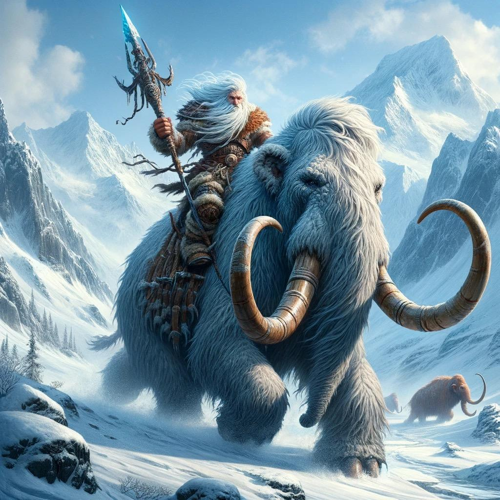

# Dunmari Frontier - Session 91

>[!info] Into the Cold: in which the party negotiates with frost giants
> *Featuring: [Seeker](<../../../people/pcs/dunmar-fellowship/seeker.md>), [Delwath](<../../../people/pcs/dunmar-fellowship/delwath.md>), [Kenzo](<../../../people/pcs/dunmar-fellowship/kenzo.md>), [Wellby](<../../../people/pcs/dunmar-fellowship/wellby.md>), [Riswynn](<../../../people/pcs/dunmar-fellowship/riswynn.md>)*
> *In Taelgar: Mar 09, 1749 DR to Mar 18, 1749 DR*
> *On Earth: Friday Jan 12, 2024*
> *[Tollen](<../../../gazetteer/greater-sembara/tollen/tollen.md>) and the [Svinjo Mountains](<../../../gazetteer/northern-green-sea/svinjo-mountains.md>)*

The [Dunmar Fellowship](<../../../people/pcs/dunmar-fellowship/dunmar-fellowship.md>) defeats more shadow hunters, traverses the [Svinjo Mountains](<../../../gazetteer/northern-green-sea/svinjo-mountains.md>), and negotiates with frost giants, securing an audience with their king.
## Session Info
### Summary
- The party successfully defends against shadow hunters in [Tollen](<../../../gazetteer/greater-sembara/tollen/tollen.md>).
- The party prepares for their journey, stocking up in [Tollen](<../../../gazetteer/greater-sembara/tollen/tollen.md>) and deciding to cross the [Svinjo Mountains](<../../../gazetteer/northern-green-sea/svinjo-mountains.md>), avoiding vampire territories.
- They endure a whiteout snowstorm in the [Svinjo Mountains](<../../../gazetteer/northern-green-sea/svinjo-mountains.md>).
- The party learns of [frost giant](<../../../species/unusual-species/giants.md>) activity and decides to investigate.
- After spotting frost giants overseeing [dwarven](<../../../species/dwarves.md>) miners, [Delwath](<../../../people/pcs/dunmar-fellowship/delwath.md>) negotiates and is granted an audience with the frost giant king, [Brimskarda](<../../../people/giants/brimskarda.md>), while [Wellby](<../../../people/pcs/dunmar-fellowship/wellby.md>) learns the dwarves are indentured servants.

### Timeline
- Mar 09, 1749 DR, late night: Defeat shadow hunters attacking [Vindristjarna](<../../../things/ships/vindristjarna.md>) in [Tollen](<../../../gazetteer/greater-sembara/tollen/tollen.md>)
- Mar 10, 1749 DR - Mar 12, 1749 DR: Gather supplies and prepare for the journey north. 
- Mar 13, 1749 DR, morning: Depart [Tollen](<../../../gazetteer/greater-sembara/tollen/tollen.md>), heading northeast across [Vostok](<../../../gazetteer/greater-sembara/vostok/vostok.md>)
- Mar 14, 1749 DR: Fly across [Vostok](<../../../gazetteer/greater-sembara/vostok/vostok.md>)
- Mar 15, 1749 DR, evening: Reach [Svinjo Mountains](<../../../gazetteer/northern-green-sea/svinjo-mountains.md>) amid gathering clouds and a threatened storm 
- Mar 16, 1749 DR: Wait out snowstorm on the ground
- Mar 17, 1749 DR, morning: Cross [Svinjo Mountains](<../../../gazetteer/northern-green-sea/svinjo-mountains.md>) mountains
- Mar 17, 1749 DR, afternoon: See frost giants watching over dwarven miners. Speak to giants, and dwarves. Learn about [Brimskarda](<../../../people/giants/brimskarda.md>), King of the Frost Giants. Send lynx messenger with letter of introduction ahead. Travel to [Brimskarda](<../../../people/giants/brimskarda.md>)'s steading, [Isenborg](<../../../gazetteer/northern-green-sea/isenborg.md>).
- Mar 18, 1749 DR, afternoon: Arrive at [Brimskarda](<../../../people/giants/brimskarda.md>)'s steading

### Mirror of the Past
- Mar 27, 1749 DR: [Vision](<../mirror-visions/phasing-stone-vision.md>) of the [Phasing Stone](<../../../things/magic-items/phasing-stones.md>) is revealed in the [Mirror of the Past](<../treasure/mirror-of-the-past.md>) recharge mirror

## Narrative
We begin late at night, as the shadow hunters mounted on flying gloomstalkers, who have been tracking the party for weeks, reach [Tollen](<../../../gazetteer/greater-sembara/tollen/tollen.md>) and attack. After hasty preparation, including raising the ice dome on [Vindristjarna](<../../../things/ships/vindristjarna.md>), the party met the shadow hunter's charge. As the enemies attacked, the party unleashed spells including Delwath's synaptic static spell and [Seeker](<../../../people/pcs/dunmar-fellowship/seeker.md>)'s slow spell, amidst a flurry of attacks. [Kenzo](<../../../people/pcs/dunmar-fellowship/kenzo.md>)'s melee prowess stunned one shadow hunter, while [Seeker](<../../../people/pcs/dunmar-fellowship/seeker.md>)'s use of ice daggers proved lethal. Despite a gloomstalker's attempt to escape with [Kenzo](<../../../people/pcs/dunmar-fellowship/kenzo.md>), the party's combined efforts led to victory. After the battle, the party spoke with Tollen guards who came to investigate;  Delwath explained the attack as an assault by [Chardon](<../../../gazetteer/greater-chardon/chardonian-empire/chardon/chardon.md>) hunters, omitting specifics at [Riswynn](<../../../people/pcs/dunmar-fellowship/riswynn.md>)'s advice. 

The next morning, the party discussed their route north with [Kecha](<../../../people/kenku/kecha.md>), the Kenku scout. They decided to cross the [Svinjo Mountains](<../../../gazetteer/northern-green-sea/svinjo-mountains.md>) inland and head toward the Kat river, avoiding the vampire territory along the coast. Over the next few days, the party concluded their business in Tollen, and stocked up on food and warm clothing for the trip north. 

The morning of March 13th, the party departed Tollen after nearly a month in town, with a refitted ship. The journey across [Vostok](<../../../gazetteer/greater-sembara/vostok/vostok.md>) was largely uneventful, the weather cold but clear as the [Svinjo Mountains](<../../../gazetteer/northern-green-sea/svinjo-mountains.md>) neared. The evening of March 15th, however, brought storm clouds, and March 16th was a day of whiteout snow, forcing the party to remain sheltered. 

Once the storm cleared, they debated their route, considering the rumored [frost giant](<../../../species/unusual-species/giants.md>) presence. [Wellby](<../../../people/pcs/dunmar-fellowship/wellby.md>) communicated with birds, learning about the dangers north, including giant wolves and giant people's settlements. Driven by curiosity, the party headed in the direction of these giant's territory. 

Mid-afternoon the next day, on March 17th, the party spotted a group of dwarves emerging from a mine, under the watchful eye of two frost giants mounted on woolly mammoths. 

The party debated what to do, as [Kenzo](<../../../people/pcs/dunmar-fellowship/kenzo.md>)'s communion with nature suggested that while the frost giants were indigenous to this land, they were not wholly in harmony with it. Deciding to talk, [Delwath](<../../../people/pcs/dunmar-fellowship/delwath.md>) sent his lynx messenger with a note requesting parlay. The giant -- curious but also on edge -- approached to speak as [Wellby](<../../../people/pcs/dunmar-fellowship/wellby.md>) snuck off under an invisibility spell to try to talk to the dwarves. 

[Delwath](<../../../people/pcs/dunmar-fellowship/delwath.md>), understanding the giant's language through a spell, negotiated. The giant revealed they were on [Brimskarda](<../../../people/giants/brimskarda.md>)'s land, a powerful frost giant king. [Delwath](<../../../people/pcs/dunmar-fellowship/delwath.md>) shared tales of their adventures, impressing the giant, who suggested a meeting with [Brimskarda](<../../../people/giants/brimskarda.md>). The giant wrote an introduction note for [Delwath](<../../../people/pcs/dunmar-fellowship/delwath.md>) to Brimskarda. [Delwath](<../../../people/pcs/dunmar-fellowship/delwath.md>) sent a lynx with the note, planning to follow for a proper introduction and potentially negotiate or gather intelligence.

Meanwhile, [Wellby](<../../../people/pcs/dunmar-fellowship/wellby.md>) investigated the dwarves, finding no signs of magical control or obvious enslavement. Telepathically communicating with a dwarf, he learned of their distasteful, but in their eyes unavoidable, situation, working as indentured servants for the giants in return for protection from dragons. 

Our session ends the next afternoon, as the party approached the steading of the frost giant king [Brimskarda](<../../../people/giants/brimskarda.md>). 

## Transcript

### Detailed Summary
#### Scene 1
(Shadow Hunter Combat, late at night on March 9th, 1749)
- The party faces Shadow Hunters and their gloomstalker mounts in combat.
- Delwath prepares for battle by considering armor and spells, ultimately deciding against medium armor due to time constraints.
- Riswynn casts Death Ward on Kenzo.
- The party briefly panics over armor limitations, with Seeker and Wellby managing to don their light armor.
- The party strategizes, with Seeker activating a defense mechanism and Delwath considering defensive spells.
- A plan to encase the ship in a protective ice globe is formulated and executed, with individual segments having their own hit points.
- The Shadow Hunters and their gloomstalkers make their assault, with the party readying their counterattacks.
- The ice globe's effectiveness is debated as the party prepares spells and attacks for the enemies' breach.
- Enemies manage to break through the ice, triggering a slew of readied actions from the party, including Delwath's synaptic static spell and Seeker's slow spell.
- The combat continues with the party dealing substantial damage to the Shadow Hunters and their gloomstalkers, utilizing spells, physical attacks, and strategic positioning.
- Kenzo engages in melee combat, stunning a Shadow Hunter and redirecting its attack back at it.
- Seeker utilizes ice daggers to target enemies, with the party coordinating their attacks for maximum efficiency.
- A Gloomstalker attempts to flee with Kenzo grappled, but is ultimately defeated by the party's concentrated efforts.
- The last of the gloomstalkers and Shadow Hunters are dealt with, securing victory for the party.
#### Scene 2
(Aftermath in Tollen. Late at night on March 9th, 1749 to morning March 13th).
- The party interacts with Tollen guards who arrive by rowboat, questioning the recent attack. Delwath explains they were attacked by hunters, assassins from Chardon, though specifics are avoided at Riswynn's suggestion.
- Delwath informs the guard that the attackers were a faction within Chardon, and it should take their master weeks to create new assailants. The party plans to leave in three days, believing the threat is temporarily resolved.
- Concern for the local casualties arises, with Delwath considering offering healing, but they realize some victims from the assault were beyond help.
- The party discusses with Kecha, a Kenku scout aboard their ship, their next destination. They decide to navigate toward a river called the Kat, avoiding areas known for vampire activity.
- The conversation shifts to how they'll manage the cold of the north, including magical means to keep warm. They consider using fire-related spells and enchantments but settle on acquiring warm clothing and supplies.
- Kenzo reflects on time spent with a lady friend and his spiritual outreach efforts in Tollen, including open house events to engage with locals interested in 'cool monk shit'.
- Delwath spends time talking to Sura, as part of his informal support group for those disoriented by time spent in cursed dimensions.
- The group prepares to depart Tollen, focusing on their ship's readiness and ensuring they have adequate supplies for the cold. They aim to fly over risky areas to avoid vampires and potentially engage with giants and changelings.
- Delwath attempts to harrass Fausto using the Dream spell, realizing Fausto might be in another plane of existence due to the spell's failure.
- The party, along with their newly recruited mapmaker and an elf gardener, depart. Discussions about the future, preparations for the cold, and potential encounters in the north dominate as they leave Tollen.

#### Scene 3
(Traveling north, starting on March 13th)
- The party begins their northern journey on March 13th, crossing Vostok towards the mountains, encountering cold but clear weather initially.
- On the second day of travel, they note storm clouds on the horizon and the snowy, cloud-covered mountains ahead.
- Encountering storm clouds and a looming snowstorm the afternoon of March 15th, the party debates continuing or finding shelter. Delwath advises landing to avoid unnecessary risk in a snowstorm.
- The party easily finds shelter in the foothills due to their high survival skills, and Delwath's lynx collects additional food to conserve supplies.
- March 16th brings whiteout conditions from a blizzard, leading the party to stay sheltered. The elf gardener and Kenzo tend to Vindristjarna's growing elder tree to prevent it from dying in the snow.
- The party questions if the storm is magical. Delwath seeks divine insight, which confirms the storm is natural, not magical. Wellby comes to same conclusion from his knowledge of weather.  
- Once the storm clears on the next day, the party debates their route, considering the presence of frost giants in the area and deciding to scout from above and inquire with local wildlife for information about giant activity.
- Seeking information from local wildlife, Wellby communicates with birds, learning about dangerous areas north where giant wolves and other creatures reside, but also about giant people's settlements.
- Despite the dangers, curiosity drives the party towards these giant territories, intrigued by the descriptions of giant wolves, hairy beasts with tusks, and the giants' livestock.
- Flying over the snowy, mountainous landscape, they spot a clearing that appears to be a mine by the afternoon of their travel.

#### Scene 4
(Approaching the Giants, on March 17th at 3 pm)
- The party observes a mine guarded by two Frost Giants mounted on enormous woolly mammoths, wearing silver-plated armor and armed with ice-tipped javelins.
- Kenzo attempts to commune with nature to discern the nature of the Frost Giants, determining they are indigenous to the land but not completely in harmony with it.
- The group discusses strategies for approaching the giants and dwarves, considering the use of spells like clairvoyance and invisibility to gather more information without being detected.
- They notice the giants appear to be guarding something, with a dozen dwarves seen working below, implying a mining operation.
- The party debates the nature of the giants' relationship with the dwarves, whether it's protective or exploitative, and contemplate direct communication.
- A decision is made to send a note to the giants using a lynx messenger, introducing themselves and expressing a desire for peace and information exchange.
- The giant receiving the note shows curiosity and a degree of nervousness, indicating a potential for peaceful interaction but also preparedness for conflict.
- The party plans to make some members invisible to approach the dwarves stealthily, while others engage the giants directly to distract them and perhaps negotiate.

#### Scene 5
(Speaking with Giants and Dwarves, on March 17th at 3 pm)
- Delwath casts a spell to understand the giant's language, and Kenzo advises against starting a fight.
- Delwath, introducing himself and part of his crew, communicates with the giants, expressing peaceful intentions and inquiring about the appropriate contact for their visit.
- The giant reveals they are on Brimskarda's land, a powerful figure and king of the local frost giants.
- Delwath explains the ship was a gift held in sacred trust, emphasizing its importance and the impossibility of relinquishing it.
- A discussion ensues about the strength and capabilities of the crew, with the giant acknowledging their potential power.
- Wellby investigates the dwarves, looking for signs of magical control or uniform identification, but finds none.
- Wellby telepathically communicates with a dwarf, learning they view their situation with the giants as a distasteful but necessary evil to provide protection against dragons.
- Delwath shares tales of their adventures to match the giants' boasting, highlighting their encounters with formidable foes like Grash.
- The giant, impressed by Delwath's stories, suggests Brimskarda would be interested in meeting them, and discusses possible introductions.
- Wellby and Delwath gather information from the dwarves and the giant about Brimskarda kingdom, including the nature of the giants' rule and the dwarves' situation.
- Although the dwawrves are closed and don't speak extensively to Wellby, he learns that the dwarves are basically indentured servants, who work for the giants in exchange for protection, and feel somewhat trapped with no good alternatives. 
- The party learns about Brimskarda's deeds, including dragon slayings, and the opulence of his reign, deciding to approach him for a meeting.
- The giant writes a note of introduction for Delwath  to Brimskarda, indicating his interest in the elf warrior's stories.
- Delwath sends a lynx with the note to Brimskarda, planning to follow after to ensure a proper introduction and possibly negotiate or gather intelligence.
- The scene ends as the party approaches Brimskarda's steading the next afternoon, with plans to speak with the king
### Short Summary
The party successfully defends their ship against an assault from Shadow Hunters and their Gloom Stalker mounts, utilizing a combination of spells, strategic defense mechanisms, and coordinated attacks. Victory is secured through teamwork and quick thinking.

After defeating the shadow hunters, the party interacts with Tollen guards, providing minimal information about their attackers. They then focus on recovery, planning their next moves, and preparing for their journey, including strategizing their route, addressing the cold climate, and engaging in personal activities within Tollen.

The party embarks on their journey north, navigating through cold weather, a snowstorm, and deciding to explore territories inhabited by giants and their creatures based on information gathered from local wildlife. They find shelter from a blizzard and eventually come across what seems to be a mine in a clearing.

The party strategizes on how to approach two giants guarding a mining operation manned by dwarves, contemplating the use of invisibility and direct communication to assess the situation without conflict. They send a note to the giants expressing peaceful intentions and prepare to both engage and observe stealthily.

The party, using peaceful and diplomatic means, communicates with giants and dwarves to navigate the complexities of their situation. They gather information about Brimskarda and his kingdom, and Delwath secures a note of introduction, setting the stage for a direct meeting with the frost giant king.

