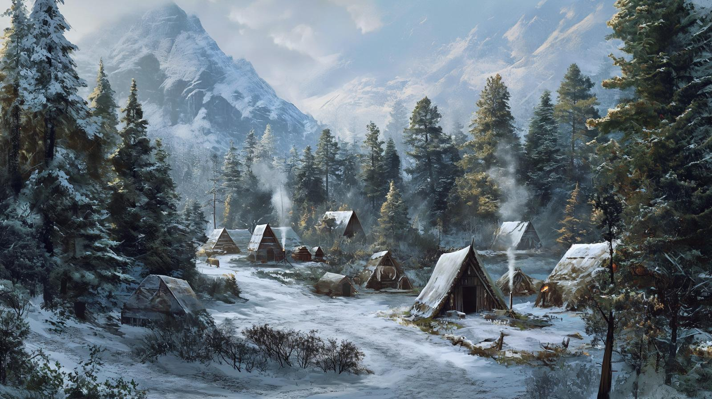

# Dunmari Frontier - Session 93

>[!info] Dragon's Defeat: in which a dragon threat to the Vargaldi is vanquished
> *Featuring: [Seeker](<../../../people/pcs/dunmar-fellowship/seeker.md>), [Delwath](<../../../people/pcs/dunmar-fellowship/delwath.md>), [Kenzo](<../../../people/pcs/dunmar-fellowship/kenzo.md>), [Wellby](<../../../people/pcs/dunmar-fellowship/wellby.md>), [Riswynn](<../../../people/pcs/dunmar-fellowship/riswynn.md>)*
> *In Taelgar: Mar 21, 1749 DR*
> *On Earth: Sunday Feb 11, 2024*
> *Vargald camp, ~Northern Boreal Forest~*

The [Dunmar Fellowship](<../../../people/pcs/dunmar-fellowship/dunmar-fellowship.md>) protects the Vargaldi camp from a dragon, emerging victorious and strengthening ties with the community.
## Session Info
### Summary
- The [Dunmar Fellowship](<../../../people/pcs/dunmar-fellowship/dunmar-fellowship.md>) arrives at the Vargaldi camp using their flying castle, causing a stir among the shape-shifting locals.
- [Delwath](<../../../people/pcs/dunmar-fellowship/delwath.md>) uses magic to camouflage the castle and bridge communication, while the group learns of dragon threats from [Jotha](<../../../people/deno-qai/jotha.md>).
- The party discusses Vargald defenses, evacuation, and dragon lore, assessing the risk of dragon attacks on the camp.
- A dragon is spotted; the group opts to protect the Vargaldi and plans an ambush, resulting in a battle with a dragon and snow constructs.
- Victorious, the party harvests dragon parts and is hailed as heroes, planning their next steps with the Vargaldi for a mission to [Ursk](<../../../gazetteer/northern-green-sea/ursk.md>).

### Timeline
- Mar 21, 1749 DR, late afternoon: Speak with Vargaldi. Meet [Jotha](<../../../people/deno-qai/jotha.md>), Torsten, Zora, and others in the village. Learn of danger of a nearby dragon. 
- Mar 21, 1749 DR, evening: Hide Vargaldi in [Vindristjarna](<../../../things/ships/vindristjarna.md>); confront and defeat dragon. Rest and plan.

## Narrative
We begin as the party arrives in dramatic fashion at the Vargaldi camp, nestled within the foreboding yet majestic northern forests, courtesy of their flying castle [Vindristjarna](<../../../things/ships/vindristjarna.md>). This spectacle did not go unnoticed by the local inhabitants, who, revealing their ability to transform from animals into humanoid forms, approached with a mix of curiosity and caution. Delwath, in a bid to bridge the communication gap, cycled through languages—Common, Deno'qai—before resorting to the Tongues spell to articulate their peaceful intentions and announce the return of lost Vargald members. This introduction sparked a dialogue with [Jotha](<../../../people/deno-qai/jotha.md>), a woman from the camp, who expressed concerns about the visibility of their ship potentially attracting a dragon's gaze to their haven. [Delwath](<../../../people/pcs/dunmar-fellowship/delwath.md>), acknowledging these fears, employed magic to camouflage the flying castle, thereby mitigating the perceived threat and earning a cautious gratitude from the Vargald.

In the ensuing interactions, [Delwath](<../../../people/pcs/dunmar-fellowship/delwath.md>) and [Jotha](<../../../people/deno-qai/jotha.md>) delved into discussions about her origins, while [Wellby](<../../../people/pcs/dunmar-fellowship/wellby.md>) telepathically conversed with Vargald halfling siblings about their ancestral ties and dragon lore. [Kenzo](<../../../people/pcs/dunmar-fellowship/kenzo.md>)'s inquiries led him to discuss the animal spirits the Vargaldi worship, known as the [Zariya](<../../../cosmology/religions/northern-folk-religions/zariya.md>), and to learn  the recent dragon incursions were from Vimfrost's mountains—a region abandoned by frost giants. [Seeker](<../../../people/pcs/dunmar-fellowship/seeker.md>) and the party pondered the dragons' motives, while [Jotha](<../../../people/deno-qai/jotha.md>) shared her puzzling displacement in time since her abduction two years prior. The party, assessing the potential dragon threat, explored the camp's defenses and engaged with the Vargald on various fronts, from discussing evacuation plans to the logistics of trade and the valuation of dragon parts.

By late afternoon, the sighting of a dragon circling nearby mountains catapulted the party into strategic debates. They weighed the dragon's diurnal patterns, their ability to outrun it, and the merits of a confrontational approach versus a strategic retreat. Opting for caution, they invited the Vargald to seek refuge on their ship while planning an ambush. As twilight descended, the party, having spread out in preparation, faced the dragon and its unexpected allies—two giant snow constructs. Despite the complexity of the battle, marred by debate over the efficacy of stealth and invisibility against such a formidable foe, they emerged victorious. The dragon's defeat was marked by a collective effort, culminating in [Riswynn](<../../../people/pcs/dunmar-fellowship/riswynn.md>)'s decisive Guiding Bolt, while Dewalth and Wellby managed the threat posed by the self-destructive snow constructs.

In the aftermath, as they harvested valuable parts from their fallen adversary, the party reflected on the battle's dynamics and the advantages conferred by aerial combat. With the dragon and constructs dispatched, and valuable resources in hand, they turned their attention to the Vargald community, who welcomed them back as heroes.

The subsequent interaction with the Vargald was a blend of celebration and strategic planning. The party discussed navigating relationships with other clans, delving into soul-severing lore to combat a nemesis named [Apollyon](<../../../people/historical-figures/drankorian-emperors/apollyon.md>), and the logistics of approaching [Ursk](<../../../gazetteer/northern-green-sea/ursk.md>) while maintaining their disguise. They debated infiltration strategies, the use of invisibility, and the logistics of learning the local language, ultimately deciding to spend two weeks preparing with the Vargald for their reconnaissance mission to the trade city. We end as the party rests for the night.

## Transcript

### Detailed Summary

#### Arriving at the Vargald Camp
- The party arrivals at the Vargald camp, noting the landscape and history of the northern forests, including the threats that inhabit it.
- The party lands their flying castle, drawing attention from the locals who transform from animals into humanoid forms.
- As the party descends to meet the Vargald, **Dewalth** attempts communication in Common and then Deno'qai, eventually using the spell Tongues to be understood.
- **Dewalth** introduces the party, highlighting their peaceful intentions and the return of lost Vargald members they rescued.
- **Johta**, a woman from the Vargald camp, engages **Dewalth** in conversation about their arrival bringing potential danger, referencing a dragon that might now notice their camp due to the ship's visibility.
- **Dewalth** uses magic to camouflage the ship, making it blend into the surrounding environment, easing some concerns from the Vargald about being discovered by threats.
- The Vargald express gratitude for the return of their people but remain cautious about the party's presence and the potential dangers it brings.
- **Dewalth** offers the party's assistance in defense or evacuation should their arrival bring any danger to the Vargald camp.

#### Speaking with the Vargald
- Dewalth engages Johta, a quiet Deno'qai woman, in conversation, expressing curiosity about her far-off origins.
- Wellby communicates telepathically two halfings, a brother and sister of the Vargald, discussing their ancestral connections to the land and their history with dragons.
- Kenzo inquires about the source of the recent influx of dragons, learning they come from Vimfrost's mountains in the north, once guarded by frost giants, but no longer.
- Seeker and the party discuss the nature of dragons’ attacks and their motives, pondering if the dragons seek treasure, food, or something else.
- Johta reveals she was taken from her people only 2 years ago, leading to a conversation about time perception and her mysterious arrival in the Vargald camp.
- Dewalth offers Johta a place on their ship and mentions maintaining a shrine to Tanshi, revealing a deep connection to another realm.
- The party speculates on the dragons’ motives and the safety of the Vargald camp, considering whether they need to prepare for an immediate dragon attack.
- Kenzo explores the camp, sensing a primal energy unique to the forest and observing that many Vargaldi appear as animals through his soul-sight.
- Seeker uses stone sense to scout the camp, finding it to be a temporary, camouflaged settlement with no significant valuables or permanent structures.
- Wellby learns from the halflings about a dragon patrolling the north bank of the [Ket](<../../../gazetteer/northern-green-sea/ket.md>), discussing its size, behavior, and the halflings' knowledge of dragons.
- Dewalth questions the Vargald camp leaders Torsten and Zora about practical matters concerning the dragon, the Vargald's ability to trade with Ursk, and the value of dragon parts.
- Kenzo engages in a deep conversation about the Zaria, animal protectors of the Vargald, revealing a kinship based on his own connections to animal spirits.
- Wellby uses his ancestral memory to learn about the origins and history of the halflings in the area, discovering their long-standing relationship with the land and its magic.

#### Debating the Dragon Danger
- The party reconvenes in the afternoon to plan and discuss their next steps after noticing a dragon circling the mountains 10-15 miles away.
- Wellby uses a spyglass to confirm it's definitely a dragon circling the mountains.
- The group debates whether dragons are nocturnal or diurnal and learns this particular dragon is most active around sunset and sunrise.
- Dewalth calculates that their ship can potentially outrun the dragon, leading to discussions about either fleeing or confronting the dragon.
- The party considers inviting the Vargaldi onto their ship for safety, presenting the option to fight the dragon in the morning after a rest.
- The Vargald people express a preference to stay on the party's ship overnight as a precaution.
- Discussions about the party's readiness to fight the dragon ensue, with some members lacking high-level spell slots and others feeling prepared.
- The party decides to take a long rest to recuperate before taking any action against the dragon.
- Plans are made to either fight the dragon immediately if it approaches or to set an ambush after resting and preparing.
- The party loads the Vargald people onto their ship for safety, while discussing tactics and the use of their ship in the potential battle.
- A look-out spots the dragon crossing a river, heightening the urgency to decide on a course of action.
- The group debates whether to run or fight, with some members favoring an ambush and others concerned about attracting the dragon's attention.
- Plans to create a makeshift camp as bait for the dragon are discussed, along with strategies for engaging it in battle.

#### Fighting the Dragon
- As twilight sets in, the party spreads out to prepare for the dragon's approach, utilizing the dim light and natural cover to their advantage.
- The party spots the dragon approaching from a distance, quickly closing in on their position.
- Despite initial preparations, the party debates the effectiveness of stealth and invisibility against the dragon.
- Dewalth questions the benefit of invisibility if it doesn't grant an advantage in the upcoming fight.
- A visible dragon descends upon the party, prompting a stealth check from everyone.
- Kenzo attacks the dragon, leveraging the party's prepared tactics.
- The dragon's presence triggers the appearance of two giant snow constructs, adding to the party's threats.
- As the battle unfolds, the party navigates through attacks, spells, and counterattacks while gradually wearing down the dragon.
- Seeker and Kenzo specifically manipulate the dragon's actions and disadvantages through spells and physical attacks.
- The dragon retaliates fiercely, causing significant damage to the party with its cold breath and physical strikes.
- The party's combined efforts eventually lead to the dragon's defeat, as Riswynn delivers the final blow with a powerful Guiding Bolt.
- Following the dragon's death, Dewalth and Wellby focus on the melting snow constructs, swiftly eliminating them before they self-destruct.
- The explosion from the snow constructs' demise knocks Seeker unconscious, prompting immediate healing from Riswynn.

#### Harvesting Monster Parts from the Dragon
- The party gathers around the defeated dragon to harvest parts, recalling past battles and discussing strategies that aided in their victory.
- **Dewalth** and **Kenzo** boast about their contributions to the dragon's defeat, while **Wellby** remarks on the dangers they faced, including the dragon's breath attack.
- The **DM** and the party engage in a meta-discussion about the advantages of flight in combat against dragons, referencing a previous encounter where the lack of flight significantly increased the encounter's difficulty.
- **Kenzo** humorously inquires about using acrobatics and insight for harvesting, but the **DM** suggests using dexterity or survival instead.
- **Seeker** opts to harvest using survival, aiming for the dragon's venom sack used for its cold breath, navigating into the dragon's mouth to retrieve it.
- **Wellby** chooses to harvest dragon scales with his sword, while **Dewalth** targets the dragon's internal organs, notably interested in the heart or anything unusual.
- The party learns the dragon had been consuming ice, causing an unexpected geyser of ice to erupt during Dewalth's examination.
- The party discusses the value of different dragon parts, with a focus on a special organ related to the dragon's legendary resistance.
- **Kenzo** explores the metaphysical, questioning what happens to the dragon's spirit upon death, but learns he lacks the power to capture it.
- The party successfully harvests various parts from the dragon, including teeth, claws, heart, and a unique detoxification organ.
- As night falls and the dragon's carcass begins to decay, the party plans to return to their ship, discussing their next moves.

#### The Aftermath, in the Village
- The party returns to the flying castle, greeted by the cheering Vargald community, expressing gratitude for the dragon's defeat.
- Torsten, a Vargald elder, offers any assistance the party requires as thanks for their actions.
- Kenzo suggests seeking an introduction to other clans and a guide to navigate downriver. Meanwhile, Seeker contemplates learning about soul-severing techniques to combat an enemy named Apollyon.
- The party spends time discussing and learning about Ursk from the Vargald villagers, including trade practices and the potential effects of an arcane ritual on shapeshifting abilities.
- They learn that disguises will be necessary to blend into Ursk due to their diverse racial appearances and receive advice on navigating through or around the city of Zvervinka.
- Seeker and Kenzo debate the merits of sneaking into Ursk via the mountains or entering through the trade city for reconnaissance.
- The party contemplates the logistics of approaching Ursk with their ship, considering visibility and the need for invisibility or a cloud generator to avoid detection.
- Discussion turns to the potential risks and strategies for entering Ursk, including learning the language and finding allies within the city.
- Dewalth raises concerns about the plan's specifics, especially regarding their ultimate goal in Ursk.
- The group ultimately decides to approach the trade city for reconnaissance, planning to hide the ship and take time to prepare, including training and learning Urskan.
- The session concludes with the party agreeing to spend two weeks with the Vargald to prepare for their journey to Ursk.

### Short Summary
The party arrives at the Vargald camp with their flying castle, drawing attention and concern from the locals about attracting dangerous creatures. After communications and assurances, including camouflaging their ship to blend into the surroundings, they discuss potential plans for defense or evacuation if their presence has endangered the camp.

The party engages with the Vargald people, learning about their history, struggles with dragons, and their deep connection to the forest's primal magic. Conversations reveal insights into the Vargald's ancestral protectors, the nature of the dragons threatening the area, and the halflings' ancient journey to and adaptation within these lands.

The party spots a dragon near the Vargald camp and debates their next move, ultimately deciding to prepare an ambush. The Vargald people are invited onto the party's ship for safety, and the group finalizes their plan to confront the dragon with a combination of invisibility, makeshift bait, and potentially using their ship in the battle.

The party successfully ambushed and defeated an approaching dragon and two snow constructs at twilight, employing a combination of stealth, spells, and coordinated attacks. Despite the victory, the battle left some party members significantly wounded, highlighting the dangerous unpredictability of their foes.

After defeating the dragon, the party engages in harvesting its parts, with discussions about past battles, the strategic value of flight, and the metaphysics of dragon spirits. They successfully gather valuable materials and ponder their next steps as they prepare to return to their ship.
Following their victory over the dragon, the party interacts with the Vargald community, discussing potential assistance and gathering information for their next move towards Ursk. They debate entry strategies, ultimately deciding to spend two weeks preparing with the Vargald before heading to the trade city for reconnaissance.

