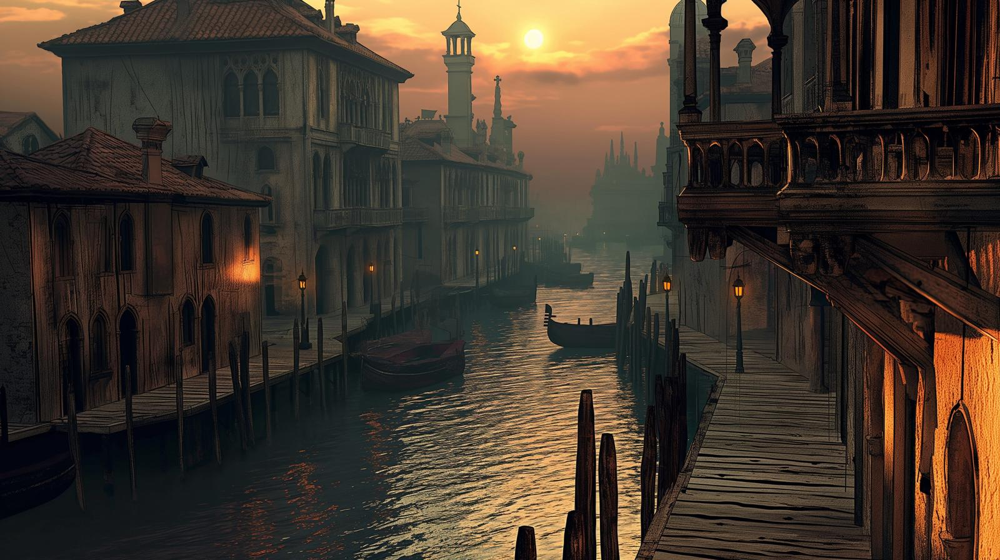
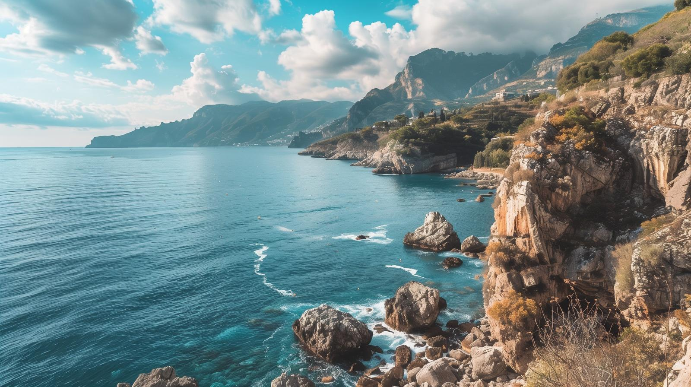
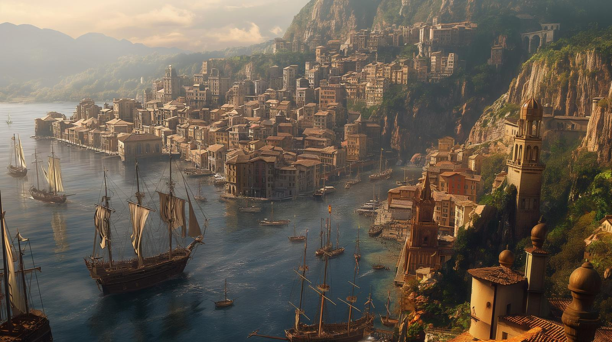

# Dunmari Frontier - Session 98

>[!info] Voyage to Castrella: in which alliances are formed and clues found
> *Featuring: [Seeker](<../../../people/pcs/dunmar-fellowship/seeker.md>), [Delwath](<../../../people/pcs/dunmar-fellowship/delwath.md>), [Kenzo](<../../../people/pcs/dunmar-fellowship/kenzo.md>), [Wellby](<../../../people/pcs/dunmar-fellowship/wellby.md>), [Riswynn](<../../../people/pcs/dunmar-fellowship/riswynn.md>)*
> *In Taelgar: May 05, 1749 DR to May 07, 1749 DR*
> *On Earth: Thursday May 02, 2024*
> *From [Nevium](<../../../gazetteer/west-coast/chardonian-empire/apporia/nevium.md>) to [Castrella](<../../../gazetteer/west-coast/chardonian-empire/apporia/castrella.md>)*

The [Dunmar Fellowship](<../../../people/pcs/dunmar-fellowship/dunmar-fellowship.md>) forms new alliances and gathers crucial information as they sail from [Nevium](<../../../gazetteer/west-coast/chardonian-empire/apporia/nevium.md>) to [Castrella](<../../../gazetteer/west-coast/chardonian-empire/apporia/castrella.md>) in search of clues for their quest.

***23 days until Apollyon's escape***
## Session Info
### Summary
- The [Dunmar Fellowship](<../../../people/pcs/dunmar-fellowship/dunmar-fellowship.md>), now in [Nevium](<../../../gazetteer/west-coast/chardonian-empire/apporia/nevium.md>), discreetly escapes the city using a Folding Boat and sails to the [Apporian Peninsula](<../../../gazetteer/west-coast/chardonian-empire/apporia/apporia.md>).
- [Delwath](<../../../people/pcs/dunmar-fellowship/delwath.md>) disguises himself and gathers intel in the village of [Artevus](<../../../gazetteer/west-coast/chardonian-empire/apporia/artevus.md>), leading the party to form an alliance with Captain [Pippa Goodbarrow](<../../../people/halflings/pippa-goodbarrow.md>) and navigator [Martino](<../../../people/chardonians/martino.md>).
- The party sails to [Castrella](<../../../gazetteer/west-coast/chardonian-empire/apporia/castrella.md>), where they gather information about [Merfolk](<../../../species/unusual-species/merfolk.md>) artifacts and potential magical aids for underwater breathing.
- At the local tavern, [The Drunken Dolphin](<../../../gazetteer/west-coast/chardonian-empire/apporia/the-drunken-dolphin.md>), the party hears the [Ballad of the Jade Garden](<../../../primary-sources/songs/ballad-of-the-jade-garden.md>), which provides hints for their quest.
### Timeline
- May 05, 1749 DR, morning: Sneak out of [Nevium](<../../../gazetteer/west-coast/chardonian-empire/apporia/nevium.md>), in the province of [Portalia](<../../../gazetteer/west-coast/chardonian-empire/apporia/portalia.md>) on the Folding Boat, and sail northwest across the [Gulf of Chardon](<../../../gazetteer/west-coast/gulf-of-chardon.md>)
- May 05, 1749 DR, evening: Sight land along the coast of the province of [Cedrano](<../../../gazetteer/west-coast/chardonian-empire/apporia/cedrano.md>); anchor in a small cove for the night. 
- May 06, 1749 DR, morning: Explore the town of [Artevus](<../../../gazetteer/west-coast/chardonian-empire/apporia/artevus.md>). Recruit [Martino](<../../../people/chardonians/martino.md>), a retired fisherman, as a guide. Hire passage on [Summer's Breeze](<../../../things/ships/summer-s-breeze.md>), a halfling ship captained by [Pippa Goodbarrow](<../../../people/halflings/pippa-goodbarrow.md>). 
- May 06, 1749 DR, afternoon: Sail north along the coast, with good winds. Convince halflings to sail into the night.
- May 06, 1749 DR, night: Arrive in [Castrella](<../../../gazetteer/west-coast/chardonian-empire/apporia/castrella.md>) well after sunset, and anchor for the night.
- May 07, 1749 DR: Explore [Castrella](<../../../gazetteer/west-coast/chardonian-empire/apporia/castrella.md>). Speak with [Juliana Maris](<../../../people/chardonians/juliana-maris.md>), a collector of merfolk artifacts. Purchase maps from [Tullus](<../../../people/chardonians/tullus.md>). Fail at an attempt to scry [Milo Thistlefoot](<../../../people/halflings/milo-thistlefoot.md>). Gather rumors and hear songs. Convince [Pippa](<../../../people/halflings/pippa-goodbarrow.md>) and the crew of the [Summer's Breeze](<../../../things/ships/summer-s-breeze.md>) to set sail before dawn, heading north. 
### Media
The party heard three songs about merfolk:
[Ballad of the Jade Garden](<../../../primary-sources/songs/ballad-of-the-jade-garden.md>)
[Fog and Fortune](<../../../primary-sources/songs/fog-and-fortune.md>)
[Merfolk Fortunes](<../../../primary-sources/songs/merfolk-fortunes.md>)
### Key Rumors
- From [Juliana Maris](<../../../people/chardonians/juliana-maris.md>), the party learned that no one has returned from the [Merfolk](<../../../species/unusual-species/merfolk.md>) territory in the west in 20 years, except for the halfling captain [Milo Thistlefoot](<../../../people/halflings/milo-thistlefoot.md>) and his crew, and genuine merfolk artifacts are becoming difficult to find. 
- From rumors among sailors and people drinking in the taverns in [Castrella](<../../../gazetteer/west-coast/chardonian-empire/apporia/castrella.md>), the party learned that if you want to breath water, there are two people you might seek. One, the [stoneborn](<../../../species/children-of-the-embodied-gods/stoneborn/stoneborn.md>) alchemist [Kazuro](<../../../people/other-nonhumans/kazuro.md>), lives in an isolated cave up the coast, and can brew potions. The other, a man obsessed with merfolk named [Dorian Almare](<../../../people/chardonians/dorian-almare.md>), touched by magic, left [Castrella](<../../../gazetteer/west-coast/chardonian-empire/apporia/castrella.md>) to find the merfolk 15 years ago and has not been seen since, but rumors persist of the "Mystic of Tamaro Bay" that might be Dorian. 
- From [Isabetta](<../../../people/chardonians/isabetta.md>), a young singer drawing a crowd at the [The Drunken Dolphin](<../../../gazetteer/west-coast/chardonian-empire/apporia/the-drunken-dolphin.md>), a rowdy sailor's tavern in [Castrella](<../../../gazetteer/west-coast/chardonian-empire/apporia/castrella.md>), the party heard the [Ballad of the Jade Garden](<../../../primary-sources/songs/ballad-of-the-jade-garden.md>), which seemed to spell out the location of the jade garden mentioned by [Thomas Hawke](<../../../people/tollenders/thomas-hawke.md>) and likely where the [Jade Piece of Rai's Hand](<../treasure/notable-items/jade-piece-of-rai-s-hand.md>) is located. 

## Narrative
We begin on the morning of May 5th, 1749, in the vibrant city of [Nevium](<../../../gazetteer/west-coast/chardonian-empire/apporia/nevium.md>), situated in the Chardonian province of [Portalia](<../../../gazetteer/west-coast/chardonian-empire/apporia/portalia.md>), after [Seeker](<../../../people/pcs/dunmar-fellowship/seeker.md>)'s succesful teleportation spell transported the party from the cold northern land of [Ursk](<../../../gazetteer/northern-green-sea/ursk.md>) to the balmy shores of the [Gulf of Chardon](<../../../gazetteer/west-coast/gulf-of-chardon.md>). Aware of their notoriety and wanted status within the [Chardonian Empire](<../../../gazetteer/west-coast/chardonian-empire/chardonian-empire.md>), the [Dunmar Fellowship](<../../../people/pcs/dunmar-fellowship/dunmar-fellowship.md>) quickly oriented themselves to their surroundings, strategizing their next move in relative secrecy.

Aiming for a discrete and quick escape from the city of [Nevium](<../../../gazetteer/west-coast/chardonian-empire/apporia/nevium.md>), the party unfolds their Folding Boat, and, [Wellby](<../../../people/pcs/dunmar-fellowship/wellby.md>) skillfully maneuvered the vessel out of [Nevium](<../../../gazetteer/west-coast/chardonian-empire/apporia/nevium.md>), evading detection by naval patrols, setting a course northwest across the vast [Gulf of Chardon](<../../../gazetteer/west-coast/gulf-of-chardon.md>). The journey by sea was marked by strategic conversations, as the he party sailed throughout the day, navigating the challenges of open water travel, until they sighted the remote shores of the [Apporian Peninsula](<../../../gazetteer/west-coast/chardonian-empire/apporia/apporia.md>) by evening. Opting for caution, they anchored in a secluded cove to rest and plan their approach to the local settlements.

The following day, May 6th, [Delwath](<../../../people/pcs/dunmar-fellowship/delwath.md>) ventured into [Artevus](<../../../gazetteer/west-coast/chardonian-empire/apporia/artevus.md>), a quiet and somewhat tired and run down  fishing village on the coast, in the province of [Portalia](<../../../gazetteer/west-coast/chardonian-empire/apporia/portalia.md>), under the effects of an Alter Self spell to disguise his appearance. Posing a treasure hunter, he quickly learned that many local sailors had been pressed into naval service recently, but a local tavernkeeper pointed him to [Martino](<../../../people/chardonians/martino.md>), a retired fisherman and skilled navigator. Meanwhile, the rest of the party approached cautiously by boat, encountering [Pippa Goodbarrow](<../../../people/halflings/pippa-goodbarrow.md>), captain of the [Summer's Breeze](<../../../things/ships/summer-s-breeze.md>). 

After a few brief moments of confusion as [Delwath](<../../../people/pcs/dunmar-fellowship/delwath.md>) returned to his usual appearance, negotiations with Captain Goodbarrow proved fruitful, as the party convinced her and her crew to embark on an extended voyage northward, joined by [Martino](<../../../people/chardonians/martino.md>) as a navigator and guide. Their newly formed alliance set sail that afternoon, enjoying favorable winds and the camaraderie of the sea. Their journey continued into the night, arriving at the bustling port of [Castrella](<../../../gazetteer/west-coast/chardonian-empire/apporia/castrella.md>), in the hilly coastal province of [Cedrano](<../../../gazetteer/west-coast/chardonian-empire/apporia/cedrano.md>), after sunset.

In [Castrella](<../../../gazetteer/west-coast/chardonian-empire/apporia/castrella.md>), the party split their efforts to gather information. [Delwath](<../../../people/pcs/dunmar-fellowship/delwath.md>) and [Seeker](<../../../people/pcs/dunmar-fellowship/seeker.md>) sought out [Juliana Maris](<../../../people/chardonians/juliana-maris.md>), a renowned collector of merfolk artifacts, hoping she might shed light on their quest. From her, they learned that merfolk fakes were becoming increasingly common, as it had been years since anyone had journeyed to the west coast of [Apporia](<../../../gazetteer/west-coast/chardonian-empire/apporia/apporia.md>) and returned with genuine merfolk treasure. The only person to have done so recently was the daring halfling captain [Milo Thistlefoot](<../../../people/halflings/milo-thistlefoot.md>), aboard his ship [Stormdancer](<../../../things/ships/stormdancer.md>). But it had been a year since anyone had seen him, and [Delwath](<../../../people/pcs/dunmar-fellowship/delwath.md>)'s attempt to scry him failed. Meanwhile, [Wellby](<../../../people/pcs/dunmar-fellowship/wellby.md>) procured maps and navigational charts to aid their forthcoming journey. [Kenzo](<../../../people/pcs/dunmar-fellowship/kenzo.md>) relaxed at a seaside cafe, hoping to gather news and information but mostly taking in the scenery. [Riswynn](<../../../people/pcs/dunmar-fellowship/riswynn.md>) wandered the town, noting the complete absence of other dwarves, and the lack of any particularly notable crafting or smithy district, but not gaining much useful information about merfolk. 

As the day drew to a close, the party gathered at the docks, immersing themselves in the local culture. The local tavern, [The Drunken Dolphin](<../../../gazetteer/west-coast/chardonian-empire/apporia/the-drunken-dolphin.md>), was alive with music and tales. [Isabetta](<../../../people/chardonians/isabetta.md>), a young singer, captured the crowd—and the party’s attention—with the [Ballad of the Jade Garden](<../../../primary-sources/songs/ballad-of-the-jade-garden.md>). Her song not only entertained but also hinted at the location of the jade garden mentioned by the mysterious [Thomas Hawke](<../../../people/tollenders/thomas-hawke.md>), aligning serendipitously with their quest. Asking about sources of magic to allow them to breath water, they learned of two possible people who could help: the stoneborn hermit and alchemist [Kazuro](<../../../people/other-nonhumans/kazuro.md>), and the Mystic of Tamaro Bay, possibly the human known as [Dorian Almare](<../../../people/chardonians/dorian-almare.md>), who left [Castrella](<../../../gazetteer/west-coast/chardonian-empire/apporia/castrella.md>) years ago. 

The session ended in evening, as the party convinced the crew of [Summer's Breeze](<../../../things/ships/summer-s-breeze.md>) to rise in the predawn light and set sail north, moving fast and sailing around the clock, to hopefully find Milo, who the party suspected may be in danger. 

## Transcript

### Detailed Summary

#### Escaping Nevium
- The party, teleported by **Seeker**, arrives in Nevium, a city in the province of Portalia, part of the Chardonian Empire, and experiences the sharp transition from the cold north of Ursk to the warm gulf of Chardon.
- They recall their quest for a piece of jade, guided by stories heard and a letter from the Philosopher's Guild involving the merfolk, the elemental sea, and a magical kelp forest.
- **Delwath** queries about their geographical location, confirming they are on the north coast near the canal as they discuss their observations and plan amidst the pre-dawn darkness.
- **Seeker** and **Kenzo** discuss the recent acquisition of another jade piece and contemplate its significance and potential uses.
- **Riswynn** suggests stealthily avoiding the Chardonian guard due to their wanted status in the empire, as they contemplate acquiring a boat for travel.
- The party debates the size of their boat to use for immediate escape, ultimately deciding on the smaller option for stealth and ease.
- **Wellby**, proficient in boats, successfully navigates the small boat into the water undetected under the cover of darkness and ambient noise.
- A naval warship is spotted, prompting a brief discussion of disguises, the feasibility of commandeering such a vessel, and the practicality of alternative plans involving their current boat or acquiring a new crew.
- **Kenzo** raises the potential of seeking out allies or a resistance against Chardonian control as they travel further from the empire's central influence.
- The party navigates out of the harbor, discussing strategies for travel, including following the coastline versus straight travel across the ocean to their destination.
- **Wellby** takes charge of navigation, opting for a northwest direction, as the group contemplates ways to manipulate the wind and weather to aid their passage.

#### Exploring the Cedrano Coast
- The party makes significant progress sailing towards the northwest, covering approximately 80 miles, thanks to Wellby's exceptional navigation skills.
- They discover a rocky coast devoid of obvious civilization and decide to land in a small cove to rest for the night.
- Delwath scouts the area and finds a small town about 15 miles back along the coast they passed. It appears to be a peaceful fishing village.
- Kenzo uses commune with nature, finding the area tranquil and sparsely populated.
- The party discusses creating a cover story involving treasure hunting to justify their journey and their need to recruit a crew in the small town.
- They contemplate fabricating a treasure map to support their story, debating the material and contents to make it believable.
- The group decides to proceed into town the next morning, considering disguising themselves and the need for a convincing backstory to recruit crew members without raising suspicion.
- They discuss the logistics of sailing with a minimal crew and the option of using a magical duplicate of Wellby to aid in sailing.
- Concerns are raised about encountering the Chardonian Legion in town and the necessity of maintaining their disguises.
- The plan includes approaching the town stealthily, disembarking at a distance, and entering town disguised to avoid recognition.

#### Finding Transport in Artevus
- Delwath leaves to scout Artevus, under the Alter Self spell which disguises his appearance.
- As the party approaches Artevus, the DM describes the quiet, dilapidated fishing town they see, highlighting its small size and lack of prosperity.
- Delwath and the party navigate through the town, noting the curious glances from locals due to their unfamiliar presence.
- Observing the docks, Delwath identifies two larger boats among the fishing vessels and decides to inquire about hiring a crew at the town's inn.
- The innkeeper informs Delwath that most capable sailors were recently conscripted by the navy, suggesting the party might not find the skilled crew they seek in this town.
- Delwath attempts to recruit crew members at the inn by generously spending gold and subtly hinting at a lucrative but mysterious venture.
- Riswynn and Delwath communicate about the recruitment efforts, and the party decides to approach the halfling boat directly.
- Successfully contacting the halfling ship, the party negotiates passage to Castrella, learning the ship's crew is more focused on fun than adventure.
- Delwath secures Martino, an old sailor, as a guide for their journey, despite some initial confusion due to Delwath's use of disguise.
- The party, now including Martino and planning to board the halfling ship, sets sail towards Castrella.

#### The Port Town of Castrella
- **Wellby** discusses the party's adventures with the halflings, aiming to captivate them with tales of grand adventures to encourage their continued assistance.
- **DM** describes Castrella's landscape and population, emphasizing its size and bustling port, with no visible presence of the Chardonian navy.
- **Delwath** suggests engaging with a local collector of merfolk artifacts for information or assistance.
- The party debates their visibility and safety in Castrella, ultimately deciding to explore the town.
- **Riswynn** expresses a desire to identify any dwarves or dwarven architecture, but finds none. The diverse population of Castrella is noted.
- **Delwath** inquires about Juliana Maris, a collector known for her interest in merfolk artifacts, leading to plans to visit her.
- **Kenzo** chooses to relax at a cafe, attempting to gather information through casual observation, but becomes distracted.
- **Wellby** seeks maps of the peninsula at a local shop, paying in coin for a collection of maps and charts. 
- Delwath and Seeker meet Juliana Maris, attempting to negotiate information or guidance on merfolk artifacts by offering potential future treasures for her right of first refusal.**
- **Delwath** and **Seeker** fail to make a significant impression on Juliana Morris but do learn that no one except Milo Thistlefoot, a daring halfling captain, has sailed to the west in 20 years, and genuine merfolk artifacts are becoming very rare.
- **Riswynn**, without finding dwarven kinship, resorts to sightseeing and contemplation of the party's next moves.
- The party reconvenes, discussing their findings and planning their next steps, including underwater exploration and finding Milo Thistlefoot.
- The party considers asking around town for magic or methods to aid in underwater exploration, acknowledging their lack of substantial leads on navigating Merfolk territory.
#### Rumors and Songs on the Docks
- As evening approaches, the party gathers rumors on the docks of Castrella, learning about historical interactions with merfolk and hearing about a Mystic of Tamaro Bay, possibly Dorian Almare, who left 15 years ago to find the merfolk and is rumored to be able to breathe underwater.
- They discover the existence of ballads about merfolk, including 'The Fog and Fortune' and learn about a stoneborne hermit named Kazuro, skilled in potions and alchemy, who might know how to breathe underwater.
- A detailed ballad is heard and recounted by the party, highlighting the merfolk's mysterious and possibly benevolent nature.
- The concept of the merfolk and their connection with jade is explored through another ballad, suggesting the Merfolk tend to gardens of jade deep under the sea, west of Tamaro Bay. 
- The party debates how to approach the halfling ship crew to aid them in their quest, considering a cook-off and the potential rescue of Milo Thistlefoot as motivators.
- After persuasion efforts, the halfling crew agrees to a week-long expedition to search for Milo Thistlefoot, motivated by concern for Milo and the promise of a grand party.

### Short Summary

#### Escaping Nevium
The party arrives in Nevium via teleportation, aiming to find a piece of jade guided by legends. After evading Chardonnian guards, they discuss transportation and navigation plans, deciding to sail northwest in a small boat, with Wellby navigating.
#### Exploring the Cedrano Coast
The party successfully navigates towards a rocky coast, plans to recruit a crew from a nearby fishing town under the guise of treasure hunters, and debates the best approach to entering the town without drawing attention from the Chardonian Legion.
#### Finding Transport in Artevus
The party navigates the challenges of recruiting a crew in Artevus, eventually enlisting the aid of a halfling ship and an old sailor named Martino for their journey to Castrella. Delwath uses disguise and negotiation to secure their passage, focusing on both a direct approach with the halflings and a more subtle tactic in the town.
#### The Port Town of Castrella
The party arrives in Castrella, exploring the town and gathering information about the Merfolk and local collector Juliana Morris. They consider their next steps for underwater exploration, and learn about Milo Thistlefoot, a halfling captain who has not been heard from for a year or more. 
#### Rumors and Songs on the Docks
In Castrella, the party hears rumors and songs of the merfolk, discovering leads on breathing underwater and the significance of jade. They convince a halfling crew to join their quest by promising a grand celebration and expressing concern for the missing Milo Thistlefoot.
