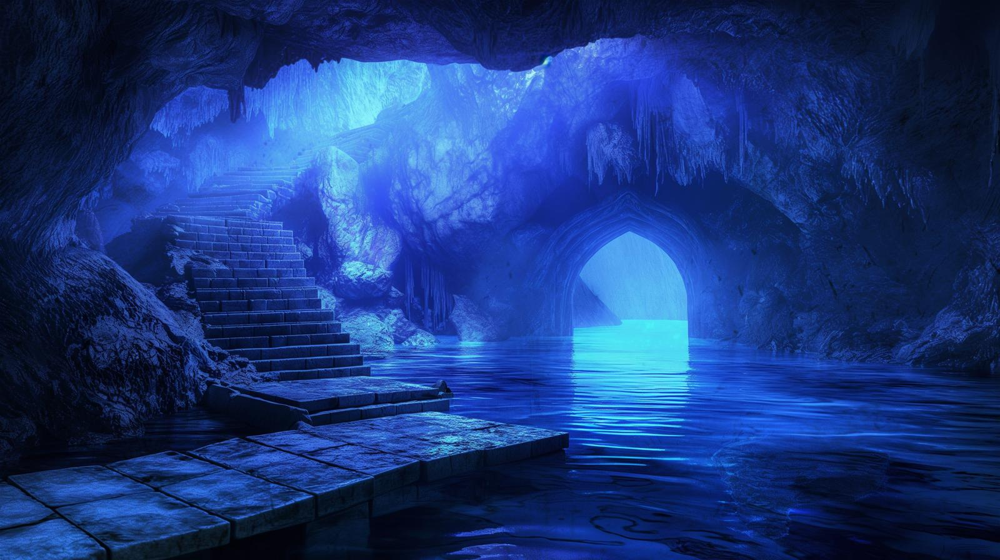
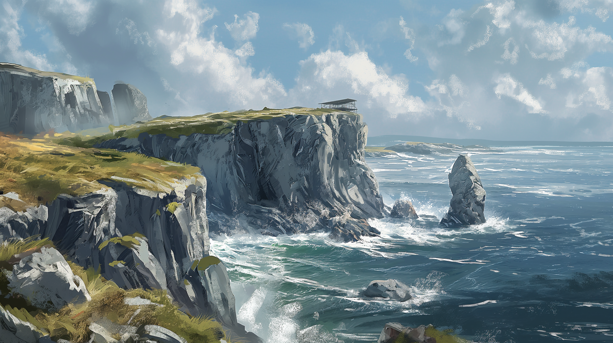

# Dunmari Frontier - Session 99

>[!info] The Path to the Merfolk: in which the party seeks underwater aid
> *Featuring: [Seeker](<../../../people/pcs/dunmar-fellowship/seeker.md>), [Delwath](<../../../people/pcs/dunmar-fellowship/delwath.md>), [Kenzo](<../../../people/pcs/dunmar-fellowship/kenzo.md>), [Wellby](<../../../people/pcs/dunmar-fellowship/wellby.md>), [Riswynn](<../../../people/pcs/dunmar-fellowship/riswynn.md>)*
> *In Taelgar: May 08, 1749 DR to May 11, 1749 DR*
> *On Earth: Thursday May 16, 2024*
> *From [Castrella](<../../../gazetteer/west-coast/chardonian-empire/apporia/castrella.md>) to the [Endless Ocean](<../../../gazetteer/endless-ocean/endless-ocean.md>)*

The [Dunmar Fellowship](<../../../people/pcs/dunmar-fellowship/dunmar-fellowship.md>) secures water-breathing potions from [Kazuro](<../../../people/other-nonhumans/kazuro.md>), cures a [cursed hermit](<../../../people/chardonians/dorian-almare.md>), and dives into the ocean towards the [Elemental Plane of Water](<../../../cosmology/multiverse/energy-realms/elemental-realms/elemental-plane-of-water.md>).

***19 days until Apollyon's escape***
## Session Info
### Summary
- The [Dunmar Fellowship](<../../../people/pcs/dunmar-fellowship/dunmar-fellowship.md>) departs [Castrella](<../../../gazetteer/west-coast/chardonian-empire/apporia/castrella.md>) harbor, sailing on the [Summer's Breeze](<../../../things/ships/summer-s-breeze.md>) to find the stoneborn hermit [Kazuro](<../../../people/other-nonhumans/kazuro.md>) on Calcara Island.
- The party convinces [Kazuro](<../../../people/other-nonhumans/kazuro.md>) to provide water-breathing potions in exchange for help building a school and recruiting students.
- The party arrives at Tamaro Bay, cures [Dorian Almare](<../../../people/chardonians/dorian-almare.md>) of an oceanic curse, and learns about [Merfolk](<../../../species/unusual-species/merfolk.md>) culture.
- Sailing west, the party encounters a windless zone above a portal to the [Plane of Water](<../../../cosmology/multiverse/energy-realms/elemental-realms/elemental-plane-of-water.md>) and dives underwater using the potions.

### Timeline
- May 08, 1749 DR, early morning: Depart [Castrella](<../../../gazetteer/west-coast/chardonian-empire/apporia/castrella.md>) in the pre-dawn light, with the outgoing tide, sailing for Calcara Island to find [Kazuro](<../../../people/other-nonhumans/kazuro.md>), the stoneborn alchemist
- May 08, 1749 DR, midday: Reach Calcara Island; find [Kazuro](<../../../people/other-nonhumans/kazuro.md>); convince him to share transformation herbs that will turn lungs to gills and back in exchange for returning later to help him build a small school and recruit students. Depart north sailing for Tamaro Bay.
- May 09, 1749 DR: Sail northwest uneventfully.
- May 10, 1749 DR, midday: Round the northernmost point of the [Apporian Peninsula](<../../../gazetteer/west-coast/chardonian-empire/apporia/apporia.md>). 
- May 10, 1749 DR, afternoon: Reach Tamaro Bay. Cure [Dorian Almare](<../../../people/chardonians/dorian-almare.md>) of a oceanic curse; speak with him about [Merfolk](<../../../species/unusual-species/merfolk.md>). 
- May 10, 1749 DR, evening: Sail west into the [Endless Ocean](<../../../gazetteer/endless-ocean/endless-ocean.md>). 
- May 11, 1749 DR, pre-dawn: Reach a place with no winds and strange oceans, above a portal to the [Elemental Plane of Water](<../../../cosmology/multiverse/energy-realms/elemental-realms/elemental-plane-of-water.md>). Part company with [Summer's Breeze](<../../../things/ships/summer-s-breeze.md>) and dive underwater.

## Narrative
Our session begins at dawn, in the harbor of [Castrella](<../../../gazetteer/west-coast/chardonian-empire/apporia/castrella.md>), where the[Dunmar Fellowship](<../../../people/pcs/dunmar-fellowship/dunmar-fellowship.md>) prepares to set sail on the halfling ship [Summer's Breeze](<../../../things/ships/summer-s-breeze.md>), captained by [Pippa Goodbarrow](<../../../people/halflings/pippa-goodbarrow.md>), and guided, in part, by the human fisherman and navigator [Martino](<../../../people/chardonians/martino.md>). With the outgoing tide, the party sets sail, making good speed. The party is aiming to find [Kazuro](<../../../people/other-nonhumans/kazuro.md>), a stoneborn hermit, who may be able to provide a magical way to breath water, allowing the party to search for the merfolk and the [Jade Piece of Rai's Hand](<../treasure/jade-piece-of-rai-s-hand.md>). [Martino](<../../../people/chardonians/martino.md>) suggests that Calcara Island, an uninhabited, rocky island off the coast, might be a good place for hermit, and [Delwath](<../../../people/pcs/dunmar-fellowship/delwath.md>) confirms this by speaking with the [tanshi](<../../../cosmology/gods/tanshi/tanshi.md>). 

As the [Summer's Breeze](<../../../things/ships/summer-s-breeze.md>) approaches the northern end of Calcara Island, [Kenzo](<../../../people/pcs/dunmar-fellowship/kenzo.md>) is able to sense the stoneborn's presence nearby, and a little bit of searching, guided by a friendly gannet and a playful seal, reveals the entrance to [Kazuro](<../../../people/other-nonhumans/kazuro.md>)'s cave. Rowing into the cave illuminated by an eerie blue light, they encounter a dock with steps leading up to a stoneborn hermit who questions their presence.

The stone-born hermit, [Kazuro](<../../../people/other-nonhumans/kazuro.md>), appears annoyed and grumpy at the interruption. [Delwath](<../../../people/pcs/dunmar-fellowship/delwath.md>) apologizes for the intrusion and explains their quest, mentioning they heard of [Kazuro](<../../../people/other-nonhumans/kazuro.md>) in [Castrella](<../../../gazetteer/west-coast/chardonian-empire/apporia/castrella.md>), and explaining their need for water-breathing to reach the [Merfolk](<../../../species/unusual-species/merfolk.md>). Despite a stony reception, [Kazuro](<../../../people/other-nonhumans/kazuro.md>) invites the party to follow him, expressing frustration at favor-seekers. [Kenzo](<../../../people/pcs/dunmar-fellowship/kenzo.md>) attempts to interest [Kazuro](<../../../people/other-nonhumans/kazuro.md>) by offering stories that could echo into the future, and [Riswynn](<../../../people/pcs/dunmar-fellowship/riswynn.md>) compliments [Kazuro](<../../../people/other-nonhumans/kazuro.md>)’s hermitage, expressing the party’s noble intentions, but [Kazuro](<../../../people/other-nonhumans/kazuro.md>) is unswayed, if not entirely unsympathetic. 

[Kazuro](<../../../people/other-nonhumans/kazuro.md>) questions the party's origins and their reasons for requesting his help. [Kenzo](<../../../people/pcs/dunmar-fellowship/kenzo.md>) shares the party members' origins, emphasizing their quest to prevent an impending evil. [Kazuro](<../../../people/other-nonhumans/kazuro.md>) shows mixed emotions, including curiosity and hidden trauma, when [Kenzo](<../../../people/pcs/dunmar-fellowship/kenzo.md>) mentions fighting great evil, mentioning he has seen battle and loss in the War of the Dark Rift. 

[Kenzo](<../../../people/pcs/dunmar-fellowship/kenzo.md>) offers to establish a monastery to preserve [Kazuro](<../../../people/other-nonhumans/kazuro.md>)’s teachings and extend his legacy. Intrigued and pleased by the offer, [Kazuro](<../../../people/other-nonhumans/kazuro.md>) expresses his long-held wish to build a small school. [Delwath](<../../../people/pcs/dunmar-fellowship/delwath.md>) suggests finding an apprentice for [Kazuro](<../../../people/other-nonhumans/kazuro.md>), emphasizing the party’s journey and connections. This seems to sway [Kazuro](<../../../people/other-nonhumans/kazuro.md>), and with the party's offer of aid in preserving his legacy, he begins pulling together the magical ingredients needed to produce the water breathing potions. He offers the party six doses of this concoction, which can transform lungs into gills, along with an antidote that can transform back. Taking the concoctions, the party departs, with a promise to return. 

Turning north, the party sails for two days under fair skies and following seas, heading for Tamaro Bay. After 48 hours of sailing, they approach the bay, noting a crude watchtower made of driftwood facing west, on an island off the coast. Wellby scouts, finding a man with  sunburned skin, matted hair, and worn-out clothes rooting for food on the leeward side of the island. 

Approaching the hermit, the party realizes he is confused, and [Delwath](<../../../people/pcs/dunmar-fellowship/delwath.md>), with magic, senses his thoughts are muddled, consuming by repeating a song in a strange language. [Seeker](<../../../people/pcs/dunmar-fellowship/seeker.md>) notices his eyes are strange, and seem to have crashing waves in them. Realizing this must be some kind of curse or magic, [Seeker](<../../../people/pcs/dunmar-fellowship/seeker.md>) manages to dispel the effect, and the hermit's demeanor shifts as he thanks the party. The [hermit](<../../../people/chardonians/dorian-almare.md>) reveals he has been on the island for 10 years, unable to recall events clearly due to the magical possession, and mentions the last thing he remembers is the merfolk woman Caloria fleeing from her kin, to the island. He remembers drinking a vial of strange water -- a vial, Seeker learns, that was constructed on a different plane -- but the events are confused. He knows there was some trouble, some conflict, among the merfolk, and he fears Caloria is dead. 

This is confirmed by the party's search, which turns up the bones and golden bracelet of Caloria just offshore, washed up against some rocks. As they talk, the hermit -- whose name is [Dorian Almare](<../../../people/chardonians/dorian-almare.md>) -- recounts fragments of memories about Caloria being chased and leaving him with a sense of regret for drinking the cursed water. The party rests for a short while, and speaks more with Dorian, gaining insights regarding [Merfolk](<../../../species/unusual-species/merfolk.md>) culture and etiquette. Dorian shares that merfolk settlements are west of their current location and hints at a significant event involving a jade garden and a green light. Before leaving, the party ensures Dorian is stable and offers to help him in the future. He refuses immediate travel, needing time to recover.

Returning to the [Summer's Breeze](<../../../things/ships/summer-s-breeze.md>) in the late afternoon, the party proceeds westward, continuing into the night under clear skies. By midnight, [Kenzo](<../../../people/pcs/dunmar-fellowship/kenzo.md>) feels a tug from the jade, indicating they are close yet also far from their destination, as if it's both within 50 miles and infinitely distant. In the early morning hours before dawn, the wind dies completely, leaving the ship adrift in a zone of calm water. [Kenzo](<../../../people/pcs/dunmar-fellowship/kenzo.md>), in a trance, senses a swirling vortex deep in the ocean, a portal to the [Elemental Plane of Water](<../../../cosmology/multiverse/energy-realms/elemental-realms/elemental-plane-of-water.md>). Telling the crew of the [Summer's Breeze](<../../../things/ships/summer-s-breeze.md>) to sail back east as quickly as possible, the party consumes their water-breathing potions, and dives into the water, experiencing a transformation as they grow gills and initially struggle, then adjust to breathing underwater.

As they descend, they feel a protective barrier and hear the whispers of a Sentient Ocean questioning their presence and intentions. The ocean's chant probes their identities and stories, creating a sense of watchfulness and judgment. The session ends as the party sinks deeper into the ocean, surrounded by these whispers and colors, hearing the echos of the sentient ocean repeating "Who are you?".
## Transcript

### Detailed Notes
#### Departing Castrella
- **DM**: The session begins at dawn in the harbor of Castrella. The party has been traveling for 21 days and has recently acquired assistance from Martino, an old fisherman, and Pippa Goodbarrow, halfling and captain of the Summer’s Breeze.
- **DM**: The party aims to rescue Milo Thistlefoot, a halfling adventurer missing for a year, and is looking for sources of water breathing.
- **Seeker**: Jokes about the difference between a normal ship and a destroyed one, lamenting the dangers of the western waters.
- **Delwath**: Mentions the group's plan to explore the deadly wastes as a joke.
- **Riswynn**: Suggests focusing on known individuals like the stone-born hermit, Kazuro.
- **Seeker**: Considers teleporting a small group onto the ship to save time.
- **DM**: Notes that teleporting onto a moving ship might have complications due to size constraints.
- **Wellby**: Proposes deciding the next steps instead of debating teleportation logistics.
- **Riswynn**: Suggests departing and figuring out the exact course towards the stone-born hermit as they travel.
- **DM**: Confirms the party sets sail with the outgoing tide, managing to make good speed.
- **Kenzo**: Attempts to use his perception ability to locate the stone-born hermit within a 20-mile radius.
- **Delwath**: Uses the spell Contact Other Plane to ask about the hermit's location, confirming he lives on the west side of Karkara Island and alone.
- **DM**: Describes the journey as they round the tip of Castella Bay towards Karkara Island, navigating tricky channels and limestone sea cliffs.
- **Kenzo**: Successfully locates the stone-born hermit approximately 4.5 miles north-northeast from their current position.
- **Wellby**: Notices several caves along the cliffs, using a spyglass to identify potential habitats for the hermit.
- **DM**: Describes four distinct caves, with varying features and accessibility based on tide levels.
- **Seeker**: Questions the height of the cliffs and discusses the hermit's possible use of submerged caves.
- **Riswynn**: Suggests that the hermit probably doesn't live in the periodically submerged cave.
#### Finding Kazuro
Wellby suggests communicating with nearby sea life to locate the hermit.
Riswynn supports the idea, suggesting seabirds.
DM describes various seabirds in the area, including gannets.
Wellby decides to telepathically communicate with a gannet, asking about the location of a two-legged creature.
The gannet identifies a cave with bad fishing as the location to investigate.
Party members discuss the clue, and Seeker suggests following the gannet.
DM describes the gannet's behavior and indicates the direction of the cave.
Wellby and Riswynn discuss getting a better view, deciding to use a spyglass.
The party decides to row closer to the cave, given the tricky winds and waves.
DM describes the party's navigation towards the cave, highlighting Wellby's skilled handling.
The party spots a cave entrance with seals camped out on the rocks nearby.
Wellby telepathically communicates with the seals, announcing their approach.
The seals offer fish to the party, which Wellby politely declines.
DM describes the party rowing into a cave lit with an eerie blue light.
They encounter a dock with steps leading up and a stoneborn hermit, who questions their presence.
The stoneborn hermit stands and walks towards the dock to greet the party.
#### Speaking to Kazuro
**DM**: The stone-born hermit, Kazuro, appears annoyed and grumpy at the interruption.
**Kenzo**: Comments on the hermit's lack of power relative to the party.
**Delwath**: Apologizes for the intrusion and explains their quest, mentioning they heard of Kazuro in Castrella.
**DM**: Confirms Kazuro's name and prompts a persuasion check.
**Delwath**: Fails the persuasion check but continues explaining their need for water-breathing to reach the merfolk.
**DM**: Kazuro invites the party to follow him, expressing frustration at favor-seekers.
**Kenzo**: Attempts to interest Kazuro by offering stories that could echo into the future.
**Riswynn**: Compliments Kazuro’s hermitage and expresses the party’s noble intentions.
**DM**: Leads the party to a living area within the cave, describing its simple yet functional setup.
**Kazuro (DM)**: Questions the party's origins and the reasons behind their request for his help.
**Kenzo**: Shares the party members' origins and emphasizes their quest to prevent an impending evil.
**DM**: Kazuro shows mixed emotions, including curiosity and hidden trauma, when Kenzo mentions fighting great evil.
**Seeker**: Recalls the War of the Dark Rift, an ancient and devastating conflict involving the dwarven civilization.
**Delwath**: Expresses interest in Kazuro’s wisdom but highlights the party’s urgency.
**Kenzo**: Offers to establish a monastery to preserve Kazuro’s teachings and extend his legacy.
**DM**: Kazuro is genuinely intrigued and pleased by the offer, expressing his long-held wish to build a small school.
**Delwath**: Suggests finding an apprentice for Kazuro, emphasizing the party’s journey and connections.
**DM**: Kazuro agrees to the idea of finding a suitable student to carry on his teachings.
**Kazuro (DM)**: Mentions unsettling news from the west and the discordant notes in the ocean’s song.
**Delwath**: Indicates the party’s mission to address a corruption affecting the kelp forests and the merfolk.
**DM**: Kazuro shares his limited knowledge but provides guidance on respecting the ocean and the merfolk.
**Delwath**: Invites Kazuro to join their quest, but he declines, preferring to remain in his hermitage.
**DM**: Kazuro prepares and offers six doses of a concoction to transform the party's lungs into gills and back.
**Seeker**: Ensures a way to teleport back by pocketing a stone from the cave.
**Kenzo**: Pledges to return and build the school with Kazuro, expressing a desire to hear and document his story.
**DM**: Kazuro shares his story and travels, hinting at strange occurrences in the far north, including ice even in summer.
**DM**: Kazuro bids the party farewell, understanding their urgency but inviting them to return.

#### Traveling to Tamaro Bay
The party departs from Castrella and makes their way to Karkara Island to seek a stone-born hermit for water-breathing resources.
They locate the hermit, Kazuro, who provides a concoction for breathing underwater after being persuaded to help by the party's pledge to preserve his teachings.
As the party prepares to depart, Kenzo discusses his plans for establishing a monastery, revealing his philosophical groundwork and recruitment efforts.
Wellby expresses interest in Kenzo's monastery plans, hinting at possible storytelling modules he could contribute.
The party discusses teleportation logistics and the practicality of using their limited water-breathing concoction.
They decide to travel to Tamaro Bay, estimating a two-day journey under good conditions, with halflings committing to sail around the clock.
During the first leg of the journey, the weather is favorable, and they sail smoothly, aiming to cover 430 miles to their destination.
The party exchanges light-hearted banter and some strategic discussions about teleportation and water-breathing items during the voyage.
On the second day, they approach Tamaro Bay, and the weather remains favorable. The party debates their exact course of action upon arrival.
They notice a wooden structure on a cliff near Tamaro Bay and decide to investigate it, considering it might hold significance.
The structure turns out to be a crude watchtower made of driftwood. They also spot a single-masted row sailboat in a cove on the leeward side of the island.
Wellby offers to scout further to the cove to locate any inhabitants or further clues, while the rest of the party plans their landing strategy.
#### The Mystic of Tamaro Bay
The party lands at a rickety two-story structure with signs of occupation but in poor condition, deciding to explore further.
Wellby scouts ahead, spots a person foraging among the dunes, and describes him as having sunburned skin, matted hair, and worn-out clothes.
The party approaches the hermit cautiously, with Delwath casting Detect Thoughts to gauge the man's surface thoughts, which are in an unrecognized language and are mostly centered around a song.
The hermit, startled by the party’s approach, initially reacts defensively but then reveals thoughts of being haunted by ghostly voices.
Seeker assesses the hermit’s eyes and determines he is under a magical effect, suggesting to dispel it, which Delwath encourages.
Seeker casts Dispel Magic at Fifth Level, successfully removing the magical influence, causing the hermit’s demeanor to shift as he thanks the party.
The hermit reveals he has been on the island for 10 years, unable to recall events clearly due to the magical possession, and mentions fleeing with a merfolk named Caloria.
The party learns the hermit's name is Dorian, realizing he has been guided by Caloria to drink a vial of enchanted ocean water.
Delwath attempts to Scry to find Caloria but fails as it appears the vial of liquid was of a different plane, confirmed by Seeker's examination.
Wellby uses Beast Sense on a fish to investigate an offshore rock, discovering bones, likely merfolk remains, and something metallic shimmering in the water.
Kenzo retrieves a golden bracelet from the offshore rock, which Dorian recognizes, affirming Caloria’s death.
Dorian recounts fragments of memories about Caloria being chased and leaving him with a sense of regret for drinking the cursed water.
The party decides to take a short rest and speaks more with Dorian, gaining insights regarding merfolk culture and etiquette.
Dorian shares that merfolk settlements are west of their current location and hints at a significant event involving a jade garden and a green light.
Before leaving, the party ensures Dorian is stable and offers to help him in the future; he refuses immediate travel, needing time to recover.
The party departs to continue their quest, noting the urgency due to an apocalyptic threat looming in 19 days.
#### Finding the Kelp Garden
The party returns to their boat around 4:30 PM with about an hour and a half of sunlight left. The DM notes that it is a new moon, so it will be dark when the sun sets.
Delwath suggests sailing west, but Wellby points out the importance of observing merfolk lights that may appear at night. The party decides to proceed westward.
Seeker mentions looking out for any moon phase-based hypotheses as the DM describes the journey. The party sails 20 miles as the sun sets, then continues into the night. The sky is clear with visible stars, and Pipa enjoys navigating by them.
By midnight, the party has sailed about 50 miles from the island. Kenzo, who is on watch, feels a tug from the jade, indicating they are close yet also far from their destination, as if it's both within 50 miles and infinitely distant.
At dawn, the wind dies completely, and the ship is adrift in a zone of calm water. Wellby recognizes this as an unusual barrier, suggesting they are close to a portal to the Plane of Water.
The party decides to get into their folding boat to move closer to the portal. They discuss the logistics and eventual departure of their halfling companions and Martina.
Kenzo enters a trance and senses a swirling vortex deep in the ocean, signaling the presence of the portal to the Plane of Water.
The party eats their 'gill pills' and dives into the water, experiencing the transformation as they grow gills and struggle initially, then adjust to breathing underwater.
As they descend, they feel the protective barrier and hear the whispers of a sentient ocean questioning their presence and intentions. The ocean's chant probes their identities and stories, creating a sense of watchfulness and judgment.
The session ends as the party sinks deeper into the ocean, surrounded by these whispers and colors, with the DM hinting at a future mechanic involving character memories to navigate the hall of stories.

### Short Summary

#### Departing Castrella
The party prepares to depart from Castrella with the aim of finding water breathing resources and rescuing Milo Thistlefoot. They sail towards Karkara Island, where they use magic to locate a stone-born hermit believed to inhabit one of four coastal caves.
#### Finding Kazuro
The party communicates with a gannet to locate a cave inhabited by a hermit. They row into the cave, encountering a stoneborn hermit who questions their presence.
#### Speaking to Kazuro
The party meets the stone-born hermit Kazuro, explaining their quest and seeking his aid in acquiring water-breathing capabilities. After persuading him with their pledge to establish a monastery and preserve his teachings, Kazuro agrees to help, providing the party with a concoction to breathe underwater and inviting them to return in the future.
#### Traveling to Tamaro Bay
The party sails from Castrella to Tamaro Bay, discussing Kenzo's monastery and teleportation logistics. Upon arrival, they investigate a crude watchtower and a cove with a row sailboat, splitting duties to scout and prepare for landing.
#### The Mystic of Tamaro Bay
The party encounters a hermit, Dorian, who has been possessed by a magical song for 10 years. After dispelling the magic and learning about his connection to a merfolk named Caloria, the party gains valuable insight into merfolk culture and prepares to continue their mission.
#### Finding the Kelp Garden
The party sails westward into the night, guided by stars and seeking a portal to the Plane of Water. They encounter a mysterious zone of calm water, consume gill pills, and dive into the ocean, feeling the presence of a sentient ocean that questions their intentions.

