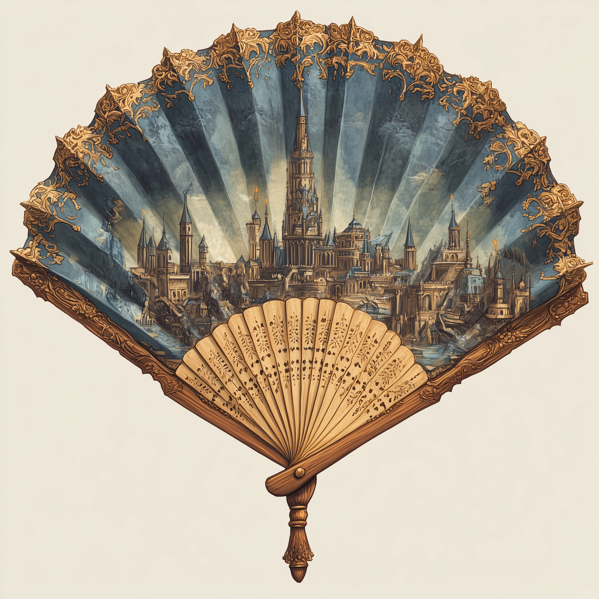

# Chardon Fan

- :octicons-info-24:{ .lg .middle } __Fan__  
   Owned by [Kenzo](<../../../people/pcs/dunmar-fellowship/kenzo.md>)  

{align="right"; width="250"}A cotton and bamboo hand fan depicting the towers of [Chardon](<../../../gazetteer/west-coast/chardonian-empire/chardon/chardon.md>), the intricate design painted onto the fan by a very skilled artist.

Looted from [Agata's hut](<../../../gazetteer/greater-dunmar/dunmari-basin/agata-s-lair.md>) by [Dunmar Fellowship](<../../../people/pcs/dunmar-fellowship/dunmar-fellowship.md>). Probably worth 10-180 gp.

Carried by [Kenzo](<../../../people/pcs/dunmar-fellowship/kenzo.md>). 

Seen in [Mirror of the Past](<./mirror-of-the-past.md>): 

