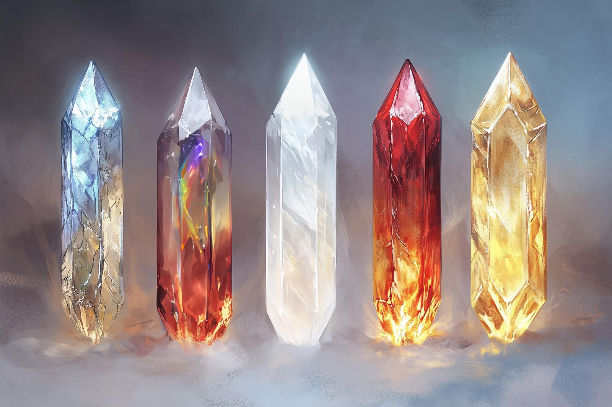

# The Binding Stones of Amloch

- :octicons-info-24:{ .lg .middle } __Legendary Wonderous Item__  
   Owned by [Seeker](<../../../../people/pcs/dunmar-fellowship/seeker.md>)  

{align="right"; width="400"}A set of five crystals, each a different color, dating from before the [Downfall](<../../../../events/ancient/the-downfall.md>) to the early days of Hkar, constructed by the wizard Amloch. 
While little is known for certain about their magic, they are powerful in entrapment and imprisonment, and in manipulating extraplanar creatures. 

The binding stones are known to have been used by the Drankorian wizard [Eudomes](<../../../../people/historical-figures/eudomes.md>), a member of the [Occulta Ludum](<../../../../groups/drankorian-societies/occulta-ludum.md>), to bind the storm giant [Hralgar](<../../../../people/giants/hralgar.md>) at [Stormcaller Tower](<../../../../gazetteer/greater-dunmar/dunmari-basin/stormcaller-tower.md>). They were removed from the tower in DR 1748 by [Dee Wildcloak](<../../../../people/halflings/dee-wildcloak.md>), [Dain Goldhammer](<../../../../people/dwarves/dain-goldhammer.md>), and companions, eventually finding their way into the possession of the wizard [Fausto](<../../../../people/chardonians/fausto.md>), and [later the Dunmar Fellowship](<../../session-notes/session-48-dufr.md>).

The five crystals are named:
- The Mirror Stone: a silvery, highly reflective stone; seems associated with reflecting and mirroring energy  
- The Chaos Stone: a streaked stone of swirling colors, that seem to shift when you are not looking at it, primarily reds, blues, whites, and browns; perhaps associated with disorder, chaos, or raw elemental energy  
- The Echo Stone: a pure white opaque stone, with an odd optical effect that it seems to contain echos or reflections of itself; perhaps associated with the Feywild, or with duplications and echoes  
- The Anger Stone: a harsh, jagged reddish stone, the color of fire and blood, holding it too long leads to a slowly growing sense of unease that turns to anger and rage; probably associated with fiends  
- The Peace Stone: a smooth golden stone with a single brilliant white line around the diameter at the middle, holding it for a while gives you a sense of peace and calmness; probably associated with the divine realms of the gods  

