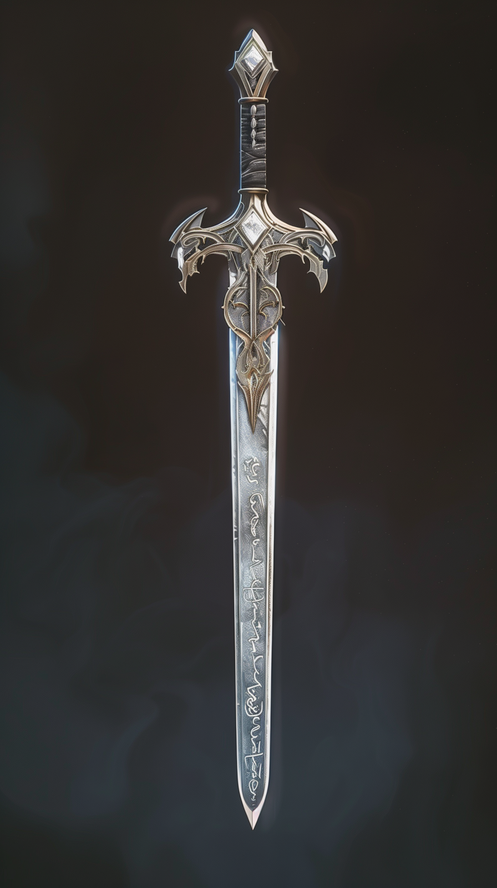

# Narëngril

- :octicons-info-24:{ .lg .middle } __Rare [Elven](<../../../../species/children-of-the-embodied-gods/elves/elves.md>) Magical Sword__  
   Owned Dewalth  
    :simple-dungeonsanddragons:{ .middle} [Mechanics](https://www.dndbeyond.com/magic-items/5346819-narengril) 

{align="right"; width="200"}An elven sword, finely made and carved with Elvish script warding against fiends. 

Found by the [Dunmar Fellowship](<../../../../people/pcs/dunmar-fellowship/dunmar-fellowship.md>) in [Grimbaskal's Hoard](<../grimbaskal-s-hoard.md>), and now used by [Delwath](<../../../../people/pcs/dunmar-fellowship/delwath.md>)

