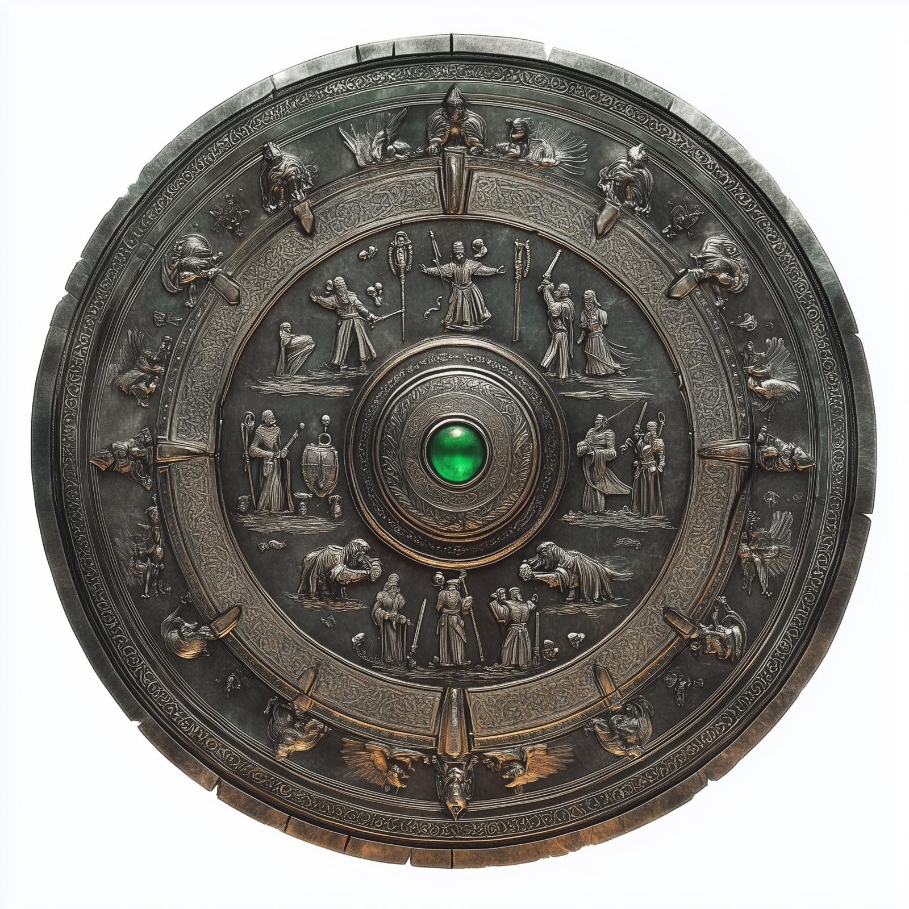

# The Shield of the Brawnanvil Clan
:octicons-info-24:{ .lg .middle } **[Dwarven](<../../../../species/children-of-the-embodied-gods/dwarves/dwarves.md>) Magical Shield**  

{align="right"; width="350"}This shield is an elaborate, decorative shield, not useful in battle, made of polished steel, with  decorations of scenes from dwarven life adorning it. It is a family heirloom of the Brawnanvils, a dwarven clan originally from[Ardith](<../../../../gazetteer/sentinel-range/dwarven-kingdoms/ardith.md>), now based in [Tharn Todor](<../../../../gazetteer/greater-dunmar/realms/nardith/tharn-todor.md>). 

While holding the shield, a dwarf can activate it, being drawn into a recreation of a story from the Brawnanvil past. A Brawnanvil can guide the story to a particular memory or place.

This shield was lost in the [Dwarven Outpost (Raven's Hold)](<../../../../gazetteer/greater-dunmar/dunmari-basin/dwarven-outpost-raven-s-hold.md>) when the Brawnanvils and many others fled during the [Great War](<../../../../events/1500s/great-war.md>). It was later recovered by [Riswynn](<../../../../people/pcs/dunmar-fellowship/riswynn.md>) and returned to the Brawnanvil clan stronghold in [Tharn Todor](<../../../../gazetteer/greater-dunmar/realms/nardith/tharn-todor.md>). 