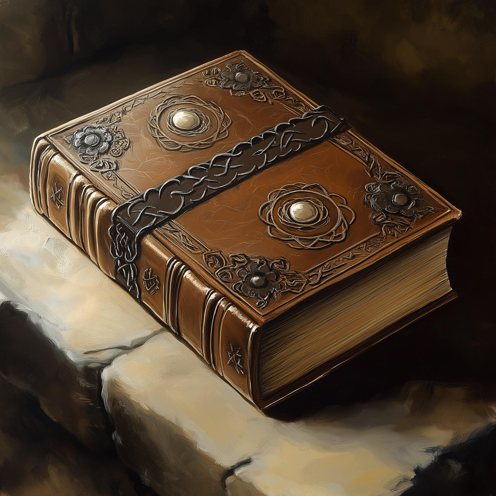

# Taurion's Manual of Stone Golems

- :octicons-info-24:{ .lg .middle } __Very Rare [Drankorian](<../../../../history/drankorian-era/drankorian-empire.md>) Magic Book__  
   Owned owned by the [Dunmar Fellowship](<../../../../people/pcs/dunmar-fellowship/dunmar-fellowship.md>)  
    :simple-dungeonsanddragons:{ .middle} [Mechanics](https://www.dndbeyond.com/magic-items/4950-manual-of-stone-golems) 

{width="right"}
