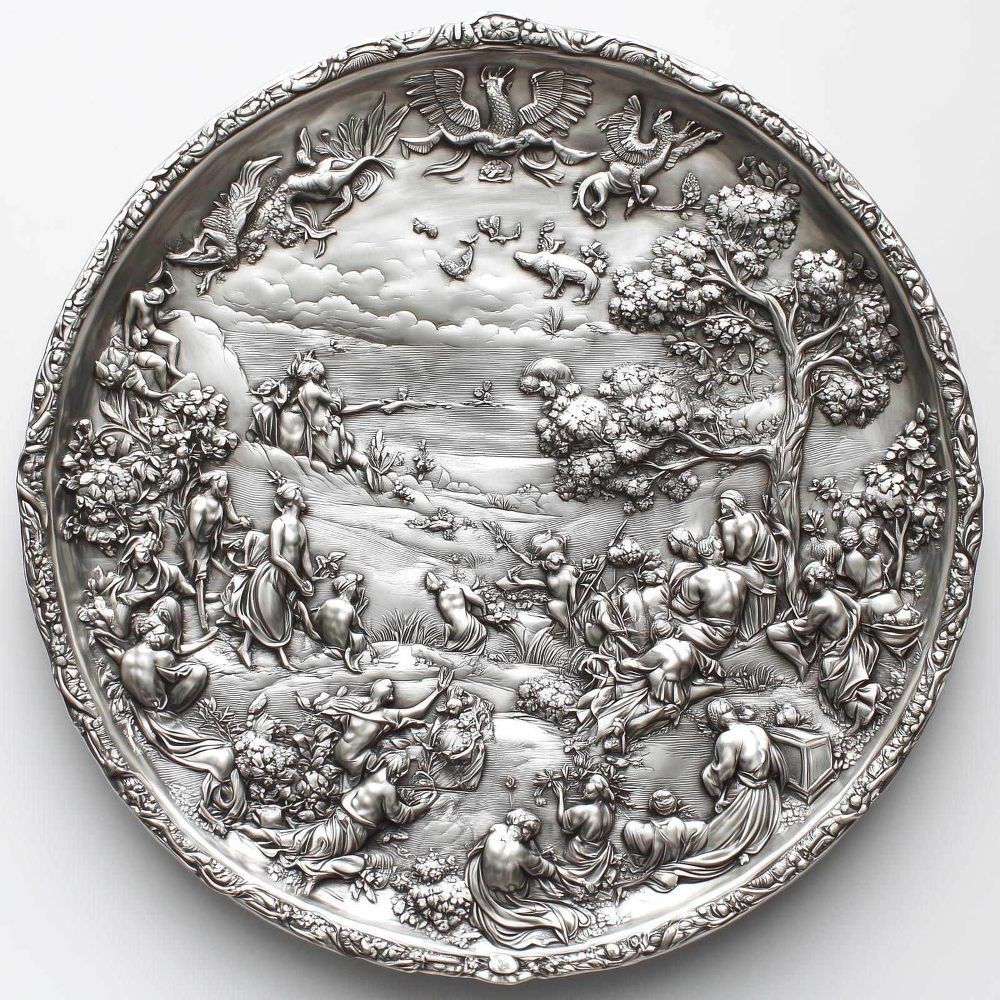
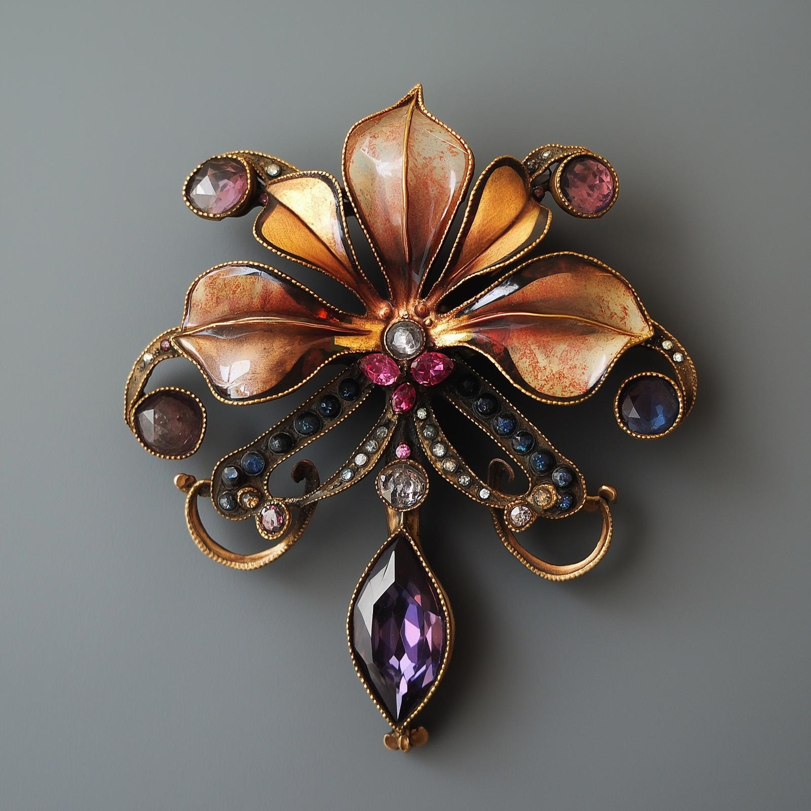

# Portable Hole Calculations

Volume of the Portable Hole is 282 cubic feet. A little more than 10% is taken up with shelving and miscellaneous organization, leaving 250 cubic feet of usable space. 

Stored in that space are:
- Both mirrors (3 cubic feet each) = 6 cubic feet
- Basic supplies for a week (5 cubic feet) = 5 cubic feet
- Treasure for bribes plus space for other "quantum items" = 4 cubic feet
- Misc magic items stored in the portable hole = 1 cubic foot

That leaves 250-16 = 234 cubic feet for items found on the Circular Island

The biggest of these is Cloudspinner, who is encased in a rectangle 8 feet long, 4 feet wide, and 3 feet deep = 96 cubic feet. There are maybe 10 cubic feet worth of metals from the tower, plus another few cubic feet from other items, mostly the platter and the ewer.

That leaves 125 cubic feet for treasure from Ra'ghemdros' hoard.
# Ra'ghemdros' Hoard

## Coins

Ra'ghemdros has collected basically every coin on the island, which amounts to about 500,000 silver coins; 700,000 copper coins; 30,000 gold coins. These are all Drankorian, and are neatly arranged in designs and patterns, ordered from oldest to newest, with different metals separated. With some investigation can find coins as far back as the height of the Great Peace in the DR 600s, although most coins date from Vestian or later, and many are from Apollyon's reign (last ~150 years of the Empire).

Volume (simplifying assumptions):
- 30,000 gold coins per cubic foot
- 20,000 silver coins per cubic foot
- 15,000 copper coins per cubic foot

## Common Jewelry and Art
Most of Ra'ghemdros' hoard consists of various examples of common, non-magical jewelry and art objects, which are detailed in sections below. 

### Rings
There are 15,000 rings in Ra'ghemdros hoard. Most of these are simple bands or signet rings of iron or bronze, but about one-fifth of the rings (3000) in the hoard are more elaborate. These are often signet rings with carved gemstone intaglios, often in moonstone, amethyst, lapis lazuli, garnet, amber, or onyx; solid gold bands of various designs, typically involving animal shapes; or elaborate metalwork with gemstone settings. 

Diamonds, pearls, and rubies -- being important components for amplifying and channeling magic -- are not really used for rings in Drankor, as they reserved typically for imperial use or for common enchantments.  

Value:
- Plain rings: typically between 1-20 sp per ring, although with some care and effort to select the best work could reach up to 50 sp for some items.
- Elaborate rings: 1-50 gp per ring, with with some care and effort to select the best work could reach 500 gp or more for some items, particularly imperial or other high-status jewelry set with particularly valuable gemstones. 

Volume (assuming relatively low packing volume and some bulky settings):
- 5000 plain rings per cubic foot
- 3000 elaborate rings per cubic foot

Examples:
 - **A Gold Signet Ring**: Set with an engraved emerald with the personal crest of a long-lost merchant or other rich citizen of Drankor. 
 - **A Twisted Silver Band**: Elaborately worked, and set with a perfect diamond that sparkles with an intensity that seems unnatural, likely the material component for a spell like Gate. 
### Hairpins and Combs
Ra'ghemdros has a set of 6000 hairpins and combs. Most of these are simply made from ivory (2000) or bone and horn (4000), usually with decorations and designs. About one-tenth of these (600) are more elaborate, set with fairly common gems. 

Value:
- Plain bone or horn: 5-100 sp, depending on the quality of the work.
- Plain ivory: 10-500 sp, depending on the quality of the work.
- Elaborate: 5-100 gp, depending on gemstone settings, mostly. 

Volume:
- 300 hairpins/combs per cubic foot

Examples:
- **An Ivory Comb with Carvings of Flowers and Vines**: This comb features intricate engravings that capture the essence of nature. It feels smooth and elegant in the hand, with each detail beautifully rendered.
- **A Silver Hairpin**: Decorated with numerous small turquoise beads set among an the silver metalwork of waves. 
### Earrings
Ra'ghemdros seemed to have a particular fascination with earrings, and this part of the hoard seems particularly complete and well preserved, showing signs of regular cleaning and even repair. There are 5000 pairs of earrings in the hoard, with a particular emphasis on higher quality works; about one-quarter (1250) are more elaborate, often set with gemstones or featuring delicate metalwork. There are also on display about 100 particularly elaborate earrings, typically either hoop designs that highlight a gemstone, or featuring clusters of metalwork and small gems. 

Value:
- Typical earrings: 5 sp - 250 sp, depending on the quality and workmanship
- Higher quality earrings, gold earrings: 5-100 gp, depending on quality and size
- Elaborate pieces: 100 gp and up. 

Volume:
- 1400 earrings per cubic foot

Examples:
1. **A Pair of Lapis and Gold Drop Earrings**: The lapis are cut and polished into spheres, each hanging from an intricately wrought golden vine, resembling ripe fruit. 
2. **A Set of Silver Hoops with Garnet Pendants**: Each earring has a smooth garnet shaped like a droplet.

### Necklaces
The 10,000 necklaces in Ra'ghemdros' hoard are the among the most diverse items in the collection, ranging from simple brass lockets and glass beads on plain silver chains, to elaborate pendants of sapphire and gold. About half the collection (3000) are relatively simple trinkets, another one third (2000) are of better make and craftsmanship but of relatively common metals, and the final one-sixth (1000) include examples of particularly elaborate and fine work in gold, including a hundred or so with gems and other markers of ornate workmanship. Included in this collection are almost 4000 holy symbols, typically in plain silver, brass, or bronze, of the Eight Divines, presumably collected from various pilgrimage sites on the island. 

Value:
- Simple trinkets: 5-30 sp
- Common necklaces: 5-25 gp
- Elaborate necklaces: 25 gp and up, including some pieces likely worth 500 gp or more for the value of the gemstones alone. 

Volume:
- 150 necklaces per cubic foot

Examples:
1. **A Beaded Lapis Lazuli Necklace**: Each bead is polished to a shine, and the lapis lazuli is flecked with gold veins. The necklace features a central pendant depicting dolphins, perfectly carved in mother-of-pearl.
2. **A Gold Chain with a Small Sapphire Pendant**: The chain is so fine it looks like spun sunlight, and the deep blue sapphire sparkles like the night sky. The gemstone is cut into an unusual teardrop shape, which reflects light in a way that seems almost otherworldly.
3. **A Gold Seashell Locket**: An ornate gold locket shaped like a seashell, set with turquoise. When opened, it reveals a painted likeness of a young man. 
4. **A Silver Oval Locket with a Floral Design**: The locket features an embossed floral pattern, and when opened, it holds a pressed flower inside, perfectly preserved. Its charm lies in its delicate beauty and the care taken in its preservation.
5. **Golden Phoenix Amulet.** An elaborate gold amulet shaped like a phoenix, adorned with rubies for eyes. 

### Belt Buckles, Brooches,  Fasteners
Although Ra'ghemdros has collected everything that is shiny on the island, it is clear that fasteners, belt buckles, and brooches were her least favorite. The 8,000 items of this type in the hoard are largely not curated, and include large numbers of relatively poor or degraded work, which is not typical of the rest of the hoard. Three quarters (6000) of these are simple items in brass, bronze, or iron, with plain decorations, while the remaining items are split between those with more elaborate metalwork (1600), typically silver, and a small handful with gems or intricate artistry (400). 

Value:
- Simple and plain: 1-20 sp
- Silver or nice metalwork, no gems: 1-10 gp
- Set with gems: 10-100 gp or more, for the value of the gemstones alone. 

Volume:
- 100 on average per cubic foot

Examples:
1. **A Silver Fibula of Sea Creatures**: A silver fibula shaped like a fish, with carefully worked filigree patterns decorating the fins.
2. **A Gold Brooch in the Shape of a Bird**: This brooch has tiny sapphires set into the wings and is designed with such precision that the feathers look almost soft to the touch.
3. **Gemstone Buckle**: An elaborate gold buckle adorned with sapphires and intricate etchings of mythical creatures.
4. **A Massive Gold Buckle Shaped Like a Lion**: This detailed buckle features a roaring lion, with the mane flowing elegantly.
### Torcs, Bracelets, Armlets
Ra'ghemdros has collected various torcs, armlets, and bracelets into a single collection, with around 4,500 pieces. These have been carefully sorted by base metal, with a bit more than half (2650) made of bronze, copper, or brass; slightly fewer made of silver (1400), and only about ten percent (450) made of gold. 

Value:
- Simple metals: 1-20 sp
- Silver: 1-10 gp, up to 50 gp or more for items set with gems.
- Gold: 10-200 gp or more for items set with gems.

Volume:
- 50 on average per cubic foot

Examples:
1. **A Gold Snake Armlet**: Coiled as though it were a real serpent, the armlet’s eyes are set with emeralds, and the scales shimmer, making the piece appear lifelike.
2. **Garnet Bracelet**: A silver bracelet with a twisting vine pattern engraved around it. Small, polished garnets are set intermittently along the design, giving it a subtle sparkle.
3. **A Gold Torc with Dragon-Head Terminals**: The ends of the torc are shaped like dragon heads, their eyes set with tiny rubies. 

### Household Goods
By volume, by far the biggest component of Ra'ghemdros hoard is a very large collection of household goods, typically including cutlery, goblets, candle holders, and platters, but also including some religious iconography. These include around 8,000 items of plain workmanship, such as pewter, brass, and bronze cutlery, ewers, salt cellars, serving platters, and candlesticks. There are maybe 4,000 silver items, largely cutlery, although with some more elaborate pieces, and a total of perhaps 600 pieces in gold or crystal, often showing signs of the Eight Divines and likely from temples. 

Value:
- Plain items: 1-100 sp, depending on the item
- Silver: 1-10 gp, up to 50 gp or more for items of large size, fine workmanship, or set with gems. 
- Gold: 50-500 gp or more for items of particularly fine workmanship.

Volume:
- 15 on average per cubic foot, given relatively poor packing efficiency

Examples:
1. **A Grand Silver Serving Platter**: This platter is unusually large, featuring intricate engravings of swirling clouds and celestial bodies, and is matched with a set of silverware. 
2. **A Ceremonial Platter**: This large platter is painted with vivid scenes of the Eight Divines, surrounded by intricate gold leaf designs
3. **Gold Candlesticks**: Decorated with flame motifs, perhaps used in a rich Drankorian society. 
4. **Crystal Decanter with Gold Filigree**: A stunning crystal decanter, etched with delicate floral designs and encased in a fine gold filigree.
5. **Silver Ewer with Gemstone Inlays**: This silver ewer features intricate inlays of rubies, with depictions of the Eight Divines blessing a feast, clearly a piece of religious significance.
6. **Ornate Gold Chalice**: Crafted with remarkable precision, this chalice is encrusted with emeralds, its stem adorned with intricate engravings of trees. 
### Weapons and Armor
Finally, Ra'ghemdros has collected a number of weapons and armor, largely swords, daggers, and shields. Most of these are relatively plain everyday items, not particularly well cared for, but some examples of fine and luxury workmanship exist. In total, there are about 700 plain weapons, 300 weapons of fine workmanship, and 50 luxury items often with gemstone or elaborate metalwork decorations. 

Value:
- Plain items: 5-15 gp each; while plain, these are well-made. 
- Fine items: 10-30 gp each, representing the fine workmanship.
- Luxury: 50-500 gp or more for items of particularly fine workmanship.

Volume:
- About 5 per cubic foot.

Examples:
1. **Ruby Dagger**: A small, richly decorated dagger with a gold-inlaid hilt with a ruby set into the pommel, clearly designed as a decorative and ceremonial item. 
2. **Warlord's Longsword**: A longsword with a cross-shaped gilded crossguard, with prayers to the Warlord engraved along the quillons. 

## Special Items

Ra'ghemdros had selected a number of items for special display. These all seem to be either (a) originally from Hkar, (b) associated with the Drankorian emperors, or (c) particularly elaborated decorated with extensive gem work. These are:

1. **Gold-encrusted Ceremonial Cup**: An ornate cup with intricate gold filigree and inlays of lapis lazuli, marked with archaic and out-of-date symbols of the eight divines.  

2. **Sapphire and Diamond Necklace**: A stunning necklace featuring a cascade of sapphires surrounded by diamonds. 

3. {align="right"; width="300"}**Intricately Carved Marble Statuette**: A small, exquisite marble statue of a dragonet, displaying incredible detail and craftsmanship, inlaid with silver and emerald eyes.  

4. **Gemstone-Set Dagger**: An elegantly designed dagger with a hilt encrusted with rubies and a finely etched blade.  

5. **Imperial Scepter**: An elaborately designed scepter made from gold and adorned with multiple sapphires.  

6. {align="right"; width="300"}**Historic Silver Paten**: An intricately designed paten (plate) made of silver, clearly very old but unweathered and undamaged, with scenes of pastoral human life.  

7. **Ceremonial Stoneborn Shield**: An ornate shield crafted from metal, featuring vivid colors and designs that tell the story of the Stoneborn fighting in the Demonfire Wars against fiends.  

8.  **Fine Gold Necklace**: A striking necklace made of interlinked gold pieces, each set with three teardrops with diamonds. . 

9. **Gold Medallion with Intricate Relief**: A large gold medallion featuring a detailed relief of a strange animalistic human figures. 

10. **Imperial Signet Ring**: A heavy gold ring featuring the Drankorian imperial crest, used for sealing important documents and symbols of authority. 

11. {align="right"; width="300"}**Chased Gold Ring**: A ring made of solid gold with intricate chase work depicting the mythology of dragnets, a rare work of art, eyes of rubies.  

12. {align="right"; width="300"}**Exquisite Gemstone Brooch**: A brooch made from an array of precious stones set in a unique floral design, a treasured family heirloom.  

13. **Silver and Diamond Ring**. Etched in Elvish with a fragment of a poem about the stars.  

14. **Emerald Platinum Ring**. A platinum ring set with a massive emerald.  

15. **Bejeweled Imperial Coronation Crown**: A stunning crown adorned with emeralds, rubies, and pearls, symbolizing the authority and lineage of a ruling family. 

16. **Enamelled Silver Serving Platter**: A large serving platter with elaborate enamel work depicting a historical scene, used during feasts. Ships sailing away from a coast.  

17. **Masterfully Wrought Sword**: A beautifully crafted sword with an inlaid hilt of gold and precious stones, displaying masterful smithing techniques. 

18. **Royal Flagon**: An intricately designed flagon made of silver, adorned with engravings and gemstones, used for serving drinks at state banquets. Like a punchbowl. 

## Magic

### Common Items

There are 56 magic items scattered among the common items of the hoard, often not separately particularly from the standard items of their type. These include:
- 14 weapons (6 swords, 3 daggers, 1 halberd, 1 greataxe, 1 maul, 2 spears)
- 3 shields 
- 8 necklaces, including 2 holy symbols of the Sibyl and 1 of the Wildling
- 9 ewers, goblets, and serving platters
- 15 rings
- 7 candlesticks

### Unusual Items

A selection of magic items were also displayed in the Ra'ghemdros' private museum. These include:

1. A small silver jewelry box, decorated with a poem about far-seeing written in Drankorian in an elegant, flowing script. Inside are five large pearls, each painted to resemble an eye. 
2. A fine gold chain necklace from which eight perfect rubies hang on thin golden threads. 
3. A potion in a crystal vial, a syrupy liquid that looks like liquified iron. 
4. A small silver vial, etched with the name Serandris in Draconic, and the words, "In Gratitude". The liquid inside is pure and clear, almost to the point of being invisible, with a single metallic silver scale floating inside. 
5. A round glass vial filled with a bubbling reddish-purple liquid. Being close to the potion bottle gives you a feeling of holiness. 
6. A small box made of a strange, shimmering wood that seems to glow faintly, and is hard to look away from. Inside is a pinch of fine powder, multihued and mesmerizing. 
7. A greatsword of fine make, apparently Stoneborn smithing, with a hilt decorated with mountain motifs. 
8. A small sculpted figurine of a triceratops made from a reddish gemstone. 
9. A shortbow, made of an unusual ebony wood that seems to faintly vibrant with excitement. 
10. A wide belt made of a fine dragonhide leather, with an elaborate silver buckle. 
11. **tbd**
12. tbd

